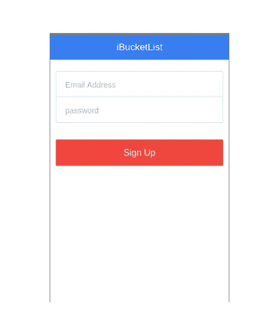
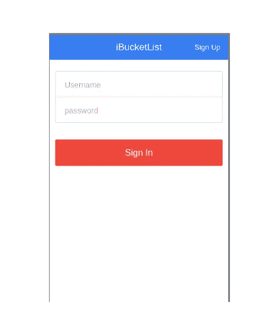
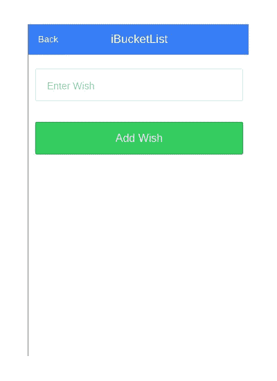
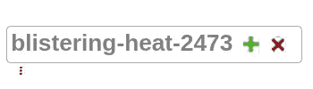
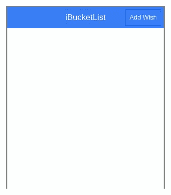
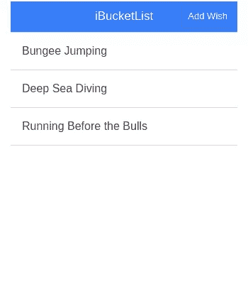

# 用 Ionic 和 Firebase 创建一个清单应用程序——第 2 部分

> 原文：<https://www.sitepoint.com/creating-bucket-list-app-ionic-firebase-part-2/>

在本教程的[前一部分](https://www.sitepoint.com/creating-bucket-list-ionic-framework-firebase/)中，我们看到了如何开始使用 [IONIC](http://ionicframework.com/) 和 [Firebase](https://www.firebase.com/) 创建一个遗愿清单应用。我们使用 Firebase 作为后端实现了登录功能。在这一部分，我们将实现注册功能，使用户能够在登录后将愿望添加到他们的列表中。本教程的源代码可以在 [GitHub](https://github.com/sitepoint-editors/iBucketListApp_Part2) 上获得。

## 入门指南

克隆本教程前一部分的源代码。

```
git clone https://github.com/sitepoint-editors/iBucketListApp_Part1
```

克隆完成后，导航到项目目录并安装所需的依赖项。

```
cd iBucketListApp_Part1
npm install
```

运行`ionic serve`在网络浏览器中运行应用程序。

## 创建注册屏幕

首先创建注册屏幕。导航到`www/templates`文件夹并创建一个名为`signup.html`的文件。在`signup.html`内部添加以下代码:

```
<ion-view title="iBucketList">
     <ion-content>
        <div class="list list-inset">
              <label class="item item-input">
                <input type="email" placeholder="Email Address" ng-model="login.email">
              </label>
              <label class="item item-input">
                <input type="password" placeholder="password" ng-model="login.password">
              </label>
        </div>
        <div class="padding">
            <button ng-click="signup()"  class="button button-block button-assertive">
                  Sign Up
            </button>
        </div>

    </ion-content>
</ion-view>
```

打开`www/js/app.js`并为注册页面添加一个新状态。

```
.state('signup', {
    url:'/signup',
    templateUrl:'templates/signup.html',
    controller:'SignUpCtrl'
  })
```

接下来为注册视图创建一个控制器。打开`www/js/controller.js`并添加`SignUpCtrl`控制器。

```
.controller('SignUpCtrl', ['$scope', function($scope){

   // Code will be here

}])
```

保存上述更改，在浏览器中打开[http://localhost:8100/#/sign up](http://localhost:8100/#/signup)，您应该会看到注册屏幕。



接下来，我们需要向登录屏幕添加一个按钮来导航到注册屏幕，反之亦然。

将以下代码添加到`ion-view`元素开始后的`home.html`中。

```
<ion-nav-buttons side="secondary">
      <button class="button" ng-click="showSignUp()">
        Sign Up
      </button>
</ion-nav-buttons>
```

正如你在上面的代码中看到的，我们已经设置了`side="secondary"`，这意味着向右。我们附加了一个 [ngClick](https://docs.angularjs.org/api/ng/directive/ngClick) 指令来调用`showSignUp`函数，接下来我们将在`HomeCtrl`函数中定义它。

```
$scope.showSignUp = function(){
        $state.go('signup');
}
```

保存以上修改，加载 app 首页。你应该在标题的右边有注册链接。点击它导航到注册页面。



将`Back`按钮添加到注册页面，以导航回登录页面。

```
<ion-nav-buttons side="primary">
      <button class="button" ng-click="showSignIn()">
        Back
      </button>
</ion-nav-buttons>
```

将`showSignIn`函数的剩余代码添加到`SignUpCtrl`控制器。

```
.controller('SignUpCtrl', ['$scope','$state', function($scope,$state){

    $scope.showSignIn = function(){
        $state.go('home');
    }

}])
```

## 实现注册

要使用 firebase 实现注册功能，将`$firebaseAuth`模块插入到`SignUpCtrl`控制器中。

```
.controller('SignUpCtrl', ['$scope','$state','$firebaseAuth', function($scope,$state,$firebaseAuth)
```

在`SignUpCtrl`控制器中创建一个叫做`signup`的函数。我们已经在注册页面的输入字段中添加了 [ngModel](https://docs.angularjs.org/api/ng/directive/ngModel) 指令。使用输入字段值调用 [createUser](https://www.firebase.com/docs/web/api/firebase/createuser.html) firebase API 来创建一个新用户。

```
$scope.login={};

var firebaseObj = new Firebase("https://burning-fire-1723.firebaseio.com");

var loginObj = $firebaseAuth(firebaseObj);

$scope.signup = function(){
        var email = $scope.login.email;
        var password = $scope.login.password;

        loginObj.$createUser(email, password)
            .then(function() {
                // do things if success
                console.log('User creation success');
                $state.go('home');
            }, function(error) {
                // do things if failure
                console.log(error);
            });
}
```

保存以上更改，尝试注册。如果您的用户创建成功，您将被重定向到登录页面。

## 添加一个愿望

一旦用户登录，我们将在他们的主页上显示成功消息，并显示添加的愿望列表。但是首先我们需要为用户创建一个添加愿望的界面。

创建一个名为`templates/addWish.html`的页面。

```
<ion-view title="iBucketList">
    <ion-nav-buttons side="primary">
      <button class="button" ng-click="showUserHome()">
        Back
      </button>
    </ion-nav-buttons>
     <ion-content>
      <div class="list list-inset">
              <label class="item item-input">
                <input type="text" ng-model="user.wish" placeholder="Enter Wish" >
              </label>

        </div>
      <div class="padding">
            <button ng-click="add()"  class="button button-block button-balanced">
                  Add Wish
            </button>
        </div>
    </ion-content>
</ion-view>
```

在`js/app.js`中，定义添加愿望页面的状态。

```
.state('addWish', {
    url:'/addWish',
    templateUrl:'templates/addWish.html',
    controller:'AddWishCtrl'
  })
```

为`js/controller.js`中的“添加愿望”页面创建一个控制器。在`AddWishCtrl`中添加一个名为`showUserHome`的方法来导航回用户的家。

```
.controller('AddWishCtrl', ['$scope','$state', function($scope,$state){

    $scope.showUserHome = function(){
        $state.go('userHome');
    }

}])
```

保存上述更改并查看“添加愿望”页面，打开浏览器至[http://localhost:8100/#/add wish](http://localhost:8100/#/addWish)。



Add Wish Page

接下来，让我们实现“添加愿望”页面的功能。我们已经在输入元素上定义了`ng-model="user.wish"`。让我们定义一下`AddWishCtrl`中添加愿望按钮附带的`add`功能。

```
$scope.add = function(){
        var firebaseObj = new Firebase("https://blistering-heat-2473.firebaseio.com/MyWish");
        var fb = $firebase(firebaseObj);

        // Adding code will be here
    }
```

如上所示，我们已经使用了 URL `<firebaseurl>/MyWish</firebaseurl>`。要创建一个子 URL `/MyWish`，请登录 Firebase 仪表板，并单击 firebase URL 旁边的加号图标。



确保在`AddWishCtrl`中已经注射了`$firebase`。

```
.controller('AddWishCtrl', ['$scope','$state','$firebase', function($scope,$state,$firebase)
```

接下来，我们将使用 push API 向 firebase 写入数据。

```
fb.$push({
    wish: $scope.user.wish
}).then(function(ref) {
    console.log(ref);
}, function(error) {
    console.log("Error:", error);
});
```

为了识别特定用户创建的愿望，我们将添加用户的电子邮件地址以及他们的愿望，创建一个 AngularJS 服务来存储用户在登录时的电子邮件地址。将服务`SessionData`添加到`controller.js`文件中。

```
.service('SessionData', function() {
    var user = '';

    return {
        getUser: function() {
            return user;
        },
        setUser: function(value) {
            user = value;
        }
    };
});
```

上述服务有两个函数`getUser`和`setUser`分别用于获取和设置用户数据。

将`SessionData`服务注入到`HomeCtrl`中。

```
.controller('HomeCtrl',['$scope','$firebaseAuth','$state','SessionData', function($scope,$firebaseAuth,$state,SessionData)
```

在`signin`函数的成功回调中，我们将在`SessionData`服务中设置用户名。

```
SessionData.setUser(username);
```

在`AddWishCtrl`的`add`功能中，将电子邮件地址与特定愿望一起推送。将`SessionData`注入`AddWishCtrl`。

```
.controller('AddWishCtrl', ['$scope','$state','SessionData','$firebase', function($scope,$state,SessionData,$firebase){
```

这里是`AddWishCtrl`中完整的 add 函数。

```
$scope.user = {};

$scope.add = function(){
        var firebaseObj = new Firebase("https://blistering-heat-2473.firebaseio.com/MyWish");
        var fb = $firebase(firebaseObj);
        var user = SessionData.getUser();

        fb.$push({
            wish: $scope.user.wish,
            email: user
        }).then(function(ref) {
            console.log(ref);
            $state.go('userHome');
        }, function(error) {
            console.log("Error:", error);
        });
    }
```

接下来，让我们在用户主页的标题栏上添加一个菜单按钮，以便导航到“添加愿望”页面。在`userHome.html`中的`ion-content`上方添加以下代码。

```
<ion-nav-buttons side="secondary">
      <button class="button" ng-click="showAddWish()">
        Add Wish
      </button>
</ion-nav-buttons>
```

在`UserHomeCtrl`中添加`showAddWish`函数，导航到添加愿望页面。

```
.controller('UserHomeCtrl', ['$scope','$state','$firebase', function($scope,$state,$firebase){
    $scope.showAddWish = function(){
      $state.go('addWish');
 }
}])
```

保存更改并尝试登录应用。在用户主页上，您应该能够看到标题中的`Add Wish`按钮。点击它，它会把你带到添加愿望页面。



## 在用户主页上列出愿望

在用户主页上，我们会显示所有添加到 firebase 的愿望。我们将获取作为数组添加的所有项目，并将其绑定到一个`$scope`变量。在`UserHomeCtrl`中添加以下代码:

```
var firebaseObj = new Firebase("https://blistering-heat-2473.firebaseio.com/MyWish");

var sync = $firebase(firebaseObj);
$scope.wishes = sync.$asArray();
```

如上所述，我们使用我们唯一的 firebase URL 创建了一个 Firebase 对象。然后我们将`firebaseObj`传递给`$firebase`，后者将数据作为数组返回。为了在用户主页上显示数据，我们将使用[n repeat](https://docs.angularjs.org/api/ng/directive/ngRepeat)指令。在`userHome.html`中的`ion-content`内，添加以下代码:

```
<ul class="list">
    <li class="item" ng-repeat="wish in wishes">
        {{wish.wish}}
    </li>
</ul>
```

保存更改，您应该在用户主页中列出所有的愿望。



## 结论

在本教程中，我们使用 Firebase 作为后端实现了注册功能。我们学习了如何向 Firebase 读写数据。我希望这篇教程能成为初学者入门 [IONIC framework](http://ionicframework.com/) 的有用资源。

请在下面的评论中告诉我们您的想法、建议和遇到的任何问题。

## 分享这篇文章