# 使用 CSS 网格创建布局

> 原文：<https://www.sitepoint.com/creating-css-grid-layouts/>

*以下对 CSS 网格的介绍摘自蒂芙尼的著作《CSS Master，第二版》。*

**CSS Grid 是一个相对较新的布局规范，截至 2017 年 10 月在大多数浏览器中发布。Grid 允许我们创建布局，这在以前是不可能的，或者只有通过大量的 DOM 操作才有可能。**

记住 [CSS 网格规范](https://www.w3.org/TR/css-grid-1/)是密集的，并且引入了几个相当复杂的新概念。请将此视为对网格的概述，而不是全面的了解。别担心，我们会为您提供大量资源，让您了解更多信息。

## 网格格式上下文

向元素添加`display: grid`会触发该元素及其子元素的网格格式上下文。在网格格式环境中，会发生三种情况:

1.  该元素成为参与正常流的块级元素。
2.  它的子节点——无论是元素还是文本节点——创建类似块的网格级别的框，这些框可以排列成行和列。网格容器的直接子容器是**网格项目**。
3.  在水平书写模式下，除非设置了明确的高度值，否则网格行中的每个成员都将与其最高的元素具有相同的高度(由内容决定)。当文档使用垂直书写模式时，其长度与其最长的元素相同(由内容决定)。

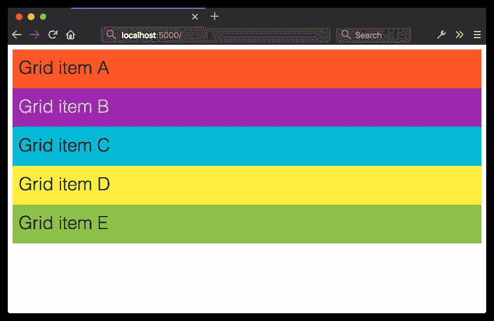Using `display: grid` creates a block-level container, and block boxes for its children

使用`display: inline-grid`的工作方式类似。内联级网格容器的子容器创建网格级框，但容器本身参与内联格式上下文。

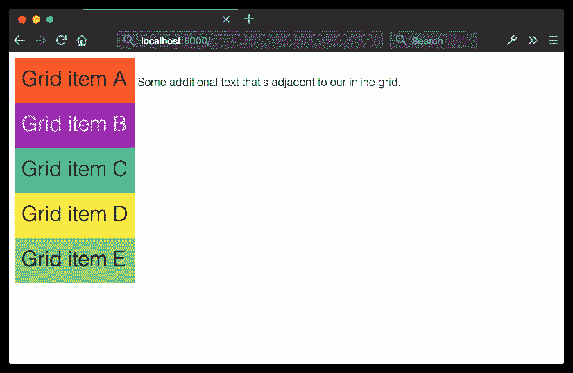Using `display: inline-grid` creates an inline-level box for the container, but block boxes for its children

通过它们自己，`display: grid`和`display: inline-grid`不会自动将这些盒子排列成行和列。我们还需要告诉浏览器在哪里以及如何放置东西。

在创建网格之前，确定是否需要固定的列数和/或行数，是否希望浏览器自动计算列数和行数，或者是否希望两者兼而有之。知道你想要创建什么样的网格决定了你将采取什么样的方法。我们来看几个技巧。

## 定义网格布局

在定义了一个网格容器之后，我们需要告诉浏览器我们的网格应该包含多少行和多少列。我们可以使用`grid-template-rows`和`grid-template-columns`属性定义行数和列数。它们被应用于网格容器。

`grid-template-rows`和`grid-template-columns`都接受所谓的*曲目列表*。**轨迹列表**是一个空格分隔的字符串，指定行或列中每个位置的网格线名称和大小。

轨道列表中的每个值在行或列内创建一个新的空间，即**轨道**。您可以使用长度、灵活的长度单位(将在本章后面讨论)或百分比。您也可以使用[尺寸值](https://www.w3.org/TR/css-sizing-3/#sizing-values)，如`auto`、`min-content`和`max-conent`。

```
.grid {
    display: grid;
    grid-template-columns: 25rem 25rem 25rem;
    grid-template-rows: 10rem 10rem;
} 
```

在上面的代码中，我们定义了一个有三列的网格，每列宽`25rem`个单位，两行高`10rem`个单位。让我们把它应用到下面的 HTML 中。是的，这是所有需要的标记:

```
<div class="grid">
    <div>Grid item A</div>
    <div>Grid item B</div>
    <div>Grid item C</div>
    <div>Grid item D</div>
    <div>Grid item E</div>
</div> 
```

我们的网格项目被组织成如下所示的列和行。

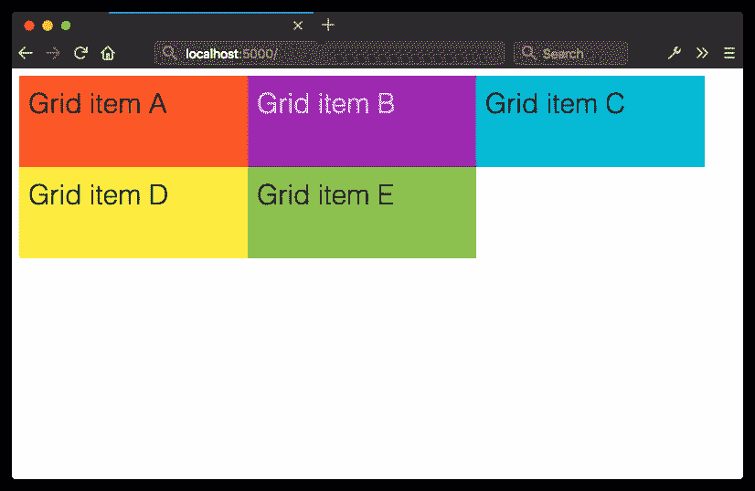Creating an explicit grid with `grid-template-columns` and `grid-template-rows`

这里，我们创建了一个大小均匀的行和列的网格，但这不是网格的要求。让我们稍微调整一下我们的 CSS。我们将把`grid-template-columns`的值改为`25rem 15rem 25rem`:

```
.grid {
    display: grid;
    grid-template-columns: 25rem 15rem 25rem;
    grid-template-rows: 10rem 10rem;
} 
```

现在我们网格中的第二列比第一列和第三列窄。

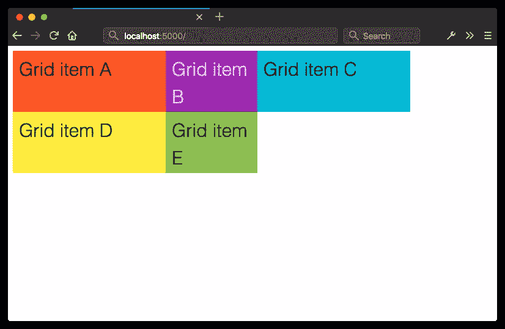Grid columns and rows don’t have to be the same width

## 显式网格与隐式网格

在上一节中，我们明确指出这个网格应该有六个可用的网格单元，由三列两行组成。这就是所谓的**显式网格**。在这里，我们的网格容器只有五个子容器。剩下的位置是空的。让我们看看当我们向容器中添加更多的子容器时会发生什么。

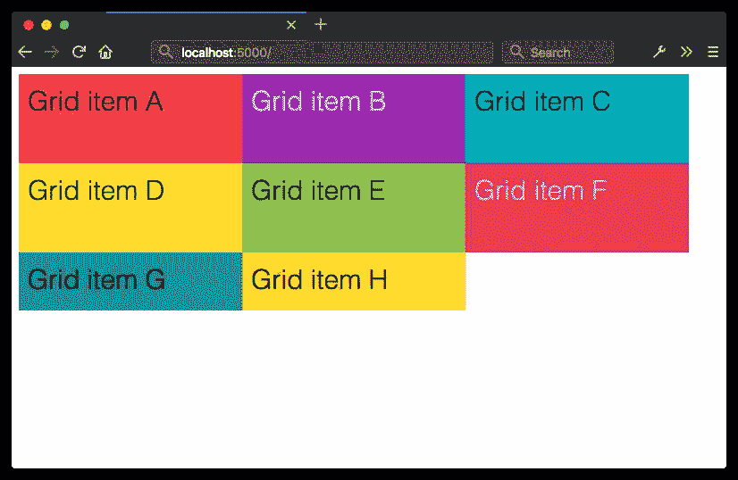When grid items exceed the number of explicitly defined cells, the remaining items are arranged in an implicit grid

现在我们有三排。但是，请注意，我们的第三行仅与其内容和填充一样高。它是网格的一部分，因为这些项目是网格容器的子容器。然而该行并没有被`grid-template-rows`明确定义。取而代之的是一个**隐式网格**——一个显式网格，其中的附加网格项超过了显式网格单元的定义数量。

默认情况下，隐式网格中的项目是`auto`大小的。网格项目将扩展以容纳其内容，或填充容器中剩余的垂直空间，以较高者为准。例如，如果我们将容器的属性`height`设置为`50rem`，我们的隐式网格轨迹将扩展为`30rem`高。

Implicit grid rows expand to fill the available height of the container

如果我们添加足够的条目来创建第四行，我们的隐式网格条目的高度将均匀分布在容器中剩余的垂直空间中。他们每个人的计算高度是`15rem`。

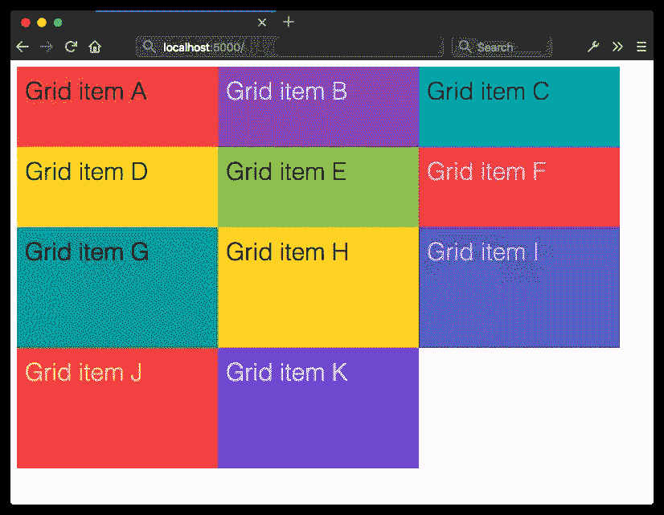The height of implicit grid rows will be evenly distributed based on the remaining space in the grid container

在我们最初的例子中，我们只显式定义了两行，每行的高度为`10rem`，所以我们的第三行默认为`auto`大小。它的高度将根据其内容和填充的大小进行调整。

## 为隐式网格指定轨迹大小

然而，可以使用`grid-auto-rows`和`grid-auto-columns`属性为隐式网格项设置一种显式的默认高度或宽度。让我们用`grid-auto-rows`更新我们的 CSS:

```
.grid {
    display: grid;
    grid-template-columns: 25rem 15rem 25rem;
    grid-template-rows: 10rem 10rem;
    grid-auto-rows: 30rem;
} 
```

现在，我们第三行中的项目——以及任何后续的行——将是`30rem`高。

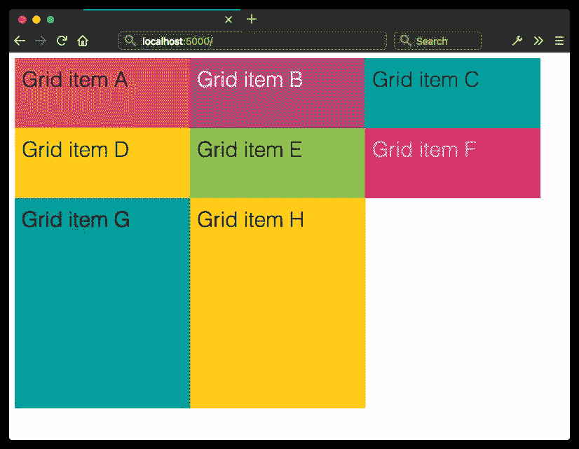Using `grid-auto-rows` to specify the height of implicit grid items

使用`grid-auto-*`属性有一个缺点:当一个网格项目的内容超过它的尺寸时，它们将溢出容器(如下所示),并且可能被其他行中的元素剪切掉。

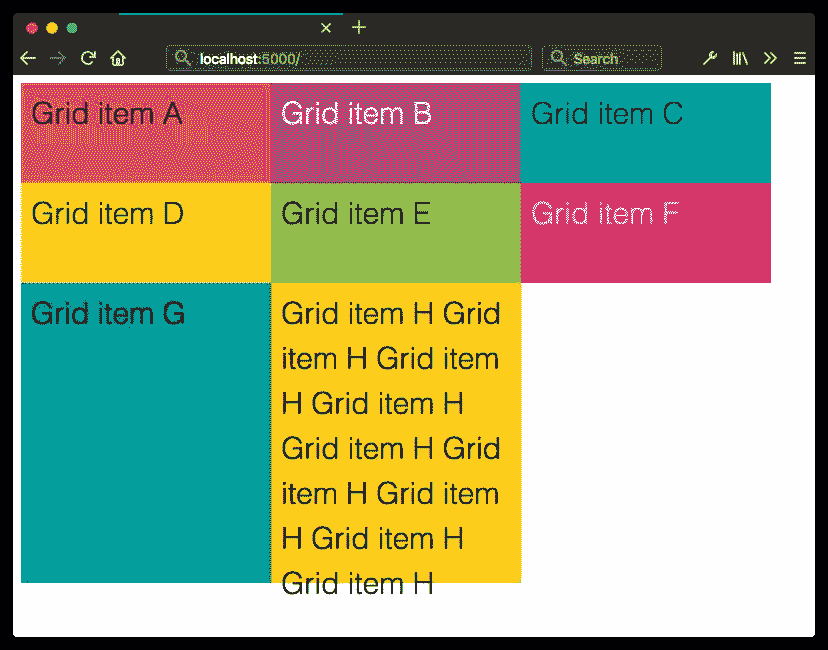Contents of a grid container can overflow the container when using length or percentage units

避免这种情况的一种方法是使用`minmax()`函数。让我们重写我们的 CSS 来使用`minmax()`:

```
.grid {
    display: grid;
    grid-template-columns: 25rem 15rem 25rem;
    grid-template-rows: 10rem 10rem;
    grid-auto-rows: minmax(30rem, auto);
} 
```

正如你可能已经从它的名字中猜到的，`minmax()`让我们定义一个轨迹的最小和最大尺寸。它需要两个参数，第一个是所需的最小磁道大小。第二个参数是最大期望大小。

在这种情况下，我们的行至少会有`30rems`高。但是由于我们已经将最大尺寸设置为`auto`，我们的轨道将会扩展以容纳该单元格的内容。`minmax()`的参数可以是长度或百分比，或者是`auto`、`min-content`和`max-content`关键字之一。在这里，`minmax(30rem, max-content)`将达到几乎相同的效果。在下一节中讨论的灵活单元也是有效的。

长度和百分比可用于定义轨道大小。使用它们可能意味着网格项不会填满容器的整个宽度或高度。例如，如果我们的网格容器是`70rem`宽，`grid-template-columns: 25rem 15rem 25rem;`将只填充其水平空间的大约 90%。另一方面，如果我们的网格容器只有`50rem`宽，我们的列的总宽度将溢出容器的边界。

避免这个问题的一个方法是使用*灵活长度*单元。

## 使用柔性单元创建柔性网格

**柔性长度**或**柔性**单位最好理解为小数单位，并用`fr`表示。Flex 单元向浏览器指示网格容器中剩余空间的多少部分或比例应该分配给每个网格项目。它们是一个比率，而不是像`px`、`em`或`cm`那样的真实长度值。

使用弹性单位时，有一个计算项目使用宽度的公式:*(弹性×剩余空间)&div；所有弹性系数的总和*。例如，如果我们的网格容器是`1000px`宽，并且`grid-template-columns`的值是`3fr 2fr 1fr`，我们的列将是`500px`、`333.33px`和`133.33px`宽。每列的宽度是根据可用空间按比例分配的，如下所示。

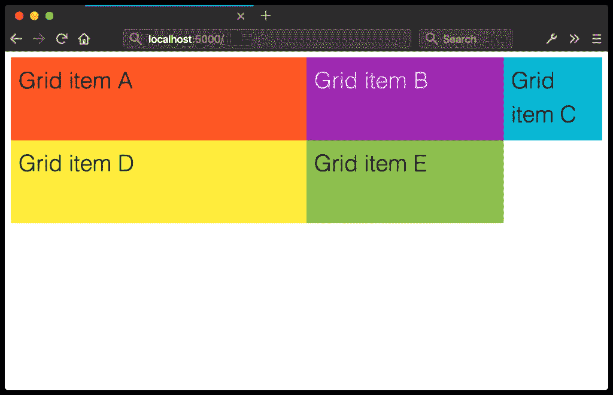Flexible length units maintain grid proportions, rather than absolute lengths

因为这些单位是比率而不是绝对长度，`grid-template-columns: 2fr 2fr 2fr`相当于`grid-template-columns: 1fr 1fr 1fr`。两者都将导致水平写入模式的等宽列和垂直写入模式的等高行。

*注意:`fr`单位不是真实长度值。这使得它们与其他长度单位不兼容，例如`px`和`rem`以及宽度百分比。这也意味着您不能使用带有`calc()`功能的`fr`单元。例如，`calc(1fr - 1rem)`是一个无效的长度值。*

## 使用`grid-template`速记属性

我们还可以使用`grid-template`属性来指示行数和列数。其语法如下:

```
grid-template: [row track list] / 
```

考虑这个 CSS 块:

```
.grid {
    display: grid;
    grid-template-columns: 25rem 25rem 25rem;
    grid-template-rows: 10rem 10rem;
} 
```

我们可以使用`grid-template`合并第二行和第三行:

```
.grid {
    display: grid;
    grid-template: 10rem 10rem / 25rem 25rem 25rem;
} 
```

然而，为了清楚起见，您可能仍然希望使用手写属性。

## 重复行和列

在许多情况下，您会想要自动重复的网格列或行；想象一个商店商品或食谱搜索结果的列表。Grid 为此提供了一个语法——`repeat()`函数:

```
.grid {
    display: grid;
    grid-template-columns: repeat(3, 1fr);
} 
```

`repeat()`接受两种说法:

1.  重复曲目列表的次数
2.  要重复的曲目列表

参数必须用逗号分隔。第一个参数可以是正整数，或者是关键字`auto-fit`或`auto-fill`。上面的 CSS 产生了下面的网格。我们的`1fr`曲目列表重复了三次。

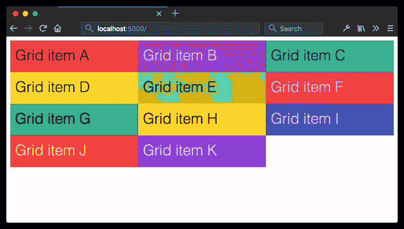A repeating grid with `fr` units

我们还可以使用重复两次的两列模式。例如，`grid-template-columns: repeat(2, 1fr 3fr);`生成一个四列网格。如下图所示，第一列和第三列的宽度是第二列和第四列的三分之一。在这两种情况下，`grid-template-rows`的值都是`auto`。

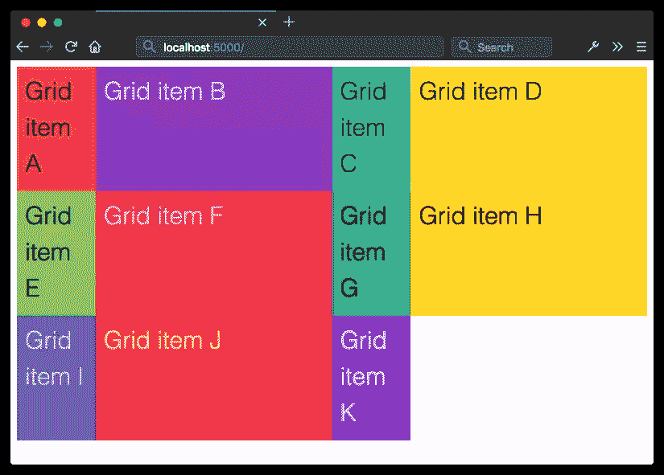A repeating two-column grid pattern

### 带有`auto-fit`或`auto-fill`的重复列

前面的两个例子告诉浏览器:*这里有一个曲目列表模式；请重复 X 次*。但是，您可能想告诉浏览器的是:*请在这个网格容器*中容纳尽可能多的列或行。为此，我们可以使用`auto-fit`或`auto-fill`作为`repeat()`的第一个参数，与`minmax()`结合使用。

`auto-fit`和`auto-fill`有什么区别？这很微妙，但意义重大。

*   `auto-fill`将尽可能多的网格项目放入一条轨迹线中，*如有必要，添加匿名网格轨迹*。
*   `auto-fit`在一条轨迹线中容纳尽可能多的网格项目，*如有必要，扩展或折叠每个轨迹的尺寸*。

当网格容器的宽度超过其网格项目的最大总宽度时，这种差异就变得很明显。我们来对比一些 CSS:

```
.grid {
    display: grid;
    width: 800px;
}
.autofill {
    grid-template-columns: repeat(auto-fill, minmax(100px, 1fr));
}
.autofit {
    grid-template-columns: repeat(auto-fit, minmax(100px, 1fr));
} 
```

让我们将这个 CSS 应用到下面的 HTML 中:

```
<div class="grid autofill">
    <div>Grid item A</div>
    <div>Grid item B</div>
    <div>Grid item C</div>
    <div>Grid item D </div>
    <div>Grid item E</div>
</div>

<div class="grid autofit">
    <div>Grid item A</div>
    <div>Grid item B</div>
    <div>Grid item C</div>
    <div>Grid item D </div>
    <div>Grid item E</div>
</div> 
```

这两种网格布局唯一的区别就是一个用`auto-fill`，一个用`auto-fit`。但是比较下图中的两个网格。

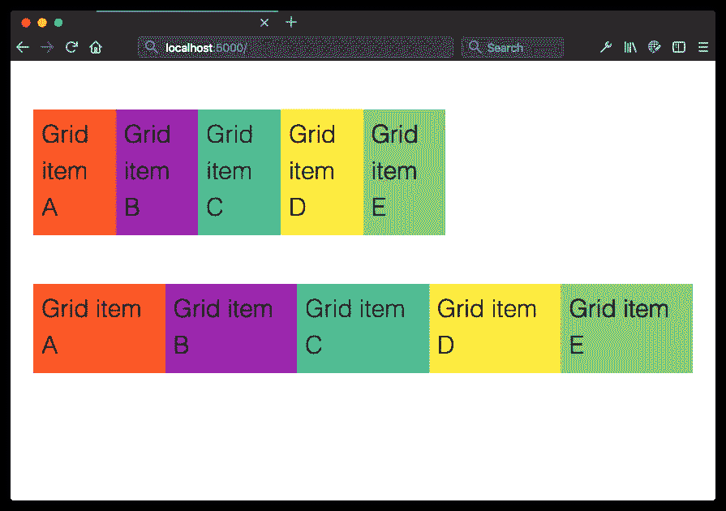Comparing `auto-fill` with `auto-fit`

在这两个网格中，网格项目的总最大宽度小于网格容器的最大宽度。然而，在顶部网格——我们的`auto-fill`网格——多余的空间被匿名网格项目*填充到*中。

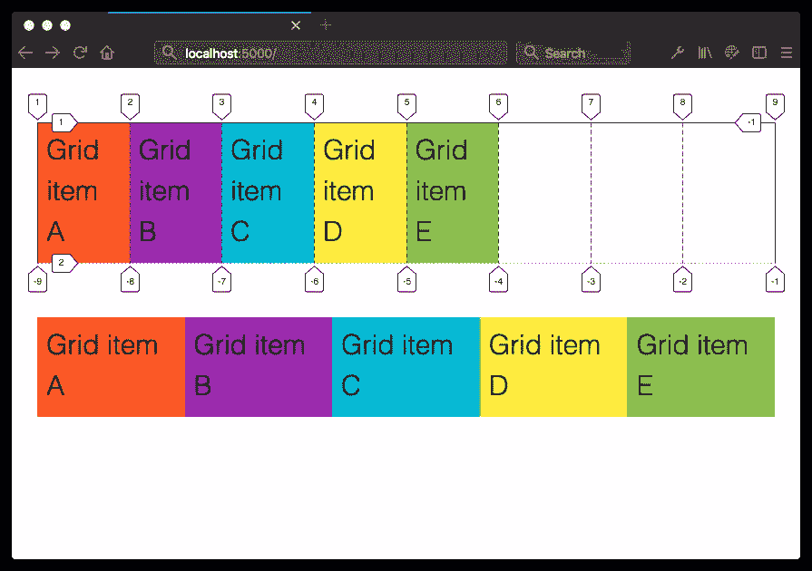Visualizing the difference between `auto-fill` to `auto-fit` with the Firefox grid inspector

与底部的网格相比，每个网格项都被拉伸以适应可用空间。上图展示了使用 Firefox 开发工具的匿名网格单元的样子。

*注意:如果这仍然没有任何意义，请阅读萨拉·苏伊丹的“[在 CSS 网格中自动调整列大小:`auto-fill` vs `auto-fit`](https://css-tricks.com/auto-sizing-columns-css-grid-auto-fill-vs-auto-fit/) ”。它包含一些视频示例，比静态图像更好地说明了这种差异。*

* * *

*这是《CSS 大师》一书的摘录，第二版。到目前为止，我们已经介绍了简单的网格，它们是整齐排列的行和列的盒子。这本书继续解释网格可以处理的更复杂的布局，包括基于行的网格放置、命名的网格区域、如何分隔网格项目以及处理网格中的图像。*

## 结论

CSS 网格是一个非常密集的话题。我们实际上只是触及了表面。幸运的是，有大量的资源可以帮助你了解更多。

我相信在可能的情况下阅读规范。在我看来， [CSS 网格规范](https://www.w3.org/TR/css-grid-1/)可读性很强，是你探索网格布局的好地方。但是规范确实倾向于包含很多术语，因为它们不仅针对 web 开发人员，也针对那些负责在浏览器中实现规范的人。

Rachel Andrew 的 [Grid by Example](https://gridbyexample.com/) 是为 web 开发人员创建的。该网站包括网格布局教程和一组常见的用户界面模式。一定要访问该网站的*资源*部分。这是一个链接的聚宝盆，展示了你可以用 CSS 网格做什么。

Jen Simmons 的实验布局实验室也充满了说明网格可能性的例子。如果视频更符合你的风格，西蒙斯的[布局和](https://www.youtube.com/channel/UC7TizprGknbDalbHplROtag) YouTube 频道包括网格和其他布局主题的视频演练。

当你需要更多的 cheatsheet 风格的参考资料时，试试 CSS-Tricks 的“[网格](https://css-tricks.com/snippets/css/complete-guide-grid/)完全指南”。

## 分享这篇文章