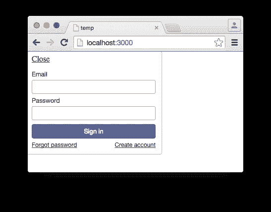

# 使用 Meteor 创建自定义登录和注册表单

> 原文：<https://www.sitepoint.com/creating-custom-login-registration-form-with-meteor/>

开箱即用，使用 Meteor JavaScript 框架可以做的最简单的事情之一就是创建一个用户帐户系统。只需安装一对软件包——`accounts-password`和`accounts-ui`——您将得到以下全功能界面:



虽然这种简单性很方便，但是依赖这种样板接口并不能带来很大的灵活性。那么，如果我们想为用户创建一个自定义界面来注册和登录我们的网站呢？

幸运的是，这一点也不困难。在本文中，我将向您展示如何使用 Meteor 创建自定义的登录和注册表单。然而，本文假设您知道如何自己使用这个框架建立一个项目。

为了使用本文中开发的代码，请看一看我设置的 GitHub 库。

## 基本设置

在一个新的 Meteor 项目中，通过执行以下命令添加`accounts-password`包:

```
meteor add accounts-password
```

通过将这个包添加到项目中，将创建一个`Meteor.users`集合来存储我们的用户数据，我们将不必为用户相关的功能编写定制逻辑。

因此，尽管创建自定义接口意味着我们将失去`accounts-ui`包的便利，但这并不意味着我们必须失去 Meteor 可以提供的后端“魔力”的便利。

## 开发界面

对于一个完整的登录和注册系统，我们必须为许多功能创建接口，包括:

*   登记
*   注册
*   忘记密码
*   “确认您的电子邮件”页面
*   “电子邮件确认”页面

但是现在，我们将讨论列出的前两点(注册和登录)表单。原因是一旦你掌握了基本原理，你就不难理解如何创建其他接口。

下面的代码片段显示了注册表单的代码:

```
<template name="register">
    <form>
        <input type="email" name="registerEmail">
        <input type="password" name="registerPassword">
        <input type="submit" value="Register">
    </form>
</template>
```

接下来的代码片段显示了登录表单的代码:

```
<template name="login">
    <form>
        <input type="email" name="loginEmail">
        <input type="password" name="loginPassword">
        <input type="submit" value="Login">
    </form>
</template>
```

如您所见，模板非常相似。它们包含一个表单、电子邮件和密码字段以及提交按钮。唯一的区别是输入字段和模板的`name`属性的值。(我们将很快引用这些值，因此请确保它们是唯一的。)

我们只希望为尚未登录的用户显示这些模板。因此，我们可以在开始和结束的`body`标签之间引用一个`currentUser`对象:

```
<head>
    <title>Custom Registration Tutorial</title>
</head>
<body>
    {{#if currentUser}}
        <p>You're logged in.</p>
    {{else}}
        {{> register}}
        {{> login}}
    {{/if}}
</body>
```

如果当前用户已登录，此代码显示“您已登录”消息，否则显示“注册”和“登录”模板。

## 创建事件

目前，我们的表单是静态的。为了让他们做些什么，我们需要他们对`submit`事件做出反应。让我们通过关注“注册”模板来演示这一点。

在项目的 JavaScript 文件中，编写以下内容:

```
if (Meteor.isClient) {
    Template.register.events({
        'submit form': function(event) {
            event.preventDefault();
            console.log("Form submitted.");
        }
    });
}
```

这里，我们编写了代码，以便“注册”模板中的表单:

1.  响应`submit`事件
2.  没有任何默认行为
3.  在控制台上输出确认消息

我们还将这段代码放在了`isClient`条件中，因为我们不希望这段代码在服务器上运行(因为它只适用于接口)。

在事件内部，我们需要获取电子邮件和密码字段的值，并将它们存储在一对变量中。所以让我们修改前面的代码:

```
Template.register.events({
    'submit form': function(event){
        event.preventDefault();
        var emailVar = event.target.registerEmail.value;
        var passwordVar = event.target.registerPassword.value;
        console.log("Form submitted.");
    }
});
```

对于“登录”模板，代码几乎相同:

```
Template.login.events({
    'submit form': function(event) {
        event.preventDefault();
        var emailVar = event.target.loginEmail.value;
        var passwordVar = event.target.loginPassword.value;
        console.log("Form submitted.");
    }
});
```

## 一起看东西

将`accounts-password`包添加到项目中后，我们可以使用许多方法:

*   `Accounts.createUser()`
*   `Accounts.changePassword()`
*   `Accounts.forgotPassword()`
*   `Accounts.resetPassword()`
*   `Accounts.setPassword()`
*   `Accounts.verifyEmail()`

我们将把重点放在`createUser`方法上，但是根据方法名，不难看出其他方法的用途。

在“注册”模板的`submit`事件的底部，写下:

```
Accounts.createUser({
    // options go here
});
```

这是我们可以用来创建新用户的代码，默认情况下，它需要两个选项:电子邮件和密码。

要传递它们，请写:

```
Accounts.createUser({
    email: emailVar,
    password: passwordVar
});
```

事件的最终代码应该类似于:

```
Template.register.events({
    'submit form': function(event) {
        event.preventDefault();
        var emailVar = event.target.registerEmail.value;
        var passwordVar = event.target.registerPassword.value;
        Accounts.createUser({
            email: emailVar,
            password: passwordVar
        });
    }
});
```

通过使用这个代码而不是一个普通的`insert`函数，我们有了自动加密密码的优势。而且，用户注册后登录，我们不用写太多代码。

我们还可以在“登录”事件中使用一个`loginWithPassword()`方法:

```
Meteor.loginWithPassword();
```

它还接受电子邮件和密码值:

```
Meteor.loginWithPassword(emailVar, passwordVar);
```

在上下文中，代码应该是这样的:

```
Template.login.events({
    'submit form': function(event){
        event.preventDefault();
        var emailVar = event.target.loginEmail.value;
        var passwordVar = event.target.loginPassword.value;
        Meteor.loginWithPassword(emailVar, passwordVar);
    }
});
```

## 注销

用户现在可以注册和登录，但是为了允许他们注销，让我们首先创建一个新的“仪表板”模板，它将在登录时显示:

```
<template name="dashboard">
    <p>You're logged in.</p>
    <p><a href="#" class="logout">Logout</a></p>
</template>
```

然后将下面的代码包含在我们在本文前面编写的`if`语句中:

```
<body>
    {{#if currentUser}}
        {{> dashboard}}
    {{else}}
        {{> register}}
        {{> login}}
    {{/if}}
</body>
```

现在，我们可以创建一个附加到“仪表板”模板中“注销”链接的事件:

```
Template.dashboard.events({
    'click .logout': function(event){
        event.preventDefault();
    }
});
```

要执行注销过程，我们只需使用这样一个`logout`方法:

```
Template.dashboard.events({
    'click .logout': function(event){
        event.preventDefault();
        Meteor.logout();
    }
});
```

注册、登录和注销现在应该都可以正常工作了。

## 结论

我们已经用很少的代码取得了很大的进步，但是如果我们想为账户系统创建一个完整的界面，还有很多工作要做。

以下是我的建议:

1.  [启用新用户邮件验证](http://docs.meteor.com/#/full/accounts_config)。
2.  [验证用户](http://docs.meteor.com/#/full/accounts_validatenewuser)的 [(和登录)。](http://docs.meteor.com/#/full/accounts_validateloginattempt)
3.  [向“注册”和“登录”表单添加视觉验证](https://atmospherejs.com/themeteorchef/jquery-validation)。
4.  [登录失败时采取措施](http://docs.meteor.com/#/full/accounts_onloginfailure)。
5.  [允许用户更改密码](http://docs.meteor.com/#/full/accounts_changepassword)。

可能要花一个下午的时间来弄清楚如何实现这些特性的细节，但是根据我们在本教程中介绍的内容，没有什么是你力所能及的。流星为我们做了艰苦的工作。

如果您想使用本文中开发的代码，请看一看我建立的 GitHub 库。

## 分享这篇文章