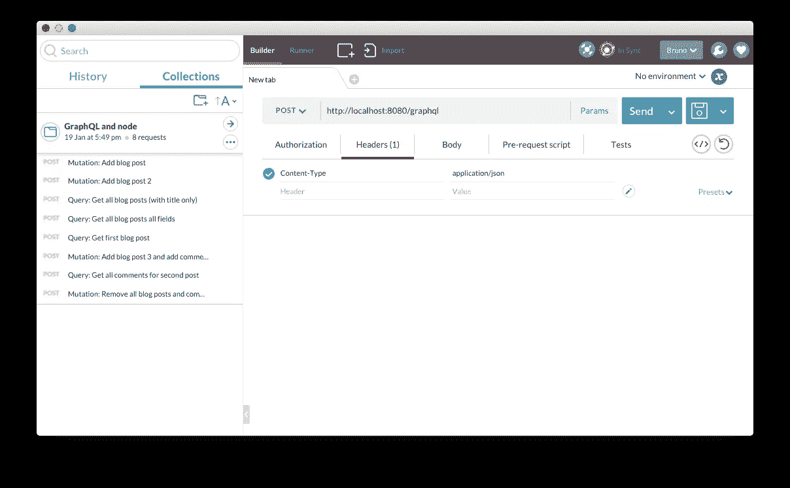
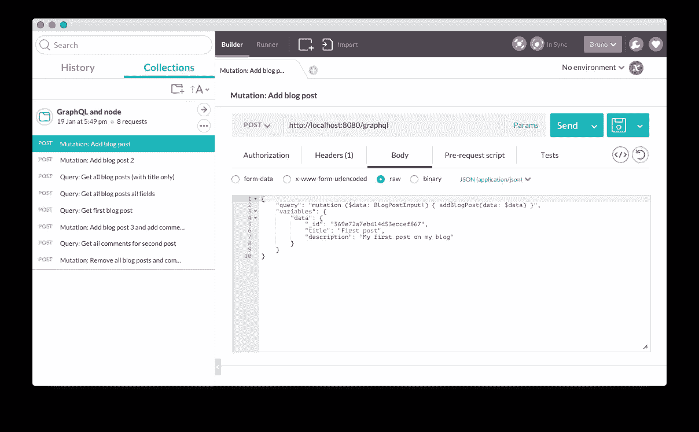
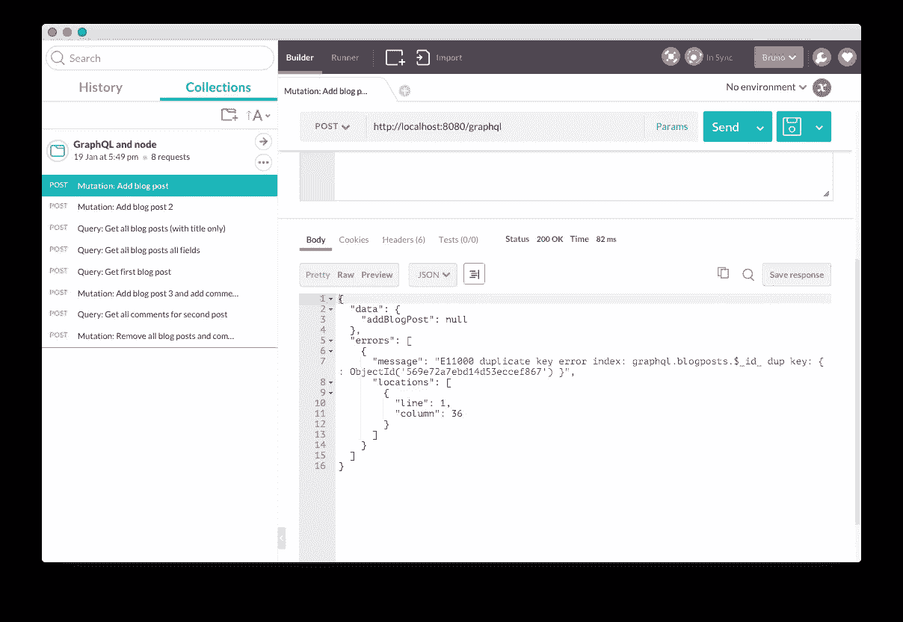

# 使用 Node.js 和 MongoDB 创建 GraphQL 服务器

> 原文：<https://www.sitepoint.com/creating-graphql-server-nodejs-mongodb/>

*这篇文章由[瑞安·陈基](https://www.sitepoint.com/author/rchenkie/)进行了同行评审。感谢 SitePoint 的所有同行评审员使 SitePoint 的内容尽可能做到最好！*

在客户端向服务器请求数据并不是一个新概念。它允许应用程序在不刷新页面的情况下加载数据。这在单页面应用程序中使用得最多，这种应用程序不是从服务器获取呈现的页面，而是只请求在客户端呈现页面所需的数据。

在过去几年中，web 上最常见的方法是 REST 架构风格。然而，这种方法给高数据需求的应用带来了一些限制。在 RESTful 系统中，我们需要发出多个 HTTP 请求来获取我们想要的所有数据，这有一个[显著的性能影响](https://www.sitepoint.com/web-site-optimization-steps/)。如果有一种方法可以在一个 HTTP 请求中请求多个资源，那会怎么样？

介绍了 GraphQL，一种统一客户端和服务器端通信的查询语言。它允许客户端在一个请求中准确描述它需要的数据。

在本文中，我们将创建一个具有 GraphQL 路由的 Node.js/Express 服务器，它将处理我们所有的查询和变异。然后，我们将通过发送一些 POST 请求来测试这条路由，并使用 [Postman](https://www.getpostman.com/) 来分析结果。

您可以在这里找到这个应用程序的完整源代码。我还做了一个邮差合集，你可以[在这里](https://www.getpostman.com/collections/4a2b6fe97174396c522e)下载。

## 在 Express 服务器上设置 GraphQL 端点

首先要做的是使用 Express 框架创建 Node.js 服务器。我们还将使用 [MongoDB](https://www.mongodb.org/) 和[mongose](http://mongoosejs.com/)实现数据持久性，babel 使用 [ES6](https://www.sitepoint.com/understanding-es6-modules/) 。因为代码在运行时被传输到 ES5，所以不需要构建过程。这是在 [index.js](https://github.com/sitepoint-editors/graphql-nodejs/blob/master/index.js) 中完成的:

```
// index.js
require('babel/register');
require('./app'); 
```

在 [app.js](https://github.com/sitepoint-editors/graphql-nodejs/blob/master/app.js) 中，我们将启动我们的服务器，连接一个 Mongo 数据库并创建一个 GraphQL 路由。

```
// app.js
import express from 'express';
import graphqlHTTP from 'express-graphql';
import mongoose from 'mongoose';

import schema from './graphql';

var app = express();

// GraphqQL server route
app.use('/graphql', graphqlHTTP(req => ({
  schema,
  pretty: true
})));

// Connect mongo database
mongoose.connect('mongodb://localhost/graphql');

// start server
var server = app.listen(8080, () => {
  console.log('Listening at port', server.address().port);
}); 
```

在本文上下文中，上面代码最相关的部分是我们定义 GraphQL 路径的地方。我们使用 [express-graphql](https://github.com/graphql/express-graphql) ，一个由脸书 [GraphQL 团队](https://github.com/graphql)开发的 express 中间件。这将通过 GraphQL 处理 HTTP 请求，并返回 JSON 响应。为此，我们需要在选项中传递我们的 GraphQL 模式，这将在下一节中讨论。我们还将选项`pretty`设置为 true。这使得 JSON 响应打印得很漂亮，更容易阅读。

## GraphQL 模式

为了让 GraphQL 理解我们的请求，我们需要定义一个模式。GraphQL 模式只不过是一组查询和变异。您可以将查询视为从数据库中检索的资源，将突变视为对数据库的任何类型的更新。作为示例，我们将创建一个`BlogPost`和一个`Comment`mongose 模型，然后我们将为它创建一些查询和变体。

### 猫鼬模型

让我们从创建猫鼬模型开始。因为猫鼬不是本文的重点，所以这里就不赘述了。你可以在 [models/blog-post.js](https://github.com/sitepoint-editors/graphql-nodejs/tree/master/models/blog-post.js) 和 [models/comment.js](https://github.com/sitepoint-editors/graphql-nodejs/tree/master/models/comment.js) 中找到这两款。

### 图形 SQL 类型

与 Mongoose 一样，在 GraphQL 中，我们需要定义我们的数据结构。不同之处在于，我们为每个查询和变异定义了可以输入什么类型的数据以及在响应中发送什么。如果这些类型不匹配，就会引发错误。虽然这看起来有些多余，但是因为我们已经在 mongoose 中定义了一个模式模型，所以它有很大的优势，比如:

*   您可以控制允许哪些内容进入，这提高了您的系统安全性
*   你控制什么可以出去。这意味着您可以定义永远不允许检索的特定字段。例如:密码或其他敏感数据
*   它过滤无效的请求，以便不采取进一步的处理，这可以提高服务器的性能

您可以在 [graphql/types/](https://github.com/sitepoint-editors/graphql-nodejs/tree/master/graphql/types) 中找到 GraphQL 类型的源代码。这里有一个例子:

```
// graphql/types/blog-post.js
import {
  GraphQLObjectType,
  GraphQLNonNull,
  GraphQLString,
  GraphQLID
} from 'graphql';

export default new GraphQLObjectType({
  name: 'BlogPost',
  fields: {
    _id: {
      type: new GraphQLNonNull(GraphQLID)
    },
    title: {
      type: GraphQLString
    },
    description: {
      type: GraphQLString
    }
  }
}); 
```

这里，我们定义了 blog post 输出 GraphQL 类型，我们将在创建查询和变化时进一步使用它。注意它的结构和猫鼬模型`BlogPost`是多么的相似。这似乎是重复工作，但这是两个不同的问题。mongoose 模型定义了数据库的数据结构，GraphQL 类型定义了在对服务器的查询或变更中接受什么的规则。

### GraphQL 模式创建

创建了 Mongoose 模型和 GraphQL 类型之后，我们现在可以创建我们的 GraphQL 模式了。

```
// graphql/index.js
import {
  GraphQLObjectType,
  GraphQLSchema
} from 'graphql';

import mutations from './mutations';
import queries from './queries';

export default new GraphQLSchema({
  query: new GraphQLObjectType({
    name: 'Query',
    fields: queries
  }),
  mutation: new GraphQLObjectType({
    name: 'Mutation',
    fields: mutations
  })
}); 
```

这里我们导出一个 GraphQLSchema，其中定义了两个属性:查询和变异。GraphQLObjectType 是众多 GraphQL 类型中的[之一。对于这一点，您可以特别指定:](http://graphql.org/docs/api-reference-type-system/)

*   **名称**——该名称应是唯一的，用于识别对象；
*   **字段**–接受一个对象的属性，在这种情况下将是我们的查询和突变。

我们正在从另一个位置导入`queries`和`mutations`，这只是为了结构的目的。如果我们想要添加更多的模型、查询、突变等，源代码的结构方式可以使我们的项目很好地扩展。

我们传递给字段的`queries`和`mutations`变量是普通的 JavaScript 对象。关键字是突变或查询名称。这些值是普通的 JavaScript 对象，带有告诉 GraphQL 如何处理它们的配置。让我们以下面的 GraphQL 查询为例:

```
query {
    blogPosts {
        _id,
        title
    }
    comments {
        text   
    }
} 
```

为了让 GrahpQL 理解如何处理这个查询，我们需要定义`blogPosts`和`comments`查询。所以我们的`queries`变量应该是这样的:

```
{
    blogPosts: {...},
    comments: {...}
} 
```

同样适用于`mutations`。这解释了在我们的查询或突变中的键和我们放入查询中的名字之间有直接的关系。现在让我们看看这些查询和变异是如何定义的。

### 问题

从查询开始，让我们从一个使用我们到目前为止已经创建的模型的例子开始。一个很好的例子是获取一篇博客文章及其所有评论。

在 REST 解决方案中，您必须为此发出两个 HTTP 请求。一个获取博客文章，另一个获取评论，如下所示:

```
GET /api/blog-post/[some-blog-post-id]
GET /api/comments?postId='[some-blog-post-id]' 
```

在 GraphQL 中，我们可以仅在一个 HTTP 请求中使用以下查询来实现这一点:

```
query ($postId: ID!) {
    blogPost (id: $postId) {
        title,
        description
    }
    comments (postId: $postId) {
        text
    }
} 
```

我们可以在一个请求中获取我们想要的所有数据，这就提高了性能。我们也可以询问我们将要使用的确切属性。上例中，回复只会带来博文的`title`和`description`，评论只会带来`text`。

仅从每个资源中检索所需的字段，会对网页或应用程序的加载时间产生巨大影响。让我们看看注释的例子，它也有一个`_id`和一个`postId`属性。每一个都很小，[确切地说是 12 个字节](https://docs.mongodb.org/manual/reference/object-id/)(不包括对象键)。这在单个或者几个评论的时候影响不大。当我们谈论比如说 200 个评论时，那超过 4800 个字节，我们甚至不会使用。这对应用程序的加载时间有很大的影响。这对于资源有限的设备尤其重要，例如移动设备，它们通常具有较慢的网络连接。

为此，我们需要告诉 GraphQL 如何为每个特定的查询获取数据。让我们看一个查询定义的例子:

```
// graphql/queries/blog-post/single.js
import {
  GraphQLList,
  GraphQLID,
  GraphQLNonNull
} from 'graphql';
import {Types} from 'mongoose';

import blogPostType from '../../types/blog-post';
import getProjection from '../../get-projection';
import BlogPostModel from '../../../models/blog-post';

export default {
  type: blogPostType,
  args: {
    id: {
      name: 'id',
      type: new GraphQLNonNull(GraphQLID)
    }
  },
  resolve (root, params, options) {
    const projection = getProjection(options.fieldASTs[0]);

    return BlogPostModel
      .findById(params.id)
      .select(projection)
      .exec();
  }
}; 
```

这里我们创建一个查询，基于 id 参数检索一篇博客文章。注意，我们指定了一个`type`，它是我们之前创建的，用于验证查询的输出。我们还用该查询所需的参数设置了一个`args`对象。最后，一个`resolve`函数，我们查询数据库并返回数据。

为了进一步优化获取数据的过程并利用 mongoDB 上的投影特性，我们正在处理 GraphQL 提供给我们的 AST，以生成与 mongoose 兼容的投影。因此，如果我们进行以下查询:

```
query ($postId: ID!) {
    blogPost (id: $postId) {
        title,
        description
    }
} 
```

因为我们只需要从数据库中获取`title`和`description`，所以`getProjection`函数将生成一个 mongoose 有效投影:

```
{
    title: 1,
    description: 1
} 
```

您可以在源代码中的`graphql/queries/*`处看到其他查询。我们不会逐一介绍，因为它们都与上面的例子相似。

### 突变

突变是对数据库进行某种改变的操作。像查询一样，我们可以在单个 HTTP 请求中对不同的突变进行分组。通常一个动作是孤立的，例如“添加评论”或“创建博客文章”。虽然，随着应用程序和数据收集的复杂性不断增加，无论是用于分析、用户体验测试还是复杂的操作，用户在网站或应用程序上的一个操作都可能触发数据库不同资源的大量突变。以我们的例子为例，我们的博客帖子上的新评论可能意味着新评论和博客帖子评论计数的更新。在 REST 解决方案中，您可能会看到如下内容:

```
POST /api/blog-post/increment-comment
POST /api/comment/new 
```

使用 GraphQL，您只需一个 HTTP 请求就可以做到，如下所示:

```
mutation ($postId: ID!, $comment: String!) {
    blogPostCommentInc (id: $postId)
    addComment (postId: $postId, comment: $comment) {
        _id
    }
} 
```

注意，查询和突变的语法完全相同，只是将`query`改为`mutation`。我们可以像从查询中一样从突变中获取数据。通过不指定片段，就像我们在上面对`blogPostCommentInc`的查询中那样，我们只是询问一个真或假的返回值，这通常足以确认操作。或者我们可以要求一些数据，就像我们对`addComment`突变所做的那样，这对于检索仅在服务器上生成的数据非常有用。

然后让我们定义我们的服务器中的突变。突变的创建与查询完全一样:

```
// graphql/mutations/blog-post/add.js
import {
  GraphQLNonNull,
  GraphQLBoolean
} from 'graphql';

import blogPostInputType from '../../types/blog-post-input';
import BlogPostModel from '../../../models/blog-post';

export default {
  type: GraphQLBoolean,
  args: {
    data: {
      name: 'data',
      type: new GraphQLNonNull(blogPostInputType)
    }
  },
  async resolve (root, params, options) {
    const blogPostModel = new BlogPostModel(params.data);
    const newBlogPost = await blogPostModel.save();

    if (!newBlogPost) {
      throw new Error('Error adding new blog post');
    }
    return true;
  }
}; 
```

这种变异会添加一篇新的博文，如果成功的话会返回`true`。注意在`type`中，我们如何指定将要返回的内容。在`args`中，从突变中得到的论据。和一个与查询定义中完全一样的`resolve()`函数。

## 测试 GraphQL 端点

既然我们已经用 GraphQL 路由和一些查询和变化创建了我们的 Express 服务器，让我们通过向它发送一些请求来测试它。

有许多方法可以将 GET 或 POST 请求发送到一个位置，例如:

*   **浏览器**–通过在浏览器中键入一个 url，您正在发送一个 GET 请求。这具有不能发送 POST 请求的限制
*   **卷曲**–用于命令行风扇。它能够向服务器发送任何类型的请求。尽管这不是最好的界面，但是你不能保存请求，你需要在命令行中写所有的东西，这在我看来并不理想
*   [**graph QL**](https://github.com/graphql/graphiql)——graph QL 的绝佳解决方案。这是一个浏览器集成开发环境，可以用来创建对服务器的查询。它有一些很棒的特性，比如:语法高亮和提前输入

除了上面描述的解决方案，还有更多解决方案。前两个是最广为人知和使用最多的。GraphQL 是 GraphQL 团队简化 graph QL 过程的解决方案，因为编写查询可能会更复杂。

从这三个中，我会推荐 GraphiQL，尽管我最喜欢和推荐的是 [Postman](https://www.getpostman.com/) 。这个工具绝对是 API 测试的一个进步。它提供了一个直观的界面，您可以在其中创建和保存任何类型请求的集合。您甚至可以为您的 API 创建测试，并通过单击一个按钮来运行它们。它还有一个协作特性，允许共享请求集合。所以我创建了一个，你可以[在这里](https://www.getpostman.com/collections/4a2b6fe97174396c522e)下载，然后你可以导入到 Postman。如果你没有安装 Postman，我绝对推荐你这样做。

让我们从运行服务器开始。您应该安装 node 4 或更高版本；如果你还没有，我推荐用 [nvm](https://github.com/creationix/nvm) 安装。然后，我们可以在命令行中运行以下命令:

```
$ git clone https://github.com/sitepoint-editors/graphql-nodejs.git
$ cd graphql-nodejs
$ npm install
$ npm start 
```

服务器现在已经准备好接收请求，所以让我们在 Postman 上创建一些请求。我们的 GraphQL 路由设置在`/graphql`上，所以首先要做的是将位置设置为我们希望将请求定向到的位置，即`http://localhost:8080/graphql`。然后我们需要指定它是 GET 请求还是 POST 请求。虽然你可以使用其中任何一个，但我更喜欢 POST，因为它不会影响 URL，使它更干净。我们还需要配置请求的报头，在我们的例子中，我们只需要添加等于`application/json`的`Content-Type`。以下是它在 Postman 中的所有设置:



我们现在可以创建一个主体，它将包含我们的 GraphQL 查询和 JSON 格式的变量，如下所示:



假设您已经导入了我提供的集合，您应该已经有了一些可以测试的查询和变异请求。因为我使用了硬编码的 Mongo ids，所以按顺序运行请求，它们应该都会成功。分析一下我在每个人身体里放了什么，你会发现这只是本文所讨论内容的一个应用。此外，如果您多次运行第一个请求，由于它将是一个重复的 id，您可以看到错误是如何返回的:



## 结论

在本文中，我们介绍了 GraphQL 的潜力以及它与 REST 架构风格的不同之处。这种新的查询语言将对网络产生巨大的影响。特别是对于更复杂的数据应用程序，现在可以准确地描述他们想要的数据，并用一个 HTTP 请求来请求它。

我很想听听你的意见:你对 GraphQL 有什么看法，你对它有什么体验？

## 分享这篇文章