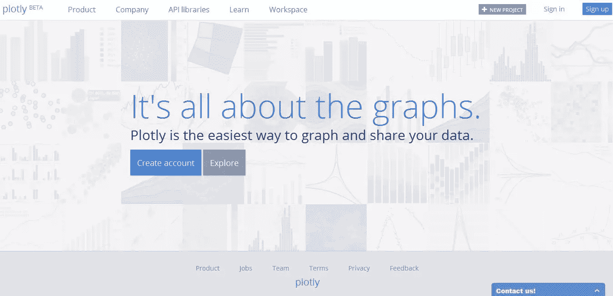
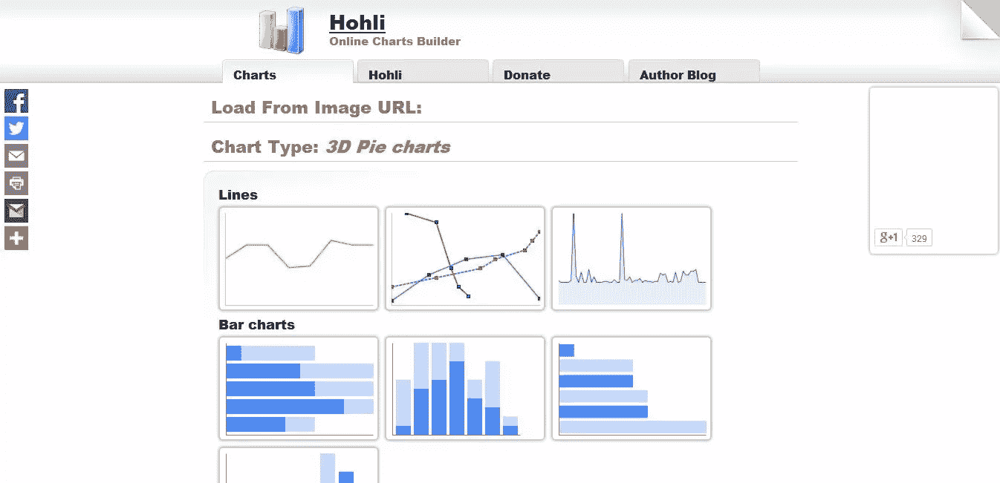
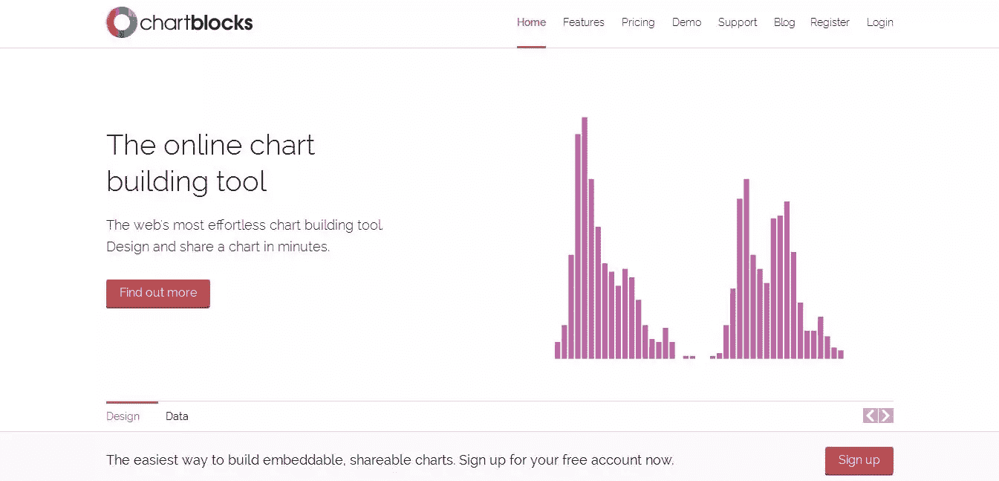
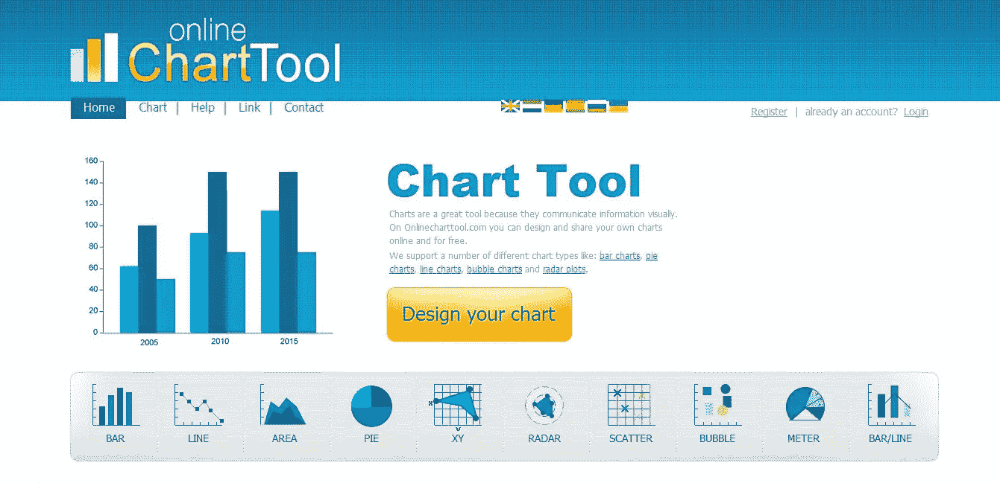
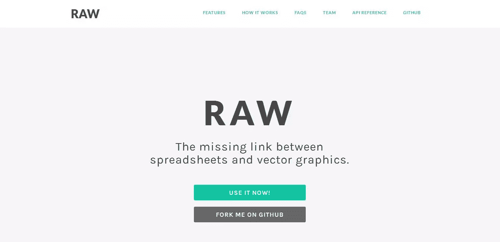

# 回顾:创建惊人在线图表的 5 个工具

> 原文：<https://www.sitepoint.com/creating-great-online-charts/>

液体之夜

快！在不到 24 小时的时间里，你有一个很大的演示文稿，其中包括一些数据表和电子表格。这是很好的数据，但没什么可看的。你想呈现比直截了当的图像更动态的东西，但是从头开始编写解决方案对你来说不是一个选项。

幸运的是，有一些在线解决方案不需要编码就能产生有吸引力的动态结果。

今天，我将向您简要介绍五种可能的解决方案，它们将帮助您构建不仅仅是一个简单的条形图。

我们开始吧！

## Plot.ly

Plot.ly

**第一印象:** Plotly 很人性化，这是我注意到的第一点。创建帐户后，我可以在五秒钟内轻松浏览网站。在账户名旁边的右上角，你可以创建你的第一个项目。

在这里，您可以选择是否要构建地块或网格。在那里，您将被引导导入数据。如果你只是想试驾 Plotly，可以查看 12 个预建的数据示例。仅这些例子就能让你了解 Plotly 能为你做什么，老实说，这是令人印象深刻的东西。

创建您的图表只需加载您的信息并定制轨迹、布局、轴、注释和图例。您可以随意使用的图表和图形类型非常专业，因此它是那些商业和分析演示的完美解决方案。

然而，这并不意味着那些呈现更随意信息的人不能使用它。即使 Plotly 仍处于测试阶段，它也有适合每个人的东西。

### 特点:

*   普洛特利自由了
*   您可以创建多达 50 个私人文件
*   你可以不依赖电子邮件而在图表上合作
*   交互式图表和各种数据可视化可供选择
*   图表可以导出为多种格式，包括 EPS、SVG 和 PDF
*   不需要安装

*注意* : Plotly 仍然相对较新，但是他们通过 [Plotly 博客](http://blog.plot.ly/post/97151096882/plotly-heres-what-you-can-do-one-year-in)报告他们最近的更新，并且展示你可以用这个程序做什么。如果你刚刚开始，想看看 Plotly 是怎么回事，那么看看他们的[学习](https://plot.ly/learn/)页面。

## Hohli:在线图表生成器

[http://charts.hohli.com/](http://charts.hohli.com/)

第一印象: Hohli 的图表生成器非常适合那些寻找高于平均水平的图表而不需要花里胡哨的人。

从一开始，您的图形类型选项就很清楚。总共有六种主要的图形类型，而其中三种图形类型又有所不同。

构建一个新图是一个相当简单的线性过程。这是一种很好的方法，因为在开始合成数据时，您永远不会被无数的选项淹没。

还有自定义图表大小和方向的能力，所以如果你需要一个垂直的图表而不是水平的，你很幸运。更不用说在屏幕右侧有一个预览窗口，可以让你看到你正在做什么，这使得纠正错误变得轻而易举。

### 特点:

*   在线图表生成器是完全免费的
*   不需要注册
*   定制图表就像点击几下、选择颜色和输入数据一样简单
*   您可以更改图表类型，而无需重新开始
*   从谷歌图表加载的能力

## 图表区块

[https://app.chartblocks.com/](https://app.chartblocks.com/)

**第一印象:** [ChartBlocks](https://app.chartblocks.com/) 很漂亮，显然创作者在设计这个免费增值图表生成器时考虑了很多视觉吸引力。注册一个账户后，你会立即被投入其中，并被提示创建你的第一张图表。

像 Plot.ly 一样，ChartBlocks 引导你完成第一次创作。这里您有三种选择:复制/粘贴或手动输入您的数据，使用您已经导入图表块的数据(仅适用于您之前已经创建的图表)或从您的计算机上传电子表格。

从那里开始，过程就顺利进行了。如果你使用免费帐户，只有五种图表类型可供选择，不幸的是，除了一些提供颜色变化的模板外，你定制图表类型的能力是有限的。

除了缺点之外，您还可以访问一组可定制选项，使您的图表在视觉上与您的演示相匹配。

### 特点:

*   ChartBlocks 是一种免费增值模式，包含 5 种图表类型
*   您可以使用三种添加数据的方法
*   图表的可定制资产有助于它们脱颖而出
*   下载多种格式的图表，包括 PS、SVG 和 PNG
*   您的图表可以通过社交网络共享，甚至嵌入到您的网站和演示文稿中

## 在线图表工具

[http://onlinecharttool.com/](http://onlinecharttool.com/)

第一印象:在线图表工具让我想起了 Hohli 工具的一个更漂亮的版本，有更多的选项和图表类型。

总而言之，有十种图表类型可供选择，每种都有自己独特的外观。像其他图表生成器一样,“OCT”在数据设计过程中遵循令人愉快的线性工作流程。然而，每种图形类型都有不同的选择和变量。

例如，如果你选择面积图，你需要决定类型和样式选项，而选择米图只需要你决定你的风格。此时，您可以手动或通过上传 CSV 文件来添加数据。

如果您在选择图表的样式资源时没有足够的可定制选项，您也可以决定标签和字体在成品上的显示方式。当您认为准备好了，您可以预览您的图表，完成您喜欢的任何调整，然后共享或下载它。

### 特点:

*   在线图表工具是一个免费的在线程序
*   不需要注册，但你可以创建一个帐户
*   您可以使用各种图表和自定义选项
*   创建标签时，有 17 种字体可供选择
*   您可以在线保存图表数据，无论是共享还是以后再使用
*   有四个可供下载的选项供您选择，包括 PDF 和 CSV
*   该网站提供了六种语言选项，让非英语人士更容易访问

## 生的

[http://raw.densitydesign.org/](http://raw.densitydesign.org/)

第一印象: RAW 不同于我见过的任何其他免费在线图形程序。如果你喜欢 Plotly 提供的专业性和各种各样的图表，那么你很可能会喜欢 RAW 提供的图表。

您可以从 16 个图表中进行选择，而不是标准的条形图/饼图。更不用说有能力设计自己的图表，如果你这样选择。

RAW 非常容易使用，当你想继续时，甚至不需要点击“下一步”按钮。你甚至不需要注册该服务就可以使用它。

不利的一面是，RAW 目前不提供上传电子表格的功能——但你可以相当容易地复制和粘贴你的数据。从那里，你可以选择你的图表类型。其中很多你可能没有听说过的图表类型，但幸运的是，左边有一个摘要，解释了每种类型。

你可以“规划出你的布局”，或者，换句话说，规划你的信息要去哪里。这是以一种松散的拖放方式完成的，与我玩过的其他应用程序完全不同。移动和排列数据会导致图表的实时变化，因此您可以有条不紊地测试什么效果最好。

一旦你完成了这个映射阶段，你就真的完成了，因为没有颜色和类型的定制选项。

### 特点:

*   任何人都可以免费使用 RAW
*   不需要注册
*   轻松创建图表
*   拖放映射工具，允许您在不意外删除数据的情况下更改信息
*   16 种专业图表可供选择
*   三个可下载选项以及一个生成的嵌入代码
*   由于没有服务器端操作，您的数据仍然安全

*注意:* RAW 是一个开放的可定制项目，可以自由下载和修改。更多信息请查看他们的 [FAQ](https://github.com/densitydesign/raw/wiki/FAQs) 或者在 GitHub 上获取[分叉。](https://github.com/densitydesign/raw/)

## 结果

所有提到的程序都是伟大的工具，任何人都希望不用编码就能构建和显示图表。从引人入胜的彩色图表到更简洁、更专业的设计，每个人都有自己的选择。

如果你想让你的演讲惊艳全场，我绝对推荐**剧情**和**原始**。对于免费程序，这两个产生了一些令人印象深刻的结果。尽管如此，Hohli、ChartBlocks 和在线图表工具都提供了独特的功能，是任何希望可视化数据的人的完美竞争者。

## 分享这篇文章