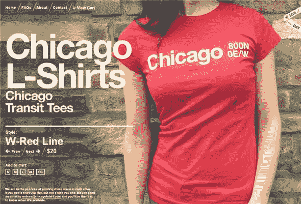
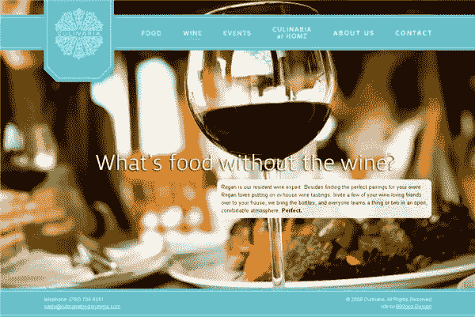
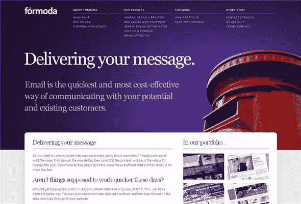
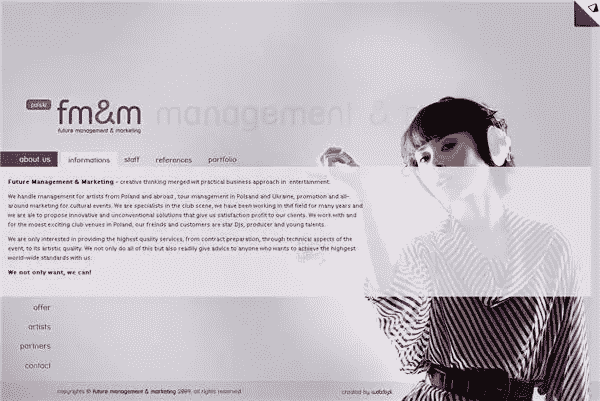
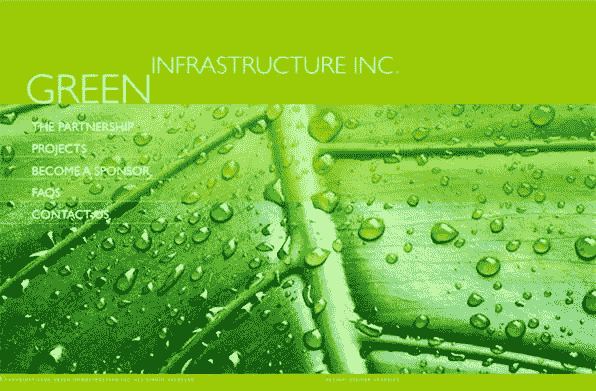
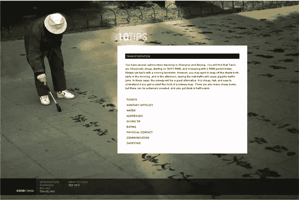
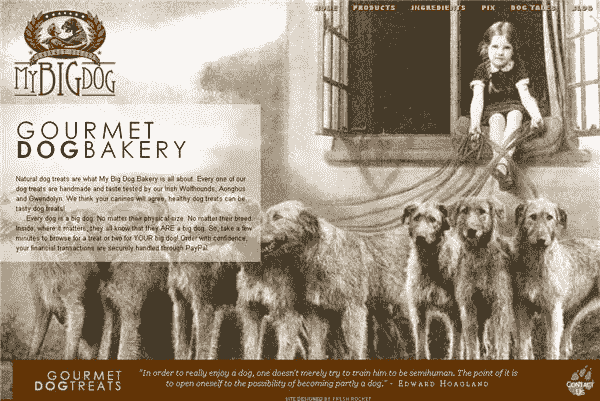
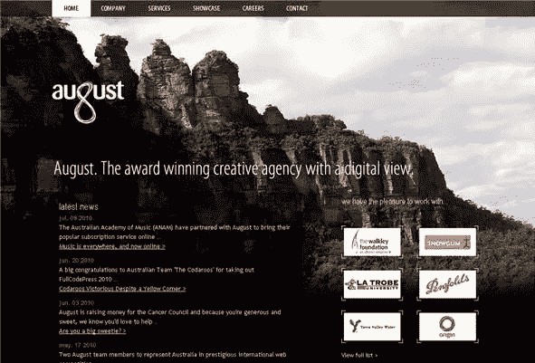

# 在网络上用照片背景创造冲击

> 原文：<https://www.sitepoint.com/creating-impact-with-photographic-backgrounds-on-the-web/>

作为网页设计者，我们通常试图用三个主要目标来设计网站:

1.吸引注意力

2.传达信息

3.创造持久的视觉印象

听起来很简单，不是吗？你的设计和布局在决定访问者是否会停留足够长的时间来浏览你的内容和你要说的内容方面起着很大的作用。通过创造视觉冲击，你抓住了观众的注意力，并(希望)让他们有足够的兴趣阅读你的信息。

有几种方法可以创造视觉冲击，过去我曾写过对比度、T2 值和 T4 色，这些都是设计中非常重要的元素。许多熟练的设计师使用摄影背景元素来创建引人注目的网站，同时又不丢失中间的信息。让我们来看一些例子。这些网站是基于 Flash 和 HTML 的网站的混合体。

Chicago L Shirts 网站将他们的 t 恤作为全尺寸背景图片展示。

Culinaria 食品和酒使用食物和饮料的大幅照片，文字覆盖在半透明的白色盒子上。

在 [Formoda](http://www.formoda.co.uk/email-marketing-devon/) 站点中，主背景图像在每个部分中变化。这些图片色彩鲜艳，但在每一页上为主要标题和简短信息留有足够的空白空间。

未来的管理和营销在整个网站的背景中使用相同的照片图像。文本覆盖在半透明的背景上。

在[绿色基础设施](http://www.greeninfrastructureinc.com/)网站的每一个部分都有一个自然场景的特写照片——树叶、贝壳、气泡，它们补充了页面上的文字。

[去中国](http://www.ringvemedia.com/)有一些很美的摄影作品。同样，每个部分都有自己的背景图像，信息显示在图像上方的白色文本框中。

我的大狗面包店有一个不寻常的背景图片集，但主页(下图)有一个甜美的老式图片，一个女孩带着一群爱尔兰猎狼犬。

[八月创意社](http://www.august.com.au/)

你觉得这些网站怎么样？你喜欢使用大的摄影背景吗？

## 分享这篇文章