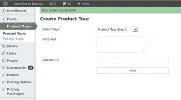
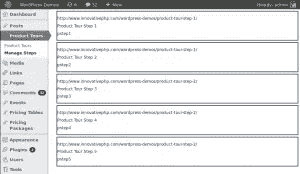

# 在 WordPress 中创建 Intro.js Powered 旅游

> 原文：<https://www.sitepoint.com/creating-intro-js-powered-tours-wordpress/>

在之前的文章[Intro.js 产品之旅简介](https://www.sitepoint.com/introduction-product-tours-intro-js/)中，我们讨论了创建产品之旅的重要性，以及如何使用 intro . js 创建令人惊叹的产品之旅。不幸的是，我们手动配置了每个步骤——这种方法不适合编程知识有限的用户。然而，Intro.js 的真正力量来自于它无需太多编程就能在动态内容上创建产品之旅的能力。本教程将教你如何将 Intro.js 集成到 WordPress 中。

## 构建 Intro.js WordPress 插件

插件是添加自定义行为到 WordPress 的推荐组件。我们将使用一个插件将 Intro.js 集成到 WordPress 中。首先在`wp-content/plugins`文件夹中创建一个新文件夹，并将其命名为`wpintrojs`。接下来，创建主插件文件`index.php`，并使用下面的代码定义插件。

```
<?php
/*
Plugin Name: Introjs Tours
Plugin URI: 
Description: Integrating intro.js powered product tours into WordPress
Author: Your Name
Version: 1.0
Author URI: http://www.innovativephp.com/
*/
```

接下来，以`admin`的身份登录并激活插件部分的插件。

## 创建产品参观步骤

在上一个教程中，我们通过分配必要的`data-attributes`和值来手动配置每个步骤。这里，我们需要一种更简单的方法来配置浏览步骤，因为内容是在 WordPress 中动态生成的。因此，构建一个特定于插件的页面来配置这些步骤是非常必要的。让我们从使用下面的代码添加新的特定于插件的页面开始。

```
add_action( 'admin_menu', 'wpintro_menu_page' );

function wpintro_menu_page(){
  add_menu_page( 'Product Tours', 'Product Tours', 'manage_options', 'wpintro_tour', 'wpintro_menu_page_display', plugins_url( 'myplugimg/icon.png' ), 6 ); 
  add_submenu_page( 'wpintro_tour', 'Manage Steps', 'Manage Steps', 'manage_options', 'wpintro_tour_steps', 'wpintro_manage_steps_display' ); 
}
```

在这段代码中，我们有一个主管理页面以及一个子菜单页面。主菜单页面用于配置步骤，而子菜单页面用于配置教程中步骤的顺序。首先，我们将通过实现前面代码块中使用的`wpintro_menu_page_display`函数来查看产品步骤创建页面。该功能如下所示。

```
function wpintro_menu_page_display() {
  global $wip_message;
  $pages = get_pages();
  $html = '';

  if ($wip_message != '') {
    $html .= '<div style="background:#9FD09F;padding:5px;">' . $wip_message . '</div>';
  }

  $html .= '<h2>Create Product Tour</h2>';
  $html .= '<form action="" method="post">';
  $html .= '<table class="form-table"><tbody>';
  $html .= '  <tr valign="top">
  <th scope="row"><label>Select Page</label></th>
  <td><select class="regular-text" id="wpi_page" name="wpi_page">';

  foreach ($pages as $page) {
    $html .= '<option value="' . get_page_link($page->ID) . '">';
    $html .= $page->post_title;
    $html .= '</option>';
  }

  $html .= '      </select></td>
</tr>';
  $html .= '  <tr valign="top">
  <th scope="row"><label>Intro Text</label></th>
  <td><textarea class="regular-text" id="wpi_intro_text" name="wpi_intro_text"></textarea></td>
</tr>';
  $html .= '  <tr valign="top">
  <th scope="row"><label>Element ID</label></th>
  <td><input type="text" class="regular-text"  id="wpi_element_id" name="wpi_element_id"/></td>
</tr>';
  $html .= '  <tr valign="top">
  <th scope="row"><label></label></th>
  <td><input type="hidden" class="regular-text"  id="wpi_action" name="wpi_action" value="save_steps" />
  <input type="submit" class="regular-text"  id="wpi_submit" name="wpi_submit" value="Save" /></td>
</tr>';
  $html .= '</tbody></table></form>';
  echo $html;
}
```

该功能用于显示菜单页面的内容。该页面由一个标题和一个用于生成步骤的 HTML 表单组成。该表单包含三个用于添加新步骤的字段。

*   元素 ID–这用于定义用于该步骤的 HTML 元素的 ID。
*   选择页面–用于选择包含指定元素 ID 的页面。
*   介绍文本–用于定义产品参观中每一步要显示的描述。

一旦实现，步骤创建屏幕将类似于下图。



您可以使用产品导览页面向导览中添加任意数量的步骤。接下来，让我们进入数据保存过程。

```
add_action('init', 'wpintro_save_steps');

function wpintro_save_steps() {
  global $wip_message;

  if (isset($_POST['wpi_action']) && $_POST['wpi_action'] == 'save_steps') {
    $intro_text = $_POST['wpi_intro_text'];
    $page = $_POST['wpi_page'];
    $element_id = $_POST['wpi_element_id'];
    $step_data = get_option('wpi_step_data', '');

    if ($step_data != '') {
      $step_data = unserialize($step_data);
      $step_data["wip" . rand(1000, 1000000)] = array("desc" => $intro_text, "url" => $page, "id" => $element_id);
    } else {
      $step_data = array("wip" . rand(1000, 1000000) => array("desc" => $intro_text, "url" => $page, "id" => $element_id));
    }

    $step_data = serialize($step_data);
    update_option('wpi_step_data', $step_data);
    $wip_message = "Step saved successfully";
  } else {
    $wip_message = "";
  }
}
```

这里，我们使用了`init`动作来定义一个名为`wpintro_save_steps`的函数。一般来说，`init`动作用于拦截用户通过`$_GET`或`$_POST`提交的数据。我们在表单中使用了一个隐藏字段来定义保存过程的操作。我们必须检查动作，因为这个函数可以拦截用户通过其他形式提交的数据。然后，我们将`$_POST`数据分配到变量中。

接下来，我们使用`wp_options`表中的`wpi_step_data`键检查数据库中现有的步骤数据。因为我们正在保存第一步，`wpi_step_data`键在数据库中将不可用。因此，我们将这些值分配到一个具有随机唯一键的数组中，并作为序列化值保存到数据库中。对于剩余的步骤，我们可以取消现有值的序列化，添加新值，并将这些值再次保存为序列化值。最后，我们向用户显示一条成功消息。

至此，我们已经了解了如何创建产品步骤并将其保存到数据库中。接下来，我们将查看订购步骤的子菜单页面。

### 配置步骤的顺序

我们可以使用前面的表单添加任意数量的步骤，默认情况下，它们将按照创建的顺序保存。除非你对产品之旅有一个非常好的计划，否则很难按照正确的顺序创建步骤。而且，在某些情况下，您可能需要在旅程中间添加新的步骤。在这种情况下，能够配置步骤的顺序非常重要。拖放是启用步骤重新排序的最简单方法。我们可以使用 jQuery UI 的可排序功能来创建步骤的排序顺序。

让我们在前面创建的子菜单页面中显示所有可用的排序步骤。

```
function wpintro_manage_steps_display() {
  $step_data = get_option('wpi_step_data', '');

  if ($step_data != '') {
    $step_data = unserialize($step_data);
  }

  echo "<div id='sortable'>";

  foreach ($step_data as $key => $data) {
    echo "<div class='wip_sort' style='margin:5px; border:2px solid; background: #fff;' data-identifier=" . $key . "  >
<ul>
  <li>" . $data['url'] . "</li>
  <li>" . $data['desc'] . "</li>
  <li>" . $data['id'] . "</li>
</ul>
    </div>";
  }

  echo "</div>";
}
```

`wpi_step_data`选项用于从数据库中检索现有步骤。在对数据进行非序列化之后，我们使用`div`容器来显示 ID 为`sortable`的容器中的步骤。您的屏幕现在应该类似于下图。



接下来，我们必须集成 jQuery UI 来支持拖放。让我们转到插入必要的 JavaScript 文件的代码块。

```
function wpintro_admin_scripts() {
  wp_enqueue_script('jquery-ui-core');
  wp_enqueue_script('jquery-ui-sortable');
  wp_register_script('wpintro_admin', plugin_dir_url(__FILE__) . 'admin.js', array('jquery'));
  wp_enqueue_script('wpintro_admin');

  $config_array = array(
    'ajaxURL' => admin_url('admin-ajax.php'),
  );

  wp_localize_script('wpintro_admin', 'conf', $config_array);
}

add_action('admin_enqueue_scripts', 'wpintro_admin_scripts');
```

使用`admin_enqueue_scripts`动作钩子来分配管理部分所需的脚本和样式是一个很好的练习。这里，我们将`wp_enqueue_script`用于 jQuery UI 核心和可排序的源文件，因为它们在 WordPress 核心中是默认可用的。我们必须同时使用`wp_register_script`和`wp_enqueue_script`函数，因为`admin.js`是一个定制的 JavaScript 文件。最后，我们使用`wp_localize_script`函数向`admin.js`添加必要的配置数据。

让我们看看处理步骤排序顺序的`admin.js`文件(如下所示)。

```
jQuery(document).ready(function() {
  jQuery("#sortable").sortable({
    update: function() {
      var selected_ids = "";

      jQuery(".wip_sort").each(function() {
        selected_ids += jQuery(this).attr("data-identifier")+"@";
      });

      jQuery.post(conf.ajaxURL, { 
        action: "wpintro_update_step_order", 
        data: selected_ids,
      }, function(data) { }, "json");
    }
  });

  jQuery("#sortable").disableSelection();
});
```

我们在`#sortable`容器上启用了可排序功能。在`#sortable`容器中的所有主要`div`元素都将获得拖放功能。我们可以移动`div`元素来设置正确的步骤顺序。每当我们通过拖放来移动元素时，jQuery UI 都会执行`update`函数。

一旦执行了`update`函数，我们就可以使用之前分配的随机 ID 来获取元素顺序。然后，我们用 ID 向服务器发出一个 AJAX 请求。在服务器端，我们必须使用从 AJAX 请求中收到的 ID 的顺序来重新排列步骤数据。

```
add_action( 'wp_ajax_nopriv_wpintro_update_step_order', 'wpintro_update_step_order');
add_action('wp_ajax_wpintro_update_step_order', 'wpintro_update_step_order');

function wpintro_update_step_order() {
  $step_data = get_option('wpi_step_data', '');
  $step_data = unserialize($step_data);
  $updates_step_order = array();
  $step_order = explode('@', $_POST['data']);
  array_pop($step_order);

  for ($i = 0; $i < count($step_order); $i++) {
    $updates_step_order[$step_order[$i]] = $step_data[$step_order[$i]];
  }

  $step_data = serialize($updates_step_order);
  update_option('wpi_step_data', $step_data);
  echo json_encode($updates_step_order);
  exit;
}
```

`wpintro_update_step_order`函数用于在服务器端处理 AJAX 请求。首先，我们从数据库中检索现有的步骤数据。然后，我们遍历步骤 ID，并根据更新的顺序重新排列步骤数据。最后，我们将更新的步骤数据保存到数据库中。

我们已经完成了产品之旅的后端功能。在这一点上，我们有了实现这个旅程的所有产品步骤数据。在下一节中，我们将研究产品游览在前端的实现。

## 将 Step 数据与 Intro.js 集成

是时候通过 Intro.js 使用现有的 step 数据来构建产品导览了。首先，我们必须将 JavaScript 和 CSS 文件包含在配置数据中。我假设您已经阅读了之前的教程，并下载了 Intro.js 相关文件。将`intro.js`和`introjs.css`文件复制到`wpintrojs`文件夹中。下面的代码显示了前端脚本文件的包含。

```
add_action('wp_enqueue_scripts', 'wpintro_enqueue_script');

function wpintro_enqueue_script() {
  wp_enqueue_script('jquery');
  wp_register_script('introjs', plugin_dir_url(__FILE__) . 'intro.js');
  wp_enqueue_script('introjs');
  wp_register_style('introjscss', plugin_dir_url(__FILE__) . 'introjs.css');
  wp_enqueue_style('introjscss');
  wp_register_script('wpintro_custom', plugin_dir_url(__FILE__) . 'custom.js', array('jquery'));
  wp_enqueue_script('wpintro_custom');
  $step_data = get_option('wpi_step_data', '');
  $step_data = unserialize($step_data);
  $step_data = array_values($step_data);
  $stepdata_array = array(
    'steps' => json_encode($step_data),
  );
  wp_localize_script('wpintro_custom', 'stepData', $stepdata_array);
}
```

我们使用`admin_enqueue_scripts`来包含后端脚本。`wp_enqueue_scripts`是在前端包含脚本的推荐操作。在最后一节中，我们从数据库中获取步骤数据，并将其作为 JSON 编码的字符串分配给一个名为`custom.js`的新 JavaScript 文件。最后，我们必须创建`custom.js`文件，并包含以下代码来初始化产品之旅。

```
jQuery(document).ready(function() {
  var currentstep = 0;

  if(QueryString.currentstep){
    currentstep = QueryString.currentstep;
  }

  var steps_json = stepData.steps;
  var wip_index=0;

  steps_json = jQuery.parseJSON(steps_json);

  jQuery.each(steps_json, function(k, v) {
    wip_index++;
    jQuery("#"+v.id).attr("data-step", wip_index).attr("data-intro", v.desc).attr("data-url", v.url);
  });

  jQuery("#flexi_form_start").click(function() {
    introJs().setOption("doneLabel", "Next page").start().oncomplete(function() {
      window.location.href = steps_json[currentstep].url + "?multipage=true&currentstep=" + currentstep;
    }).onbeforechange(function(targetElement) {
      currentstep = jQuery(targetElement).attr("data-step");    
    });
  });
});
```

首先，我们将当前步骤设置为零。我们使用一个名为`QueryString`的自定义函数从 URL 中检索查询参数。您可以在源代码文件夹中找到`QueryString`函数的实现。

然后，我们通过`jQuery.parseJSON`函数传递步骤数据来创建一个 JavaScript 对象。接下来，我们必须将 Intro.js 特定的数据属性添加到 step 元素中。在遍历步骤数据时，我们找到具有给定 ID 的元素，并使用`steps_json`对象中的值分配数据属性。

最后，我们在按钮点击时初始化 Intro.js，就像我们在上一个教程中做的那样。在这里，它与之前的教程略有不同，因为我们在多个页面上使用产品指南，而不是一个单独的页面。因此，我们在第一个页面完成后用 Intro.js `multipage`属性设置页面的 URL。同样，我们在每次阶跃变化时改变`currentstep`的值。

一旦用户完成第一页上的产品参观步骤，他/她将通过`multipage`参数被重定向到下一页。让我们看看如何使用下面的代码处理后续页面的步骤。

```
if (RegExp("multipage", "gi").test(window.location.search)) {
  var introObj =  introJs();

  introObj.setOption("doneLabel", "Next page").start().oncomplete(function() {
    if (steps_json[currentstep]) {
      window.location.href = steps_json[currentstep].url + "?multipage=true&currentstep=" + currentstep;
    }
  }).onbeforechange(function(targetElement) {
    currentstep = jQuery(targetElement).attr("data-step");

    if (steps_json.length <= (parseInt(currentstep) + 1)) {
      introObj.setOption("doneLabel", "Done");
    }
  });
}
```

我们必须使用正则表达式来过滤`multipage`属性，因为 Intro.js 依赖这个参数来启用多页面支持。在`if`语句中，我们必须使用与之前相同的代码来启用递归页面支持。我们使用完成按钮作为**下一页**。我们必须检查旅程的最后一步，并使用最后一段代码将标签设置为**完成**。

现在是时候看看产品之旅了。按照这里给出的步骤生成产品导览，并查看它的运行情况。

1.  创建几个空白页面并分配内容。
2.  在每一页上创建一些 HTML 元素，并添加 ID 的。
3.  导航到插件的产品导览部分，并选择之前创建的页面。
4.  对所有创建的页面中的所有步骤重复前面的步骤。
5.  最后，将以下代码添加到其中一个页面中，并单击链接开始浏览

```
<a id="flexi_form_start">Start Tour</a>
```

## 扩展插件

本教程的目标是用 Intro.js 向您介绍产品游览的动态实现。在这个阶段，这个插件的功能非常基本，符合本教程的范围。你可以使用下面的建议来扩展这个插件，使它在你的 WordPress 站点上更加有效。

*   使用必填字段验证步骤创建。
*   将步骤移除功能添加到步骤排序部分。
*   能够创建多个产品游览，而不是独立的产品游览。
*   启用 Intro.js 的其他配置选项，如位置、标签、退出功能等。

## 结论

本教程向您介绍了使用 Intro.js 的动态产品游览。因此，我们将 Intro.js 集成到 WordPress 中，以简化动态产品游览的创建过程。您可以使用以下链接下载并观看演示。

[下载源代码](http://www.innovativephp.com/demo/wpintrojs.zip)

请告诉我们您使用 Intro.js 的体验以及改进该插件功能的建议。

## 分享这篇文章