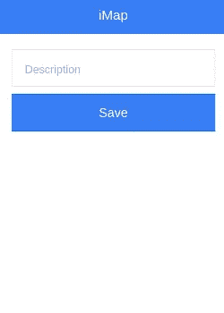
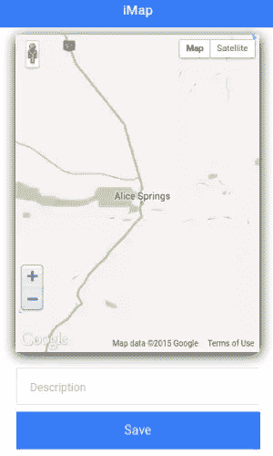
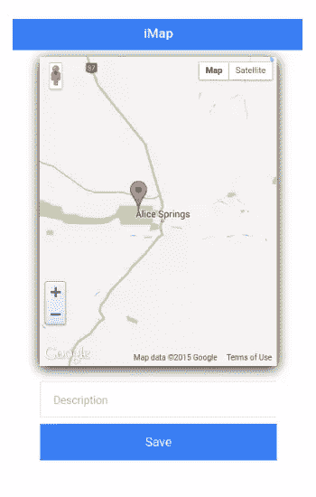

# 使用 Ionic 框架创建位置共享应用程序

> 原文：<https://www.sitepoint.com/creating-location-sharing-app-using-ionic-framework/>

很难记得在谷歌地图出现之前，旅行是什么样的。幸运的是，与笨重、折叠不良的纸质地图和手绘方向的斗争已经成为过去。取而代之的是，从口袋里掏出一部手机来确认用户的位置、想要的位置以及如何到达两者之间。

在本教程中，我将展示如何使用谷歌地图，同时使用 [IONIC](http://ionicframework.com/) 开发移动应用。使用这个应用程序，用户将能够在地图上标记一个特定的位置，填写地址，并将位置保存在数据库中。我将创建一个自定义指令，将谷歌地图集成到我们的应用程序。我将使用 [Firebase](http://firebase.com/) 来保存数据。

本教程的源代码可以在 [GitHub](https://github.com/sitepoint-editors/iMapApp) 获得。

## 离子框架

IONIC 是一个使用 HTML5 开发混合应用的移动应用框架。它使用 AngularJS 来创建丰富和健壮的移动应用程序。

从官方网站上，

> Ionic 是免费开源的，提供了一个移动优化的 HTML、CSS 和 JS 组件、手势和工具库，用于构建交互式应用。使用 Sass 构建，并针对 AngularJS 进行了优化。

## 入门指南

首先安装 Node.js，这也将安装节点包管理器 npm。

使用 npm 安装 IONIC。

```
npm install -g cordova ionic
```

本教程介绍了如何为 Android 平台创建一个移动应用程序，因此请确保安装了所需的依赖项。

一旦安装了平台依赖项，就创建一个空白的 IONIC 项目。

```
ionic start iMapApp blank
```

导航到项目目录 *iMapApp* ，添加所需的平台，构建并仿真。

```
cd iMapApp
ionic platform add android
ionic build android
ionic emulate android
```

空白应用程序应该在 Android 模拟器中运行。

每次在模拟器上运行应用程序将是一项耗时的任务，因此使用 IONIC cli 在浏览器中运行应用程序。使用 npm 安装所需的依赖项。

```
npm install
```

一旦安装了依赖项，在终端中运行`ionic serve`,应用程序应该在浏览器中运行。

## 创建用户界面

让我们从添加一个显示地图的新模板开始。在项目目录中创建一个名为 *www/templates* 的文件夹。在【map.html】模板里面创建一个名为*的文件*。

```
<ion-view title="iMap">
    <ion-content>

        <div>
            <div id="map">
            </div>

            <div width="80%" class="list list-inset" style="margin-left:10%;margin-right:10%;">
                <label class="item item-input">
                    <input type="text" ng-model="user.desc" placeholder="Description">
                </label>

                <button class="button button-full button-positive" ng-click="saveDetails()">
                    Save
                </button>
            </div>
        </div>

    </ion-content>
</ion-view>
```

在*map.html*里面有一个叫做`#map '的 div。谷歌地图将在这里呈现。地图下方是一个供用户输入描述的输入文本框和一个保存详细信息的按钮。

我们将利用 [ionNavView](http://ionicframework.com/docs/api/directive/ionNavView/) 指令来基于不同的状态呈现不同的模板。让我们将`ionNavView`指令添加到 *www/index.html* 页面中。移除`body`标签的当前内容，并在`ionNavView`上方添加`ionNavBar`指令来创建一个顶栏。以下是改装后的*index.html*的外观:

```
<body ng-app="starter">

    <ion-nav-bar class="bar-positive">
    </ion-nav-bar>

    <ion-nav-view></ion-nav-view>

</body>
```

从渲染的`ionView`中设置`ionNavBar`的标题。如上面的*map.html*代码所示，标题设置为`ionView`。

IONIC 使用 Angular UI 路由器模块将 app 界面组织成不同的状态。让我们为*map.html*模板定义一个状态。打开 *www/js/app.js* ，添加以下代码:

```
.config(function($stateProvider, $urlRouterProvider) {
    $stateProvider
        .state('map', {
            url: '/map',
            templateUrl: 'templates/map.html',
            controller: 'MapCtrl'
        })

    $urlRouterProvider.otherwise('/map');
});
```

上面的代码为 URL 定义了一个新的状态， */map* ，它将呈现模板*map.html*，并由`MapCtrl`控制器控制(稍后将定义)。`$urlRouterProvider.otherwise('/map');`用于将 */map* 设置为默认状态。

在 *www/js/* 中创建一个名为 *controller.js* 的文件，并在 *www/index.html* 文件中添加一个引用。

```
<script src="js/controller.js"></script>
```

需要定义 *controller.js* 里面的控制器代码。首先定义角度模块。

```
angular.module('starter.controllers', ['ionic'])
```

定义控制器`MapCtrl`。

```
.controller('MapCtrl', ['$scope', function($scope) {
// Code will be here
}]);
```

将`starter.controllers`模块注入到 *js/app.js* 中的`starter` app 中。

```
angular.module('starter', ['ionic','starter.controllers'])
```

保存后，*map.html*模板就可以查看了。



接下来，通过创建一个名为`map`的自定义指令，在*map.html*添加谷歌地图。这个指令将被用作属性，所以让我们从在 *controller.js* 中定义这个指令开始。

```
.directive('map', function() {
    return {
        restrict: 'A',
        link:function(scope, element, attrs){
            // Code will be here
        }
    };
});
```

在*map.html*是一个 div `#map`。让我们给它添加 directive 属性。

```
<div id="map" map> </div>
```

谷歌地图将需要一些默认参数，如缩放，纬度，经度等。将这些参数传递给指令:

```
<div id="map" lat="-23.639492" lng="133.709107" zoom="8" map>

</div>
```

这些属性可以在指令的链接函数中使用参数`attrs`来访问。

```
.directive('map', function() {
    return {
        restrict: 'A',
        link:function(scope, element, attrs){

          var zValue = scope.$eval(attrs.zoom);
          var lat = scope.$eval(attrs.lat);
          var lng = scope.$eval(attrs.lng);

        }
    };
});
```

`scope.$eval`用于评估 AngularJS [表达式](https://docs.angularjs.org/guide/expression)。

接下来在*index.html*中加入谷歌地图 API 参考。

```
<script src="https://maps.googleapis.com/maps/api/js?v=3.exp"></script>
```

使用默认值定义谷歌地图的纬度和经度。

```
var myLatlng = new google.maps.LatLng(lat,lng)
```

为谷歌地图定义地图选项:

```
mapOptions = {
                  zoom: zValue,
                  center: myLatlng
                }
```

用上面的`mapOptions`定义地图，并绑定到`element[0]`可以访问的`#map` div。

```
map = new google.maps.Map(element[0],mapOptions)
```

指令现在应该是这样的:

```
.directive('map', function() {
    return {
        restrict: 'A',
        link:function(scope, element, attrs){

          var zValue = scope.$eval(attrs.zoom);
          var lat = scope.$eval(attrs.lat);
          var lng = scope.$eval(attrs.lng);

          var myLatlng = new google.maps.LatLng(lat,lng),
          mapOptions = {
                zoom: zValue,
                center: myLatlng
            },
              map = new google.maps.Map(element[0],mapOptions);

        }
    };
});
```

将以下样式添加到 *www/css/style.css* 中，以设置`#map` div 的样式。

```
#map{
    width:80%;
    height:400px;
    margin:10px auto;
    box-shadow:0 3px 25px black;
}
```

保存以上更改，谷歌地图将在地图页面上可见。



让我们在谷歌地图上添加一个标记。

```
marker = new google.maps.Marker({
      position: myLatlng,
      map: map,
      draggable:true
})
```

标记的默认位置设置为作为属性传递的纬度和经度，draggable 选项设置为 true。下面是修改后的指令:

```
.directive('map', function() {
    return {
        restrict: 'A',
        link:function(scope, element, attrs){

          var zValue = scope.$eval(attrs.zoom);
          var lat = scope.$eval(attrs.lat);
          var lng = scope.$eval(attrs.lng);

          var myLatlng = new google.maps.LatLng(lat,lng),
          mapOptions = {
              zoom: zValue,
              center: myLatlng
          },
          map = new google.maps.Map(element[0],mapOptions),
          marker = new google.maps.Marker({
                position: myLatlng,
                map: map,
                draggable:true
          });

        }
    };
});
```

保存上述更改，谷歌地图中将会出现一个可拖动的标记。



## 跟踪标记位置

接下来，我们将在 Google Maps 标记上附加一个`dragend`事件来跟踪标记的位置。在指令内，添加以下代码以附加一个拖动结束事件侦听器:

```
google.maps.event.addListener(marker, 'dragend', function(evt){
        console.log('Current Latitude:',evt.latLng.lat(),'Current Longitude:',evt.latLng.lng());
});
```

保存更改并尝试拖动标记。检查浏览器控制台，它应该包括当前的纬度和经度。

## 保存细节

接下来我们将在`MapCtrl`中定义一个名为`user`的`$scope`变量。它将包含当前位置的纬度，经度和用户输入的描述。

```
$scope.user = {};
```

在`MapCtrl`控制器中创建一个名为`saveDetails`的函数。这将利用`$scope.user`变量来获得所需的数据。

```
$scope.saveDetails = function(){
    var lat = $scope.user.latitude;
    var lgt = $scope.user.longitude;
    var des = $scope.user.desc;

    // Code to write to Firebase will be here
  }
```

当用户拖动地图上的标记时，更新`dragend`事件监听器的回调函数中的`$scope.user.latitude`和`$scope.user.longitude`变量。

```
google.maps.event.addListener(marker, 'dragend', function(evt){
    scope.$parent.user.latitude = evt.latLng.lat();
    scope.$parent.user.longitude = evt.latLng.lng();
    scope.$apply();
});
```

调用`scope.$apply`来更新模型绑定。将一个 [ngModel](https://docs.angularjs.org/api/ng/directive/ngModel) 指令附加到描述输入文本框，并将一个 [ngClick](https://docs.angularjs.org/api/ng/directive/ngClick) 指令附加到保存按钮。

```
<label class="item item-input">
  <input type="text" ng-model="user.desc" placeholder="Description">
</label>

<button class="button button-full button-positive" ng-click="saveDetails()">Save</button>
```

接下来，我们将数据保存到 firebase。如果你还没有注册一个免费账户，请注册一个免费账户。一旦登录，你应该有一个独特的 firebase 网址。例如，我的 firebase URL 是:

```
https://blistering-heat-2473.firebaseio.com
```

登录到您的 Firebase 帐户，然后单击仪表板中 URL 旁边的加号链接。输入名称为 *MapDetails* ，值为 *0* ，创建一个子 URL， */MapDetails* 。


在*index.html*中包含以下脚本引用，以便在应用中使用 firebase。

```
<script src="https://cdn.firebase.com/js/client/2.0.4/firebase.js"></script>

<script src="https://cdn.firebase.com/libs/angularfire/0.9.0/angularfire.min.js"></script>
```

在 *controller.js* 中的`starter.controllers`模块中注入 firebase。

```
angular.module('starter.controllers', ['ionic','firebase'])
```

将`$firebase`模块插入`MapCtrl`控制器。

```
.controller('MapCtrl', ['$scope','$firebase', function($scope,$firebase)
```

在`MapCtrl`中，使用 firebase URL 创建一个 firebase 对象。

```
var firebaseObj = new Firebase("https://blistering-heat-2473.firebaseio.com/MapDetails");
```

使用 firebaseObj 创建一个`$firebase`的实例。

```
var fb = $firebase(firebaseObj);
```

在`saveDetails`函数中，利用 firebase [推送](https://www.firebase.com/docs/web/api/firebase/push.html) API 将数据保存到 firebase 中。

```
fb.$push({
    latitude: lat,
    longitude: lgt,
    description: des
}).then(function(ref) {
    $scope.user = {};
}, function(error) {
    console.log("Error:", error);
});
```

保存以上更改并刷新应用程序。将标记拖动到所需位置，输入描述，然后单击保存。检查 firebase 仪表板，数据应该在那里。

一旦数据保存，包括一个警告通知用户。利用[离子弹出](http://ionicframework.com/docs/api/service/%24ionicPopup/)来创建它。将`$ionicPopup`注入到`MapCtrl`控制器中。

```
.controller('MapCtrl', ['$scope','$firebase','$ionicPopup', function($scope,$firebase,$ionicPopup)
```

在`MapCtrl`控制器中添加一个名为`showAlert`的函数。

```
$scope.showAlert = function() {
    $ionicPopup.alert({
        title: 'iMapApp',
        template: 'Your location has been saved!!'
    });
};
```

`showAlert`函数将调用`$ionicPopup`服务来显示一个带有标题和模板的弹出窗口。在 push API 调用成功回调中调用`showAlert`。

```
fb.$push({
    latitude: lat,
    longitude: lgt,
    description: des
}).then(function(ref) {
    $scope.user = {};
    $scope.showAlert();
}, function(error) {
    console.log("Error:", error);
});
```

保存更改并尝试再次保存详细信息。一旦细节被保存在 firebase 中，将会弹出一个成功消息。

## 结论

在本教程中，我演示了如何在 IONIC 移动应用程序中使用谷歌地图，特别是创建一个自定义指令来集成谷歌地图。关于使用 IONIC 框架的深入信息，我推荐阅读 SitePoint 上的官方文档或进一步的 IONIC 教程。

请在下面的评论中添加您的想法、建议和更正。

## 分享这篇文章