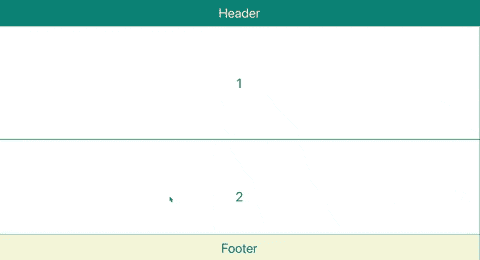
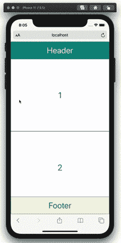

# 创建可重用 React 组件的实用指南

> 原文：<https://www.sitepoint.com/creating-reusable-react-components/>

虽然 React 是世界上最受欢迎和使用最多的前端框架之一，但许多开发人员仍在努力重构代码以提高可重用性。如果您曾经发现自己在整个 React 应用程序中重复相同的代码片段，那么您就找到了正确的文章。

在本教程中，将向您介绍三个最常见的指标，说明是时候构建一个可重用的 React 组件了。然后，我们将通过构建一个可重用的布局和两个令人兴奋的 React 挂钩来看一些实际的演示。

当你读完的时候，你将能够自己找出*何时*适合创建可重用的 React 组件，以及*如何*这样做。

本文假设读者对 React 和 React 挂钩有基本的了解。如果你想重温这些话题，我推荐你去看看“[React](https://www.sitepoint.com/getting-started-react-beginners-guide/)入门”指南和“[React Hooks 简介](https://www.sitepoint.com/react-hooks/)”。

## 可重用 React 组件的三大指标

首先让我们来看看*的一些迹象，什么时候*你可能想要这样做。

### 使用相同的 CSS 样式重复创建包装器

我最喜欢知道何时创建可重用组件的标志是重复使用相同的 CSS 样式。现在，你可能会想，“等一下:为什么我不简单地给共享相同 CSS 样式的元素分配相同的类名呢？”你完全正确。每次不同组件中的一些元素共享相同的样式时，创建可重用的组件并不是一个好主意。事实上，它可能会引入不必要的复杂性。所以你必须再问自己一个问题:这些常见样式的元素是包装器吗？

例如，考虑以下登录和注册页面:

```
// Login.js
import './common.css';

function Login() {
  return (
    <div className='wrapper'>  <main>  {...}  </main>  <footer className='footer'>  {...}  </footer>  </div>
  );
} 
```

```
// SignUp.js
import './common.css';

function Signup() {
  return (
    <div className='wrapper'>  <main>  {...}  </main>  <footer className='footer'>  {...}  </footer>  </div>
  );
} 
```

相同的样式被应用到容器(`<div>`元素)和每个组件的页脚。因此，在这种情况下，您可以创建两个可重用的组件— `<Wrapper />`和`<Footer />`——并将子组件作为道具传递给它们。例如，登录组件可以重构如下:

```
// Login.js
import Footer from "./Footer.js";

function Login() {
  return (
    <Wrapper main={{...}} footer={<Footer />} />
  );
} 
```

因此，您不再需要在多个页面中导入`common.css`或者创建相同的`<div>`元素来包装所有内容。

### 事件侦听器的重复使用

要将事件监听器附加到一个元素，您可以在`useEffect()`中处理它，如下所示:

```
// App.js
import { useEffect } from 'react';

function App() {
  const handleKeydown = () => {
    alert('key is pressed.');
  }

  useEffect(() => {
    document.addEventListener('keydown', handleKeydown);
    return () => {
      document.removeEventListener('keydown', handleKeydown);
    }
  }, []);

  return (...);
} 
```

或者您可以像这样直接在您的 JSX 中完成，如下面的按钮组件所示:

```
// Button.js
function Button() {
  return (
    <button type="button" onClick={() => { alert('Hi!')}}> Click me! </button>
  );
}; 
```

当您想给`document`或`window`添加一个事件监听器时，您必须使用第一种方法。然而，正如你可能已经意识到的，第一种方法需要更多的代码来使用`useEffect()`、`addEventListener()`和`removeEventListener()`。所以在这种情况下，创建一个定制的钩子可以让你的组件更加简洁。

使用事件侦听器有四种可能的情况:

*   相同的事件侦听器，相同的事件处理程序
*   相同的事件侦听器，不同的事件处理程序
*   不同的事件侦听器，相同的事件处理程序
*   不同的事件侦听器，不同的事件处理程序

在第一个场景中，您可以创建一个钩子，其中定义了事件侦听器和事件处理程序。考虑以下挂钩:

```
// useEventListener.js
import { useEffect } from 'react';

export default function useKeydown() {
  const handleKeydown = () => {
    alert('key is pressed.');
  }

  useEffect(() => {
    document.addEventListener('keydown', handleKeydown);
    return () => {
      document.removeEventListener('keydown', handleKeydown);
    }
  }, []);
}; 
```

然后，您可以在任何组件中使用此挂钩，如下所示:

```
// App.js
import useKeydown from './useKeydown.js';

function App() {
  useKeydown();
  return (...);
}; 
```

对于其他三个场景，我建议创建一个接收事件和事件处理函数的钩子作为道具。比如我会把`keydown`和`handleKeydown`作为道具传递给我的自定义钩子。考虑以下挂钩:

```
// useEventListener.js
import { useEffect } from 'react';

export default function useEventListener({ event, handler} ) {
  useEffect(() => {
    document.addEventListener(event, props.handler);
    return () => {
      document.removeEventListener(event, props.handler);
    }
  }, []);
}; 
```

然后，您可以在任何组件中使用此挂钩，如下所示:

```
// App.js
import useEventListener from './useEventListener.js';

function App() {
  const handleKeydown = () => {
    alert('key is pressed.');
  }
  useEventListener('keydown', handleKeydown);
  return (...);
}; 
```

### 重复使用相同的 GraphQL 脚本

当谈到使 GraphQL 代码可重用时，您并不真的需要寻找迹象。对于复杂的应用程序，用于查询或变异的 GraphQL 脚本很容易占用 30-50 行代码，因为有许多属性需要请求。如果您不止一次或两次使用同一个 GraphQL 脚本，我认为它应该有自己的定制钩子。

考虑下面的例子:

```
import { gql, useQuery } from "@apollo/react-hooks";

const GET_POSTS = gql` query getPosts {
    getPosts {
    user {
      id
      name
      ...
      }
      emojis {
         id
         ...
      }
      ...
  } `;

const { data, loading, error } = useQuery(GET_POSTS, {
  fetchPolicy: "network-only"
}); 
```

您应该为这个特定的 API 创建一个 React 挂钩，而不是在从后端请求帖子的每个页面中重复这段代码:

```
import { gql, useQuery } from "@apollo/react-hooks";

function useGetPosts() {
  const GET_POSTS = gql`{...}`;
  const { data, loading, error } = useQuery(GET_POSTS, {
    fetchPolicy: "network-only"
  });
  return [data];
}

const Test = () => {
  const [data] = useGetPosts();
  return (
    <div>{data?.map(post => <h1>{post.text}</h1>)}</div>
  );
}; 
```

## 构建三个可重用的 React 组件

既然我们已经看到了*何时*创建一个可以在整个 react 应用程序中共享的新组件的一些常见迹象，让我们将这些知识付诸实践，并构建三个实用的演示。

### 1.布局组件

React 通常用于构建复杂的 web 应用程序。这意味着需要在 React 中开发大量的页面，我怀疑一个 app 的每个页面都会有不同的布局。例如，一个包含 30 个页面的 web 应用程序通常使用不到五种不同的布局。因此，构建一个灵活的、可重用的、可以在许多不同的页面中使用的布局是至关重要的。这将为您节省许多代码行，从而节省大量时间。

考虑以下 React 功能组件:

```
// Feed.js
import React from "react";
import style from "./Feed.module.css";

export default function Feed() {
  return (
    <div className={style.FeedContainer}>  <header className={style.FeedHeader}>Header</header>  <main className={style.FeedMain}>  {
          <div className={style.ItemList}>  {itemData.map((item, idx) => (
              <div key={idx} className={style.Item}>  {item}  </div>
            ))}  </div>
        }  </main>  <footer className={style.FeedFooter}>Footer</footer>  </div>
  );
}

const itemData = [1, 2, 3, 4, 5]; 
```

这是一个典型的网页，有一个`<header>`、一个`<main>`和一个`<footer>`。如果有 30 多个这样的网页，你会很容易厌倦重复编写 HTML 标签和一遍又一遍地应用相同的样式。

相反，您可以创建一个布局组件，它接收`<header>`、`<main>`和`<footer>`作为道具，如下面的代码所示:

```
// Layout.js
import React from "react";
import style from "./Layout.module.css";
import PropTypes from "prop-types";

export default function Layout({ header, main, footer }) {
  return (
    <div className={style.Container}>  <header className={style.Header}>{header}</header>  <main className={style.Main}>{main}</main>  <footer className={style.Footer}>{footer}</footer>  </div>
  );
}

Layout.propTypes = {
  main: PropTypes.element.isRequired,
  header: PropTypes.element,
  footer: PropTypes.element
}; 
```

这个组件不需要`<header>`和`<footer>`。因此，无论页面是包含页眉还是页脚，您都可以使用相同的布局。

使用这个布局组件，您可以将您的提要页面变成一个更加复杂的代码块:

```
// Feed.js
import React from "react";
import Layout from "./Layout";
import style from "./Feed.module.css";

export default function Feed() {
  return (
    <Layout
      header={<div className={style.FeedHeader}>Header</div>}
      main={
        <div className={style.ItemList}>  {itemData.map((item, idx) => (
            <div key={idx} className={style.Item}>  {item}  </div>
          ))}  </div>
      }
      footer={<div className={style.FeedFooter}>Footer</div>}
    />
  );
}

const itemData = [1, 2, 3, 4, 5]; 
```

### 创建带有粘性元素的布局的专业技巧

许多开发人员倾向于使用`position: fixed`或`position: absolute`来将页眉粘贴到视口的顶部，或者将页脚粘贴到底部。但是，在布局的情况下，您应该尽量避免这种情况。

由于布局的元素将是传递的道具的父元素，所以您希望尽可能简单地保持布局元素的样式——以便传递的`<header>`、`<main>`或`<footer>`按照预期的方式进行样式化。所以，我建议将`position: fixed`和`display: flex`应用到你布局的最外层元素，并将`overflow-y: scroll`设置到`<main>`元素。

这里有一个例子:

```
/* Layout.module.css */
.Container {
  /* Flexbox */
  display: flex;
  flex-direction: column;

  /* Width & Height */
  width: 100%;
  height: 100%;

  /* Misc */
  overflow: hidden;
  position: fixed;
}

.Main {
  /* Width & Height */
  width: 100%;
  height: 100%;

  /* Misc */
  overflow-y: scroll;
} 
```

现在，让我们将一些样式应用到您的提要页面，看看您构建了什么:

```
/* Feed.module.css */
.FeedHeader {
  /* Width & Height */
  height: 70px;

  /* Color & Border */
  background-color: teal;
  color: beige;
}

.FeedFooter {
  /* Width & Height */
  height: 70px;

  /* Color & Border */
  background-color: beige;
  color: teal;
}

.ItemList {
  /* Flexbox */
  display: flex;
  flex-direction: column;
}

.Item {
  /* Width & Height */
  height: 300px;

  /* Misc */
  color: teal;
}

.FeedHeader,
.FeedFooter,
.Item {
  /* Flexbox */
  display: flex;
  justify-content: center;
  align-items: center;

  /* Color & Border */
  border: 1px solid teal;

  /* Misc */
  font-size: 35px;
} 
```

#### 粘性页眉和页脚演示

下面是运行中的代码。

[https://codesandbox.io/embed/example-1-t11f8?fontsize=14&hidenavigation=1&module=%2Fsrc%2FFeed.js&theme=dark&view=preview](https://codesandbox.io/embed/example-1-t11f8?fontsize=14&hidenavigation=1&module=%2Fsrc%2FFeed.js&theme=dark&view=preview)

这是它在桌面屏幕上的样子。



这是它在手机屏幕上的样子。



这种布局在 iOS 设备上也能正常工作！如果你不知道，iOS 因给 web 应用程序的开发带来意想不到的位置相关问题而臭名昭著。

### 2.事件监听器

通常，同一个事件侦听器会在整个 web 应用程序中多次使用。在这种情况下，创建一个自定义的 React 挂钩是一个好主意。让我们通过开发一个`useScrollSaver`钩子来学习如何做到这一点，这个钩子保存用户设备在页面上的滚动位置——这样用户就不需要从头开始滚动了。这个钩子对于列出了大量元素(如帖子和评论)的网页非常有用；想象一下没有滚动保护程序的脸书、Instagram 和 Twitter 的页面。

让我们分解以下代码:

```
// useScrollSaver.js
import { useEffect } from "react";

export default function useScrollSaver(scrollableDiv, pageUrl) {
  /* Save the scroll position */
  const handleScroll = () => {
    sessionStorage.setItem(
      `${pageUrl}-scrollPosition`,
      scrollableDiv.current.scrollTop.toString()
    );
  };
  useEffect(() => {
    if (scrollableDiv.current) {
      const scrollableBody = scrollableDiv.current;
      scrollableBody.addEventListener("scroll", handleScroll);
      return function cleanup() {
        scrollableBody.removeEventListener("scroll", handleScroll);
      };
    }
  }, [scrollableDiv, pageUrl]);

  /* Restore the saved scroll position */
  useEffect(() => {
    if (
      scrollableDiv.current &&
      sessionStorage.getItem(`${pageUrl}-scrollPosition`)
    ) {
      const prevScrollPos = Number(
        sessionStorage.getItem(`${pageUrl}-scrollPosition`)
      );
      scrollableDiv.current.scrollTop = prevScrollPos;
    }
  }, [scrollableDiv, pageUrl]);
} 
```

你可以看到`useScrollSaver`钩子需要接收两个项目:`scrollableDiv`，它必须是一个可滚动的容器，就像你上面布局中的`<main>`容器一样；以及`pageUrl`，它将被用作一个页面的标识符，这样你就可以存储多个页面的滚动位置。

#### 步骤 1:保存滚动位置

首先，您需要将一个“滚动”事件侦听器绑定到您的可滚动容器:

```
const scrollableBody = scrollableDiv.current;
scrollableBody.addEventListener("scroll", handleScroll);
return function cleanup() {
  scrollableBody.removeEventListener("scroll", handleScroll);
}; 
```

现在，每当用户滚动`scrollableDiv`时，就会运行一个名为`handleScroll`的函数。在此功能中，您应该使用`localStorage`或`sessionStorage`来保存滚动位置。不同之处在于，`localStorage`中的数据不会过期，而当页面会话结束时，`sessionStorage`中的数据会被清除。您可以使用`setItem(id: string, value: string)`在任一存储器中保存数据:

```
const handleScroll = () => {
  sessionStorage.setItem(
    `${pageUrl}-scrollPosition`,
    scrolledDiv.current.scrollTop.toString()
  );
}; 
```

#### 步骤 2:恢复滚动位置

当用户返回到一个网页时，用户应该被引导到他或她以前的滚动位置——如果有的话。这个位置数据目前保存在`sessionStorage`里，你需要取出来使用。您可以使用`getItem(id: string)`从存储器中获取数据。然后，您只需要将可滚动容器的`scroll-top`设置为获得的值:

```
const prevScrollPos = Number(
  sessionStorage.getItem(`${pageUrl}scrollPosition`)
);
scrollableDiv.current.scrollTop = prevScrollPos; 
```

#### 第三步:在任何网页中使用`useScrollSaver`钩子

现在您已经完成了自定义钩子的创建，您可以在任何您想要的网页中使用钩子，只要您将两个必需的项目传递给钩子:`scrollableDiv`和`pageUrl`。让我们回到`Layout.js`，在那里用你的钩子。这将允许任何使用此布局的网页使用您的滚动保护程序:

```
// Layout.js
import React, { useRef } from "react";
import style from "./Layout.module.css";
import PropTypes from "prop-types";
import useScrollSaver from "./useScrollSaver";

export default function Layout({ header, main, footer }) {
  const scrollableDiv = useRef(null);
  useScrollSaver(scrollableDiv, window.location.pathname);
  return (
    <div className={style.Container}>  <header className={style.Header}>{header}</header>  <main ref={scrollableDiv} className={style.Main}>  {main}  </main>  <footer className={style.Footer}>{footer}</footer>  </div>
  );
} 
```

#### Scrollsaver Demo

这是在沙箱中运行的代码。尝试滚动页面，然后使用左下角的箭头重新加载应用程序。

你会发现自己回到了离开的地方！

[https://codesandbox.io/embed/example-2-g22qh?fontsize=14&hidenavigation=1&theme=dark&view=preview](https://codesandbox.io/embed/example-2-g22qh?fontsize=14&hidenavigation=1&theme=dark&view=preview)

### 3.查询/变异(特定于 GraphQL)

如果您像我一样喜欢将 GraphQL 与 React 一起使用，您可以通过为 GraphQL 查询或变异创建 React 挂钩来进一步减少您的代码库。

考虑下面运行 GraphQL 查询`getPosts()`的例子:

```
import { gql, useQuery } from "@apollo/react-hooks";

const GET_POSTS = gql` query getPosts {
    getPosts {
    user {
      id
      name
      ...
      }
      emojis {
         id
         ...
      }
      ...
  } `;

const { data, loading, error } = useQuery(GET_POSTS, {
  fetchPolicy: "network-only"
}); 
```

如果后端请求的属性越来越多，GraphQL 脚本将占用越来越多的空间。因此，不用在每次需要运行查询`getPosts()`时重复 GraphQL 脚本和`useQuery`，您可以创建下面的 React 钩子:

```
// useGetPosts.js
import { gql, useQuery } from "@apollo/react-hooks";

export default function useGetPosts() {
  const GET_POSTS = gql` query getPosts {
    getPosts {
    user {
      id
      name
      ...
      }
      emojis {
         id
         ...
      }
      ...
  } `;

  const { data, loading, error } = useQuery(GET_POSTS, {
    fetchPolicy: "network-only"
  });

  return [data, loading, error];
} 
```

然后，您可以使用您的`useGetPosts()`钩子，如下所示:

```
// Feed.js
import React from "react";
import Layout from "./Layout";
import style from "./Feed.module.css";
import useGetPosts from "./useGetPosts.js";

export default function Feed() {
  const [data, loading, error] = useGetPosts();
  return (
    <Layout
      header={<div className={style.FeedHeader}>Header</div>}
      main={
        <div className={style.ItemList}>  {data?.getPosts.map((item, idx) => (
            <div key={idx} className={style.Item}>  {item}  </div>
          ))}  </div>
      }
      footer={<div className={style.FeedFooter}>Footer</div>}
    />
  );
} 
```

## 结论

在本文中，您了解了可重用 React 组件的三个最常见的指标和三个最流行的用例。现在你已经了解了*何时*创建一个可重用的 React 组件，以及*如何*轻松而专业地做到这一点。您很快就会发现自己喜欢将代码行重构为复杂的可重用 React 组件或钩子。使用这些重构技术，我们在 [Clay](https://get.clay.it/) 的开发团队能够将我们的代码库缩减到可管理的规模。希望你也可以！

## 分享这篇文章