# 为网页创建无缝背景图案

> 原文：<https://www.sitepoint.com/creating-seamless-background-patterns-for-the-web/>

图案背景在现代网页设计中变得非常流行。随着浏览器支持的增加，越来越多的设计师将平铺纹理和重复图案集成到他们的布局中。你可以在网上找到许多不同的背景图案，但你也可以使用 Photoshop 创建自己的背景图案。

创建自定义背景图像时，文件大小是一个重要的考虑因素。您希望您的背景图像文件相当小，以便它可以快速加载。有几种不同的文件格式可供您使用，但它们最终都具有相当相似的文件大小。最好的背景模式在足够小(就文件大小而言)以便快速加载和足够大(就尺寸而言)以便在整个布局中无休止地重复而没有任何瑕疵之间取得了谨慎的平衡。

**第一步:建立你的文档**

打开 Photoshop 并创建一个新文档。为了保持我们的文件小，我创建了一个 20px 乘 20px 的正方形画布。画布的方形形状非常重要，因为我们要依靠对称性来用一个图像创造无缝的垂直和水平重复。您可以使用各种形状来设计图案，但要确保图像本身是正方形。

[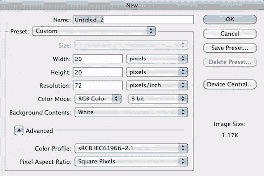](https://www.sitepoint.com/wp-content/uploads/2012/02/img1.png)

**第二步:** **展示你的统治者**

如果标尺不可见，请按 command 或 ctrl + "R "来显示标尺。显示标尺将使您能够在下一步中应用参考线。

[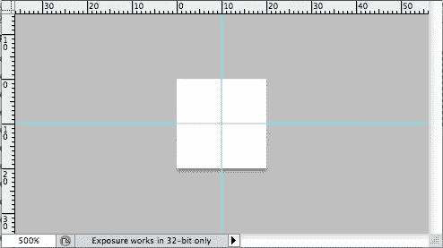](https://www.sitepoint.com/wp-content/uploads/2012/02/Screen-shot-2012-02-16-at-11.28.24-PM.png)

**第三步:** **利用导游帮忙把事情扯平**

单击并从垂直和水平标尺拖到中间，将参考线应用到您的文档。两条辅助线的交点应该可以确定你的中心点。

[](https://www.sitepoint.com/wp-content/uploads/2012/02/Screen-shot-2012-02-16-at-11.28.24-PM1.png)

第四步:选择工具制作你的图案

您可以使用选框工具、钢笔工具或自定形状工具创建自己的形状。

我选择了自定义形状工具，您可以从矩形、椭圆形或多边形等规则形状中进行选择，也可以使用顶部工具栏选项中的自定义形状。

[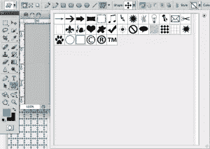](https://www.sitepoint.com/wp-content/uploads/2012/02/Screen-shot-2012-02-16-at-11.28.49-PM.png)

**第五步:选择你的形状设置** 

我选择了自定义形状工具，并单击了带有下拉箭头的自定义形状图标。此菜单应该有一个默认的形状列表，但是如果您在以前的项目中使用了一个，它可能会在默认选项的弹出框中显示。

[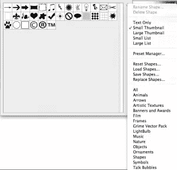](https://www.sitepoint.com/wp-content/uploads/2012/02/Screen-shot-2012-02-16-at-11.29.17-PM1.png)

第六步:选择你的形状

单击弹出菜单并选择“装饰”。我选择了形成十字的五颗钻石。

[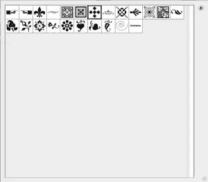](https://www.sitepoint.com/wp-content/uploads/2012/02/Screen-shot-2012-02-16-at-11.49.53-PM.png)

**第七步:画出你的形状** 

点击并拖动你的形状到你的画布上，确保在正中央释放它。这里的想法是创造一个对称的设计，在所有四个边界上有均匀的间距。

[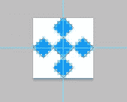](https://www.sitepoint.com/wp-content/uploads/2012/02/Screen-shot-2012-02-16-at-11.30.39-PM.png)

第八步:给你的图案上色

如果选择了形状工具，可以单击形状层上的滑块图标，轻松更改图形的颜色。如果您选择用钢笔工具自己绘制形状，那么您必须使用“路径”面板并单击底部名为“用前景色填充路径”的图标来给它着色

[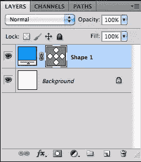](https://www.sitepoint.com/wp-content/uploads/2012/02/Screen-shot-2012-02-16-at-11.30.52-PM.png)

第九步:为你的图案选择合适的背景

如果要制作透明图案，请确保删除背景层，或者单击眼睛图标隐藏背景层。如果你要用不透明的。jpg 文件来形成你的模式，请确保添加你想要的颜色到背景。

[](https://www.sitepoint.com/wp-content/uploads/2012/02/Screen-shot-2012-02-16-at-11.55.15-PM.png)

**第十步:保存你的图案**

选取“文件”>“存储为 Web 和设备所用”。

[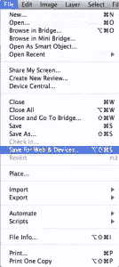](https://www.sitepoint.com/wp-content/uploads/2012/02/Screen-shot-2012-02-16-at-11.55.52-PM.png)

**第 11 步:选择适合你的文件格式**

根据您的偏好，您可以保存为三种不同的文件格式。

您可以将其保存为低分辨率的平面文件。jpg 文件。这将不允许你有透明度，所以你必须选择所需的背景颜色，并在保存图像文件之前将其应用到图案的后面。否则，你会以白色作为图案的背景。的。jpg 文件将有一个非常小的文件大小，这有利于快速页面加载。

您也可以将图像保存为. gif 文件。使用. gif，您可以获得透明背景的能力，但是如果您的图案很复杂，您可能会损失图像质量。您可能会看到粗糙的边缘或轻微的像素化。将背景保存为. gif 文件也会使文件变小，当您不需要创建不同颜色的复杂图案时，这是一个可行的选择。

[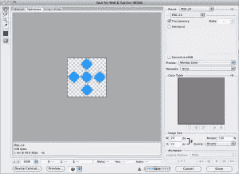](https://www.sitepoint.com/wp-content/uploads/2012/02/Screen-shot-2012-02-16-at-11.58.38-PM.png)

通常，最好的选择是将文件保存为. png 文件，它与。gif 可以，但是复杂的图案、颜色和颜色渐变看起来更清晰。

选择你的文件类型完全取决于你想要的最终结果。如果你不需要透明，你只是想要一个简单的模式，那么一个. jpg 文件就可以了。如果你想用 CSS 快速方便地改变你的背景颜色，那么选择。gif 或. png。

在这个例子中，我将文件保存为透明的。png 我想要一个清晰的重复模式，能够使用 CSS 改变背景颜色。

步骤 12:用 CSS 实现你的模式

在 CSS 中，我将背景颜色设为#FFC(一种黄色)，这和我们之前选择的蓝色很搭配。我还引入了我创建的图案，并设置它沿着 X 和 Y 轴重复。您可以通过不指定 X 或 Y 轴来做到这一点，默认情况下会导致图案沿这两个轴重复。

```
body {
background: #FFC url(images/bluedia.png) repeat;
}
```

结果是所有的钻石排成一行，形成一个网格图案，以所选的黄色作为背景。

[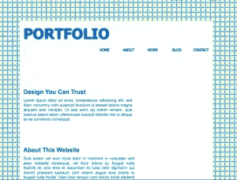](https://www.sitepoint.com/wp-content/uploads/2012/02/Screen-shot-2012-02-16-at-11.32.10-PM.png)

**步骤 13:** **做一个重复的边框图案代替**

只需对 CSS 代码做一点小小的修改，您就可以将您选择的图形改为边框或条纹。需要记住的一点是，较厚的边框需要更高或更宽的图像，这取决于边框是水平的还是垂直的。

**第十四步:** **做一个横的图案**

将图案图形的重复从“重复”更改为“重复-x”。您可以指定“顶部”、“中心”或“底部”来指示重复的位置。

注意:要制作底部边框，请在下面的代码中将“顶部”改为“底部”。

```
body {
background: #FFC url(images/bluedia.png) repeat-x top;
```

[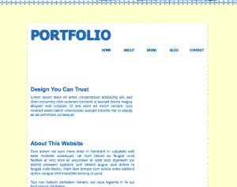](https://www.sitepoint.com/wp-content/uploads/2012/02/Screen-shot-2012-02-18-at-1.50.20-PM.png)

**第十五步:** **做一个横条纹图案**

如果您将“顶部”更改为“中心”，结果将是一条横过布局中心的水平条纹。

```
body {
background: #FFC url(images/bluedia.png) repeat-x center;
}
```

[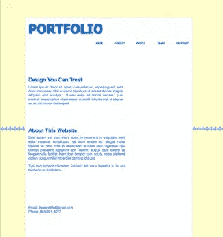](https://www.sitepoint.com/wp-content/uploads/2012/02/Screen-shot-2012-02-18-at-1.53.32-PM.png)

**第十六步:** **做一个竖图案**

对于“repeat-y”，可以指定 left、center 或 right，会得到不同的结果。

**第十七步:** **制作一个垂直边框图案**

注意:要制作右边框，请在下面的代码中将“左”改为“右”。

```
body {
background: #FFC url(images/bluedia.png) repeat-y left;
}
```

**[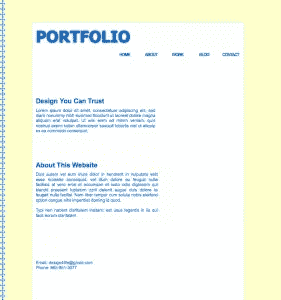](https://www.sitepoint.com/wp-content/uploads/2012/02/Screen-shot-2012-02-18-at-2.24.11-PM.png)** 

**第十八步:** **做一个竖条纹图案**

将“左”改为“中”会在你的布局中间产生一个垂直条纹。

```
body {
background: #FFC url(images/bluedia.png) repeat-y center;
```

[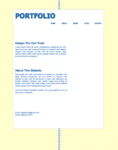](https://www.sitepoint.com/wp-content/uploads/2012/02/Screen-shot-2012-02-18-at-2.27.11-PM.png)

### ****结论****

 **你可以在 Photoshop 中用任何形状创建一个图案。你可以使用对角线、圆形、简单的杂色纹理、条纹、装饰物，或者任何你可以在 Photoshop 中创建的东西。有效地使用平铺和纹理图案可以在不影响网站速度或网站功能的情况下，增强设计的美感。** 

## **分享这篇文章**