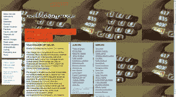
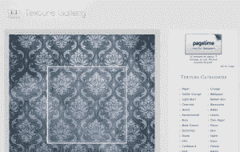
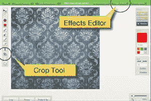
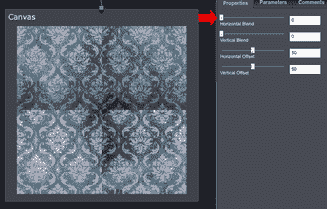
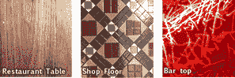

# 无需离开浏览器即可创建无缝纹理

> 原文：<https://www.sitepoint.com/creating-seamless-textures-without-even-leaving-your-browser/>

耶鲁大学艺术学院对平铺背景采取了一种有点过时的方式

上周有人给我指出了耶鲁大学艺术学院和他们的..*嗯*..有趣且颇具讽刺意味的平铺背景的使用。根据你的年代，你可能会回想起 MySpace、Angelfire 甚至最近离开的 Geocities，但这让我思考。

平铺背景就像网页设计世界的鳄鱼。它们最初是在网络的“侏罗纪”时期进化而来的，像基于表格的布局和字体标签一样，比恐龙存在的时间还要长。当然，它们可能丑得吓人，但就像鳄鱼一样，它们会呆很长时间，因为它们会工作。

好吧，这可能是一个概念性的延伸，但我看了很多探索频道。

展望未来，我们只会看到更多的平铺背景。现在，所有当前的浏览器(IE9、Chrome、Firefox、Opera 和 Safari)终于支持在单个元素上使用[多个背景](https://www.w3.org/TR/css3-background/)，似乎有一些很好的机会以新的有趣的方式将不同大小的磁贴编织在一起。然而，大多数时候你会希望你的图像样本平铺没有可见的边缘或接缝。

那么，我们该怎么做呢？

制作无缝拼贴最常用的方法是使用 Photoshop 的偏移滤镜将接缝移动到图像区域内部，然后用修复画笔或克隆工具手动修饰接缝。现在毫无疑问:这给了你一个好的结果，但是它确实需要一些工作，并且当涉及到复杂的模式时，通常需要一些相当的技巧。

有一些优秀的商业无缝拼接工具主要针对游戏开发者和 3D 建模者( [Genetica](http://www.spiralgraphics.biz/gen2tour/index.htm) 、 [Pattern Studio](http://www.mediachance.com/patternstudio/index.html) 和 [PhotoSEAM](http://www.mediachance.com/pseam/) 就是很好的例子)。

如果你经常使用这些工具，它们很棒，但对我们来说可能有些过头了。有一些付费的 Photoshop 插件和一些原始的自制应用，但我不得不说没有给我留下深刻印象。如果你不用安装任何东西，甚至不用离开你的浏览器就能制作出高质量的无缝瓷砖会怎么样？请继续阅读。

1.  

    从《失物招领》中采样壁纸纹理

    今天，我们将使用一些在线图形工具的 [Aviary 套件，为了配合，你可能要考虑安装](http://www.aviary.com/) [Chrome](https://chrome.google.com/extensions/detail/ncgcgghbabbopfcpgcjpfffdgnbadegf) 或 [Firefox 扩展](https://addons.mozilla.org/en-us/firefox/addon/aviary-screen-capture-quick-la/)，它们将你的浏览器与它们的服务直接对接。不一定要得到一个结果，但是会让你的过程更有效率。你说了算。

2.  I’m going to start with an old [wallpaper texture](http://lostandtaken.com/gallery/vintage-wallpaper-8.html) from [Caleb Kimbrough’s stunning and ever-growing collection at Lost & Taken](http://lostandtaken.com/). When you’ve found a texture you like, use the Aviary extension to screen capture the browser window. It should load straight into Aviary’s Image Markup Editor (aka Talon), where you can use the crop tool to trim your image down to a nice section of texture. You don’t need to be too precious about exactly where you crop your patterns — we can fix that later — but try to select an area that is relatively flatly lit.

    将您的图像裁剪到可使用的大小，然后将其传输到效果编辑器

    接下来，点击右上角的绿色“图像效果”按钮，将我们的图像传输到 Aviary 的效果编辑器(又名孔雀)——这就是漂亮的事情发生的地方。当它被加载时，工作空间应该显示你的纹理(标签为“资源”)的瓷砖，其下有一个输出画布。一个连接臂自动将我们的样本纹理连接到画布上。

3.  现在打开左边的“效果”标签，你会发现一个抽屉，里面有大约 40 种效果。四处翻找，直到你找到“无缝”效果，并将其拖放到我们的纹理贴图(资源)和画布之间。
4.  

    将您的资源、效果和画布连接在一起

    我们需要将这些元素“连接”在一起。如果你对无缝效果的定位恰到好处，它们可能会自动连接在一起。

    如果没有，也没什么大不了的。只需从我们示例底部边缘的小手柄和无缝效果图块顶部边缘的手柄拖动一个连接臂。按照相同的过程将无缝效果连接到画布。现在，您应该有一个很好的资源菊花链来无缝地绘制。

5.  选择无缝效果，你会看到它的属性显示在右边的面板中。坦白地说，默认设置不是很有用，所以重置水平和垂直混合为零，水平和垂直偏移为 50%。这将把硬边接缝移动到画布的中心，使它们更容易处理。
6.  Now for the magic. Begin gradually sliding the horizontal blend settings and the hard-edged vertical seam should start to evaporate before your eyes. If your original sample texture is an organic texture (paper, grass, marble, etc), almost any blend of around 10% should work fine. Man-made, repeating patterns such as wallpaper and fabric will take a little more fine-tuning on your part, but it’s not super difficult.

    滑动水平混合设置，垂直接缝应该开始蒸发

7.  你可能已经猜到了下一步。使用垂直混合滑块移除水平连接。
8.  当您对结果满意时，单击您的画布元素，并在属性面板中选中“*调整显示大小以适应输入位图*”复选框。这将自动为您裁剪掉任何空白图像区域。*瞧*！你现在应该看到一个完美的无缝瓷砖。
9.  现在你只需要下载它。在顶部的“文件”菜单中，您可以使用“将画布导出为位图”选项来下载副本。你也可以保存一份副本到你的鸟舍账户，如果你有的话。

这是示例中完成的图块，我创建了一个小演示页面来展示动作。

成品无缝瓷砖

注意:你可能会注意到在图像的底部角落有一个鸟舍水印。这在默认情况下是打开的，但可以在您的个人资料设置中关闭。你需要有一个鸟类账户，但它不会花费你任何东西。

### 摘要

正如你可能已经知道的，效果编辑器不仅仅是生成无缝的图块。孔雀是一个复杂的工具，旨在让你混合和匹配摄影源文件，生成分形图案，程序纹理，镜头效果和过滤器，以创建几乎任何你能想到的表面。我们今天几乎没有触及表面，但无缝瓷砖发电机是一个伟大的方式从鸟舍获得有价值的东西，同时让你的脚湿。

你可能每天都会路过或者吃一些很棒的食物。把它们收藏起来以备不时之需。

In this demo, I started with one of Caleb’s textures, but if you scour the web, you’ll find great, free, raw materials everywhere. In the past, I’ve sampled textures from commercial tile retailers, specialty paper suppliers, fabric wholesalers and brick manufacturers.

更重要的是，我们大多数人都在臀部口袋里带着高质量的“纹理捕捉设备”。只要意识到你的眼睛在看什么，抓住并把它藏起来。用不了多久，你就会拥有自己的超级有用的免费原始纹理集合。

玩得开心。

## 分享这篇文章