# 在 Photoshop 中创建自己的用户界面

> 原文：<https://www.sitepoint.com/creating-your-own-user-interface-in-photoshop/>

[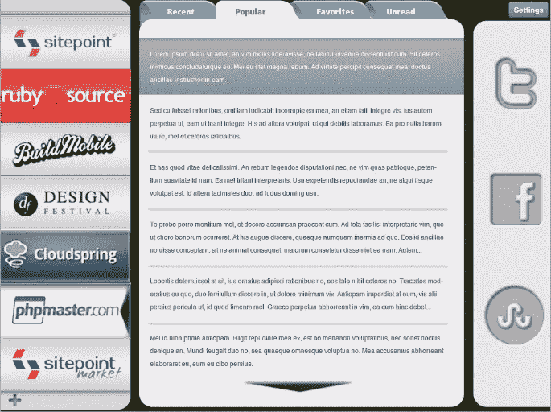](https://www.sitepoint.com/wp-content/uploads/2012/04/Screen-shot-2012-04-14-at-11.41.26-AM.png)

Photoshop 非常适合将你的作品从想法变成成品，这也是为什么它是大多数行业专业人士的首选。无论您是摄影师、平面设计师、网页设计师还是移动应用程序设计师，您几乎可以为任何场景设置稳定的工作流程。在本教程中，我们将逐步完成在 Photoshop 中创建自己的用户界面的过程。

### 技巧

**设置事物**

你如何为你的应用程序建立基础实际上取决于一旦它被创建，它将生活在哪里。如果它是一个桌面应用程序，那么你会选择一个不同的大小和分辨率，如果它是一个 iPad 或 iPod 应用程序。在这个例子中，我将为 iPad 创建一个应用程序。

**知道你的尺寸**

如果你设计你的 iPad 应用程序，而它没有按比例显示，这对任何人都没有好处。内容将被剪切，否则用户将无法正确选择。为任何特定设备创建应用程序时，了解它的尺寸总是有好处的。你通常可以在制造商的网站上，或者在一些文档中找到技术规格。iPad 的尺寸为纵向 768 x 1024 和横向 1024 x 768。

**考虑你的内容**

你的应用程序的设计也取决于它的内容。你不可能为每种情况创建一个终极解决方案的布局或设计，所以考虑交付内容的最简单方式是一个好主意，并基于这个想法设置你的结构。

**保持简单**

我知道我们已经听过无数次了，但是在应用程序设计中尤其如此。你需要让用户体验尽可能简单。让它变得直观，让任何用户——无论是有经验的还是新手——都能够通过你的应用来工作。

**看比赛**

这不是一个抄袭他人作品的机会，而是一个看看已经做了什么的机会，这样你就可以集思广益，看看你可以添加什么来使你的应用程序独一无二。你可以看看竞争应用的关键功能，以及它们缺少哪些元素。通过试用竞争对手的产品，你可以了解到哪些产品效果好，哪些不好。

**考虑元素的自然流动**

在美国创建用户界面时，我们非常清楚自己在做什么。我们对某些元素应该去哪里有一个直观的理解。然而，当我们为其他国家设计时，事情可能没有那么直观。比如阿拉伯国家从右往左读，和美国相反。为英语用户创建应用程序时，我们通常从左到右阅读，所以导航等主要元素应该从左侧开始。如果你的应用程序的体验是按顺序流动的，那么你应该从左边开始，从左向右流动。你也应该从上到下，因为这是阅读内容时最直观的流程。把它想象成阅读一本书，因为这是我们在学校被训练的消费和扫描内容的方式。

**考虑平台如何工作**

如今，大多数移动设备都可以在纵向和横向模式下工作。iPad 也不例外。当你为你的应用程序设计用户界面时，你需要考虑到这一点。你想把你的应用程序设计成肖像模式吗？如果你的目标是让你的应用程序响应它的方向，使它在纵向和横向都充满屏幕，那么你需要考虑这两种方向。

### 第一步:分割你的画布

我们的示例项目将是一个应用程序，它包含一个伞状网站，并将其所有子域和文章集成到一个地方。这个应用程序的目的是能够在一个应用程序中阅读几个不同网站的文章，而不必从一个网站跳到另一个网站。我们的第一步是将画布分成我们内容的主要区域。我们需要一个网站导航垂直区域，和子导航水平。我们还需要一个实际文章的预览区域，最后一个区域将用于发布文章，或与脸书或 StumbleUpon 分享。

[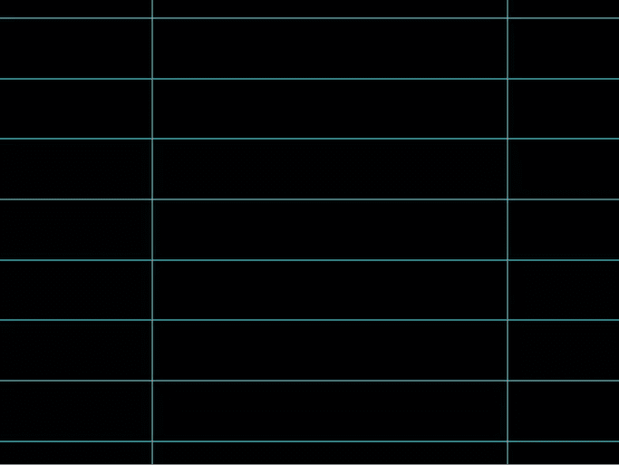](https://www.sitepoint.com/wp-content/uploads/2012/04/Screen-shot-2012-04-14-at-11.44.14-AM.png)

### 第二步:添加视觉趣味的纹理

在设计任何类型的界面时，有视觉对比是好的。我提前知道我的应用程序的大部分将会是平滑的、闪亮的，甚至可能是光滑的。在背景区域添加轻微的粗糙纹理确实可以在不分散观众注意力的情况下给背景添加一个不错的视觉冲击。我添加了一个棕褐色的纹理图案。关键是微妙的，所以我把不透明度降低到 30%，比例降低到 25%。

[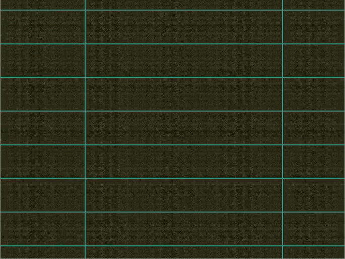](https://www.sitepoint.com/wp-content/uploads/2012/04/Screen-shot-2012-04-14-at-12.06.53-PM.png)

### 第三步:封锁你的主要区域，根据口味进行调整

一个好主意是——即使你已经完成了初步的草图——用不同的颜色在主要的上下文区域进行遮挡。这样，你可以得到一个整体外观的视觉预览。在这一步，你可以调整每一列的宽度，并确保在左列有足够的空间放置每个徽标，在中间有足够的空间放置内容，在右列有足够的空间放置图标。

[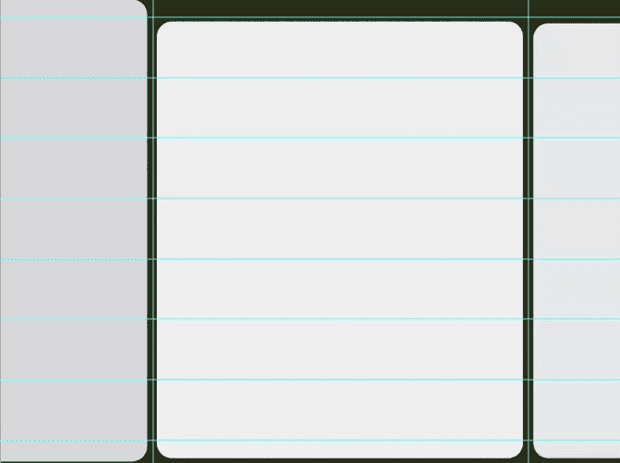](https://www.sitepoint.com/wp-content/uploads/2012/04/Screen-shot-2012-04-14-at-12.11.38-PM.png)

### 步骤 4:为你的图标制作框架

我已经为教程的目的设置了这个，但是我将向你展示我是如何设置的。不幸的是，为了在左侧创建垂直菜单，我们需要做一些数学计算。这可能听起来令人生畏，但我会帮助你打破它。SitePoint 系列有七个不同的图标，所以我们需要计算出我们需要多少空间，以便我们可以将它们彼此等距隔开，同时在顶部和底部留出额外的空间。我们希望在顶部和底部都留出大约 50-75px 的空间，是为了给子菜单、其他菜单的按钮(如首选项、选项和设置)以及我们可能集成的任何其他内容(如社交媒体集成、用户帐户详细信息等)留出空间。在我们的例子中，高度是 768 像素，所以我们需要为顶部和底部的菜单栏减去至少 100 像素。这给我们留下了 668px 的空间，我们将这个数字除以 7。答案大致是 95.42 像素。如果你想让每个网站的右侧导航按钮垂直填充空间，那么每个按钮需要大约 95px 高。请记住，您不必垂直填充空间。你总是可以为以后的扩展留下空间。

### 第五步:拿出你的指南

我喜欢用尺子来设置一切，我用像素而不是英寸。要更改标尺尺寸，右键单击标尺本身，将英寸更改为像素。你可以拉出顶部指南，为我们之前提到的菜单留出空间。

### 第六步:使用矩形模板来节省时间

从我们的计算中我们知道，我们需要使左侧的每个导航按钮高度为 95px，所以现在我们可以使用选框工具和顶部参考线来创建一个矩形模板，简单地复制它并相应地放置它。要为我们的选框工具指定一个精确的大小，请转到顶部的菜单栏，将正常设置更改为固定大小。然后，你会看到宽度和高度选项变得活跃，所以现在你可以拨你的尺寸。用要作为背景的颜色填充选区。确保您选择了适合每个图标的颜色，或者决定使用普通文本作为每个菜单的名称。

[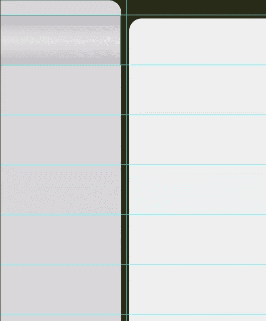](https://www.sitepoint.com/wp-content/uploads/2012/04/Screen-shot-2012-04-14-at-7.52.11-PM.png)

### 第七步:复制和排列

复制你的矩形层，将它们堆叠在一起，直到你有 7 个垂直排列。

[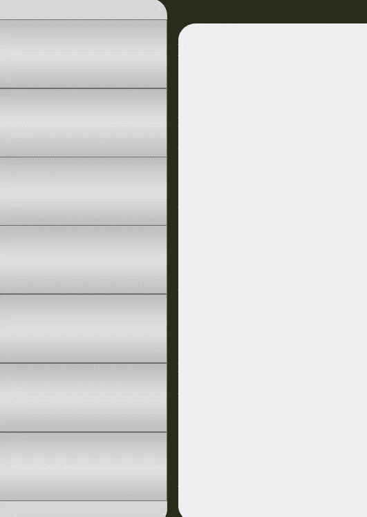](https://www.sitepoint.com/wp-content/uploads/2012/04/Screen-shot-2012-04-14-at-8.00.21-PM.png)

### 第八步:不要忘记组织你的层

当您创建自己的用户界面时，您的 Photoshop 文件可能会变得非常大，并且可能会变得难以处理和导航。幸运的是，Photoshop 集成了通过分组来组织图层的功能。你可以把你的作品的整个部分，由无数层组成，并把它们都放在一个文件夹里。只需选择您希望组合在一起的图层，然后进入“图层”>“新建”>“从图层组合”您甚至可以给群组命名，以便于识别其内容。当你在做一些非常详细的事情时，你会喜欢这个特性的；我们的实体模型的一部分由 75 层组成。

[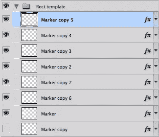](https://www.sitepoint.com/wp-content/uploads/2012/04/Screen-shot-2012-04-14-at-8.02.03-PM.png)

### 步骤 9:添加一些维度

我们需要一种方法来直观地显示用户在应用程序中的位置。用户需要知道相对于应用程序的其他部分，他们一直处于什么位置。你的指标不一定要又大又响；它们可能是微妙的，简单的，容易注意到的。在我们的应用程序中，左侧菜单的正常状态是一个轻微的渐变。为了表示当鼠标经过或选择一个项目时菜单的样子，我创建了一个与渐变相反的形状。我添加了一个内部阴影，并突出了中间区域，使其更加明亮。

[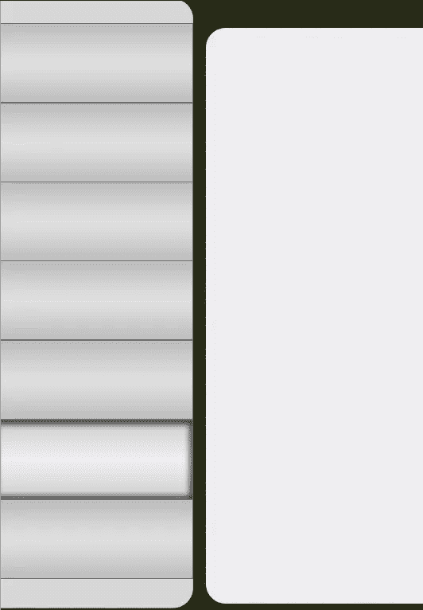](https://www.sitepoint.com/wp-content/uploads/2012/04/Screen-shot-2012-04-14-at-8.05.35-PM.png)

### 步骤 10:导入徽标或创建一致的文本菜单

如果要导入徽标，您可以导入几种不同类型的文件。您可以导入 Illustrator 矢量文件，也可以将它们作为智能对象导入。打开 Illustrator 文件，选择徽标，复制您的选择，然后切换回 Photoshop。当你进入“编辑”>“粘贴”，你可以粘贴为几个选项，但我通常选择“粘贴为智能对象。”这使得文件清晰、干净且可编辑。对您的其他徽标重复此操作。

您也可以使用透明的 PNG 文件。它们没有背景，通常在分辨率和颜色方面质量都很好。尽量避免低分辨率文件，如 GIF 文件或位图，因为它们可能是一个麻烦的工作。如果有空间的话，把它们放在左边栏的中心，但是你也可以把它们稍微向左移动，因为你需要为导航箭头留出空间，我们将使用导航箭头来指示哪个站点的文章被选中。

[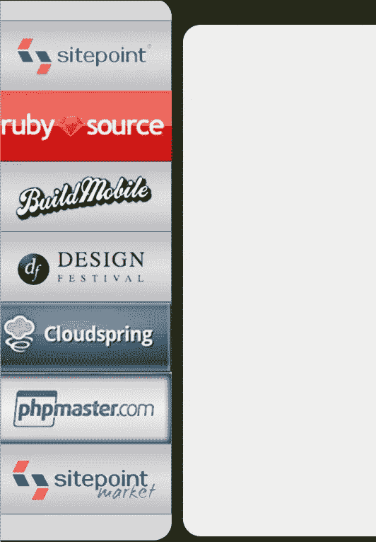](https://www.sitepoint.com/wp-content/uploads/2012/04/Screen-shot-2012-04-14-at-8.10.40-PM.png)

要创建箭头，请选择自定义形状工具，然后选择一个三角形。大小和形状并不重要，因为我们可以通过锚点来操纵它们。使其适合其所属区域的大小和形状。现在，添加一个图层样式，给它一些维度。我添加了一个小阴影，一个白色的内阴影，和一个缎面图层样式来给箭头一些光泽。

[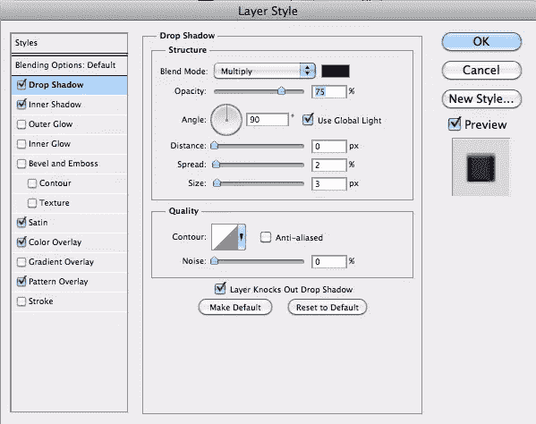](https://www.sitepoint.com/wp-content/uploads/2012/04/Screen-shot-2012-04-15-at-12.11.29-PM.png)

[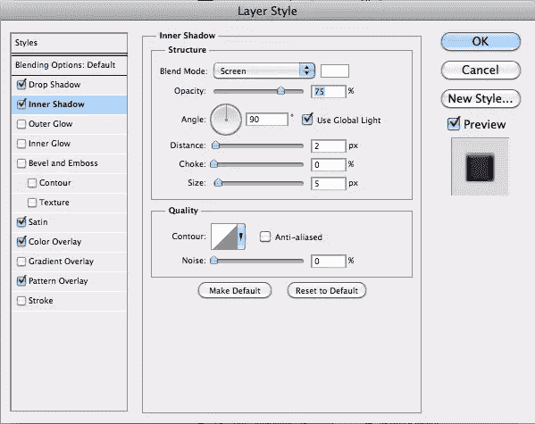](https://www.sitepoint.com/wp-content/uploads/2012/04/Screen-shot-2012-04-15-at-12.11.44-PM.png)

[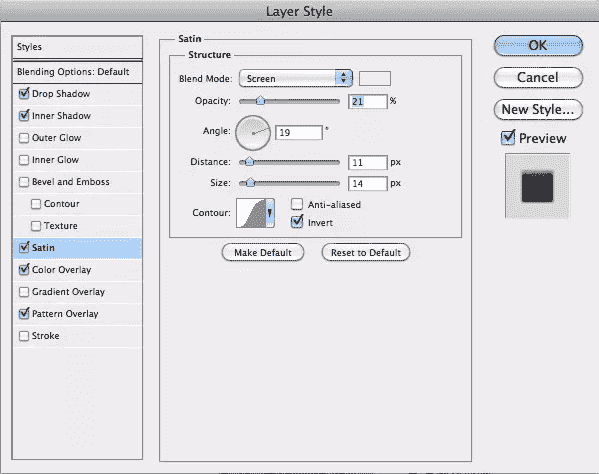](https://www.sitepoint.com/wp-content/uploads/2012/04/Screen-shot-2012-04-15-at-12.11.57-PM.png)

[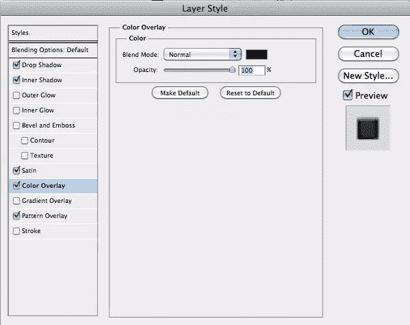](https://www.sitepoint.com/wp-content/uploads/2012/04/Screen-shot-2012-04-15-at-12.12.11-PM.png)

[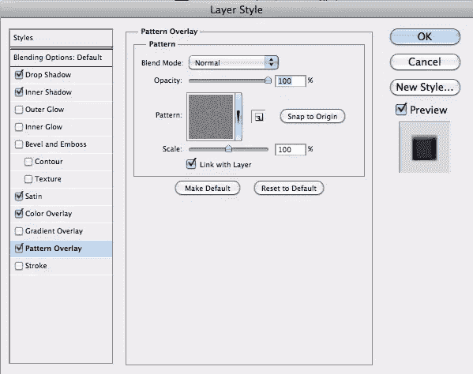](https://www.sitepoint.com/wp-content/uploads/2012/04/Screen-shot-2012-04-15-at-12.12.27-PM.png)

正如你所看到的，按钮区域的内部阴影和箭头，让用户很难不知道他们在应用程序中的位置。

[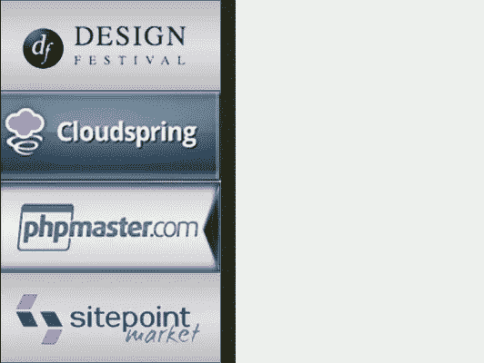](https://www.sitepoint.com/wp-content/uploads/2012/04/Screen-shot-2012-04-15-at-11.59.09-AM.png)

### 步骤 11:顶部导航

为了在视觉上分割网站，不要在顶部使用块状的按钮，试着创建一个更美观的标签菜单。这给你的设计增加了一些变化，这是让用户知道他们在哪里的好方法，因为选项卡是通过 dimension 突出显示的。

[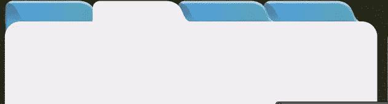](https://www.sitepoint.com/wp-content/uploads/2012/04/Screen-shot-2012-04-14-at-8.19.14-PM.png)

要创建每个标签，首先选择圆角矩形工具。使用钢笔工具和选择工具来编辑形状，直到你已经创建了如下所示的圆形。复制并粘贴形状，直到您拥有所需的四个相邻选项卡。一个是白色的，因为它将作为我们的活动标签。要在左侧创建阴影，请按住 command/ctrl 并点按图层图标以选择标签形状。创建一个新层，填充深蓝色。使用箭头键移动深蓝色选项卡，直到它覆盖原始选项卡。您可以将深蓝色阴影选项卡剪切到下面的选项卡层，也可以按 command/ctrl 键加载常规选项卡作为选择。然后，选择深蓝色标签层，并击中命令/ctrl + shift +“我”反转选择，并选择多余的，只留下阴影部分。对另外两个蓝色选项卡重复此过程。

[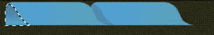](https://www.sitepoint.com/wp-content/uploads/2012/04/Screen-shot-2012-04-15-at-2.18.34-AM.png)

最左边的选项卡将被暴露，所以我们需要添加到蓝色选项卡的那一部分，以便它与内容区域的外观无缝连接。使用选框工具画一个足够大的框来填充白色圆角左侧的区域。将此层与最左边的选项卡合并。通过添加斜面和浮雕图层样式，为每个选项卡添加一些形状。添加一个 5px 大小的平滑内斜面，使每个标签具有柔软、圆润的感觉。为了节省时间，右键单击图层样式，选择复制图层样式，然后右键单击其他每个蓝色选项卡图层，选择“粘贴图层样式”这使你不必单独重做每个图层样式。

[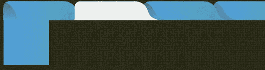](https://www.sitepoint.com/wp-content/uploads/2012/04/Screen-shot-2012-04-15-at-2.20.16-AM.png)

[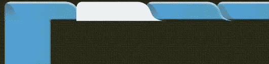](https://www.sitepoint.com/wp-content/uploads/2012/04/Screen-shot-2012-04-15-at-2.21.39-AM.png)

### 第十二步:内容区

默认情况下，每篇文章摘录都是非常浅的灰色，但是当你选择它时，它会变成深灰色。创建一个圆角矩形，覆盖内容将要放置的空白区域。确保它与白色标签完美融合。

[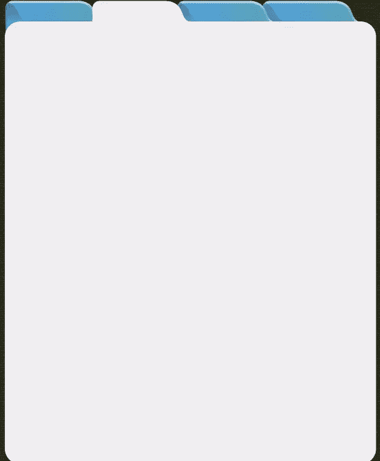](https://www.sitepoint.com/wp-content/uploads/2012/04/Screen-shot-2012-04-15-at-2.23.08-AM.png)

### 步骤 13:标签的文本

使用文本工具，选择一种粗体无衬线字体用于选项卡上的文本。无衬线字体显示效果最好，选择粗体字体通常是个好主意。好的选择通常是 Verdana、Arial 或 Helvetica。将它们排列在每个标签的中间。

[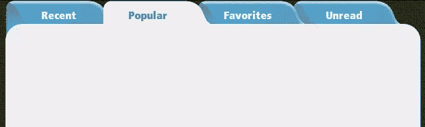](https://www.sitepoint.com/wp-content/uploads/2012/04/Screen-shot-2012-04-15-at-2.30.45-AM.png)

### 步骤 14:展示摘录

使用文本工具绘制文本区域。你可以简单地点击并拖动来画一个你想要的文本边界的方框。在这里，我使用了代表性的文本，因为这只是一个模型。您可以在任何 lorem ipsum 生成网站上找到这种类型的文本。我知道我想要显示大约三行文本，用户必须双击摘录才能完整阅读文章。为了显示用户已经选择了一篇文章，我创建了一个更粗的版本。当一篇文章被选中时，我创建了一个黑色矩形和白色文本，以消除对哪篇文章被选中的任何疑问。我添加了一个内阴影图层样式来给选中的版本添加维度。

[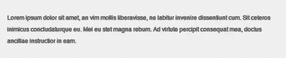](https://www.sitepoint.com/wp-content/uploads/2012/04/Screen-shot-2012-04-15-at-2.38.36-AM.png)

[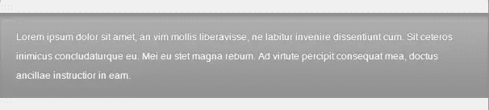](https://www.sitepoint.com/wp-content/uploads/2012/04/Screen-shot-2012-04-15-at-2.40.23-AM.png)

### 第十五步:分解内容

当有大量文本时，用户需要能够确定一个摘录在哪里结束，另一个摘录在哪里开始。为了使这尽可能容易，使用水平或垂直标尺是一个好主意。为了在示例中建立规则，我使用钢笔工具，在文本开始和结束的地方从左到右画了一条水平线，以便它与每个边缘对齐。我选择了一个 1px 的硬边笔刷，在路径面板中，我点击了第二个图标“用笔刷绘制路径”不管你选择什么颜色，因为我去了图层面板，设置填充为 0%，并添加了轻微的阴影。请确保将距离设置为 0，以获得均匀的阴影。按 Command/ctrl+ "J "键，根据需要多次复制层，以分割每个摘录。

[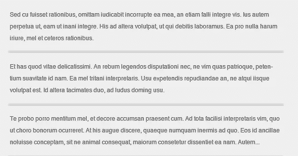](https://www.sitepoint.com/wp-content/uploads/2012/04/Screen-shot-2012-04-15-at-2.40.40-AM.png)

### 步骤 16:让用户了解更多内容

选择自定义形状工具，创建一个倒三角形。填充你选择的颜色，并添加一个轻微的斜面和浮雕图层样式。将其放在最后一段摘录的底部，表示还有更多内容。

[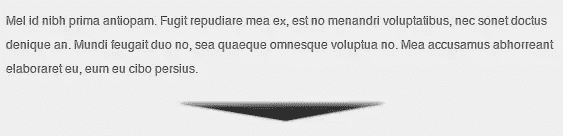](https://www.sitepoint.com/wp-content/uploads/2012/04/Screen-shot-2012-04-15-at-2.55.12-AM.png)

### 第十七步:添加社交媒体

你可以自己制作社交媒体按钮，也可以从网上下载免费的。有数百个免费的脸书和 Twitter 图标可供你免费下载。诀窍是寻找用形状或路径制作的，或者在 illustrator 中构建的。你可以把它们作为路径导入，给你干净、清晰的图标。对于我们的应用程序，我想要一个“压入”的外观，所以我使用了具有适当负空间的形状，以便内部边缘可以凸起。

[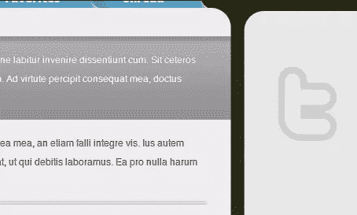](https://www.sitepoint.com/wp-content/uploads/2012/04/Screen-shot-2012-04-15-at-11.03.40-AM.png)

导入你的形状，双击图层，调出你的图层样式。选择内阴影，设置距离为 1px，大小为 5px。选择斜面和浮雕，并选择外斜面。将方向设置为向下，大小设置为 5px。然后，选择颜色覆盖并选择黑色作为颜色，你应该有一个稍微嵌入的 Twitter 图标。

[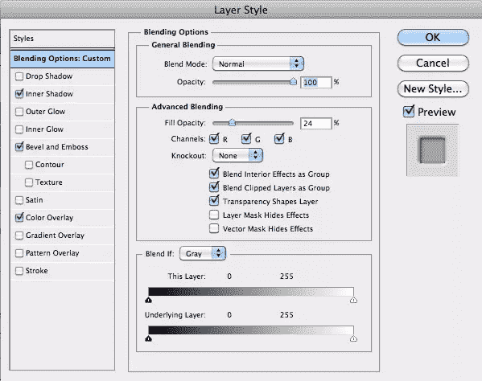](https://www.sitepoint.com/wp-content/uploads/2012/04/Screen-shot-2012-04-15-at-11.05.20-AM.png)

导入你的其他图标，从 twitter 图标复制图层样式，粘贴到其他社交媒体图标上。将它们等间距排列，并使它们与右列的中心对齐。

[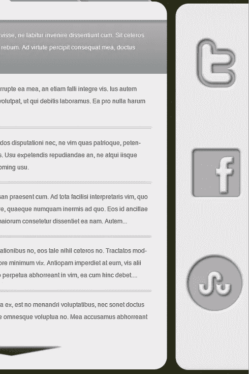](https://www.sitepoint.com/wp-content/uploads/2012/04/Screen-shot-2012-04-15-at-11.01.33-AM.png)

### 步骤 18:为设置/选项添加一个按钮

让我们使用圆角矩形工具在应用程序的右上角创建一个设置按钮。尝试之前在标签上使用的蓝色，以营造统一感。添加一个距离和大小为 1px 的轻微阴影。然后，设置不透明度为 40%。添加一个内阴影，但使其为白色，并将混合模式设置为“正常”将距离设置为 1px，大小设置为 2px。添加一个轻微的渐变叠加，不透明度为 30%，以增加一些维度。添加一个 1px 的小笔画，设置类型为渐变，渐变为黑色到炭灰色。

[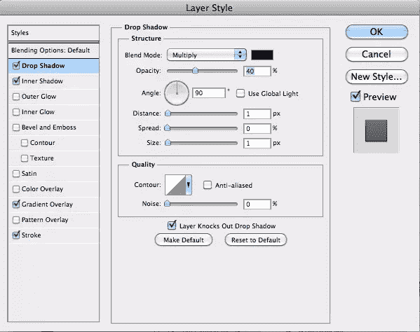](https://www.sitepoint.com/wp-content/uploads/2012/04/Screen-shot-2012-04-15-at-11.18.16-AM.png)

[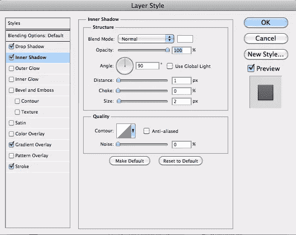](https://www.sitepoint.com/wp-content/uploads/2012/04/Screen-shot-2012-04-15-at-11.18.32-AM.png)

[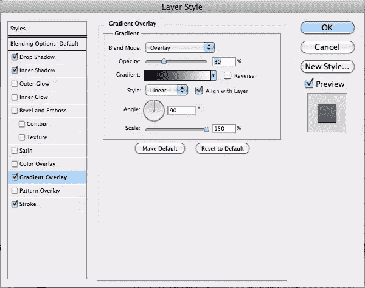](https://www.sitepoint.com/wp-content/uploads/2012/04/Screen-shot-2012-04-15-at-11.18.44-AM.png)

[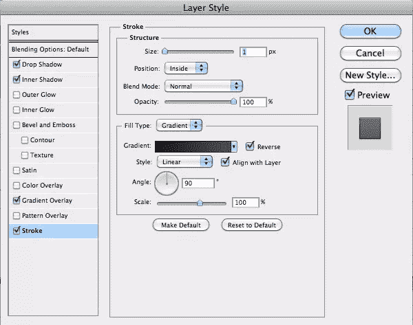](https://www.sitepoint.com/wp-content/uploads/2012/04/Screen-shot-2012-04-15-at-11.18.56-AM.png)

复制标签的一个文本层，并降低尺寸以适应你做的按钮。在图层样式中添加 1 像素的投影。

[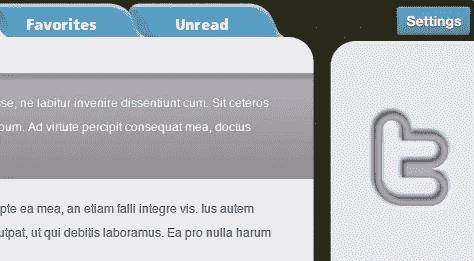](https://www.sitepoint.com/wp-content/uploads/2012/04/Screen-shot-2012-04-15-at-11.26.32-AM.png)

### 步骤 19:添加一个按钮来添加站点

我们想添加一个按钮，以便能够将网站添加到我们的阅读列表中。要做到这一点，只需绘制一个薄矩形，复制层，并点击命令/ctrl + "T "转换第二个矩形。旋转时按住 shift 键，将其限制为 45 度增量，然后旋转直到水平。按 command/Ctrl + "E "将两个矩形合并成一个加号。然后复制我们之前使用的一个社交媒体图标的图层样式。一开始效果太强了，所以我们想把斜面和浮雕图层样式的尺寸降低到 2px。这将缩放效果到较小的图标。

[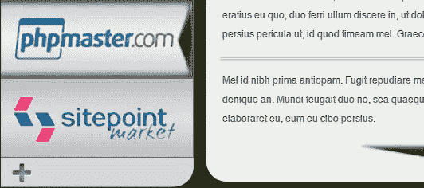](https://www.sitepoint.com/wp-content/uploads/2012/04/Screen-shot-2012-04-15-at-11.39.43-AM.png)

### 结论

通过实现我们在本教程中介绍的技术，您可以快速有效地创建应用程序的模型。添加微妙的纹理，渐变覆盖和重复元素将创建一个直观的界面，促进使用，因为它在视觉上很有趣，并且易于导航。通过在相同的元素上复制和粘贴图层样式来节省时间，记住要给每个部分留有喘息的空间。最终结果如下所示:

[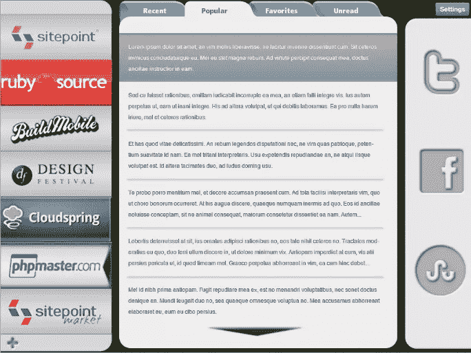](https://www.sitepoint.com/wp-content/uploads/2012/04/Screen-shot-2012-04-15-at-12.19.46-PM.png)

## 分享这篇文章