# 120 多个地方可以找到知识共享媒体

> 原文：<https://www.sitepoint.com/creative-commons-sources/>

在这个时代，似乎网上的所有东西都有价格。无论你是在付费网站上订阅完整的文章，还是点击博客中的广告，网上的一切似乎都与金钱有关。幸运的是，根据[知识共享许可](http://creativecommons.org/about/licenses)列出的媒体文件仍然有一个大的、非常健康的在线运动。

对于那些不熟悉这个概念的人来说，这些文件可以免费用于创建网站和其他媒体。但是，请注意，许可证有不同的等级，其中一些仅用于私人用途，或者它们可能要求您包含原始创作者的署名。请务必阅读并理解各种许可证，以及您发现的每个文件所使用的许可证。

当这篇文章在 2009 年首次发表时，SitePoint 已经收集了超过 30 个最好的音频、视频、图像等在线资源，供你在下一个项目中使用。随着时间的推移，知识共享运动已经获得了很大的势头。虽然最初名单中的一些网站已经销声匿迹，但新的更新名单拥有数量更多的新条目。

多大？太大，无法详细描述每个条目。这就是为什么我们将在每个部分突出显示我们认为最有趣的五个网站，而其余的条目将按照字母顺序排列。话虽如此，是时候让事情运转起来了。

## 声音的

免费的音频剪辑和歌曲基本上有无限的用途，从播放视频到作为播客的开场主题，甚至只是当用户点击链接时用作声音效果。在所有的资源中，知识共享许可的音乐对内容创作者和设计者来说是最有潜力的。

YouTube、Vimeo 和其他平台上媒体创作的传播提高了对优质音频剪辑的需求，这些剪辑可以由小型内容创作者使用，而不会失去将其内容货币化的选择。这种资源非常受欢迎也就不足为奇了。我们名单上的大量新条目证明了这一点。

### [ccMixter.org](http://ccmixter.org/)

ccMixter 提供了上千首知识共享许可的混音歌曲，几乎涵盖了所有可用的流派。请务必阅读每个轨道的信息页面，以了解它遵循的许可证版本。

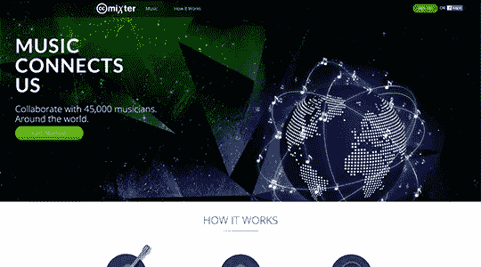

### [鼠标打开](https://musopen.org/)

MusOpen 是公共领域音乐的在线储存库。绝大多数曲目都是经典音乐，所有著名作曲家都出席了演出。还有大量的乐谱收藏，以及众多的音乐教育资源。

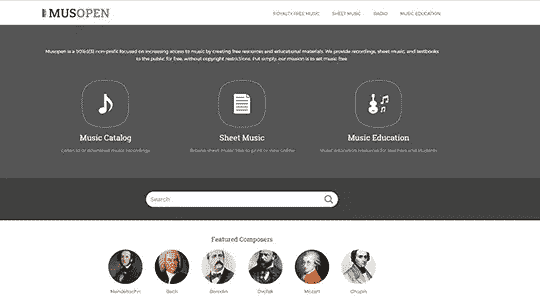

### [FMA——免费音乐档案](http://freemusicarchive.org/)

免费音乐档案是一个高质量的，合法的音频下载的互动图书馆，所有的音频都是由他们的既定的音频策展人之一精心挑选的。你在免费音乐档案上发现的每一个 MP3 都被预先批准用于某些类型的用途，否则这些用途会被不是为数字时代设计的版权法所禁止。

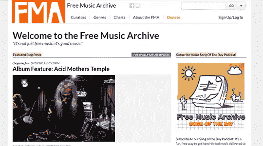

### [技术服务中心](http://teknoaxe.com/)

TeknoAXE 拥有非常大的音乐收藏(超过 1200 首)，每周都有新的作品加入。所有的歌曲都是在 CC 4.0 许可下发布的，只要发布归属信息，就可以在任何地方免费使用。

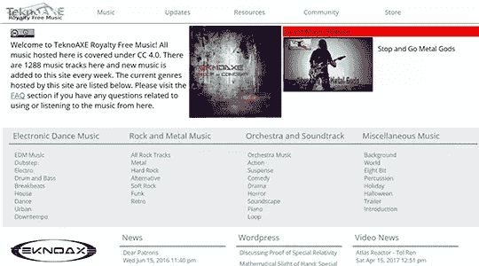

### [西尔弗曼声音工作室](https://www.silvermansound.com/)

Siverman Sound Studios 是音乐家 Shane Ivers 分享音乐的地方。你可以浏览近 100 首各种风格的免费歌曲——它们都是在[知识共享署名 4.0 国际许可](http://creativecommons.org/licenses/by/4.0/)下提供的。

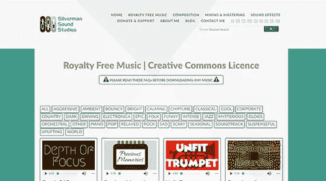

### 其他提供音频资源的网站

如果你在上面的精选条目中找不到你想要的歌曲，不要绝望。你可以在以下网站(按字母顺序排列)找到大量知识共享许可下的音频:

*   [Audionautix](http://audionautix.com/)
*   [Bensound](http://www.bensound.com/)
*   [CCTrax](http://cctrax.com/)
*   [合唱维基](http://www2.cpdl.org/wiki/index.php/Main_Page)
*   [Free-Loops.com](http://free-loops.com/)
*   [FreeSound.org](http://freesound.org/)
*   [Hearthis CC 收藏](https://hearthis.at/creative-commons/)
*   [iBeat.org](http://audio.ibeat.org/)
*   [未检测到](http://incompetech.com/wordpress/)
*   贾门多
*   乔希·伍德沃德
*   [莫比免费赠送](http://www.mobygratis.com/)
*   [OpsSound.org](http://www.opsound.org/)
*   [样本交换](http://sampleswap.org/)
*   斯科特·巴克利
*   桑尼·布
*   [SoundBible 版税免费音集](http://soundbible.com/royalty-free-sounds-1.html)
*   [声音点击](https://www.soundclick.com/)
*   [噪音部落](https://www.tribeofnoise.com/)

## 常规搜索

虽然有这么多的知识共享媒体供人们使用是件好事，但是找到它们却是完全不同的事情。幸运的是，有几个网站可以减轻你的痛苦，帮助你寻找合适的文件。虽然有些网站，如 Archive.org 网站，只搜索他们的网站，但他们的收藏如此广泛，仍然值得包括在内。

### [知识共享搜索](https://search.creativecommons.org/)

通用 CC 搜索的第一站应该是 Creative Commons 组织本身提供的搜索界面。虽然它本身不是一个搜索引擎，但这个工具可以连接到各种其他搜索引擎和资源，以获取最佳结果。

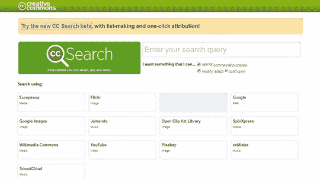

他们还提供了一个专门用于图片搜索的新工具的测试版，你可以在[ccsearch.creativecommons.org](https://ccsearch.creativecommons.org/)访问。

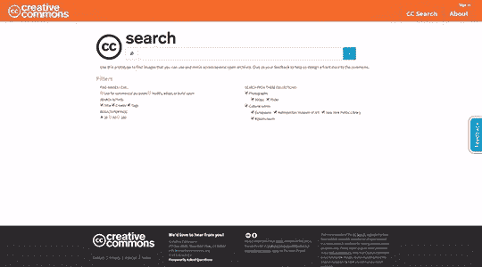

### [Archive.org](https://archive.org/)

大多数人只想到 Archive.org 的 Wayback 机器，但它也提供了大量的音频，视频和文本文件的选择下，创作共用许可证。

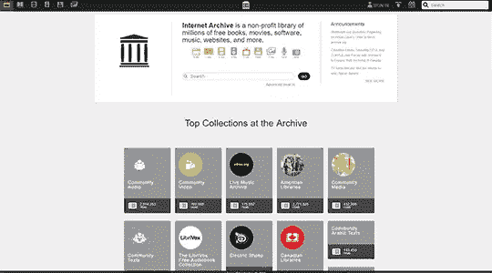

### [维基媒体公社](https://commons.wikimedia.org/wiki/Main_Page)

每个人都知道维基百科。没有多少人知道它的知识共享部分，维基共享。这是一个超过 4000 万个媒体文件的集合，这些文件可以在受到某些限制(在许多情况下)的情况下自由重用。不过，请务必检查每个文件的许可细节，以了解如何使用它。

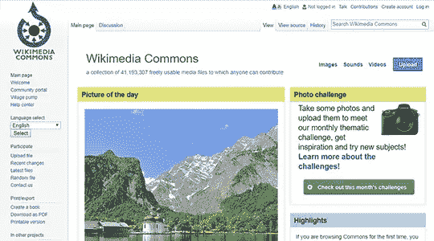

### [咱们抄送](http://eng.letscc.net/)

Let's CC 是一个韩国网站，作为搜索 CC 许可文件的界面。它没有自己的索引，而是使用其他搜索引擎，如 Flickr 或 YouTube。就像在其他情况下一样，确保检查每个文件的许可细节。

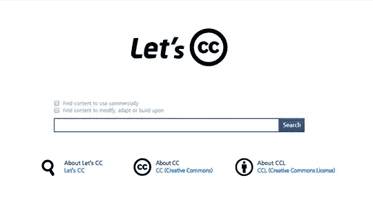

### [pond 5](https://www.pond5.com/free)的公共领域项目

Pond5 启动了公共领域项目，作为一种让您的创意项目可以使用历史媒体文件的方式。这里收藏了超过 6 万份文件，是一个值得一去的地方。

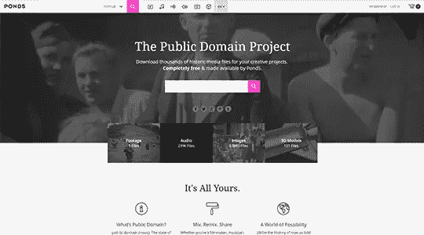

### 主流搜索引擎

当然，人们不一定需要专门的工具来寻找知识共享资源。同样的事情可以使用任何一个主流搜索引擎来完成。不管你更喜欢谷歌、必应、雅虎还是别的什么，在你的任何媒体搜索查询中加入“知识共享”，你都会得到一些好的结果。

## 形象

早在 2009 年，在知识共享许可下寻找免费图片是一项相当艰巨的任务，因为大部分市场都被库存摄影网站所主导。几年后，我们发现这是增长最快的资源类别。我们最初的列表有 10 个条目，更新后的列表有 70 多个条目。这使得选择 5 个特色网站的工作变得更加困难，不可避免的是，不是每个人都同意我们的选择。

需要特别一提的是网站的一个子类 one author 集合。许多摄影师选择在各种形式的知识共享许可下提供他们的作品。在某些情况下，一些人将他们的图像汇集在一起，形成一个更大的集合。虽然这些网站上的图片总数并不多，但你可以找到其他地方没有的精彩照片。

### [Flickr 知识共享](https://www.flickr.com/creativecommons/)

Flickr 过去是，现在仍然是寻找知识共享许可图片的最佳地点。对每种口味的 CC 都有预先过滤的搜索，结果通常数以千万计。下面列表中的一些条目是由 Flickr API 支持的。如果你在搜索知识共享图片，这绝对是你应该访问的第一个网站。

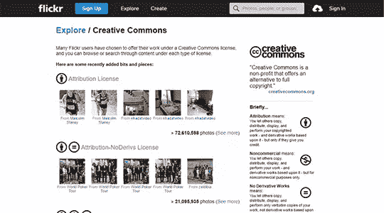

### [去飞溅](https://unsplash.com/)

毫无疑问，Unsplash 是过去几年席卷互联网的免费图片运动的典型代表。2013 年，Tumblr 网站从一张照片的 10 张照片开始，如今已经成为一个蓬勃发展的社区，拥有超过 20 万张图片，日浏览量超过《纽约时报》，下载量接近 1 亿次，并与苹果等行业巨头建立了合作关系。

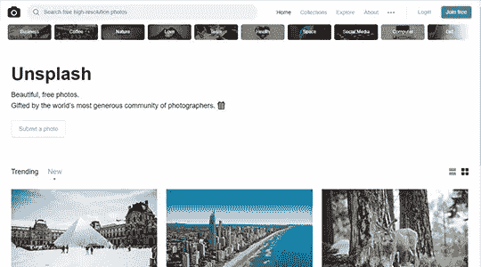

### [500px 知识共享](https://500px.com/creativecommons)

500px 是另一个旨在取代 Flickr 的社区门户网站，因为后者在过去十年里已经淡出了公众的兴趣。拥有超过 1200 万用户，看起来他们可以支持他们的说法。就像 Flickr 一样，它们提供类似的预定义搜索，让你更容易找到任何在知识共享许可下发布的图片。

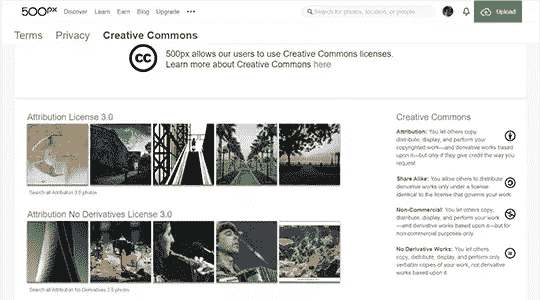

### [Pixabay](https://pixabay.com/)

Pixabay 是另一个蓬勃发展的在线社区，专注于分享照片、插图、矢量图形和视频。与 Flickr 和 500px 不同，所有内容都只能在 [CC0](https://creativecommons.org/publicdomain/zero/1.0/) 下获得——这意味着它们都是公共领域的一部分。所有提交的内容在被接受之前都经过筛选和批准，甚至还有一个面向所有应用开发者的 API。

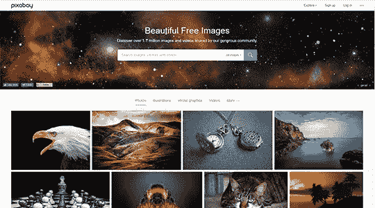

### [Libreshot](https://libreshot.com/)

最后一个特色节目是 Libreshot。我们在这里涉足越来越多的单一作者网站——在这个案例中，是来自捷克共和国布拉格的马丁·沃雷尔。这里有数百张图片，你可以查看过去 24 小时、30 天或网站开始时最受欢迎的图片。

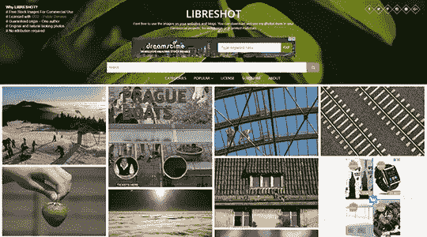

### 其他提供知识共享图像的网站

如前所述，我们这里有一个非常大的网站列表，按字母顺序排列。

*   [100 万张免费图片](http://www.1millionfreepictures.com/)
*   [4 张免费照片](http://www.4freephotos.com/)
*   [相册](http://albumarium.com/)
*   [动物照片](http://animalphotos.info/)
*   avopix
*   [列表照片](http://photos.bucketlistly.com/)
*   [时钟](https://www.clker.com/)
*   [竞争](http://compfight.com/)
*   [创造力 103](http://creativity103.com/)
*   纸杯蛋糕尼尔森·李
*   [Davalign](http://pdi.davalign.com/)
*   [Dreamstime 公共领域照片](https://www.dreamstime.com/free-photos)
*   [Duion](http://duion.com/art/main)
*   [幻想渴望](http://fancycrave.com/category/collections/free/)
*   [FindAPhoto](http://finda.photo/)
*   [吃货们喂](https://www.foodiesfeed.com/)
*   [脚](http://foter.com/)
*   [免费图片](https://free-images.com/)
*   [免费图片抄送](http://www.free-images.cc/)
*   自由形象
*   [免费自然股票](http://freenaturestock.com/)
*   [免费照片 SE](http://www.freephotos.se/)
*   [免费复古插图](https://freevintageillustrations.com/)
*   [自由](http://www.freeqration.com/featured/)
*   [来自旧书](http://www.fromoldbooks.org/)
*   [地理位置](http://www.geograph.org.uk/)
*   [地形图](http://www.gratisography.com/)
*   [好的免费照片](https://www.goodfreephotos.com/)
*   [Jay Mantri](http://jaymantri.com/)
*   [照片的寿命](http://www.lifeofpix.com/)
*   [小画面](http://littlevisuals.co/)
*   [马德琳](https://magdeleine.co/)
*   [大理石照片](http://www.marblepics.com/)
*   [MMT 库存](https://mmtstock.com/)
*   [移动器](http://moveast.me/)
*   [我的公共领域图片](http://www.mypublicdomainpictures.com/)
*   [负空格](https://negativespace.co/)
*   [新老股票](http://nos.twnsnd.co/)
*   [打开剪贴画](https://openclipart.org/)
*   [PDPics](http://pdpics.com/)
*   [PD 海报](http://pdposter.weebly.com/)
*   [轴](https://www.pexels.com/)
*   [照片无处不在](http://photoeverywhere.co.uk/)
*   [班级照片](http://www.photosforclass.com/)
*   [照片公共领域](http://www.photos-public-domain.com/)
*   [光针](http://photopin.com/)
*   [摄影标准](http://www.phototeria.com/)
*   赛马场
*   [拍摄图像](http://pickupimage.com/)
*   [PixZoid](http://www.pixzoyd.com/)
*   [Plixs](https://plixs.com/)
*   [公共领域档案](http://publicdomainarchive.com/)
*   [公共领域文件](http://www.publicdomainfiles.com/)
*   [公共领域照片](http://www.public-domain-photos.com/)
*   [实景图](https://realgraphy.org/)
*   [迅猎兽照片](https://skitterphoto.com/)
*   爽快的山羊
*   [灵魂照片](http://soul-photos.com/)
*   [飞溅底座](http://www.splashbase.co/images?images=true)
*   [创业股票照片](http://startupstockphotos.com/)
*   [股票抢购](https://stocksnap.io/)
*   [股票](http://thestocks.im/)
*   [托珀的照片](http://www.topersphotos.com/)
*   [旅行咖啡本](http://travelcoffeebook.com/)
*   [WikiHow](http://www.wikihow.com/)

## 文本

许可文本的使用可能有点奇怪，但它们对于在网站标题中引用和使用短语来说非常有用。

### [古腾堡项目](https://www.gutenberg.org/)

古腾堡计划开始于 1971 年，可以安全地认为是第一个公共领域内容的数字仓库。这个项目背后的理念是使信息、书籍和其他材料以大多数计算机、程序和人们可以容易阅读、使用、引用和搜索的形式提供给公众。

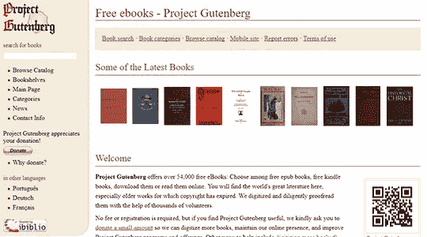

### [文本内](http://www.intratext.com/)

IntraText 图书馆包含超过 1200 万篇文本，其历史可以追溯到公元前 900 年，也可以追溯到 21 世纪。在使用每个资源之前，请务必检查每个资源所使用的许可证。

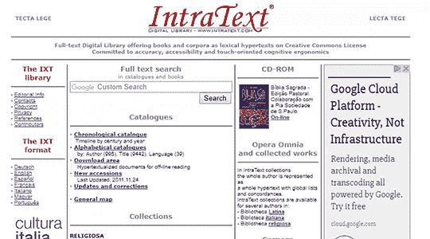

### [智慧共享](http://www.wisdomcommons.org/)

智慧共享空间是一个寻找和讨论人类普遍认同的重要美德的地方，比如慷慨、同情和勇气等等。这是由数以千计的报价，诗歌，寓言，散文和其他类似的作品都是免费使用的支持。

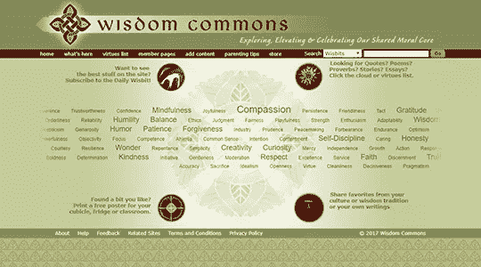

### [公共领域审查](http://publicdomainreview.org/)

《公共领域评论》是一个在线期刊和非盈利项目，致力于探索艺术、文学和思想历史中奇特而引人注目的作品。

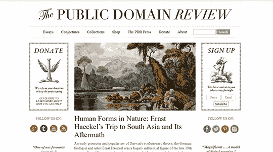

### [美国政府出版物目录](https://catalog.gpo.gov/)

CGP 是联邦出版物的查找工具，包括历史和当前出版物的描述性信息，以及完整文档的直接链接。用户可以通过作者机构、标题、主题和一般关键字进行搜索。

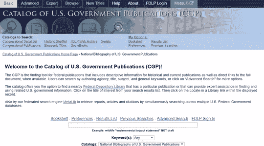

### 其他提供知识共享文本、书籍和出版物的网站

和以前一样，这里有一些其他的网站，可以链接到不太为人所知的公共领域和知识共享文本。

*   [欧洲系列](http://www.europeana.eu)
*   [在线图书页面](http://onlinebooks.library.upenn.edu/)
*   [维基百科:公共领域资源](https://en.wikipedia.org/wiki/Wikipedia:Public_domain_resources)

## 录像

越来越多的网络转向视频，在线视频观看量创下历史新高。如今，对免费使用的高质量股票视频有着非常大的需求，而不需要为使用权支付一大笔钱。如果你发现自己需要这样的视频，这里是你应该开始搜索的地方。

### [Vimeo 知识共享](https://vimeo.com/creativecommons)

Vimeo 的目标是成为仅次于 YouTube 的第二大视频社区。他们用最大的知识共享许可视频集合之一来支持这一立场，并通过提供工具来足够快地找到这些视频。

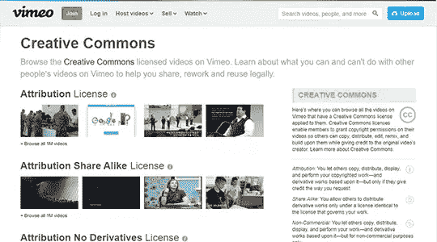

### [Videvo](https://www.videvo.net/)

Videvo 提供完全免费的库存视频素材和运动图像，可用于任何项目。它拥有大约 6000 个剪辑，并且每天都在增加。但是在使用剪辑之前，请务必检查许可证的所有细节。

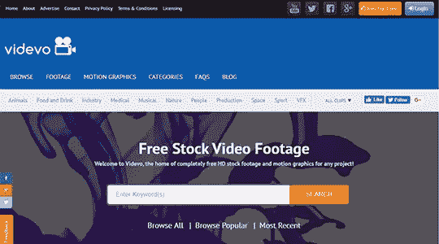

### [Pixabay](https://pixabay.com/)

我们在图片部分展示了 Pixabay，理由很充分。我们在这里再次提及，因为它还拥有一个伟大的高清和 4K 分辨率的视频剪辑集合。

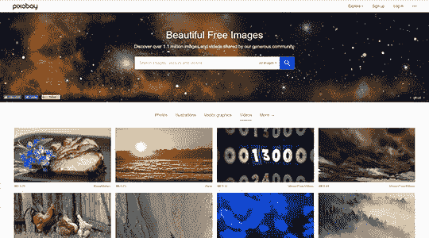

### [Flickr](https://www.flickr.com/search/?media=videos&adv=1&text=video&advanced=1&license=2%2C3%2C4%2C5%2C6%2C9)

这个特色网站列表必须包括 Flickr 和它的超过 95，000 个在知识共享许可下的视频。虽然大多数都是业余自制的剪辑，但你可以在你的项目中找到一些隐藏的宝石。

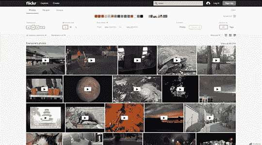

### [打开图像](https://www.openbeelden.nl/)

开放图像是一个开放的媒体平台，提供在线访问视听档案材料，以刺激创造性的再利用。Open Images 还提供了一个 API，使得开发 mashups 变得容易。在知识共享许可模式下，可以访问开放图像上的材料。

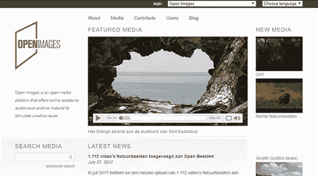

### 其他提供知识共享视频资源的网站

这里有更多的地方，你可以去搜索知识共享许可的视频剪辑。

*   [海滨 B-Roll](http://www.beachfrontbroll.com/)
*   [免费库存素材存档](http://freestockfootagearchive.com/)
*   [互联网存档社区视频](https://archive.org/details/opensource_movies)
*   [像素视频](https://videos.pexels.com/)
*   [飞溅底座](http://www.splashbase.co/images?videos=true)

## 包装东西

这里是我们旅程的终点，有一个巨大的新的地方列表，可以搜索各种知识共享资源。希望这能让你更容易为你的项目找到合适的媒体。

## 分享这篇文章