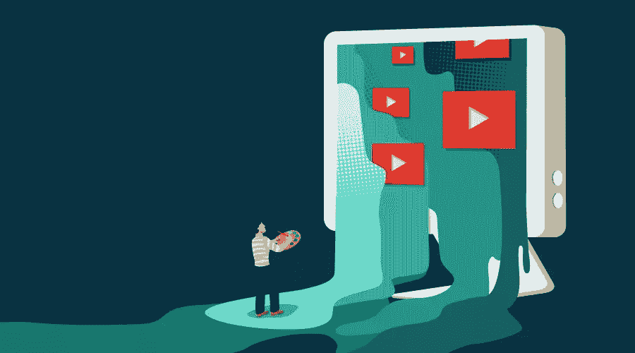
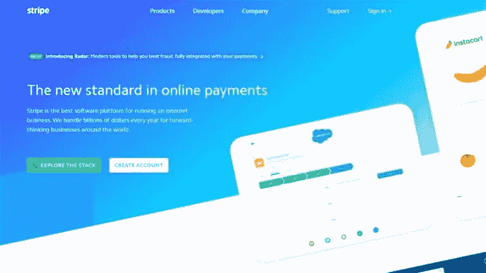
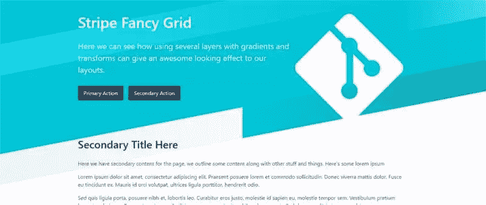
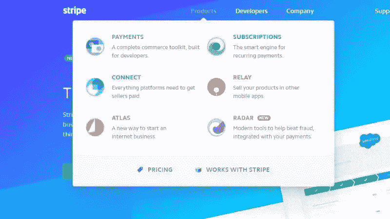
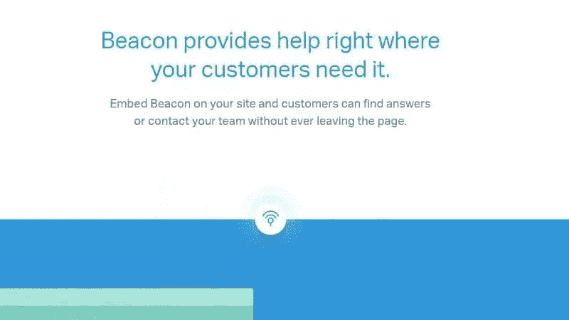

# 为你的下一个网站项目提供灵感的用户界面设计

> 原文：<https://www.sitepoint.com/creative-ui-design-ideas-you-can-use-in-your-next-website/>

*这篇文章由[戴夫·马克斯韦尔](https://github.com/davemaxwell77)和[帕纳伊奥蒂斯·韦利萨拉科斯](https://www.sitepoint.com/author/pvelisarakos/)进行了同行评审。感谢 SitePoint 的所有同行评审员使 SitePoint 的内容尽可能做到最好！*

网络已经远离了它的传统根基。曾经提供一个基本的纯文本网站是非常好的，现在实际上期望你的网站不仅传达信息，而且提供一个现代的、清晰的和令人兴奋的用户体验。

为此，作为设计者或开发者，你需要创造一些视觉上有趣的东西。这可能小到一组令人惊叹的字体组合，也可能大到完整的动画和深度交互。

今天我们将看看几个网站，它们熟练地使用微交互、悬停状态动画、CSS 渐变和变换来创造视觉兴趣并引导用户的行动。重点是创造用户喜欢的东西，或者直接通过交互，或者通过用户可能不会注意到的微妙效果，这仍然有助于创建与网站的积极联系。

## 种类

[Stripe](https://stripe.com/) 是一个位于美国的信用卡支付处理系统。这是一个以开发人员为中心的解决方案，这在他们的系统和网站上都有体现。他们的网站丰富多彩，互动性强，使用起来非常棒。让我们看看在我们的设计中可以挑选和利用哪些元素。

### 渐变背景和 CSS 变换

Stripe 网站展示了一个主要的标题部分，创造性地使用了布局和设计。页眉逐页改变颜色，并用作主要的**行动号召**元素。

在最基本的层面上，它是一个容器的集合，这些容器被定位来创建一个半镶嵌网格。这些片段都有自己的线性渐变，与标题的其他部分混合或形成对比。

让页眉看起来更有趣的是它被倾斜了。为了获得这种效果，你需要做的就是在顶部元素上应用一个`skew(xdeg)`变换。这样做会立刻扭曲内部元素。

微妙的倾斜，以及简单而有趣的图像和颜色，都是你需要带来这个创造性的设计。在这里获得低对比度和高对比度部分的良好混合是很重要的。如果这些部分是单调的颜色，效果看起来就不会那么好。相反，从一个部分到另一个部分的渐变使它看起来非常醒目。

如果你喜欢这个想法，你可以在你的标题中加入这样的布局，甚至在行动号召或功能块中使用它作为背景。尝试混合颜色、位置和变换，创造出看起来有趣、让你脱颖而出的东西。

这里有一个 [CodePen 演示](https://codepen.io/SitePoint/pen/rmKVZz)可以让你马上开始。

在最基本的层面上，这个例子是一个 div 的集合，这些 div 已经用渐变进行了着色，然后被定位以产生效果。选择正确的颜色、高度和位置组合是这种效果引人注目的原因。

### 创建互动、有趣的菜单

菜单已经从过去的老式左侧垂直菜单走了很长的路。如今，人们希望你的菜单既有用，视觉上又有趣，当然还要移动优化。

Stripe 的菜单很有意思。

他们的每个主要顶级类别都展开，并以独特的布局展示了他们的几个子页面。例如，他们的*产品*菜单采用了大型菜单风格的布局。每个子页面都有自己的风格图标、标题和摘要描述，以吸引您了解更多信息。

正如您所料，所有这些菜单在移动设备上都运行良好，可以根据需要动态改变。

这里的想法是 Stripe 把一些通常很无聊的东西，比如下拉菜单，变成了一个展示区，一些有趣的东西。例如，你可以在菜单中加入一些动画来微妙地改变它的位置或不透明度。或者，您可以为菜单创建动态布局，在独特的灯光下展示每个页面。

在之前的一篇文章中，我提到了一些你可以使用的不同菜单的例子，但是指导原则是它们应该易于使用并且视觉上有趣。

## 帮助侦察员

是一个易于实现的动态帮助系统。它公开了一个前端小部件，访问者可以通过浏览预定义的帮助文章或发送联系表单来获得帮助。

他们的网站非常简单，只关注内容。然而，它使用几个微妙的动画和图标来吸引你的注意力。

### 创建微妙的重复动画

并非所有的动画都必须由用户交互触发。有时，创建一个在后台巧妙运行的动画就足以赋予你的页面以动感，使其看起来更有活力。

当你进入[帮助童子军的工具页面](https://www.helpscout.net/embed-tools/)时，你很快就会看到上图中的简单脉冲组件。这是一个好看的图标，材质阴影和一个简单的脉动波纹动画的组合。

这是一个很好的例子，你可以把一些东西引入到你的设计中，一个微妙的动画，看起来很好，不会分散用户对你的内容的注意力。

我创建了一个类似的独立小部件，您可以将它放入您的项目中:

通过 [CodePen](http://codepen.io) 上的 SitePoint ( [@SitePoint](http://codepen.io/SitePoint) )看笔 [CSS 脉动声纳](http://codepen.io/SitePoint/pen/WjyvYw/)。