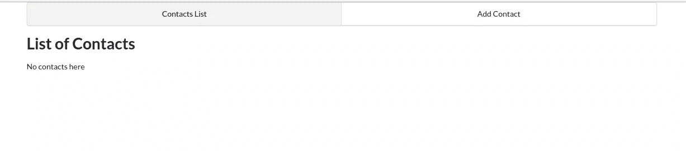
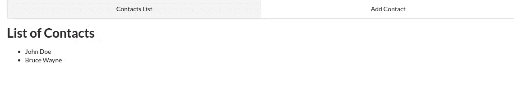
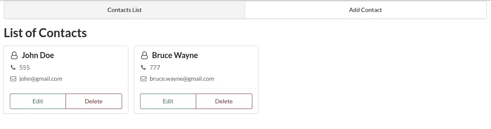
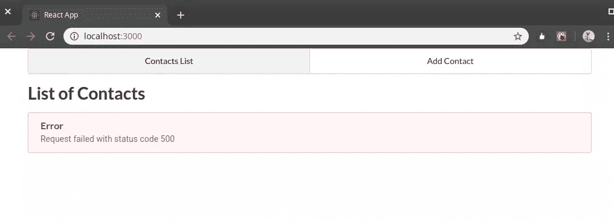
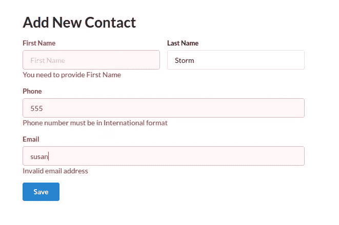
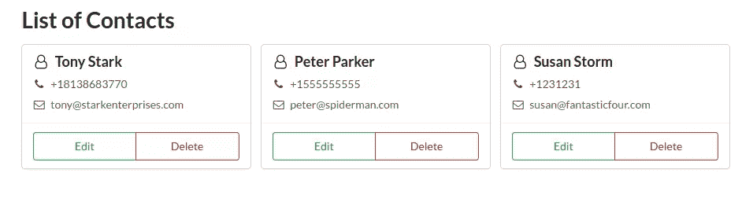
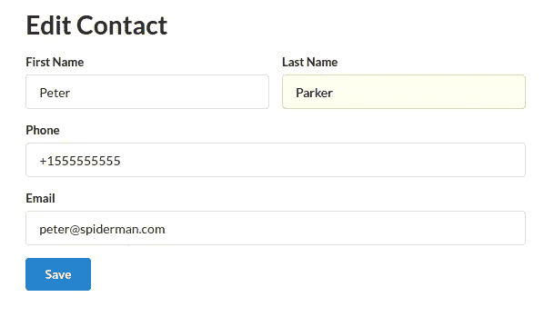
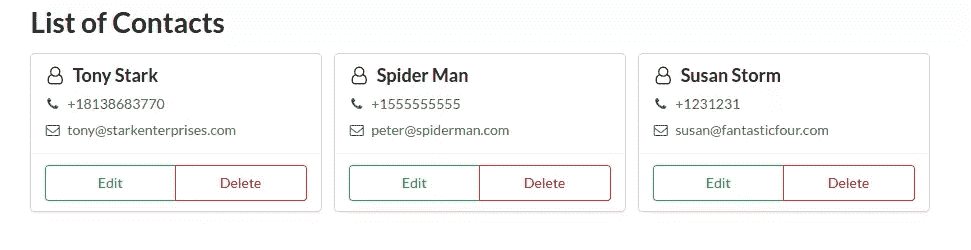

# 使用 React 和 FeathersJS 构建 Node.js CRUD 应用程序

> 原文：<https://www.sitepoint.com/crud-app-node-react-feathersjs/>

构建一个现代项目需要将逻辑分成前端和后端代码。此举背后的原因是为了促进代码的可重用性。例如，我们可能需要构建一个访问后端 API 的本地移动应用程序。或者，我们可能正在开发一个模块，它将成为一个大型模块化平台的一部分。


构建服务器端 API 的流行方式是将 Node.js 与 Express 或 Restify 之类的库一起使用。这些库使得创建 RESTful 路径变得容易。这些库的问题是，我们会发现自己写了一大堆**重复代码**。我们还需要为授权和其他中间件逻辑编写代码。

为了摆脱这种困境，我们可以使用像 [Feathers](http://feathersjs.com/) 这样的框架来帮助我们只用几个命令就生成一个 API。

羽毛的神奇之处在于它的简单。整个框架是模块化的，我们只需要安装我们需要的功能。Feathers 本身是一个建立在 Express 基础上的薄包装器，他们在其中添加了新功能——[服务](https://docs.feathersjs.com/api/services.html)和[挂钩](https://docs.feathersjs.com/api/hooks.html)。Feathers 还允许我们毫不费力地通过 WebSockets 发送和接收数据。

## 先决条件

为了跟随本教程，您需要在您的机器上安装以下组件:

*   [Node.js](https://nodejs.org/en/) v12+和 npm 的最新版本。如果你需要帮助设置，请查看[这个教程](https://www.sitepoint.com/quick-tip-multiple-versions-node-nvm/)。
*   [MongoDB](https://www.mongodb.com/) v4.2+。如果你需要帮助设置，请查看[这个教程](https://www.sitepoint.com/an-introduction-to-mongodb/)。
*   [纱线](https://yarnpkg.com/en/)包装管理器——使用`npm i -g yarn`安装。

如果您熟悉以下主题，也会有所帮助:

*   [如何编写现代 JavaScript](https://www.sitepoint.com/premium/books/javascript-novice-to-ninja-2nd-edition?utm_source=blog&utm_medium=articles)
*   [现代 JavaScript 中的流量控制](https://www.sitepoint.com/flow-control-callbacks-promises-async-await/)(例如`async ... await`)
*   [React 的基础知识](https://www.sitepoint.com/getting-started-react-beginners-guide/)
*   [REST API 的基础知识](https://www.sitepoint.com/developers-rest-api/)

另外，请注意，您可以在 GitHub 上找到[完整的项目代码。](https://github.com/sitepoint-editors/react-crud-app)

## 搭建应用程序

我们将使用 Node.js、React、Feathers 和 MongoDB 构建一个 CRUD 联系人管理器应用程序。

在本教程中，我将向您展示如何自底向上构建应用程序。我们将使用流行的 [Create React App](https://www.sitepoint.com/create-react-app/) 工具启动我们的项目。

您可以像这样安装它:

```
npm install -g create-react-app 
```

然后创建一个新项目:

```
# scaffold a new react project
create-react-app react-contact-manager
cd react-contact-manager

# delete unnecessary files
rm src/logo.svg src/App.css src/serviceWorker.js 
```

使用你喜欢的代码编辑器，删除`src/index.css`中的所有内容。然后打开`src/App.js`，重写代码如下:

```
import React from 'react';

const App = () => {
  return (
    <div>  <h1>Contact Manager</h1>  </div>
  );
};

export default App; 
```

并且在`src/index.js`中，像这样修改代码:

```
import React from 'react';
import ReactDOM from 'react-dom';
import './index.css';
import App from './App';

ReactDOM.render(
  <React.StrictMode>  <App />  </React.StrictMode>,
  document.getElementById('root')
); 
```

从`react-contact-manager`目录运行`yarn start`来启动项目。你的浏览器应该会自动打开 [http://localhost:3000](http://localhost:3000/) ，你应该会看到标题“联系人管理器”。快速检查控制台选项卡，确保项目运行干净，没有警告或错误，如果一切运行顺利，使用`Ctrl` + `C`停止服务器。

## 用 Feathers 构建 API 服务器

让我们继续使用`feathers-cli`工具为 CRUD 项目生成后端 API:

```
# Install Feathers command-line tool
npm install @feathersjs/cli -g

# Create directory for the back-end code
# Run this command in the `react-contact-manager` directory
mkdir backend
cd backend

# Generate a feathers back-end API server
feathers generate app

? Do you want to use JavaScript or TypeScript? JavaScript
? Project name backend
? Description Contacts API server
? What folder should the source files live in? src
? Which package manager are you using (has to be installed globally)? Yarn
? What type of API are you making? REST, Realtime via Socket.io
? Which testing framework do you prefer? Mocha + assert
? This app uses authentication No
? Which coding style do you want to use? ESLint

# Ensure Mongodb is running
sudo service mongod start
sudo service mongod status

● mongod.service - MongoDB Database Server
   Loaded: loaded (/lib/systemd/system/mongod.service; disabled; vendor preset: enabled)
   Active: active (running) since Fri 2020-09-18 14:42:12 CEST; 4s ago
     Docs: https://docs.mongodb.org/manual
 Main PID: 31043 (mongod)
   CGroup: /system.slice/mongod.service
           └─31043 /usr/bin/mongod --config /etc/mongod.conf

# Generate RESTful routes for Contact Model
feathers generate service

? What kind of service is it? Mongoose
? What is the name of the service? contacts
? Which path should the service be registered on? /contacts
? What is the database connection string? mongodb://localhost:27017/contactsdb

# Install email and unique field validation
yarn add mongoose-type-email 
```

我们来开`backend/config/default.json`。这是我们可以配置 MongoDB 连接参数和其他设置的地方。将缺省分页值更改为 50，因为本教程不涉及前端分页:

```
{
  "host": "localhost",
  "port": 3030,
  "public": "../public/",
  "paginate": {
    "default": 50,
    "max": 50
  },
  "mongodb": "mongodb://localhost:27017/contactsdb"
} 
```

打开`backend/src/models/contact.model.js`并更新代码，如下所示:

```
require('mongoose-type-email');

module.exports = function (app) {
  const modelName = 'contacts';
  const mongooseClient = app.get('mongooseClient');
  const { Schema } = mongooseClient;
  const schema = new Schema({
    name : {
      first: {
        type: String,
        required: [true, 'First Name is required']
      },
      last: {
        type: String,
        required: false
      }
    },
    email : {
      type: mongooseClient.SchemaTypes.Email,
      required: [true, 'Email is required']
    },
    phone : {
      type: String,
      required: [true, 'Phone is required'],
      validate: {
        validator: function(v) {
          return /^\+(?:[0-9] ?){6,14}[0-9]$/.test(v);
        },
        message: '{VALUE} is not a valid international phone number!'
      }
    }
  }, {
    timestamps: true
  });

  // This is necessary to avoid model compilation errors in watch mode
  // see https://mongoosejs.com/docs/api/connection.html#connection_Connection-deleteModel
  if (mongooseClient.modelNames().includes(modelName)) {
    mongooseClient.deleteModel(modelName);
  }

  return mongooseClient.model(modelName, schema);
}; 
```

Mongoose 引入了一个名为[时间戳](https://mongoosejs.com/docs/guide.html#timestamps)的新特性，它为您插入了两个新字段— `createdAt`和`updatedAt`。每当我们创建或更新记录时，这两个字段都会自动填充。我们还安装了[mongose-type-email](https://www.npmjs.com/package/mongoose-type-email)插件来在服务器上执行邮件验证。

现在，打开`backend/src/mongoose.js`并更改该行:

```
{ useCreateIndex: true, useNewUrlParser: true } 
```

收件人:

```
{
  useCreateIndex: true,
  useNewUrlParser: true,
  useUnifiedTopology: true,
  useFindAndModify: false,
} 
```

这将粉碎几个恼人的弃用警告。

打开一个新的终端，在`backend`目录下执行`yarn test`。您应该已经成功运行了所有的测试。然后，继续执行`yarn start`来启动后端服务器。一旦服务器初始化，它应该将`'Feathers application started on localhost:3030'`打印到控制台。

启动您的浏览器并访问 URL[http://localhost:3030/contacts](http://localhost:3030/contacts)。您应该会收到以下 JSON 响应:

```
{"total":0,"limit":50,"skip":0,"data":[]} 
```

## 用跳房子测试 api

现在让我们使用 [Hoppscotch](https://hoppscotch.io/) (以前的 Postwoman)来确认我们所有的端点都工作正常。

首先，让我们创建一个联系人。这个链接将打开 Hoppscotch，所有的东西都设置为[发送一个 POST 请求到`/contacts`端点](https://hoppscotch.io/?method=POST&url=http%3A%2F%2Flocalhost%3A3030&path=%2Fcontacts&contentType=application%2Fjson&rawParams=%7B%0A%20%20%22name%22%3A%20%7B%0A%20%20%20%20%22first%22%3A%20%22Tony%22,%0A%20%20%20%20%22last%22%3A%20%22Stark%22%0A%20%20%7D,%0A%20%20%22phone%22%3A%20%22%2B18138683770%22,%0A%20%20%22email%22%3A%20%22tony%40starkenterprises.com%22%0A%7D)。确保*原始输入*设置为上的*，然后按绿色*发送*按钮创建一个新触点。回应应该是这样的:*

```
{
  "_id": "5f64832c20745f4f282b39f9",
  "name": {
    "first": "Tony",
    "last": "Stark"
  },
  "phone": "+18138683770",
  "email": "tony@starkenterprises.com",
  "createdAt": "2020-09-18T09:51:40.021Z",
  "updatedAt": "2020-09-18T09:51:40.021Z",
  "__v": 0
} 
```

现在，让我们检索新创建的联系人。该链接将打开 Hoppscotch，准备好[向`/contacts`端点](https://hoppscotch.io/?method=GET&url=http://localhost:3030&path=/contacts)发送 GET 请求。当您按下*发送*按钮时，您应该会得到这样的响应:

```
{
  "total": 1,
  "limit": 50,
  "skip": 0,
  "data": [
    {
      "_id": "5f64832c20745f4f282b39f9",
      "name": {
        "first": "Tony",
        "last": "Stark"
      },
      "phone": "+18138683770",
      "email": "tony@starkenterprises.com",
      "createdAt": "2020-09-18T09:51:40.021Z",
      "updatedAt": "2020-09-18T09:51:40.021Z",
      "__v": 0
    }
  ]
} 
```

我们可以通过向`http://localhost:3030/contacts/<_id>`发送 GET 请求来显示 Hoppscotch 中的单个联系人。`_id`字段总是惟一的，所以您需要将它从上一步收到的响应中复制出来。这是[上面例子](https://hoppscotch.io/?method=GET&url=http://localhost:3030&path=/contacts/5f64832c20745f4f282b39f9)的链接。按下*发送*将显示联系人。

我们可以通过向`http://localhost:3030/contacts/<_id>`发送 PUT 请求来更新联系人，并将更新后的数据作为 JSON 传递给它。这是上例的[链接。按下*发送*将更新联系人。](https://hoppscotch.io/?method=PUT&url=http://localhost:3030&path=/contacts/5f64832c20745f4f282b39f9&contentType=application/json&rawParams=%7B%0A%20%20%22name%22:%20%7B%0A%20%20%20%20%22first%22:%20%22Tony%22,%0A%20%20%20%20%22last%22:%20%22Stark%22%0A%20%20%7D,%0A%20%20%22phone%22:%20%22%2B18138683770%22,%0A%20%20%22email%22:%20%22ts@starkenterprises.com%22%0A%7D)

最后，我们可以通过向同一个地址发送`DELETE`请求来删除我们的联系人——即`http://localhost:3030/contacts/<_id>`。这是[上面例子](https://hoppscotch.io/?method=DELETE&url=http://localhost:3030&path=/contacts/5f64832c20745f4f282b39f9)的链接。按下*发送*将删除联系人。

Hoppscotch 是一个非常通用的工具，我鼓励您在进入下一步之前，使用它来满足您的 API 正在按预期工作。

## 构建用户界面

最初，我想使用[语义 UI](https://semantic-ui.com/) 进行造型，但是在撰写本文时，它已经两年多没有更新了。幸运的是，开源社区通过创建一个流行的分支 [Fomantic-UI](https://github.com/fomantic/Fomantic-UI) ，成功地让这个项目存活了下来，这就是我们将要使用的。当语义 UI 的积极开发重新开始时，有计划将两者合并。

我们还将使用[语义 UI React](https://react.semantic-ui.com) 来快速构建我们的用户界面，而不必定义大量的类名。幸运的是，这个项目也一直保持最新。

最后，我们将使用 [React 路由器](https://reacttraining.com/react-router/)来处理路由。

这样一来，在`react-contact-manager`目录中打开一个新的终端，并输入以下命令:

```
# Install Fomantic UI CSS and Semantic UI React
yarn add fomantic-ui-css semantic-ui-react

# Install React Router
yarn add react-router-dom 
```

通过将以下目录和文件添加到`src`目录来更新项目结构:

```
src
├── App.js
├── App.test.js
├── components #(new)
│   ├── contact-form.js #(new)
│   └── contact-list.js #(new)
├── index.css
├── index.js
├── pages #(new)
│   ├── contact-form-page.js #(new)
│   └── contact-list-page.js #(new)
├── serviceWorker.js
└── setupTests.js 
```

从终端:

```
cd src
mkdir pages components
touch components/contact-form.js components/contact-list.js
touch pages/contact-form-page.js pages/contact-list-page.js 
```

让我们用一些占位符代码快速填充 JavaScript 文件。

`ContactList`组件将是一个功能性组件(一个返回 React 元素的普通 JavaScript 函数):

```
// src/components/contact-list.js

import React from 'react';

const ContactList = () => {
  return (
    <div>  <p>No contacts here</p>  </div>
  );
}

export default ContactList; 
```

对于顶级容器，我使用页面。让我们为`ContactListPage`组件提供一些代码:

```
// src/pages/contact-list-page.js

import React from 'react';
import ContactList from '../components/contact-list';

const ContactListPage = () => {
  return (
    <div>  <h1>List of Contacts</h1>  <ContactList />  </div>
  );
};

export default ContactListPage; 
```

组件需要是智能的，因为它需要管理自己的状态，特别是表单字段。我们将使用 React 挂钩来实现这一点:

```
// src/components/contact-form.js

import React from 'react';

const ContactForm = () => {
  return (
    <div>
      <p>Form under construction</p>
    </div>
  )
}

export default ContactForm; 
```

用以下代码填充`ContactFormPage`组件:

```
// src/pages/contact-form-page.js

import React from 'react';
import ContactForm from '../components/contact-form';

const ContactFormPage = () => {
  return (
    <div>  <ContactForm />  </div>
  );
};

export default ContactFormPage; 
```

现在让我们创建导航菜单，并为我们的应用程序定义路线。`App.js`通常被称为单页应用程序的“布局模板”:

```
// src/App.js

import React from 'react';
import { NavLink, Route } from 'react-router-dom';
import { Container } from 'semantic-ui-react';
import ContactListPage from './pages/contact-list-page';
import ContactFormPage from './pages/contact-form-page';

const App = () => {
  return (
    <Container>  <div className="ui two item menu">  <NavLink className="item" activeClassName="active" exact to="/"> Contacts List </NavLink>  <NavLink
          className="item"
          activeClassName="active"
          exact
          to="/contacts/new"
        > Add Contact </NavLink>  </div>  <Route exact path="/" component={ContactListPage} />  <Route path="/contacts/new" component={ContactFormPage} />  <Route path="/contacts/edit/:_id" component={ContactFormPage} />  </Container>
  );
};

export default App; 
```

上面的代码使用了 React 路由器。如果你想复习一下，请[查阅我们的教程](https://www.sitepoint.com/react-router-complete-guide/)。

最后，用这段代码更新`src/index.js`文件，其中我们导入 Formantic-UI 进行样式化，导入`BrowserRouter`组件使用 HTML5 历史 API，这将使我们的应用程序与 URL 保持同步:

```
// src/index.js

import React from 'react';
import ReactDOM from 'react-dom';
import { BrowserRouter } from 'react-router-dom';
import App from './App';
import 'fomantic-ui-css/semantic.min.css';
import './index.css';

ReactDOM.render(
  <BrowserRouter>  <App />  </BrowserRouter>,
  document.getElementById('root')
); 
```

确保`create-react-app`服务器正在运行(如果没有，使用`yarn start`启动它)，然后访问 [http://localhost:3000](http://localhost:3000) 。您应该会看到与下面的截图类似的视图:



## 用 React 钩子和上下文 API 管理状态

以前，在 React 应用程序中管理状态时，可能会用到 Redux。然而，从 React v16.8.0 开始，可以使用 [React 钩子和上下文 API](https://www.sitepoint.com/replace-redux-react-hooks-context-api/) 来管理 React 应用程序中的全局状态。

使用这种新技术，您将编写更少、更易于维护的代码。我们仍将使用 Redux 模式，但只是使用 [React 钩子](https://reactjs.org/docs/hooks-intro.html)和[上下文 API](https://reactjs.org/docs/context.html) 。

接下来，让我们看看如何连接上下文 API。

## 定义上下文存储

这将像我们的商店处理联系人的全球状态。我们的状态将由多个变量组成，包括一个`contacts`数组、一个`loading`状态和一个用于存储后端 API 服务器生成的错误消息的`message`对象。

在`src`目录下，创建一个包含`contact-context.js`文件的`context`文件夹:

```
cd src
mkdir context
touch context/contact-context.js 
```

并插入以下代码:

```
import React, { useReducer, createContext } from 'react';

export const ContactContext = createContext();

const initialState = {
  contacts: [],
  contact: {}, // selected or new
  message: {}, // { type: 'success|fail', title:'Info|Error' content:'lorem ipsum'}
};

function reducer(state, action) {
  switch (action.type) {
    case 'FETCH_CONTACTS': {
      return {
        ...state,
        contacts: action.payload,
      };
    }
    default:
      throw new Error();
  }
}

export const ContactContextProvider = props => {
  const [state, dispatch] = useReducer(reducer, initialState);
  const { children } = props;

  return (
    <ContactContext.Provider value={[state, dispatch]}>  {children}  </ContactContext.Provider>
  );
}; 
```

正如你所看到的，我们使用了 [useReducer 钩子](https://reactjs.org/docs/hooks-reference.html#usereducer)，它是 [useState](https://reactjs.org/docs/hooks-reference.html#usestate) 的替代。`useReducer`适合处理涉及多个子值的复杂状态逻辑。我们还使用上下文 API 来允许与其他 React 组件共享数据。

## 将上下文提供者注入应用程序根

我们需要用`Context Provider`封装我们的根组件。更新`src/index.js`如下:

```
...
import { ContactContextProvider } from './context/contact-context';

ReactDOM.render(
  <ContactContextProvider>  <BrowserRouter>  <App />  </BrowserRouter>  </ContactContextProvider>,
  document.getElementById('root')
); 
```

现在所有的子组件都可以通过使用`useContext`钩子来访问全局状态。

## 显示联系人列表

在这一步中，我们将创建一些静态数据进行测试。我们的初始状态有一个空的触点数组。我们将使用`dispatch`方法临时填充`contacts`数组。打开`pages/contact-list-page.js`，更新如下:

```
import React, { useContext, useEffect } from 'react';
import ContactList from '../components/contact-list';
import { ContactContext } from '../context/contact-context';

const data = [
  {
    _id: '1',
    name: {
      first: 'John',
      last: 'Doe',
    },
    phone: '555',
    email: 'john@gmail.com',
  },
  {
    _id: '2',
    name: {
      first: 'Bruce',
      last: 'Wayne',
    },
    phone: '777',
    email: 'bruce.wayne@gmail.com',
  },
];

const ContactListPage = () => {
  const [state, dispatch] = useContext(ContactContext);

  useEffect(() => {
    dispatch({
      type: 'FETCH_CONTACTS',
      payload: data,
    });
  }, [dispatch]);

  return (
    <div>  <h1>List of Contacts</h1>  <ContactList contacts={state.contacts} />  </div>
  );
};

export default ContactListPage; 
```

接下来，我们将使用一个简单的循环来显示`components/contact-list.js`中的联系人。更新如下:

```
import React from 'react';

const ContactList = ({ contacts }) => {
  const list = () => {
    return contacts.map(contact => {
      return (
        <li key={contact._id}>  {contact.name.first}  {contact.name.last}  </li>
      );
    });
  };

  return (
    <div>  <ul>{list()}</ul>  </div>
  );
}

export default ContactList; 
```

现在，如果你回到浏览器，你应该有这样的东西:



让我们通过使用语义 UI 样式使列表 UI 看起来更有吸引力。在`src/components`文件夹中，创建一个新文件`contact-card.js`:

```
touch src/components/contact-card.js 
```

然后添加以下代码:

```
// src/components/contact-card.js

import React from 'react';
import { Card, Button, Icon } from 'semantic-ui-react';

const ContactCard = ({ contact }) => {
  return (
    <Card>  <Card.Content>  <Card.Header>  <Icon name="user outline" />  {contact.name.first}  {contact.name.last}  </Card.Header>  <Card.Description>  <p>  <Icon name="phone" />  {contact.phone}  </p>  <p>  <Icon name="mail outline" />  {contact.email}  </p>  </Card.Description>  </Card.Content>  <Card.Content extra>  <div className="ui two buttons">  <Button basic color="green"> Edit </Button>  <Button basic color="red"> Delete </Button>  </div>  </Card.Content>  </Card>
  );
}

export default ContactCard; 
```

更新`ContactList`组件以使用新的`ContactCard`组件:

```
// src/components/contact-list.js

import React from 'react';
import { Card } from 'semantic-ui-react';
import ContactCard from './contact-card';

const ContactList = ({ contacts }) => {
  const cards = () => {
    return contacts.map(contact => {
      return <ContactCard key={contact._id} contact={contact} />;
    });
  };

  return <Card.Group>{cards()}</Card.Group>;
}

export default ContactList; 
```

列表页面现在应该如下所示:



## 从 Feathers API 服务器异步获取数据

既然我们知道全局状态正被其他 React 组件正确地共享，我们就可以向数据库发出一个真正的获取请求，并使用该数据来填充我们的联系人列表页面。有几种方法可以做到这一点，但是我将向您展示的方法非常简单。

首先，确保 Mongo 数据库和后端服务器都运行在不同的终端上。你可以打开网址[http://localhost:3030/contacts](http://localhost:3030/contacts)确认一下。如果没有返回任何结果，返回页面，使用 Hoppscotch 添加一个联系人。

接下来，安装 axios 库。我们将用它来提出我们的要求:

```
yarn add axios 
```

然后，更新`src/contact-list-page.js`来执行数据获取请求，并使用该结果来更新全局状态。您需要删除静态数据数组列表，因为我们不再需要它了。按如下方式更新代码:

```
// src/contact-list-page.js

import React, { useContext, useEffect } from 'react';
import axios from 'axios';
import ContactList from '../components/contact-list';
import { ContactContext } from '../context/contact-context';

const ContactListPage = () => {
  const [state, dispatch] = useContext(ContactContext);

  useEffect(() => {
    const fetchData = async () => {
      const response = await axios.get('http://localhost:3030/contacts');
      dispatch({
        type: 'FETCH_CONTACTS',
        payload: response.data.data || response.data, // in case pagination is disabled
      });
    };
    fetchData();
  }, [dispatch]);

  return (
    <div>  <h1>List of Contacts</h1>  <ContactList contacts={state.contacts} />  </div>
  );
}

export default ContactListPage; 
```

保存后，返回浏览器。联系人列表页面现在应该显示来自数据库的数据。

## 错误处理

让我们假设您忘记了启动后端服务器和 Mongo 数据库服务。如果您启动`create-react-app`服务器，主页将简单地显示没有联系人。除非您弹出打开控制台选项卡，否则它不会指示发生了错误。

让我们通过首先创建一个显示错误消息的组件来实现一些错误处理。我们还将实现一个助手函数，用于从捕获的错误中提取信息。这个助手函数将能够区分网络错误和后端服务器发送的错误消息，例如，验证或 404 错误消息。

我们将使用[语义 UI React 的消息](https://react.semantic-ui.com/collections/message/)组件来构建我们的代码。在`src/components`文件夹中创建一个`flash-message.js`文件:

```
touch src/components/flash-message.js 
```

然后，插入以下代码:

```
// src/components/flash-message.js

import React from 'react';
import { Message } from 'semantic-ui-react';

export const FlashMessage = ({ message }) => {
  return (
    <Message
      positive={message.type === 'success'}
      negative={message.type === 'fail'}
      header={message.title}
      content={message.content}
    />
  );
}

export const flashErrorMessage = (dispatch, error) => {
  const err = error.response ? error.response.data : error; // check if server or network error
  dispatch({
    type: 'FLASH_MESSAGE',
    payload: {
      type: 'fail',
      title: err.name,
      content: err.message,
    },
  });
} 
```

接下来，将这个缩减器添加到`src/context/contact-context.js`中，用于处理 flash 消息:

```
function reducer(state, action) {
  switch  (action.type)  {
    ...
    case 'FLASH_MESSAGE': {
      return {
        ...state,
        message: action.payload,
      };
    }
    ...
  }
} 
```

最后更新`pages/contact-list-page.js`。我们将实现一个`try … catch`机制来捕捉和调度错误。我们还将呈现`FlashMessage`组件，该组件只有在`FLASH_MESSAGE`被分派时才会显示:

```
// src/pages/contact-list-page.js

...
import { FlashMessage, flashErrorMessage } from '../components/flash-message';

const ContactListPage = () => {
  const [state, dispatch] = useContext(ContactContext);

  useEffect(() => {
    const fetchData = async () => {
      try {
        const response = await axios.get('http://localhost:3030/contacts');
        dispatch({
          type: 'FETCH_CONTACTS',
          payload: response.data.data || response.data, // in case pagination is disabled
        });
      } catch (error) {
        flashErrorMessage(dispatch, error);
      }
    };
    fetchData();
  }, [dispatch]);

  return (
    <div>  <h1>List of Contacts</h1>  {state.message.content && <FlashMessage message={state.message} />}  <ContactList contacts={state.contacts} />  </div>
  );
}

export default ContactListPage; 
```

下面是后端服务器正在运行但 Mongo 数据库服务已经停止时出现的错误消息的屏幕截图:



请注意，为了从上述错误中恢复，您必须首先启动 Mongo 服务，然后依次启动 Feathers 后端服务器。

## 使用 React 钩子表单处理创建请求

接下来，让我们看看如何添加新的联系人，为此我们需要表单。起初，构建表单看起来很容易。但是当我们开始考虑客户端验证和控制何时显示错误时，事情就变得棘手了。此外，后端服务器会进行自己的验证，我们还需要在表单上显示这些错误。

我们不会自己实现所有的表单功能，我们会借助表单库——[React Hook Form](https://react-hook-form.com/)——在我看来，这是创建 React 表单时最容易使用的库。我们还将使用 [classnames](https://www.npmjs.com/package/classnames) 包来突出显示有验证错误的表单字段。

首先，用`Ctrl` + `C`停止`create-react-app`服务器，并安装以下软件包:

```
yarn add react-hook-form classnames 
```

软件包安装完成后，重新启动服务器。

将这个 CSS 类添加到`src/index.css`文件中，以设置表单错误的样式:

```
.error {
  color: #9f3a38;
} 
```

接下来，打开`src/components/contact-form.js`构建表单用户界面。将现有代码替换如下:

```
// src/components/contact-form.js

import React, { useContext } from 'react';
import { Form, Grid, Button } from 'semantic-ui-react';
import { useForm } from 'react-hook-form';
import classnames from 'classnames';
import { ContactContext } from '../context/contact-context';

const ContactForm = () => {
  const [state] = useContext(ContactContext);
  const { register, errors, handleSubmit } = useForm();
  const onSubmit = data => console.log(data);

  return (
    <Grid centered columns={2}>  <Grid.Column>  <h1 style={{ marginTop: '1em' }}>Add New Contact</h1>  <Form onSubmit={handleSubmit(onSubmit)} loading={state.loading}>  <Form.Group widths="equal">  <Form.Field className={classnames({ error: errors.name })}>  <label htmlFor="name.first"> First Name <input
                  id="name.first"
                  name="name.first"
                  type="text"
                  placeholder="First Name"
                  ref={register({ required: true, minLength: 2 })}
                />  </label>  <span className="error">  {errors.name &&
                  errors.name.first.type === 'required' &&
                  'You need to provide First Name'}  </span>  <span className="error">  {errors.name &&
                  errors.name.first.type === 'minLength' &&
                  'Must be 2 or more characters'}  </span>  </Form.Field>  <Form.Field>  <label htmlFor="name.last"> Last Name <input
                  id="name.last"
                  name="name.last"
                  type="text"
                  placeholder="Last Name"
                  ref={register}
                />  </label>  </Form.Field>  </Form.Group>  <Form.Field className={classnames({ error: errors.phone })}>  <label htmlFor="phone"> Phone <input
                id="phone"
                name="phone"
                type="text"
                placeholder="Phone"
                ref={register({
                  required: true,
                  pattern: /^\+(?:[0-9] ?){6,14}[0-9]$/,
                })}
              />  </label>  <span className="error">  {errors.phone &&
                errors.phone.type === 'required' &&
                'You need to provide a Phone number'}  </span>  <span className="error">  {errors.phone &&
                errors.phone.type === 'pattern' &&
                'Phone number must be in International format'}  </span>  </Form.Field>  <Form.Field className={classnames({ error: errors.email })}>  <label htmlFor="email"> Email <input
                id="email"
                name="email"
                type="text"
                placeholder="Email"
                ref={register({
                  required: true,
                  pattern: /^\w+([.-]?\w+)*@\w+([.-]?\w+)*(\.\w{2,3})+$/,
                })}
              />  </label>  <span className="error">  {errors.email &&
                errors.email.type === 'required' &&
                'You need to provide an Email address'}  </span>  <span className="error">  {errors.email &&
                errors.email.type === 'pattern' &&
                'Invalid email address'}  </span>  </Form.Field>  <Button primary type="submit"> Save </Button>  </Form>  </Grid.Column>  </Grid>
  );
}

export default ContactForm; 
```

花时间检查代码；里面发生了很多事。参见[入门指南](https://react-hook-form.com/get-started)了解 React 钩子形式如何工作。另外，看看 [Semantic UI React 的表单文档](https://react.semantic-ui.com/collections/form/)，看看我们如何用它来构建表单。请注意，在我们的`onSubmit`处理程序中，我们将表单数据输出到控制台。

现在让我们回到浏览器，尝试有意识地保存一个不完整的表单。使用我们之前设置的导航菜单，点击*添加联系人*按钮，然后点击*保存*按钮，无需填写表格。这将触发以下验证错误消息:



你现在可以开始填写表格了。当您键入时，您会注意到各种验证消息会发生变化或消失。一旦一切都有效，你可以再次按下*保存*。如果您检查您的控制台输出，您应该得到一个类似于以下结构的 JSON 对象:

```
{
  "name":{
    "first": "Jason",
    "last": "Bourne"
  },
  "phone": "+1 555 555",
  "email": "jason@gmail.com"
} 
```

现在让我们定义将新联系人保存到数据库的必要操作。首先，让我们为`CREATE_CONTACT`指定一个 reducer 处理程序。更新`src/context/contact-context.js`如下:

```
function reducer(state, action) {
  switch  (action.type)  {
    ...
    case 'CREATE_CONTACT': {
      return {
        ...state,
        contacts: [...state.contacts, action.payload],
        message: {
          type: 'success',
          title: 'Success',
          content: 'New Contact created!',
        },
      };
    }
    ...
  }
} 
```

接下来，打开`src/components/contact-form.js`，更新代码如下:

```
import React, { useContext, useState } from 'react';
import { Form, Grid, Button } from 'semantic-ui-react';
import { useForm } from 'react-hook-form';
import classnames from 'classnames';
import axios from 'axios';
import { Redirect } from 'react-router-dom';
import { ContactContext } from '../context/contact-context';
import { flashErrorMessage } from './flash-message';

const ContactForm = () => {
  const [state, dispatch] = useContext(ContactContext);
  const { register, errors, handleSubmit } = useForm();
  const [redirect, setRedirect] = useState(false);

  const createContact = async data => {
    try {
      const response = await axios.post('http://localhost:3030/contacts', data);
      dispatch({
        type: 'CREATE_CONTACT',
        payload: response.data,
      });
      setRedirect(true);
    } catch (error) {
      flashErrorMessage(dispatch, error);
    }
  };

  const onSubmit = async data => {
    await createContact(data);
  };

  if (redirect) {
    return <Redirect to="/" />;
  }

  return (
    //... form code
  )
}

export default ContactForm; 
```

我们创建了一个单独的`createContact`函数来处理新联系人的创建。稍后，我们将实现另一个更新现有联系人的功能。如果出现错误，无论是网络错误还是服务器错误，都会显示一条 flash 消息，向用户指出哪里出错了。否则，如果 POST 请求成功，将执行到`/`的重定向。成功消息将显示在主页上。

现在，完成表格的填写。点击*保存*后，我们应该会被定向到列表页面。在下面的例子中，我成功地添加了两个联系人。



## 编辑现有联系人

现在我们可以添加新的联系人，让我们看看如何更新现有的联系人。让我们从定义几个获取单个联系人和更新联系人的 reducers 开始。

更新`src/context/contact-context.js`如下:

```
function reducer(state, action) {
  switch  (action.type)  {
    ...
    case 'FETCH_CONTACT': {
      return {
        ...state,
        contact: action.payload,
      };
    }
    case 'UPDATE_CONTACT': {
      const contact = action.payload;
      return {
        ...state,
        contacts: state.contacts.map(item =>
          item._id === contact._id ? contact : item,
        ),
        message: {
          type: 'success',
          title: 'Update Successful',
          content: `Contact "${contact.email}" has been updated!`,
        },
      };
    }
    ...
  }
} 
```

接下来，让我们将`ContactCard`组件中的*编辑*按钮转换成一个链接，该链接将用户引导到表单:

```
// src/components/contact-card.js

...
import { Link } from 'react-router-dom';

const ContactCard = ({ contact }) => {
  return (
    <Card> ... <Card.Content extra>  <div className="ui two buttons">  <Button
            basic
            color="green"
            as={Link}
            to={`/contacts/edit/${contact._id}`}
          > Edit </Button>  <Button basic color="red"> Delete </Button>  </div>  </Card.Content>  </Card>
  );
}

export default ContactCard; 
```

现在，当用户点击*编辑*按钮时，网址会变成`http://localhost:3030/contacts/edit/{id}`。目前，`ContactFormPage`组件还不能处理这样的 URL。让我们用下面的代码替换`src/pages/contact-form-page.js`文件中的现有代码:

```
import React, { useContext, useEffect, useState } from 'react';
import axios from 'axios';
import ContactForm from '../components/contact-form';
import { flashErrorMessage } from '../components/flash-message';
import { ContactContext } from '../context/contact-context';

const ContactFormPage = ({ match }) => {
  const [state, dispatch] = useContext(ContactContext);
  const [loading, setLoading] = useState(true);

  useEffect(() => {
    const { _id } = match.params; // Grab URL _id

    if (_id) {
      const fetchData = async () => {
        try {
          const response = await axios.get(
            `http://localhost:3030/contacts/${_id}`,
          );
          dispatch({
            type: 'FETCH_CONTACT',
            payload: response.data,
          });
          setLoading(false);
        } catch (error) {
          flashErrorMessage(dispatch, error);
        }
      };
      fetchData();
    } else {
      setLoading(false);
    }
  }, [match.params, dispatch]);

  if (loading) {
    return <p>Please wait...</p>;
  }

  return (
    <div>  <ContactForm contact={state.contact} />  </div>
  );
}

export default ContactFormPage; 
```

当页面加载时，它检查 URL 中是否存在一个`_id`。如果没有，它将简单地加载一个空白表单，用于创建一个新的联系人。否则，它将执行一个获取查询，并通过`dispatch`函数填充`state.contact`。

我们还指定了一个默认设置为`true`的本地`loading`状态。这是为了延迟`ContactForm`组件的渲染，直到`state.contact`被填充。要理解为什么延迟是必要的，打开`src/components/contact-form.js`并更新代码如下:

```
...
const ContactForm = ({contact}) => {
  ...
  const { register, errors, handleSubmit } = useForm({
    defaultValues: contact,
  });
  ...
  const updateContact = async data => {
    try {
      const response = await axios.patch(
        `http://localhost:3030/contacts/${contact._id}`,
        data,
      );
      dispatch({
        type: 'UPDATE_CONTACT',
        payload: response.data,
      });
      setRedirect(true);
    } catch (error) {
      flashErrorMessage(dispatch, error);
    }
  };

  const onSubmit = async data => {
    if (contact._id) {
      await updateContact(data);
    } else {
      await createContact(data);
    }
  };
  ...
  return (
    //... Display Form Mode
    <h1 style={{ marginTop: "1em" }}>  {contact._id ? "Edit Contact" : "Add New Contact"}  </h1>
    ....
  );
}

export default ContactForm; 
```

正如你在上面看到的，我们引入了一个更新联系人的新功能。它与`createContact`几乎相同，除了 URL 不同，我们使用的是`PATCH` HTTP 请求。我们还检查了`_id`的存在，以确定表单的提交动作应该是更新还是创建。

回到`loading`状态的目的，你可能知道，如果通过 props 链接到组件的数据发生变化，React 通常会重新呈现。不幸的是，将现有的`contact`传递给 React 钩子子程只能在[初始化](https://react-hook-form.com/api/#useForm)期间完成。这意味着，当表单第一次加载时，它是空的，因为`fetch`函数是异步的。当它解析并填充`state.contact`字段时，表单将保持为空，因为它们之间没有链接。

解决这个问题的一个方法是编写一个函数，使用 [`setValue`函数](https://react-hook-form.com/api/#setValue)以编程方式设置每个字段的值。我们实现的另一个方法是简单地延迟`ContactForm`组件的渲染，直到`state.contact`被填充。

一旦列表页面完成刷新，选择任意联系人并点击*编辑*按钮。



完成更改并点击保存。



现在，您的应用程序应该允许用户添加新联系人和更新现有联系人。

## 实现删除请求

现在让我们看看最后的 CRUD 操作:delete。这个代码简单多了。我们从实现`src/context/contact-context.js`文件中的`DELETE_CONTACT`缩减器开始:

```
function reducer(state, action) {
  switch (action.type) {
    ...
    case 'DELETE_CONTACT': {
      const { _id, email } = action.payload;
      return {
        ...state,
        contacts: state.contacts.filter(item => item._id !== _id),
        message: {
          type: 'success',
          title: 'Delete Successful',
          content: `Contact "${email}" has been deleted!`,
        },
      };
    }
    ...
  }
} 
```

接下来，我们实现执行实际删除的函数。我们将在`src/components/contact-card.js`中这样做。更新如下:

```
...
import  axios  from  'axios';
import  { ContactContext }  from  '../context/contact-context';
import  { flashErrorMessage }  from  './flash-message';

const  { useContext }  =  React;

const ContactCard = ({ contact }) => {
  // eslint-disable-next-line no-unused-vars
  const [state, dispatch] = useContext(ContactContext);

  const deleteContact = async id => {
    try {
      const response = await axios.delete(
        `http://localhost:3030/contacts/${id}`,
      );
      dispatch({
        type: 'DELETE_CONTACT',
        payload: response.data,
      });
    } catch (error) {
      flashErrorMessage(dispatch, error);
    }
  };

  return (
    ...
     <Button basic color="red" onClick={() => deleteContact(contact._id)}> Delete </Button>
    ...
  );
}

export default ContactCard; 
```

等待浏览器刷新，然后尝试删除一个或多个联系人。删除按钮应该像预期的那样工作，在顶部显示一条确认消息。

作为一个挑战，尝试修改删除按钮的`onClick`处理程序，让它要求用户确认或取消删除操作。

## 结论

我们现在已经使用 React 和 Feathers 构建了一个完整的应用程序，可以执行`CREATE`、`READ`、`UPDATE`和`DELETE`动作。现在您已经理解了 React 应用程序中的 CRUD 逻辑，您可以自由地替换技术了。例如，您可以使用不同的 CSS 框架，如布尔玛、物化或引导。您也可以使用不同的后端服务器，如 LoopBack 或 Strapi 等无头 CMS 平台。

我还想指出，我们编写的代码可以在许多方面进行改进。例如，我们可以:

*   用环境变量替换硬编码的 URL
*   在某些地方重构代码，使其更加整洁
*   通过注释添加文档
*   在一个单独的文件中实现缩减器代码
*   创建一个`actions`文件，并将所有与获取相关的代码放在那里 <sup>#</sup>
*   通过实现用户友好的消息来改进错误处理
*   使用现代测试框架编写单元和端到端测试

你可以决定不这样做，取而代之的是，把动作代码放在它被使用的地方旁边。然而，有些情况下可以在多个地方调用操作代码。在这种情况下，建议将这样的代码移动到一个可共享的动作文件中。

如果您想了解有关如何构建更好的信息管理应用程序的更多信息，我建议您学习以下内容:

*   [图表 QL](https://www.sitepoint.com/how-to-build-a-web-app-with-graphql-and-react/)
*   [Next.js](https://www.sitepoint.com/writing-server-rendered-react-apps-next-js/)

GraphQL 是取代 REST APIs 的较新技术。它允许前端开发人员查询连接的记录。您不能用 REST API 连接记录，除非您编写一个执行连接 SQL/非 SQL 查询的自定义路由。Feathers 通过一个`fgraphql`钩子支持 [GraphQL](https://blog.feathersjs.com/fgraphql-feathers-graphql-hook-38faee75dd1) ，所以你可以很容易地在你的前端界面上开始使用 GraphQL。

Next.js 是一个服务器渲染框架，提供了比`create-react-app`更好的 SEO 和网站性能。将这些技术、Next.js 和 Feathers 与 GraphQL 支持结合起来，将允许您以更少的努力构建一个健壮的数据管理应用程序。

## 分享这篇文章