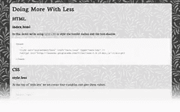

# CSS:多一点少一点

> 原文：<https://www.sitepoint.com/css-a-little-more-on-less/>

尽情呼吸甜蜜的空气吧，CSS 的伙伴们，因为 2010 年是个好时光！经过多年的磕磕绊绊、诡计多端的浏览器制作者、隐藏的议程和僵化的标准机构，事情似乎终于朝着正确的方向发展了。

为什么？这里有一个概述:

*   许多最有用的 CSS3 属性现在都被所有主流的非 IE 浏览器支持——尽管不可否认它们经常需要专有代码(例如-moz 或-webkit)。
*   每个浏览器更新都引入了新的 CSS3 属性。
*   尽管显然 IE8 不能很好地处理 CSS3，但它至少倾向于以一种可预测的方式呈现普通的 CSS2。
*   虽然我不排除微软从胜利的虎口中夺回失败的能力(向微软 Outlook 团队大声疾呼)，但所有迹象都表明 IE9 大有希望。

确实是好时光。

不过，也有一些小问题。目前，CSS3 可能很难使用。让我们以一个典型的 CSS3 属性为例，比如“`box-shadow`”

对于 Opera(如果幸运的话还有 IE9)，我们需要使用标准的 CSS3 语法:

```
box-shadow: 1px 1px 8px #999999
```

Safari 和 Chrome 目前仍然需要它们自己版本的代码:

```
-webkit-box-shadow: 1px 1px 8px #999999
```

只要你给它想要的东西，火狐就能很好地配合。

```
-moz-box-shadow: 1px 1px 8px #999999
```

尽管这一切在每一个浏览器中都能很好地工作，但管理起来却是一件痛苦的事情。如果你想调整阴影颜色或者模糊，你需要在三个地方编辑你的 CSS。

除了令人厌烦之外，这给了你更多犯错的机会。应该有一种“一次编写，随处使用”的方法——当然，是有的。

去年，Raena 向我们介绍了如何[一个叫做 LESS](https://www.sitepoint.com/write-better-css-with-less/) 的系统。少于 T4 的概念是允许你设置 CSS 变量，然后在你的代码中使用。

LESS 是作为基于 Ruby 的解决方案开发的，如果你是 Ruby 用户，这很棒——但如果你不是，就没那么有用了。在这段时间里，我们看到了 [PHP](http://leafo.net/lessphp/) 和[的发展。NET](http://www.dotlesscss.com) 版本较少。

好吧，这很好，但是如果您想体验一下 LESS 在不安装代码或致力于服务器端技术的情况下能做什么呢？令人高兴的是，这是可以做到的。

Google Code 现在允许你直接从它的服务器上链接和运行 LESS 的 JavaScript 版本。这里有一个使用我上面引用的例子的快速演示:

1).创建一个新的 CSS 文件，将您的 CSS 规则剪切并粘贴到其中:

```
.content {
   box-shadow: 1px 1px 8px #999999;
   -webkit-box-shadow: 1px 1px 8px #999999;
   -moz-box-shadow: 1px 1px 8px #999999;
  }
```

2).将文件另存为“`style.less`”

3).接下来，我们将在该文件的顶部创建四个新变量。我们以一个`@`开头来声明它们，但是你可以用任何你喜欢的名字来称呼它们。我试图让我的变量名简单明了:

```
 @box-x: 1px;
  @box-y: 1px;
  @box-blur: 8px;
  @box-col: #999999;

.content {
   box-shadow: 1px 1px 8px #999999;
   -webkit-box-shadow: 1px 1px 8px #999999;
   -moz-box-shadow: 1px 1px 8px #999999;
  }
```

我也给了每个变量一个值。

4).现在我们需要编辑 CSS 值，用新的 CSS 变量替换它们。这应该会给你这样的东西:

```
 @box-x: 1px;
  @box-y: 1px;
  @box-blur: 8px;
  @box-col: #999999; 

.content {
 box-shadow:@box-x @box-y @box-blur @box-color;
 -webkit-box-shadow: @box-x @box-y @box-blur @box-color;
 -moz-box-shadow: @box-x @box-y @box-blur @box-color; 
```

5).接下来，我们需要从 HTML 文档的头部链接这个文件。乍一看，*可能看起来*像一个普通的链接标签，但是不要忽略了值为`**stylesheet/less:**`的不寻常的`REL`属性

```
<link rel="stylesheet/less" href="style.less" type="text/css" />
```

6).最后，我们必须附上完成所有繁重工作的代码——更少的 JavaScript 库:

```
<script src="http://lesscss.googlecode.com/files/less-1.0.18.min.js"></script>
```

我特意将这一步留到最后，因为这些文件的加载顺序很重要。这个少库文件必须在你的 CSS ( `**i.e your 'style.less' document**`)之后*加载。*

[](https://www.sitepoint.com/examples/less/) 这里有一个[的简单演示，展示了代码在运行](https://www.sitepoint.com/examples/less/)。我们的每个变量都被动态地自动插入到每个 CSS 规则中。

现在，如果我们需要调整我们的`box-shadow`的颜色，对样式文档顶部的`@box-color`变量的一个简单更改将改变整个文档的颜色。

这仅仅是触及了更少的表面。正如 Raena 的[原帖解释的](https://www.sitepoint.com/write-better-css-with-less/)，LESS 让你:

*   计算列宽和页边距占正文宽度的百分比(例如`**width: @bodywidth/6**`)
*   将 CSS 规则嵌套在其他 CSS 规则中，以生成新的子规则
*   将常用的 CSS 片段分组为可重用的“混合”

这些都是令人兴奋的玩法。

### 但是有什么收获吗？

当然，这个解决方案有一个明显的问题。如果用户没有启用 JavaScript，这些样式都不会被呈现。

因此，将所有主要样式保存在一个普通的样式表中，然后将我们的 CSS3 服饰分解成一个更简单的样式表，这可能是有意义的。

此外，如果你决定少是你前进的方向(或类似的技术，如 [Sass](http://sass-lang.com/) 和 [CSS Scaffold](http://wiki.github.com/anthonyshort/Scaffold/) )，你可能需要考虑基于服务器的解决方案。

然而，如果你正在寻找一个简单的方法把你的脚趾浸入水中，谁会要求呢..更多？

###### 来自设计视图#74

## 分享这篇文章