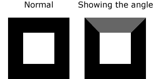
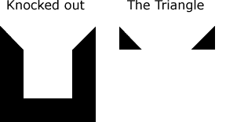
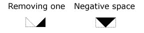
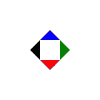
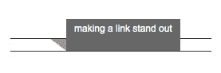
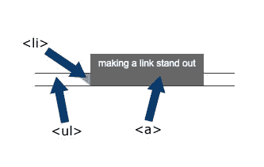
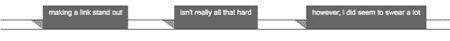
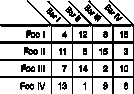

# CSS 角度:正是你的网页需要的边缘！

> 原文：<https://www.sitepoint.com/css-angles-the-edge-you-need/>

随着像 [jQuery](http://jquery.com) 和 [Prototype](http://www.prototypejs.org/) 这样的 JavaScript 库的涌入，前端开发的许多更基本的元素都被遗漏了。我们花几个小时坐下来寻找解决 CSS 问题的创造性方法的日子已经一去不复返了；现在我们立即转向 JavaScript。这并不是说这是一件坏事——这就是当前网络发展的现状。但有时我们不得不回过头来看那些旧技术，以找到实现解决方案的新方法。

我第一次看到 CSS 角度的使用是在 Eric Meyer 的倾斜演示中。我立刻觉得这太酷了，并对它所展现的可能性感到惊讶。在那之后，我开始大量使用`border`属性，看看实际上可以做什么，在哪些浏览器中可以工作，以及如何将它与其他元素结合起来，以创建一些真正独特的效果。

##### `border`属性

属性是 CSS 中最常用和最有价值的属性之一。它可以极大地提高网页的可读性，给网站添加一些急需的*元素，并帮助引导用户浏览内容。一般可以分为三个部分:`width`、`style`和`color`。手写:*

```
border-width: 10px; 

border-style: solid; 

border-color: #333333;
```

简而言之:

```
border: 10px solid #333;
```

也有一些流行的 CSS3 属性通过供应商的专有扩展在 Web 上找到了自己的路:`-moz-`、`-webkit-`和`-khtml-`。这些与`border`属性一起使用，如`border-radius`:

```
-moz-border-radius: 5px; 

-webkit-border-radius: 5px; 

-khtml-border-radius: 5px; 

border-radius: 5px;
```

如今，改变边框的宽度、颜色和样式是很常见的做法。最近，我注意到用`border-bottom:1px solid color`代替链接上的`text-decoration:underline`的趋势。

##### 创建三角形

属性只制作直线和方框——每个人都知道，对吗？嗯，我希望不会，否则这篇文章会让很多人失望。让我们希望情况不是这样…

当一个边框与另一个边框在一个角上相交时，它会产生一条对角线，这很容易被忽略或忽略，因为边框通常只有一两个像素宽，并且都是一种颜色。如果我们改变其中一个边框的颜色，我们可以看到一条自然的对角线出现。这条对角线是创建 CSS 角度的基础。



我们可以通过将`border-top-color`声明更改为白色来进一步强调这一行，这会创建一个带有框的挖空效果:它使它看起来没有顶部，但保留了角度。



但是我们仍然有一些很粗的边界线要处理。因此，接下来我们必须删除底部边界。我还喜欢清除`height`和`width`以确保任何跨浏览器的问题都得到处理。

```
#box { 

  border: 30px solid #000; 

  border-top: 10px solid #fff; 

  border-right: 10px solid #000; 

  border-bottom: 0; 

  height: 0; 

  width: 0; 

}
```

清空`width`后，两个三角形应该在中间接触。您可以用几种不同的方式来处理这个问题:

*   通过将`border-left-color`(或`border-right-color`)设置为白色来移除一个三角形
*   使用中间的负空间创建一个向下的箭头



多做几次，混合一些定位，最终你会得到一个漂亮的，像指南针一样的方向箭头。每个三角形的斜度可以通过改变每个元素边框的宽度来控制。



##### 搭建一个架子

同样的主题，我们可以通过创建一些 [CSS 货架](http://www.csskarma.com/lab/css_shelves/)来为链接或导航添加一些 3D 强调，从而将这一点应用到日常的网页设计中。老实说，放些架子不会要你的命。

CSS 书架的想法第一次出现在我访问 Webmonkey 的时候。他们的旧设计(大约一年前)将搜索框放在看起来像一个小架子的地方，搜索框本身有阴影。我想知道纯 CSS 是否可以做到这一点。事实证明，是可以的。



##### 语义层剖析

CSS shelf 由三部分组成(如果包括容器`<div>`，则为四部分)。保持标记语义让我们可以像对待任何其他类型的导航一样对待它，并允许我们为以后的设计更改保持非常灵活的布局。

```
<div id="shelf">  

  <ul>  

    <li><a href="#">making a link stand out</a></li>  

    <li><a href="#">isn't really all that hard</a></li>  

    <li><a href="#">however, i did seem to swear a lot</a></li>  

  </ul>  

</div><!--/shelf-->
```



对于书架的底部，我们需要首先用我们的`<div>`建立一个相对定位点，设置我们的`height`和`width`属性，并设置一个字体底部。

```
#shelf {  

  position: relative;  

  top: 50px;  

  width: 700px;  

  font: normal .75em Arial, Helvetica, sans-serif;  

}
```

搭建货架的第二步是处理`<ul>`来为我们的链接创建一个立足点。货架这一部分的许多属性都是装饰性的，但边缘实际上解决了我遇到的一些布局问题。

```
#shelf ul {  

  margin: 0 0 0 -50px;  

  padding: 0;  

  border-top: 1px solid #333;  

  border-bottom: 1px solid #333;  

  height: 15px;  

}
```

`<li>`保存每个货架物品的长度(宽度:130px)，创建阴影(`border-top`，并提供一些重要的定位属性(`position: relative`)。将`border-left`颜色设置为白色会产生我们之前提到的挖空效果。在这种情况下，它会填充阴影左下方的区域。

```
#shelf li {  

  list-style: none;  

  margin: 0 20px 0 50px;  

  float: left;  

  border-top: solid 15px #999;  

  border-left: solid 20px #fff;  

  position: relative;  

  width: 130px;  

}
```

最后，我们必须设置链接属性:构成货架底部的装饰样式。如果你稍微摆弄一下这些值，你会发现最微小的变化会改变你的架子的外观和感觉。

```
#shelf a {  

  display: block;   

  height: 30px;  

  position: absolute;  

  top: -40px;  

  white-space: nowrap;  

  padding: 5px 10px;  

  color: #fff;  

  text-decoration: none;  

  background: #555;  

}
```

然后我们把它挂在墙上，坐好，欣赏一些不错的老式质量工艺。



##### CSS 角度的未来

W3C 起草了 CSS3 盒子模型的扩展，称为[旋转盒子](https://www.w3.org/TR/css3-box/#rotating)。这个模型包括两个属性:`rotation`和`rotation-point`。旋转可以应用于块级、内联表和内联块元素。它可以取 0 到 360 度的值。旋转点只能应用于块级元素，采用两个值(例如，`bottom`和`left`，并定义旋转发生的点。这些值也可以是数字和/或负数。

建议的语法还包括一个[块前进属性](https://www.w3.org/TR/css3-box/#block-progression)，它可以定义旋转后的框中文本的方向，其用途不仅仅是与旋转属性配对。

```
thead th {  

  block-progression: rl;  

  padding: 0.5em 1em;  

  rotation: 45deg;  

  rotation-point: bottom left;  

}
```

上面的代码示例([通过 W3C 示例](https://www.w3.org/TR/css3-box/#rotating))将产生倾斜的表格标题，如下所示。



##### 利益

在 CSS 中多花一个小时来完成一个图片用不到一半的时间就能完成的任务有什么好处？

1.  你以你的 CSS 为傲，讨厌使用不必要的图片来完成设计。

*   你需要制作一个角度效果的 CSS 量通常比做同样工作的图像的重量要轻——至少在 99%的情况下。如果你想亲自测试一下，雅虎推出了一个对 [Firebug](https://addons.mozilla.org/en-US/firefox/addon/1843) 的巨大扩展，用于对网站进行速度评级，名为 [YSlow](http://developer.yahoo.com/yslow/) 。*   使用不必要的图像会增加对服务器的 HTTP 请求。太多的请求会导致网页加载缓慢。*   使用斜线是打破简单设计的四四方方倾向并抓住用户眼球的好方法。

创造性地使用基本属性(如边框)来解决问题的最大好处是所有的浏览器都支持这些技术；通常情况下，他们很少有跨浏览器的问题。在此基础上添加一层 JavaScript 可以创造一些非常酷的效果，比如詹姆斯·爱德华兹的 3D 迷宫。

##### 关闭

CSS 管道中有很多东西:一些来自 W3C，另一些来自社区。现在一个热门话题似乎是 [JavaScript 是通向 CSS3](http://github.com/jeresig/sizzle/tree/master) 的门户。当我们等待网络的某些领域赶上雄心勃勃的开发者的期望时，CSS 的当前状态仍然有大量的探索要做。

CSS 禅园这样的网站可以向我们展示 CSS 的威力；这只是另一个例子，说明只需一点汗水和创造力，就可以对语义标记进行大量操作。当然，这只是使用纯 CSS 可以做的事情的冰山一角。关键是要避免那种认为[一个表必须看起来像一个表](http://www.csskarma.com/lab/csstable/)的思维定势(抱歉，那个链接只在 Firefox 中有效)。我们都知道并使用的许多最伟大的 CSS 技术来自于想象力、空闲时间和一次又一次尝试新事物的结合。不要因为是“做事的方式”，是“标准”，就让惯例成为法律。CSS 仍然非常年轻，我们都感觉到了它的局限性；网络发展太快，我们无法适应。请记住，使用表格进行布局曾经也是一个标准…

## 分享这篇文章