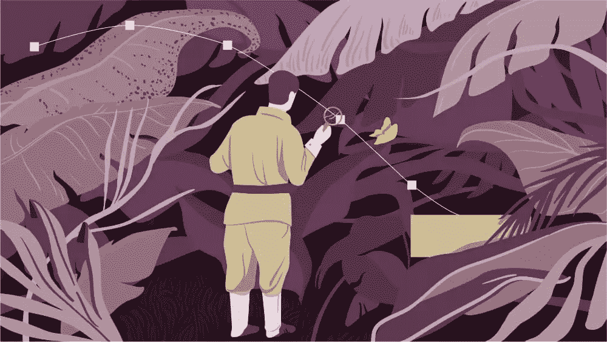

# CSS 动画，原型工具和灵感来源

> 原文：<https://www.sitepoint.com/css-animation-prototyping-tools-and-sources-of-inspiration-with-donovan-hutchinson/>

在这一集的版本控制节目中，Tim 和 David 加入了 Donovan Hutchinson，他是 CSSanimation.rocks 的开发人员、教师和所有者。他们讨论了教学和演讲如何帮助您学习、解决用户问题、CSS 动画和可访问性、设计和开发世界的桥梁、原型工具、浏览器兼容性、灵感来源、发出嗖嗖声以及为猫设计 ui。

[https://w.soundcloud.com/player/?url=https%3A//api.soundcloud.com/tracks/322992408&color=ff5500&auto_play=false&hide_related=false&show_comments=true&show_user=true&show_reposts=false](https://w.soundcloud.com/player/?url=https%3A//api.soundcloud.com/tracks/322992408&color=ff5500&auto_play=false&hide_related=false&show_comments=true&show_user=true&show_reposts=false)

不要忘记在 SitePoint 上查看多诺万的[CSS](https://www.sitepoint.com/premium/courses/animating-with-css-2941)动画课程！

[访问版本控制展示主页](https://www.sitepoint.com/versioning-show/)

**[在 iTunes 上订阅](https://itunes.apple.com/us/podcast/the-versioning-show/id1135300597) | [在 Stitcher 上订阅](http://www.stitcher.com/podcast/sitepoint/the-versioning-show) | [查看所有剧集](https://www.sitepoint.com/blog/)**

## 显示注释

*   多诺万在推特上: [@DonovanH](https://twitter.com/DonovanH)
*   [CSSAnimation.rocks](https://cssanimation.rocks/)
*   CSS 动画在推特上摇滚: [@CSSanimation](https://twitter.com/CSSanimation)
*   [mp3.com](http://mp3.com/)
*   多诺万的 SitePoint 教程[用 CSS 制作动画](https://www.sitepoint.com/premium/courses/animating-with-css-2941)
*   [成帧器](https://framer.com/)
*   [原理](http://principleformac.com/)
*   [目标的 12 项基本原则](https://en.wikipedia.org/wiki/12_basic_principles_of_animation)
*   [为危机而设计](https://meyerweb.com/eric/thoughts/2016/01/25/designing-for-crisis-design-for-real-life/)
*   在推特上打招呼:[@ mdavid green](https://twitter.com/mdavidgreen)|[@ tevko](https://twitter.com/tevko)|[@ versioningshow](https://twitter.com/versioningshow)|[@ sitepointdotcom](https://twitter.com/sitepointdotcom)

## 谈话要点

> 我记得花了几个晚上试图在 Amiga 中模拟我的吉他或我房子的不同部分，然后让它通宵渲染。

* * *

> 一家小公司非常鼓舞人心的 CTO 说服我不仅要尝试新技术，拥抱网络上正在发生的有趣的事情，还要写下它。

* * *

> 我刚刚开始阅读关于 Angular。他建议我在那个月底去当地的一个聚会上做一个关于这个问题的演讲。我不知道我能在短短几周内学到足够多的东西来做一个关于这个主题的演讲，但它成功了，它真的向我展示了花时间正确地理解一些东西，足够你可以教某人关于它的东西，这是彻底理解和欣赏它的一个好方法——比仅仅在表面上使用它要多得多。

* * *

> 对我来说，这一切都是将对事物外观和感觉的兴趣与它们是如何建造的结合在一起。为此，CSS 很好地位于中间。它有时会令人沮丧，当然 CSS 就是这样，但它是表达布局和理解人们实际使用我们软件的一个很好的方式。

* * *

> 我当然不会让老版本的浏览器来决定新功能的用途。

* * *

> 通常，即使是微妙的动画也会分散人们的注意力，以至于他们甚至不能再使用该应用程序，因为运动阻止了他们越过这一部分。我们必须非常注意这一点，当我们使用动画时，当我们希望人们专注于其他事情时，我们开始、停止和关闭动画。

* * *

> 动画制作非常出色的两个主要属性是`transform`和`opacity`，它们处理位置、缩放、倾斜对象以及处理它们的透明度。

* * *

> 原型工具确实有助于人们交流思想。

## 副本

Tim:

嘿！大家好吗？这是蒂姆·埃夫科…

David:

…这位是大卫·格林先生…

Tim:

…您正在收听的是版本控制播客的第 29 集。

David:

这是一个我们聚在一起讨论网络产业的地方，从开发到设计，与一些人一起实现它，并计划它在下一个版本中的发展方向。

Tim:

所以，今天我们要和多诺万·哈钦森聊聊，他是 CSSAnimation.rocks 的开发者、教师和所有者。所以，我们要和他谈谈开发和教学，以及 CSS 动画。那么，让我们开始这个版本吧。

David:

嘿，多诺万，你今天怎么样？

Donovan:

我很好，谢谢。

David:

很好。感谢您加入我们的版本控制节目。

Donovan:

很荣幸。谢谢你邀请我。

David:

酷毙了。所以，既然是版本控制秀，我们正在谈论网页设计和开发的哲学，我们总是喜欢问我们的客人一个哲学问题。你今天的哲学问题是:在你目前的职业生涯中，你是什么版本，为什么？

Donovan:

哇哦。好吧。我会说，天哪，在这一点上，它必须是第三或第四版。我经历了职业生涯中的几个不同阶段才走到这一步。这一切都要追溯到 90 年代末，当时我被介绍给了我的第一个 Amiga，并开始用它来创作音乐和 3D 图形，我发现自己正在使用计算机来创作东西……当网络起飞时，这些东西很快就成为了网络上的一项工作。在那里的很长一段时间里，我是你可能称之为的<q>网站管理员</q>——这曾经是一件事，在它变得更像一个<q>开发者</q>之前。然后这些天我开始涉足更多的设计。我猜是设计和后端之间的桥梁，人们称之为前端开发。

David:

是的，我认为前端开发跟踪了我们中的许多人，但是我也对我刚起步时的 Amiga 日子有美好的回忆。如今，我认为你可以用 JavaScript 模仿一个，不是吗？

Donovan:

我想我见过类似的东西，是的。

David:

所以，我可以理解从 Amiga 到前端。你一直对视觉感兴趣吗？你说音频是最初吸引你去 Amiga 的原因。

Donovan:

我想这是多种因素的混合。当我最初真正进入这个领域时，我曾经从杂志上创建——或者复制——游戏到我的 ZX 谱中，然后一次输入一个单词。这真的是一种做出东西然后看到结果的能力。或者，在音频的情况下，制作一些东西并听到结果。不管怎样，这个过程对我来说还是很有趣的。所以，说到音频，我喜欢收集样本。我曾经录下几个小时的广播，然后把它剪成小样本，用它来制作音乐。但是，与此同时，就大众市场用途而言，3D 软件正在成为一种东西。你可以在当时的杂志封面上免费试用相当强大的软件。我记得花了几个晚上试图在 Amiga 中模拟我的吉他或我房子的不同部分，然后让它通宵渲染。

David:

那是如何让你从事网页开发和设计的，尤其是你一直在做的前端工作？

Donovan:

我想，最初，它是一个分享我创作的东西的地方，然后能够创建一个网络存在是分享我创作的音乐的一部分。我创建了一些分享音乐的网站，然后发现了 mp3.com 并加以利用。但是分享一个单独的兴趣的过程，就在网上制作音乐而言，让我对建立网站本身的机制产生了兴趣。这就延伸到了网络建设，而不仅仅是把网络作为一种分享的方式。

David:

当你有这个想法的时候，网络是你尝试分享的第一种方式吗？或者在此之前，你用其他方式分享过吗？

Donovan:

我们过去常常带着磁带去参加聚会。这通常是你当时分享的方式。

David:

所以，音频工作带来了分享，带来了网络，带来了与人交往。后来，你也开始教书了。

Donovan:

这对我来说是最近的事情，也是我目前非常感兴趣的事情。我想这可能是从四五年前开始的，当时我很幸运地与一个非常鼓舞人心的小型创业公司的首席技术官一起工作，他说服我不仅要尝试新技术，拥抱这种在网络上发生的有趣的事情，还要写下它。在某种程度上，这让我更好地学习，因为为了写一些东西，我必须更好地理解它。然后他实际上也鼓励我就这些话题发表演讲。比如我当时在学 Angular。我刚刚开始阅读关于 Angular。他建议我在那个月底去当地的一个聚会上做一个关于这个问题的演讲。我不知道我能在短短几周内学到足够多的东西来做一个关于这个主题的演讲，但它成功了，它真的向我展示了花时间正确地理解一些东西，足够你可以教某人关于它的东西，这是彻底理解和欣赏它的一个好方法——比仅仅在表面上使用它要多得多。

David [4:21]:

是的，我能理解这种教学是如何成为你学习方式的重要组成部分的。我们采访了一些人，他们谈到了教学过程最终是如何成为他们学习的对象。当你这么说的时候，有一件事引起了我的注意，那就是你已经对角度有了足够的了解，所以你可以教它，但在这种情况下，你并没有把自己表现成角度专家。

Donovan:

是的。远非如此。我把我觉得有趣的东西呈现给我觉得会喜欢听的人。

David:

你最初是怎么进入 Angular 的？我的意思是，JavaScript 有很多不同的发展方向。

Donovan:

当时，当我在研究 MVC 框架，寻找可以与数据双向绑定的东西时，我正在为一个 web 应用程序构建后端，我们需要一些非常快速的东西，可以在页面上的各种视图中实时显示编辑内容。就其呈现方式而言，以及使用指令(相当复杂的功能)在标签中构建的方式而言，它确实打动了我。事实上，我认为它是由谷歌支持的，这也有所帮助。从那以后，我继续前进，谢天谢地，围绕着它的生态系统已经成长了许多。你有像 React 这样奇妙的选项，还有很多更快的选项。但是，在当时，我觉得对于我们手头的问题来说，这是一个很好的选择，它也给了我一个提高我的 JavaScript 的机会，只是为了更好地理解当我使用 JavaScript 构建前端应用程序时我在做什么。

David:

不过，当我想到你最近教的东西时，我想到的大多是 CSS 方面的东西。

Donovan:

是的，很多驱动我的东西更接近表示层，就事物如何交互，以及事物如何在应用程序或网站中呈现而言。在过去的几年里，我比最初开始时更倾向于设计，我喜欢思考如何解决用户问题，从这个角度思考用户体验。对我来说，这一切都是将对事物外观和感觉的兴趣与它们是如何建造的结合在一起。为此，CSS 很好地位于中间。它有时会令人沮丧，当然 CSS 就是这样，但它是表达布局和理解人们实际使用我们软件的一个很好的方式。对我来说，你有很多方法可以进入 CSS 并使用它，从中学习。我目前对动画感兴趣，这是其中的一部分，但这只是 CSS 这个大主题中的一小部分。

David:

我知道你在有趣的 CSS 动画方面做了很多工作。你能告诉我们一些你已经出版的东西吗？

Donovan:

当然可以。最近，我有幸在 SitePoint 的一个课程上与你们一起工作，在那里我谈到了 CSS 动画、关键帧和过渡的概念是如何工作的。我介绍了这方面的理论，并讨论了它在项目中的实际应用。当我在我的网站 [CSSAnimation.rocks](https://cssanimation.rocks/) 上了解到更多关于这个话题的信息时，我也写并分享教程。这是我的想法的出口，所以如果我决定，嗯，如果我试图用 CSS 来构建它，会发生什么？如果成功了，如果我学到了什么，我就会去网站上分享。

David:

你是如何遇到这些项目来分享的？比如，你如何决定你想在那里放什么？

Donovan:

它可能来自各种各样的地方。一个例子是去年我看《星球大战》预告片的时候。我对最后的演职员表印象深刻，心想，<q>我在想，这能用 CSS 实现吗？这看起来像是变形金刚很适合做的事情。</q>我只是试了一下，看看发生了什么。

另一个来源可能是在工作中，我们正在努力思考如何解决 UI 挑战，以及如何帮助用户理解某些东西从哪里来，到哪里去。这可能会产生一些想法，也许你如何使用 CSS 动画一个弯曲的路径。这就是要写的东西，它本身就成为一个话题。

David:

你写的东西，是针对初级水平，还是更针对高级 CSS 人员？

Donovan [7:47]:

嗯，我想我写我所学的东西的一个副产品是，很容易带着一点期望，人们知道很多我在写作时知道的东西…因为那是我当时的想法。我经常不得不停下来，告诉自己回想一下我是如何走到这一步的，以及我在工作中的假设。但是，总的来说，我会假设你对 CSS 有一个总体的理解，比如定位是什么，边距和填充是什么，以及基本的东西是什么。但是，只要有可能，我会尽量花时间解释我是否在做一些复杂的事情，比如任何新的 CSS 属性。我可能会试着解释一下，我在做什么，给大家一个背景。

今天我写了一个关于如何在页面加载前停止动画的例子，我使用了`:not`伪类。这不是我经常使用的东西，但是在需要的时候，它非常有用。这是我想我会停下来说，<q>等一下。这就是这个意思，以防你以前没看过。</q>

David:

我知道，由于兼容性问题，很多这些东西对人们来说是陌生的。当你在做你正在做的事情时，你对浏览器兼容性有多重视？

Donovan:

一般来说，当我开始写一个教程的时候，我不会太担心如何让所有的东西都工作起来。但是，我一直记在心里。而且，当我设计和构建东西时，我喜欢首先尝试用 CSS 实现尽可能多的东西，但同时，优雅地退化回仍然工作并且在幕后可访问的东西。就实际版本号而言，我通常不会太在意这个问题，而是会想，<q>如果 JavaScript 在这里不起作用怎么办，</q>或者，<q>如果这个浏览器不能播放动画怎么办？</q>然后我们应该使用 [Modernizr](https://modernizr.com/) ，或者一些后备措施，确保内容确实可读，无论如何都会出现在屏幕上。然后，如果这个项目有能力做奇特的动画，那就去做吧。尽可能多做。这很棒，但我当然不会让老浏览器来决定新特性能做什么。

David:

这很有道理。你写的文章中让我最感兴趣的是关于可访问性和动画的问题。我很好奇。你能和大家分享一些你在这方面遇到的事情吗？

Donovan:

当然可以。当人们使用动画时，有几个主要问题出现了，首先是晕动病。我们大脑中有一个硬连线的平衡系统，它告诉我们当地球移动时，我们会有某种感觉。如果我们展示动画，尤其是可能覆盖整个屏幕的大型动画，欺骗大脑认为某些东西应该移动，但我们的大脑没有感觉到这种移动，我们会感到不舒服。有些人比其他人更容易受到这种影响。与此同时，另一个与可访问性有关的问题是，当移动出现在屏幕上时，很难不去看移动的东西。通常，即使是微妙的动画也会分散人们的注意力，以至于他们甚至不能再使用该应用程序，因为运动阻止了他们越过这一部分。我们必须非常注意这一点，当我们使用动画时，当我们希望人们专注于其他事情时，我们开始、停止和关闭动画。

David:

我没有想过晕车的问题，但这是一个有趣的观点。我在想动画如何对视力受损的人有用，因为我们天生倾向于看到移动的东西，并把我们的注意力吸引到它们身上。

Donovan:

这是一个很好的观点，当然。人们会注意到一些事情。这是被运动分散注意力的另一面，它更容易被注意到。而且，如果你想引起人们对某件事情的注意，或者更想解释某件事情从何而来，动画比让某件事情出现更有帮助。

David:

是真的。当你用 CSS 创建你的动画时，你是否会遇到很多关于保持平滑运动的问题，比如每秒 60 帧的问题？

Donovan:

当然，但大多数时候，这实际上取决于我们选择哪些属性来制作动画。动画制作非常出色的两个主要属性是`transform`和`opacity`，它们处理位置、缩放、倾斜对象以及处理它们的透明度。如果你使用这些——如果你说，放大和移动它们，使用变换和平移——那么这通常是很好的，因为浏览器不会在每次移动时都重新绘制。它不会重新计算页面上其他所有内容的位置。这些东西往往会孤立地移动。但是，如果你在制作高度之类的动画，比如说你有一个固定高度的`div`,你想让它变大以显示更多的内容，它必须把其他东西推开。如果你有一个很大的页面，这往往会导致口吃，因为它每秒钟要重新计算 60 次，整个页面的布局。这不是你想要的。

字体大小也是如此，其他方面可能没有硬件加速——就像如果你试图动画化一个大区域的背景颜色，可能是整个页面或屏幕。这可能看起来很明显也不正确，因为它试图在一秒钟内重画很多次，一个非常复杂的场景。所以，有时候这是一个判断的问题。你可能会看着它，然后说，<q>嗯，也许这部动画里发生了太多的事情。如果我们修剪回来，或试图坚持变换和不透明度，那么通常会导致更好的性能。</q>

David [12:28]:

有道理。这是一个工程师在试图开发一个网站时会考虑的因素，但设计师在设计时可能不会真正考虑这些问题。我很好奇，既然你说你正在设计和开发之间过渡，你是如何在这两个世界之间架起桥梁的，尤其是和那些对工程方面了解不多的设计师，反之亦然？

Donovan:

我认为这是一个问题，这取决于你在哪里工作，我想，但这已经不再是一个问题，我看到的问题比以前少了，也许在过去，人们会从印刷背景开始处理很多设计工作，并从折叠的角度思考，对事物看起来的样子和像素完美的设计有非常严格的预期。但是，我们现在到达了一个情况，原型工具真的帮助人们交流想法，我认为，更好地在部门之间交流，所以如果有人在构建一些东西，如果设计师可以帮助实际构建它如何移动，甚至更好，例如，使用像 [Framer](https://framer.com/) 这样的工具，其中涉及一些基本的 JavaScript，并且有一些实际的补间，那么可以非常清楚地向构建它的开发人员传达这是设计的意图。

但是，反之亦然:如果设计师试图想出一些东西，但不知道它是否会工作，就浏览器的功能而言，这样的工具有助于更快地公开。这有助于对话来回进行，我发现这对交流很有用，<q>这就是我们能做的，</q>然后就正在设计的东西进行双向对话。

David:

你觉得有什么特别有用的工具吗？

Donovan:

有什么特别的工具吗？我是[原理](http://principleformac.com/)的忠实粉丝。而且，就快速获得基本原型而言，我发现这是一个非常棒的工具。你可以更进一步，使用 Principle 制作一些看起来相当真实的模型。但是，我对它的使用实际上更加简单。我曾经用 Principle 创建了一个使用白板绘图的交互模拟。

我在白板上的屏幕上画下了每块板，拍下了每块板的照片，将每块屏幕放入原理中，并制作了触摸区域。这是你能得到的最逼真的画面，但它表达了当人们触摸这一部分时会发生什么，以及屏幕会去哪里的想法。

有原则。还有 [FramerJS](https://www.npmjs.com/package/framerjs) ，如果人们想对代码更熟悉一点，我会推荐它。但是，它也有一些很好的工具来创造运动，并且非常适合移动。

David:

你有没有发现和工程师交流动画中的微妙之处有什么困难？比如，为什么某些事情很重要，为什么某些事情不重要？

Donovan:

可以有。就像我说的，良好地使用原型真的可以帮助澄清正在发生的事情。例如，在为 iOS 设计时，有一些工具不仅可以显示事物的外观，还可以输出 iOS 所需的代码，以处理运动的弹性。

是的，我认为越多的人可以通过各种媒介交流，无论我们能找到什么工具来帮助弥合这些差距，这真的有助于这个过程更加顺利。它帮助人们从设计开始就交流想法。

David:

我认为一般来说，动画在用户界面中越来越成为一个重要的元素，人们开始想出一种几乎是语言学的方法来说明如何在他们的用户界面中使用动画。

Donovan:

是啊。我认为传达什么是动画是一件棘手的事情。有时很难把想法表达清楚。举例来说，你不能仅仅通过挥动你的手来做你需要做的事情。

David:

但是，当人们在他们的用户界面上看到一些东西时，菜单会有一点跳动，人们开始熟悉这一点，因为它传达了关于内容发生了什么的特定概念。

Donovan:

我非常喜欢谷歌在他们的材料设计工作中所做的事情，他们采用了很多动画原理，并将其应用于帮助人们理解 UI 正在发生的事情。他们想出了一些微妙的动画效果，例如，如果有什么东西出现在屏幕上，它应该在运动中开始，然后减速，而不是在视图中缓慢上升和下降。很高兴看到这种现实的 UI 设计被采用。

David [16:13]:

我明白你的意思。我们很多人都是看着卡通长大的，卡通里所有的事情都是动画和夸张的。然而，现在我们小时候看到的所有东西都在影响着我们今天的工作方式。

Donovan:

我认为动画的原则仍然有效。[实际上，在如何帮助我们与屏幕上的内容联系起来方面，这里有 12 个经过深思熟虑的要点](https://en.wikipedia.org/wiki/12_basic_principles_of_animation)。如果我们把它应用到我们的 UI 中，那么帮助人们连接到我们正在构建的东西是一件好事。

David:

你有没有从用户那里得到任何关于你发布的信息类型的反馈？

Donovan:

在过去的两年里，我有 2000 多人参加了我在 CSSanimation.rocks 开设的课程。这对我了解人们真正喜欢学习什么，以及他们将这些技能用于什么方面是非常宝贵的。看到不同的观点和不同的想法，然后看到像 CodePen 这样的网站上出现的东西，看到围绕网络和动画的生态系统不断增长，这真是太棒了。

David:

你觉得你接下来会把它带到哪里？

Donovan:

我要继续拉这根线，看看它通向哪里。每次我学到新的东西，我都会尽我所能去分享，看看它打开了什么令人兴奋的大门。

David:

太棒了。对于对你的课程和你的信息很好奇的听众来说，人们如何在网上找到你？

Donovan:

我可以在 Twitter [@DonovanH](https://twitter.com/DonovanH) 上找到，在网上我经营着一个名为 CSSanimation.rocks 的网站，那也是在 Twitter 上，但名字是 [@CSSanimation](https://twitter.com/CSSanimation) 。

David:

很好，我想你在 SitePoint 也有一门课。

Donovan:

我确实如此。推荐你去看看。

David:

太棒了。嗯，谢谢你今天加入我们。这真是令人着迷。

Donovan:

谢谢您们。这是我的荣幸。

*【音乐插曲】*

David:

嗯，蒂姆，我真的需要谢谢你，因为你知道我们在节目中遇到了一些技术问题，这就是为什么我问了所有的问题。但是，你在后台给我发了一些好问题。你在秘密频道打字，让我知道我应该问多诺万什么。

Tim:

是的。我在精神上是存在的，并且在谷歌视频上保持沉默。

David:

谢天谢地，声音很小，但对我们所有人来说都很好。这也是一个伟大的插曲，多诺万真的把我带回了我的过去。它谈到了 Amiga 和 Sinclair ZX81，以及 3D 渲染。伙计，这让我想起了过去。

Tim:

当我听他讲话，听你讲话，只是听一般情况下，我真的开始明白这几乎是一个公式化的过程，其中有人只是对 web 开发领域感兴趣，他们继续学习，写作，演讲或教授他们所学的东西，他们只是，他们继续这样做。当他们学到一些东西的时候，他们会对自己说:好吧，这是一件有趣的事情。我要告诉别人我在做什么。他们只是继续这样做，这就是他们如何在行业中达到这种阶段，成为一种良好的资源。

David:

这是鼓舞人心的，因为很容易想到只是进去，做你的工作，然后回家，接受他们的任务，而不是真正考虑更广阔的前景。但是，这些人在他们自己的职业生涯中发挥作用，并且说，这是我感兴趣的。这就是让我着迷的地方。他们走进那些有趣的小频道，探索 CSS 动画等奇怪的角落和缝隙——人们可能不会想到的核心工程或严肃的职业发展领域。但是，他们最终为自己建立了声誉。他们这样做的方式使他们成为我们希望在节目中谈论他们如何建立职业生涯的那种人。

Tim:

是啊。就好像他们让好奇心驱使着他们。是的，我喜欢看到这一点，当然他们会成为我们提问的对象。比如，当你问多诺万关于 CSS 动画的问题时，我学到了一些全新的东西，其中你的动画有时会让人失去平衡，并引起特殊的无意识。我可能以前也这样做过，但我从来没有想过这个问题。

David [20:07]:

这是真的，而且很奇妙，人们正在思考可访问性问题。正如多诺万所说，无障碍不仅仅是针对残疾人。可访问性是指无论你来自哪里，都能与网站进行交互。它可能来自那些可能会分心的人。你可能需要以一种特殊的方式来设计，以便有人可以注意到，所以你把一些闪光的东西放在这里，以利用人类对闪光物品做出反应的自然倾向。

Tim:

是的。情境意识通常是我们在构建事物时没有考虑到的。你知道，我们很少问自己，<q>使用这项服务或产品的人的心理空间是什么？</q>实际上，我相信埃里克·迈耶对此有很多话要说。他说了很多关于[为危机](https://meyerweb.com/eric/thoughts/2016/01/25/designing-for-crisis-design-for-real-life/)而设计的事情。例如，如果你正在为一家医院创建一个页面，什么类型的信息更重要，用户在查找这些信息时处于什么样的状态？

David:

这就是为什么 UX 设计的整个领域，我认为，现在正在爆炸，因为我们正在进入这样一种情况，一些人为了满足某些要求而在最后期限内拼凑的东西现在拯救了生命，或者没有拯救生命。在我们社会赖以建立的机构中，这正在成为现实。所以，现在我们必须快速赶上，并意识到我们所做的所有这些工作，对人们的生活有着真正的影响。这些都是即将出现的事情，我们需要注意的是，我们以前从未想过这些。

Tim:

很容易忘记一些事情。我现在正在工作中开发一些搜索功能。我们对这类产品有一些很小的期望，却从来没有想过。例如，当用户搜索时，我们从一开始就假设我们知道他们在搜索什么。那不一定…假设我正在构建一个搜索来搜索，我不知道，不同类型的纸箱，对吗？你可以假设我需要买一个纸箱，或者你可以假设我是一个纸箱爱好者。

David:

或者，你可以假设你是一只猫。

Tim:

你也可以假设我是一只猫。在这种情况下，屏幕上不会有红点闪烁。我会攻击我的电脑。

David:

*【咯咯笑】*是真的。但是不，你提出了一个非常有效的观点。我的意思是，我们正在做这些直接的假设，如果我们有一个用户，我们知道我们希望那个用户在那里寻找什么。我们知道用户的到来对我们的业务有什么好处。但是，用户实际上是为了什么，我们可能不知道。能够提出这种观点，认识到这一点，并具有足够的适应性，我们正在做的事情将为任何类型的用户工作，这是人们尚未充分开发的技能。

Tim:

是啊。我对此 100%有罪。

David:

多诺万谈论的事情之一，特别是围绕 CSS 动画的问题，是人们用来交流动画应该如何工作的工具。我想，我们以前和其他人讨论过这个问题——关于设计师不是工程师，不一定知道技术的能力是什么。同时，工程师——不是设计师——不了解用户对动画的期望是什么。他带来了一些工具。我实际上没有使用过这些工具中的任何一个。我认为是 Principle and Framer.JS。

Tim:

我听说过 Framer。JS，但是我没用过。我可以告诉你的是，我非常内疚通过在空中挥舞你的手，发出嗖嗖的声音来与设计师交流动画。

David:

蒂姆驱动的设计，这将是。

Tim:

Tim 驱动的设计可能是—

David:

标签！

Tim:

…不如 FramerJS 好，但它使—

David:

不过，看起来可能更有趣。

Tim:

哦是的。太棒了。这很棒，尤其是如果你听不到任何人在说什么，然后你就可以即兴发挥了。

David:

这在实践中是如何运作的呢？

Tim:

不太好，因为你最终得到的是一部从未被充分交流过的动画，也没有人预料到。

David [24:02]:

这是一个棘手的问题，我认为这在很大程度上归结于人们用来交流制作一种动画的实际意义的语言。我认为我们还没有这样做的语言。

Tim:

几乎就好像每次我开始和一个新的设计师合作，我都会忘记说，<q>这是我们应该用来制作动画原型的东西，这是我将要用来制作这些原型的东西。</q>

David:

我认为让设计师知道工程师在做什么是有用的。在某种程度上，等式两边之间必须有更多的交互，因为工程师必须理解这些东西如何协同工作的复杂数学，而设计师可能会考虑更多，也许是用户的情境注意力。

Tim:

正如我们之前提到的，动画通常是事后想起的。我们需要与像多诺万这样的人交谈，不断提醒自己这是一件重要的事情。这值得思考，你需要有一个计划。即使你实际上并不打算在你的项目中添加动画，大多数时候，它只是渗入其中。

David:

你提出了一个有效的观点，动画是后来才出现的。我想几年前，我们中的很多人曾经对<q>我是一名开发人员还是一名设计师的想法感到愤怒。作为一名开发人员，有人会问，<q>你是网页设计师吗？</q>当你实际上是一名开发人员时，你会对被称为设计师感到不安。我认为现在，人们看待动画的方式和 10 年或者 15 年前看待设计的方式差不多。它是你在项目结束时作为装饰添加的东西。但是，事实上，动画对于当今人们与所有这些界面的交互方式是至关重要的。我们越来越了解动画有多重要。</q>

Tim:

是的，因为没有人想打开一个画布外的导航菜单，比如说，它只是一闪而过。你想让它滑出一点点。即使你作为一个用户没有想到这一点，潜意识里，当它打开时一切都很好，很流畅，这让你对你正在使用的东西感觉更好。

David:

它模拟真实世界的互动，给你一个操作的环境。我想，随着我们开始进入更加沉浸式的环境和增强现实，这将变得更加重要。

Tim:

对，因为实际上没有人喜欢使用接口。事实上，似乎技术越进步，你实际上想要的接口就越少，对吗？有一个无用户界面应用程序的概念，其中你得到一个推送通知，你通过触摸一个按钮来响应它。这可能就是你与应用程序交互的全部内容，因为每一个新的用户界面都需要投资。你必须投入时间去学习如何使用它，去了解它的怪癖，它的缺陷，它的优点。但是，用户自己并不想在这类事情上进行初始投资。他们只想完成手头的目标。

David:

正如我们所看到的，这也是当应用程序中的界面发生变化时，用户感到如此沮丧的原因之一。当你移动这个按钮到这里，你改变了人们互动的方式，你调整了你点击表单按钮的方式，或者输入域的工作方式。用户已经习惯了这些东西的行为模式。我认为这是浏览器设计者决定让 HTML 表单元素更难用 CSS 样式化的原因之一，这是明智之举，因为用户已经习惯了浏览器表单元素的工作方式。如果你遇到这样一种情况，人们为了让表单元素的行为、外观和感觉与特定应用程序的其他部分一样而过度设计表单元素，习惯了浏览器表单元素工作方式的用户将会对不同的站点感到困惑。

Tim:

我希望它也能在设计师和开发者之间这样翻译。

*【咯咯地笑】*

因为我经常收到要求重新设计选择下拉菜单、单选按钮或文件输入类型的邮件。

David [27:56]:

是啊。这是我经常回想的事情。当我反驳的时候，我并不总是能赢得那些争论。但是，我认为现在有一个更有效的论点，即认识到这些交互会改变用户在浏览器中使用的所有不同应用程序中一致地解释应用程序的方式。随着设计师们越来越多地进入动画设计和情境感知，我认为他们现在可能更适应这个问题。

Tim:

是的，我当然希望如此。说到感知，我非常喜欢多诺万的一点是他的授课方式，因为这就像浏览他在 CSSanimation.rocks 上的课程一样，他似乎真的明白他所教的 CSS 动画的类型的人可能来自一个不一定了解这个主题的背景。

只要钻研一下这里的材料，你就会发现这是面向任何层次的人的。你知道，基本概念都有解释，但不要太详细，以免对不一定是初学者的人来说变得琐碎。但这真的解释了他思考了他的用户来自哪里，在他的课程中潜水。

David:

我知道很多有工程背景的人历来都倾向于回避 CSS。它吸引了更多设计界的人，而不是工程界的人。然而，这些天来，它变得如此不可或缺的工程，能够创造高性能的 CSS，特别是与动画，创造这样的课程，让人们进来，应用他们的技能，但发展他们需要的知识，这是无价的。

多诺万给我留下深刻印象的一件事是，他谈论的教学课程是他如何走出去学习他感兴趣的东西，并通过教学过程学习。我认为这是教师的共性。

Tim:

是啊。他还提到 CSS 对每个人来说都很难，因为它不像 JavaScript 或 PHP 或 Ruby 那样是一种编程语言。很有宣示性。那会绊倒很多人。从多诺万开始的方式中得到建议，通过感兴趣，学习，然后教授他所学的东西，这似乎对任何发现 CSS 非常困难的人来说都是很好的建议，对吗？如果你正在努力学习，也许建立你自己的 CSS 101 课程是个好主意，看看这能让你更好地理解基础知识。

David:

这是真的，也不是说不会有观众。总有人对学习这些东西感兴趣。你所需要做的就是知道一件超出你的观众所期待的事情，然后你就是他们下一步需要知道的那件事情的专家。比如，他谈论动画中不同技巧的方式，这些技巧或多或少都有表演性。他谈到了变换和不透明，缩放和平移——但是，不要改变高度和不要改变大小——以及这些东西如何在人们如何与网页互动方面产生巨大的影响。他可以一口气说出来，因为他经历过，一步一步，他发现这些是有用的，这些是没用的。

Tim:

而且，这不仅仅是拥有别人没有的信息。大多数时候，这些也是很好的提醒。我大概可以浏览一下 Donvan 发布的 CSS 动画 101 课程。我可能听说过那门课的每一件事，但我可以向你保证，我会去的不止一件事。我完全忘记那件事了。让我把它写下来。

David:

它也总是会改变的。另一件重要的事情是，它永远不会静止不动。随着浏览器的变化，随着用户期望的变化，随着设计技术的变化，我们总是要不断学习新的东西。这项五年前还是边缘的技术现在对我们正在做的工作来说绝对是核心，所以总是有另一个机会去学习一些东西。

Tim [31:48]:

没错。例如，现在开始使用 CSS 的人可能不必像过去那样担心浏览器厂商前缀，对吗？我真的不必再为边界半径编写浏览器前缀了。那不是我要担心的事情。对于我需要担心的任何事情，我只需连接一个后处理器，它将通过[添加这些浏览器前缀。我可以使用](https://caniuse.com/)数据吗，它完全被遗忘了。

David:

当然，如果我们使用 Sass，无论如何，很多事情都会在幕后为我们处理，除非我们是为 Sass 编写插件的人，让这些事情发生。

Tim:

是的，那些人必须知道这件事。

David:

我对此非常感激，因为我曾经梦想在 CSS 浏览器中使用前缀和代码，比如在事物前面加星号，以便让 IE6 识别或不识别不同的选择器。很高兴那些日子已经过去了。

Tim:

`zoom`属性。那只是-没用，我要试试这个。

David:

令人惊讶的是，这种方法经常奏效。

* * *

Tim:

非常感谢大家的倾听。我们一直很高兴能与大家谈论技术。

David:

我们还要感谢 SitePoint.com 和我们的制片人 Adam Roberts 和奥菲利·勒沙特，他们在制作上得到了拉尔夫·梅森的帮助。请随时在 Twitter 上给我们发送您的评论—[@ versioningshow](https://twitter.com/versioningshow)—[在 iTunes 上给我们评分](https://itunes.apple.com/us/podcast/the-versioning-show/id1135300597)，让我们知道我们做得如何。

Tim:

我们下次再见，希望你喜欢这个版本。

## 分享这篇文章