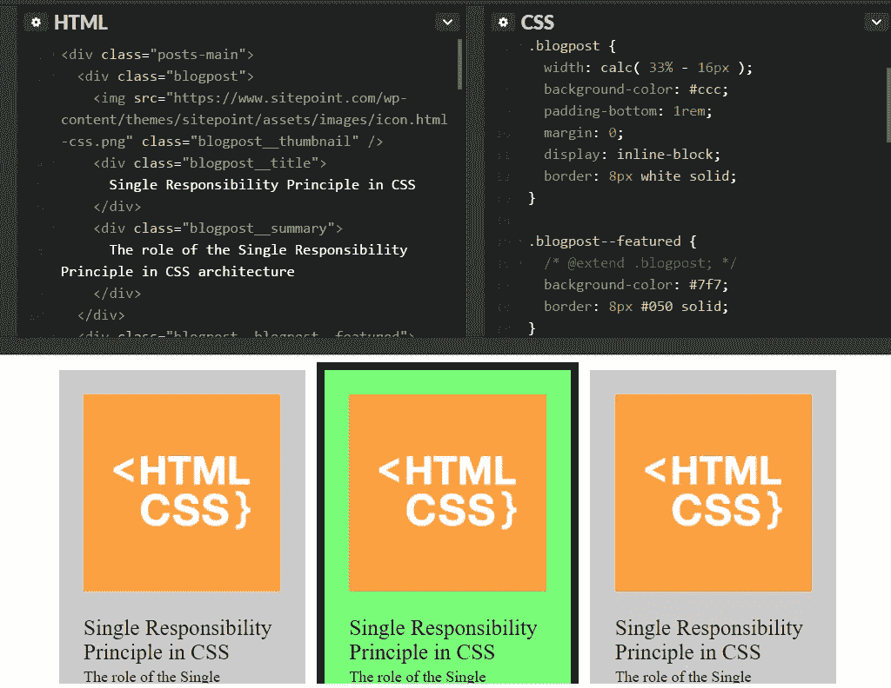
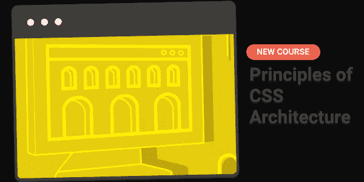

# CSS 架构和可维护 CSS 的三大支柱

> 原文：<https://www.sitepoint.com/css-architecture-and-the-three-pillars-of-maintainable-css/>


## CSS 架构的元素

如果你曾经继承了糟糕的 CSS 并负有维护它的责任，你可能会对将来维护你的代码的其他人产生共鸣。在极端情况下，开发人员别无选择，只能完全重写应用程序的 CSS。当每个补丁引入多个不希望的副作用时，就会出现这些极端的情况。一旦到了这一步，样式表就变得不可维护了。

你只能通过现在做出架构上可靠的决定来避免给你未来的自己一个将死的机会。这就是为什么在实践中了解构建一个可维护的 CSS 架构的细节是很重要的。

如果你不想成为传递糟糕代码的人，你可能想知道如何从头开始创建可维护的 CSS。你会从哪里开始？让我们看看在构建您的完美项目时值得考虑的 CSS 架构元素。

## 可维护 CSS 的三大支柱

在设计软件系统的 CSS 架构时，有三个概念值得考虑。这些概念非常基本，我们可以把它们看作支撑建筑结构的支柱。我们需要所有这三个支柱来使我们的 CSS 经受住时间的考验，并且不会崩溃成不可维护的混乱。

第一个支柱定义了 CSS 架构的**构件**。这些构建块由各种各样的解决方案和工具组成，比如使用 [Sass](https://www.sitepoint.com/getting-started-with-sass/) ，编写高效的 CSS 选择器，[block-element-modifier](https://www.sitepoint.com/css-architecture-block-element-modifier-bem/)(BEM)语法，使用类代替 ID 属性，以及在适当的地方使用相对单元。

虽然这种观点给你的 CSS 代码质量带来了可测量的改进，但是我们需要更高层次的组织来使我们的努力系统化。因此，我们需要第二个支柱，关注构建模块的**编排，以建立稳固的、可维护的、层次化的 CSS。把这一层想象成你的 CSS 架构的骨架。如果你对两个现成的 CSS 架构感兴趣，多研究一下 [ITCSS](https://www.sitepoint.com/atomic-oobemitscss/) 和 [SMACSS](https://www.sitepoint.com/bem-smacss-advice-from-developers/) 。**

不幸的是，无论是构建模块，还是框架或 CSS 架构的有条不紊的使用，都不能给你写出坚如磐石、可维护的 CSS 的答案。通过**软件工程原理**的应用，我们的代码变得坚实。这是编写可维护 CSS 的第三个支柱。

## 将软件工程原理应用于 CSS

持久的工程软件有许多不同的原则。

通过确保你的 CSS 代码以可维护的方式模拟现实，这些原则负责提供使用你选择的 CSS 工具和解决方案的目的。如果没有这些原则，使用任何 CSS 架构都只是一种仪式。一旦代码变得不可维护，不遵守软件工程原则编写 CSS 往往会在它的重压下崩溃。

如果你是一个对一些编程语言有经验的软件工程师，你可能会发现将这些原则应用于像 CSS 这样的声明性语言是相当令人惊讶的。然而在实践中，CSS 已经成为一种成熟的语言，与其他语言类似，结构是对所需代码的深思熟虑。让我们来研究一些主要的原则。

### 关注点分离

**关注点分离**是一个软件设计原则，负责定义软件解决方案中清晰分离的职责。CSS 最明显的应用是用于样式的类和用于功能的类之间的分离。样式类不应该出现在 JavaScript 代码中，功能相关类也不应该出现在样式表中。

### 坚实的原则

罗伯特·c·马丁定义了五个坚实的原则。其中一些原则适用于 CSS，也适用于其他编程语言。

在我关于 CSS 架构的课程中，你会发现许多不同的应用程序详细说明了如何在 CSS 代码的上下文中使用这些坚实的原则，包括**单一责任原则**和**开闭原则**。

当谈到样式表层次结构时，我们应用单一责任原则。例如，ITCSS 体系结构中的一层包含复位或规格化器。标记样式建立在规范化器上，组件样式建立在标记样式上。每一层都有一个明确定义的职责。

将软件工程原理应用于 CSS 代码的最著名的例子可能是**干**和**湿** CSS 之间的对比。首字母缩写 DRY 代表不要重复自己，而 WET 代表我们喜欢打字。

干燥代码会带来更好的可维护性，因为无论何时对干燥代码进行更改，您都可以在一个地方执行该更改，并且非常确定，您不必研究 CSS 代码库的其余部分来查找相同代码的其他出现。

当你的 CSS 是湿的，你可以通过识别你的代码的公共部分来弄干它，并且**抽象**这个公共功能到一个基类中(或者如果使用一个预处理器的话是一个 mixin)。

在代码中使用基类和子类被称为**继承**，在 Sass 中使用[@ extend](https://www.sitepoint.com/the-benefits-of-inheritance-via-extend-in-sass/)来执行。当我们使用 mixin，或者使用 Sass 术语的 [@mixin 指令](https://www.sitepoint.com/sass-basics-the-mixin-directive/)时，我们使用**组合**。继承、组合和 Sass 常量的使用是执行抽象的很好的工具。

## 在 CSS 中尝试合成

让我们来看一个实际的例子。假设我们的代码库中有四种类型的矩形。普通矩形、圆角矩形、绿色矩形和圆角绿色矩形。

我们可以使用 BEM 命名约定标记每个矩形组件，如下所示:

```
<div class="rectangle"></div>
<div class="rectangle--rounded"></div>
<div class="rectangle--green"></div>
<div class="rectangle--rounded--green"></div>
```

让我们使用继承在 Sass 中定义这四个类。我们从`.rectangle`的基类开始，然后使用 Sass `@extend`创建从基类继承样式的修饰符类:

```
.rectangle {    
  width: 200px;  
  height: 100px;  
  margin: 20px;  
  padding: 20px;  
  display: inline-block;  
  border: 1px solid black;
}
.rectangle--rounded {  
  @extend .rectangle;
  border-radius: 20px;
}

.rectangle--green {  
@extend .rectangle; 
  background-color: green;
}

.rectangle--rounded--green {  
  @extend .rectangle--rounded;  
  @extend .rectangle--green;
}
```

结构很清楚，我们在修改后的课程中不再重复。然而，创建一个包含五个修饰符的层次结构将会产生 31 个类定义，其中大多数定义只包含一组`@extend`指令。

组合给了我们一个更坚固的结构。为了创建一个完全灵活的结构，我们所需要的就是通用的 rectangle 类和两个 mixins:

```
@mixin rounded {  
  border-radius: 20px;  
}

@mixin green { 
  background-color: green;
}
```

假设我们有一个特殊的特征框。

```
<div class="feature-box"></div>
```

如果特征框是圆形的，但不是绿色的，我们需要做的就是扩展 rectangle 类，并包含使矩形变圆的 mixin:

```
.my-rectangle {  
  @extend .rectangle;  
  @include rounded;  
}
```

结构保持灵活，没有为每个组合定义类的开销。

## 迈向更好的 CSS 架构

我们可以得出结论，软件工程原则适用于 CSS，就像适用于任何其他编程语言一样。这些原则位于两个层次之间:CSS 构建块的微观层次，以及这些构建块的宏观层次结构。因此，在创建可维护的 CSS 时，学习如何在实践中应用这些原则是有益的。

为了帮助解释和演示这些原则的实际应用，我创建了一个关于坚如磐石的 CSS 架构的课程；[CSS 架构原理](https://www.sitepoint.com/premium/courses/principles-of-css-architecture-2969)

在本课程中，我们探索 CSS 架构的所有三个支柱，重点强调软件工程原则。你不仅会在理论上学到这些原理，还会有机会在很多实际例子中用到它们。



例如，我们将获取一堆博客文章，并确定为什么提供的 CSS 代码是不可维护的。我们一步一步地走完了重构 CSS 的过程，应用了本文中简要介绍的和课程视频中深入讨论的原则。

我已经专门用了一整节的篇幅，通过使用 ITCSS 体系结构和 Sass 创建一个小型组件库来实践 CSS 体系结构的三大支柱。如果你有兴趣学习更多关于 CSS 架构的知识，[报名参加](https://www.sitepoint.com/premium/courses/principles-of-css-architecture-2969)课程，里面见！

[](https://www.sitepoint.com/premium/courses/principles-of-css-architecture-2969)

## 分享这篇文章