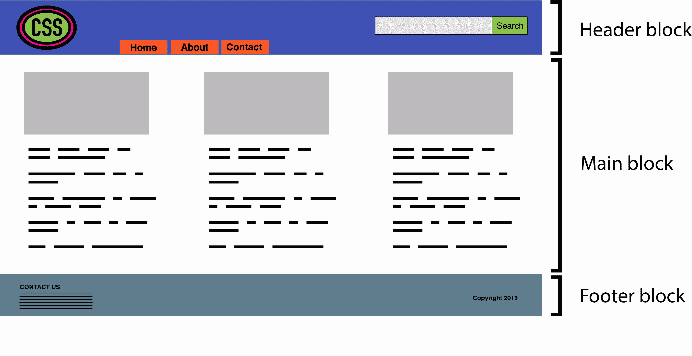
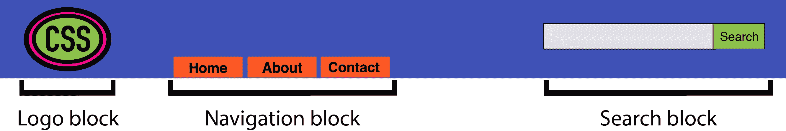
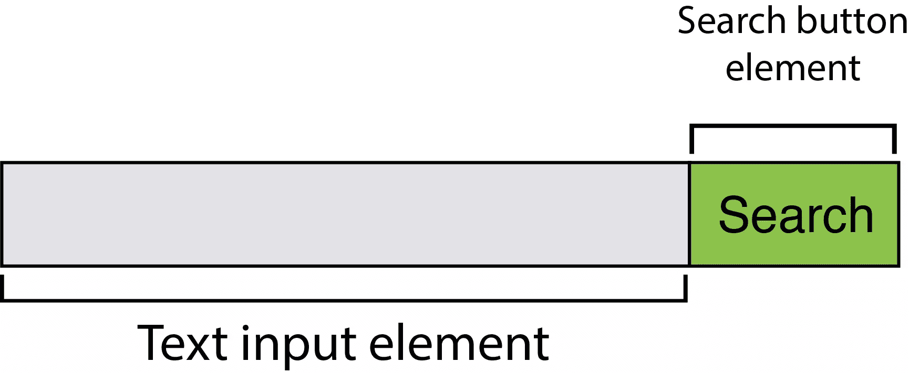
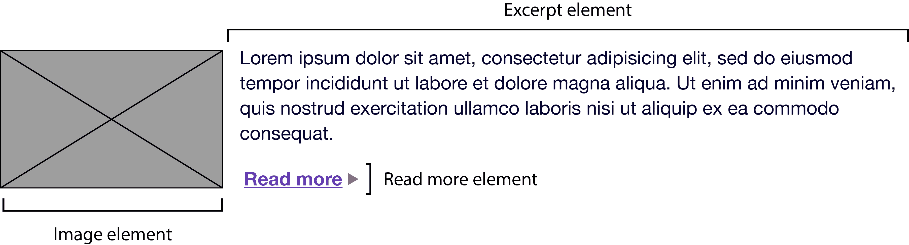

# CSS 架构:块元素修改器(BEM)和原子 CSS

> 原文：<https://www.sitepoint.com/css-architecture-block-element-modifier-bem-atomic-css/>

*以下是蒂芙尼新书《CSS 大师，第二版》的简短摘录。*

在这篇文章中，我们将看看在 CSS 中命名事物的两种方法。这两种方法都是为了改进大型站点和大型团队的开发过程而创建的；然而，对于一个人的团队来说，它们同样适用。无论你选择其中一个，都不选，还是两者都选，都取决于你。介绍它们的目的是帮助你思考编写你自己的 CSS 的方法。

### 块元修正器

BEM 或 Block-Element-Modifier 是一种方法论、一种命名系统和一套相关工具。创建于 [Yandex](https://www.yandex.com/) 的 BEM 是为大型开发团队的快速开发而设计的。在这一节中，我们将关注概念和命名系统。

BEM 方法论鼓励设计者和开发者把一个网站想象成一个可重复使用的组件*模块*的集合，它们可以混合和匹配来创建界面。一个**块**仅仅是文档的一部分，比如页眉、页脚或侧边栏，如下图所示。可能令人困惑的是，“块”在这里指的是组成页面或应用程序的 HTML 片段。



块可以包含其他块。例如，标题块可能还包含徽标、导航和搜索表单块，如下所示。页脚块可能包含站点地图块。



比块更细粒度的是**元素**。正如 [BEM 文档所解释的](https://en.bem.info/method/definitions/):

> 元素是执行特定功能的块的一部分。元素是上下文相关的:它们只在它们所属的块的上下文中有意义。

例如，一个搜索表单块包含一个文本输入元素和一个提交按钮元素，如下图所示。(为了澄清，我们在设计元素的意义上使用“元素”,而不是 HTML 元素的意义。)



另一方面，主内容块可能有一个文章列表块。这个文章列表块可能包含一系列文章推广块。并且每个文章宣传块可以包含图像、摘录和“阅读更多”元素，如下所示。



块和元素共同构成了边界元命名规则的基础。根据边界元法的规则:

*   块名在项目中必须是唯一的
*   元素名称在块中必须是唯一的
*   一个块的变体——比如一个黑色背景的搜索框——应该在类名中添加一个修饰符

块名和元素名通常由双下划线(`.block__element`)分隔。块名和元素名通常用双连字符与修饰符名分开(例如，`.block--modifier`或`.block__element--modifier`)。

下面是使用搜索表单示例时 BEM 的样子:

```
<form class="search">
    <div class="search__wrapper">
        <label for="s" class="search__label">Search for: </label>
        <input type="text" id="s" class="search__input">
        <button type="submit" class="search__submit">Search</button>
    </div>
</form> 
```

带有深色背景的此表单的变体可能使用以下标记:

```
<form class="search search--inverse">
    <div class="search__wrapper search__wrapper--inverse">
        <label for="s" class="search__label search_label--inverse">Search for: </label>
        <input type="text"  id="s" class="search__input search__input--inverse">
        <button type="submit" class="search__submit search__submit--inverse">Search</button>
    </div>
</form> 
```

我们的 CSS 可能看起来像这样:

```
.search {
    color: #333;
}
.search--inverse {
    color: #fff;
    background: #333;
}
.search__submit {
    background: #333;
    border: 0;
    color: #fff;
    height: 2rem;
    display: inline-block;
}
.search__submit--inverse {
    color: #333;
    background: #ccc;
} 
```

在我们的标记和 CSS 中，`search--inverse`和`search__label--inverse`是*附加的*类名。他们不是`search`和`search__label`的替代品。类名是 BEM 系统中唯一使用的选择器类型。可以使用子代和后代选择器，但是后代也应该是类名。禁止使用元素和 ID 选择器。强制块和元素名称的唯一性还可以防止命名冲突，这可能会成为团队中的一个问题。

这种方法有几个优点:

*   新团队成员很容易阅读标记和 CSS，并理解其行为
*   增加更多的开发人员可以提高团队的生产力
*   一致的命名减少了类名冲突和副作用的可能性
*   CSS 独立于标记
*   CSS 是高度可重用的

有更多的事情要做，而不是一章中的某一节就能轻松完成的。BEM 站点更详细地描述了这种方法，并提供了一些工具和教程来帮助您入门。要了解更多关于 BEM 命名约定方面的内容，另一个很棒的资源是 [Get BEM](http://getbem.com/introduction/) 。

## 原子 CSS

如果 BEM 是业界宠儿，Atomic CSS 就是它叛逆的特立独行者。雅虎的 Thierry Koblentz 在他 2013 年的文章《[挑战 CSS 最佳实践](http://www.smashingmagazine.com/2013/10/21/challenging-css-best-practices-atomic-approach/)》中对原子 CSS 进行了命名和解释。这些类名通常是缩写的，并且与它们影响的内容无关。在原子 CSS 系统中，您可以知道类名的作用——但是类名(至少不是样式表中使用的那些)和内容类型之间没有关系。

让我们用一个例子来说明。下面是我们称之为传统 CSS 架构的一组规则。这些规则集使用描述它们所应用的内容的类名—全局消息框，以及“成功”、“警告”和“错误”消息框的样式:

```
.msg {
    background-color: #a6d5fa;
    border: 2px solid #2196f3;
    border-radius: 10px;
    font-family: sans-serif;
    padding: 10px;
}
.msg-success {
    background-color: #aedbaf;
    border: 2px solid #4caf50;
}
.msg-warning {
    background-color: #ffe8a5;
    border-color:  #ffc107;
}
.msg-error {
    background-color: #faaaa4;
    border-color: #f44336;
} 
```

要创建一个错误消息框，我们需要将`msg`和`msg-error`类名添加到元素的`class`属性中:

```
<p class="msg msg-error">An error occurred.</p> 
```

让我们对比一下原子系统，在原子系统中，每个声明都成为自己的类:

```
.bg-a {
    background-color: #a6d5fa;
}
.bg-b {
    background-color: #aedbaf;
}
.bg-c {
    background-color: #ffe8a5;
}
.bg-d {
    background-color: #faaaa4;
}
.bc-a{
    border-color: #2196f3;
}
.bc-b {
    border-color: #4caf50;
}
.bc-c {
    border-color:  #ffc107;
}
.bc-d {
    border-color:  #f44336;
}
.br-1x {
    border-radius: 10px;
}
.bw-2x {
    border-width: 2px;
}
.bss {
    border-style: solid;
}
.sans {
    font-style: sans-serif;
}
.p-1x {
    padding: 10px;
} 
```

那就多了很多 CSS。现在让我们重新创建我们的错误消息组件。使用原子 CSS，我们的标记变成:

```
<p class="bw-2 bss p-1x sans br-1x bg-d bc-d">
    An error occurred.
</p> 
```

我们的标记也更加冗长。但是当我们创建一个警告消息组件时会发生什么呢？

```
<p class="bw-2 bss p-1x sans br-1x bg-c bc-c">
    Warning: The price for that item has changed.
</p> 
```

更改了两个类名:`bg-d`和`bc-d`被替换为`bg-c`和`bc-c`。我们重用了五个规则集。现在，让我们创建一个按钮:

```
<button type="button" class="p-1x sans bg-a br-1x">Save</button> 
```

嘿现在！这里我们重用了四个规则集，并避免向样式表中添加更多的规则。在一个健壮的原子 CSS 架构中，添加一个新的 HTML 组件，比如一个文章侧边栏，不需要添加更多的 CSS(尽管，实际上，可能需要添加更多)。

原子 CSS 有点像在你的 CSS 中使用实用类，但是更极端。具体来说，它:

*   通过创建高粒度、高度可重用的样式，而不是为每个组件创建一个规则集，来保持 CSS 的整洁
*   通过使用低特异性选择器系统，大大减少了特异性冲突
*   一旦定义了初始规则集，就可以快速开发 HTML 组件

然而，原子 CSS 并非没有争议。

### 反对原子 CSS 的理由

原子 CSS 几乎违背了我们在编写 CSS 时所学的一切。感觉几乎和到处贴`style`属性一样错误。事实上，对原子 CSS 方法的主要批评之一是它模糊了内容和表示之间的界限。如果`class="fl m-1x"`将一个元素向左浮动并增加了 10 个像素的边距，当我们不再希望该元素向左浮动时，我们该怎么办？

当然，一个答案是从我们的元素中移除`fl`类。但是现在我们正在改变 HTML。使用 CSS 的全部原因是为了使标记不受表示的影响，反之亦然。(我们也可以通过从样式表中删除`.fl {float: left;}`规则来解决这个问题，尽管这会影响每个类名为`fl`的元素。)尽管如此，更新 HTML 可能是微调 CSS 的一个小代价。

在科布伦茨的原始帖子中，他使用了类名，如用`.M-10`代表`margin: 10px`，用`.P-10`代表`padding: 10px`。这种命名约定的问题应该是显而易见的。将边距改为 5 或 20 像素意味着我们需要更新我们的 CSS *和*我们的 HTML，否则会有类名无法准确描述其效果的风险。

使用类名如`p-1x`，如本节所做的，解决了这个问题。类名的`1x`部分表示一个比率，而不是定义的像素数。如果基础填充是五个像素(即`.p-1x { padding: 5px; }`，那么`.p-2x`将设置十个像素的填充。是的，这并没有很好地描述类名的作用，但是这也意味着我们可以在不更新 HTML 的情况下修改 CSS，也不会产生误导性的类名。

原子 CSS 架构不会阻止我们在标记中使用描述内容*的类名。您仍然可以将`.button-close`或`.accordion-trigger`添加到代码中。这样的类名实际上更适合 JavaScript 和 DOM 操作。*

### BEM 与原子 CSS

当有大量开发人员并行构建 CSS 和 HTML 模块时，BEM 的效果最好。它有助于防止大型团队产生的错误和缺陷。它的伸缩性很好，部分原因是命名约定是描述性的和可预测的。BEM 不仅仅是大型团队的 T1，它对大型团队的 T3 也很有效。

当有一个小团队或单个工程师负责开发一组 CSS 规则，由一个更大的团队构建完整的 HTML 组件时，原子 CSS 会工作得更好。有了原子 CSS，开发人员只需查看样式指南或 CSS 源代码，就可以确定特定模块需要哪组类名。

### 知道什么时候走自己的路

实际上，你的 CSS 可能包含了多种方法。除了影响布局的实用程序类名之外，您可能还有描述内容或组件的类名。如果您不能完全控制标记，就像使用 CMS 一样，那么这两种方法都没有用。您甚至可能需要使用长的和特定的选择器来实现您想要的。

## 分享这篇文章