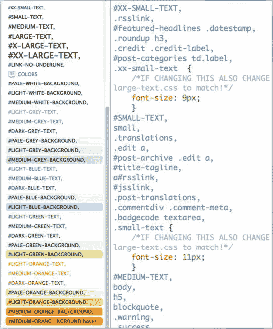

# CSS 架构:可扩展和模块化的方法

> 原文：<https://www.sitepoint.com/css-architectures-scalable-and-modular-approaches/>

随着在线行业的成熟，处理大型网站代码的方法也越来越成熟。更简洁的 CSS 是一个很好的起点，但是前端开发人员可以通过应用日益流行的可扩展 CSS 架构的方法将网站的样式表提升到另一个水平。

通过完整地使用一种方法，或者从所有方法中选择一些原则和实践，您可以告别困扰大型网站 CSS 的问题，例如冗长和难以阅读的代码，难以维护和更新，以及造成代码膨胀的冗余。

## 诊断 CSS 膨胀的根源

如果您发现了以下任何症状或疾病，那么让您的样式表模块化和更具可伸缩性正是医生的要求。为了正确处理事情有多糟糕，搜索某些属性，看看数字告诉你什么。在妮可·沙利文的演讲《大规模 CSS 的五大错误》中，她提供了一个标准来诊断几个关键属性过剩的根源:

*   大量的浮动意味着有一个无效的或不存在的网格。
*   大量的边距意味着你需要一个 [reset.css](http://meyerweb.com/eric/tools/css/reset/) (或者 normalize.css)。
*   大量的填充意味着设计参数不明确，因此多个开发人员对细节进行了大量调整。
*   大量的字体大小意味着级联没有被利用。标题可能也隐藏在带有字体大小的规则集中。
*   大量的！重要意味着该属性被用于覆盖特异性，并且级联没有被利用。

这听起来耳熟吗？没关系，你得到了很好的帮助，因为现在你已经诊断出了 CSS 膨胀的根源，我们可以讨论一些万无一失的治疗方法了。

## 可扩展和模块化方法:要点

不同可伸缩方法的主要概念可以归结为两个核心实践:

### 1.减少、再利用和回收

*减少*意味着在选择器中编写尽可能最短的元素链，并删除元素限定符，其中大部分我在[的上一篇文章](https://www.sitepoint.com/css-architectures-new-best-practices/)中讨论过。同样重要的是，通过优先选择类而不是 id 来创建合适的选择器，避免使用元素，并使用组合选择器来更直接地定位页面上所需的元素。

重用包括创建通用类而不是过于具体的类，以及组合类来创建不同的视觉效果。

*回收利用*包括更好地利用级联来减少冗余的样式声明，用最少的代码模块化页面组件，并通过子类化来扩展模块。

### 2.组织、构建和通知

提供良好的、组织良好的信息对于清晰和理解是至关重要的。第一篇文章中列出的实践，比如在样式表中提供开发人员信息，以及根据文档本身创建一个结构(通过对文档中的样式进行分类)，在可伸缩的方法中扮演着重要的角色。但是，开发人员可以通过将样式类别分解成多个文档来添加更多的结构，通过可重用类的命名约定来指示结构和含义，并通过网格建立页面结构。网站风格指南是确保团队充分了解风格、结构和术语的最后一个组成部分。

## 可扩展和模块化方法概述

既然我已经介绍了关键概念，让我们通过对处理大型 CSS 项目的最著名和最流行的方法的概述，来看看支持这些概念的具体实践。我将介绍的方法包括 DRY(不要重复)CSS、面向对象的 CSS (OOCSS)、面向 CSS 的可扩展和模块化架构(SMACSS)以及面向成年人的 CSS。

### 干 CSS

学习和应用 CSS 的便利性由于语言缺乏逻辑性而大打折扣。与拥有可重用组件(如变量和函数)的编程语言不同，CSS 几乎鼓励对选择器和属性值对的公然重用。事实上，即使在冗余和臃肿的时候，CSS 的功能也是完美的。

[干 CSS](http://www.slideshare.net/jeremyclarke/dry-css-a-dontrepeatyourself-methodology-for-creating-efficient-unified-and-scalable-stylesheets) 是基于把软件开发的“[不要重复自己](http://programmer.97things.oreilly.com/wiki/index.php/Don%27t_Repeat_Yourself)的原则非常字面化。没错:在编写 CSS 代码时，目标是永远不要重复属性-值对。永远不会。我知道这看起来相当…啊，*激烈*，但这是可以做到的。

#### 让你的团队行动起来(可以这么说)

干 CSS 的核心是分组，从根本上来说，它需要结构、组织、减少和回收。DRY CSS 的设计者 Jeremy Clarke 建议创建具有共享属性的选择器组，而不是像编写 CSS 时那样为每个选择器分别重复属性-值对。虽然一个组可能有许多选择器，但每个属性值对只定义一次。

这些组实际上定义了共享属性。使用 DRY CSS，您必须放弃根深蒂固的基于语义命名类和 id 的习惯，比如。例如警报盒。相反，组使用基于其外观或其在设计中的角色的描述性名称，如。圆角—但是所有共享该属性的选择器都应该用该样式分组。虽然这样做消除了混合和匹配的可能性，但确实减少了代码量。

你如何创建一个小组？首先，根据小组在设计中的角色为其命名。然后使用组名作为列表顶部的 ID 和底部的类。然后将其余共享属性的选择器添加到它们共享的描述性类名之上。Jeremy 在他的演讲“ [DRY CSS:一种创建高效、统一和可伸缩的样式表的方法学](http://simianuprising.com/2012/03/07/video-of-my-dry-css-talk/)”中给出了图 1 所示的例子


**图一。** **干 CSS 分组例子**

那些看起来不属于一个组的选择器怎么办？“干燥”CSS 的另一个目标是使单个选择器尽可能的稀少，只在例外情况下使用它们。这意味着当你编码的时候，你需要进行一次精神锻炼。当你为一个选择器创建一个样式声明时，总是问“为什么它不是一个组的一部分？”—然后想办法让它成为一个团体的一部分，如果可以的话。

一旦你创建了小组，你需要考虑组织他们。Clarke 建议使用颜色、文本、形状、结构和模块作为类别，但他也鼓励开发人员创建他们认为最适合项目的类别。

#### 利益

在他关于 DRY CSS 的演讲中，Clarke 列举了这种方法的许多好处。以下是我认为最有说服力的一些例子:

*   减小 CSS 文件的大小。很明显，这是首要目标，通过使用干 CSS 你不仅仅实现了它。
*   优化元素并一般化选择器。当你看到它们的相互关联以及它们是如何被遗传的时候，这种情况就会增加。
*   对群组的编辑会影响其所有成员，这有助于保持一致性。你可以看到一个组的成员同时改变，这比改变许多单独的选择器有很大的优势。
*   HTML 保持不变。这对于生成的 HTML 不容易控制的站点很有用，比如内容管理系统或博客工具。
*   鼓励通过设计元素/风格和设计模式及其一致性进行思考。这促进了良好的设计实践和统一的更新。

Clarke 还断言，DRY CSS 可以与其他可伸缩的架构集成，比如 OOCSS 和 SMACSS。

#### 成功

Clarke 在将他的方法应用到全球之声网站上取得了巨大的成功，该网站还必须支持多种语言的本地化。据 Clarke 称，在开发和应用干式 CSS 时，网站的样式表从大约 4500 行增加到 2400 行。这是一个大多数前端开发人员都会欢迎的改进。

### OOCSS

[面向对象的 CSS](https://github.com/stubbornella/oocss/wiki) 从模式识别开始:确定哪些页面元素结构相似，在网站上经常使用。一旦确定了模式，就可以将设计元素制作成模块。然后，该模块可以为它在站点中显示的不同方式进行皮肤处理。

OOCSS 有两个关键原则。第一种是将结构和表示分离开来(或者将结构从“皮肤”中分离出来)，这意味着将元素的结构从其外观中分离出来，并将外观视为“皮肤”这个原则应该不难实现，因为它类似于 Web 标准的基本原则之一:表示和内容的分离。

第二个原则是分离容器和内容，这意味着使用特定于元素的样式，并且不依赖于位置。创建 CSS 选择器的常见方式是将 ID 或类附加到 DOM 中的高层元素(如)，然后创建长链选择器来创建元素的变体。这种做法造成了最令人发指的 CSS 违规行为，导致样式表难以使用和维护。相反，在 OOCSS 中，容器是通过扩展来修改的，这实际上是根据内容来改变容器。换句话说，您添加了一个额外的 CSS 类来提供外观上的差异。

Sullivan [将 OOCSS 方法分解为以下步骤](http://www.slideshare.net/stubbornella/the-fast-and-the-fabulous):

1.  确定站点范围内可重用的元素，如标题、列表(动作列表、外部链接列表、产品列表或功能列表)、模块页眉和页脚、网格、按钮、圆角框、选项卡、传送带、切换块。
2.  描述以下内容:
    *   容器和内容
    *   结构和皮肤
    *   轮廓和背景
    *   对象和混合
3.  混合搭配容器和内容对象，实现高性能设计。
4.  为了视觉上的不同，对模块进行皮肤处理。皮肤/主题是模块的表现形式——它看起来是什么样子。我们的目标是拥有非常可预测的皮肤，只改变容易计算或测量的值。

### 模块:站点的构建块

OOCSS 的许多实践都是建立在可重用组件之上的。沙利文将这些组件比作乐高积木，并将它们称为模块。模块的目标是既不依赖于 DOM 树，也不依赖于特定的元素类型。它应该足够灵活，以适应不同的容器，并很容易被皮肤。

识别、创建和使用一个模块是 OOCSS 的一个非常枯燥的方面。通过找到共同的元素和表现形式，并将它们抽象成可重用的代码模块，前端开发人员不会重复自己，而是真正地实践减少、重用和回收。

Sullivan 的模块就是一个很好的例子，它可以处理带有各种形式和化身的文本的图像。媒体模块。的。开发媒体模块是为了处理浮动到文本旁边的图像实例和相关的排列。她给出了媒体模块可以采取的各种形式的例子。

以下是构成媒体模块结构的 HTML:

```
<!-- media -->
	<div class="media">
	  

	  <div class="text">
	...
	  </div>
	</div>
```

初始模块的 CSS 建立了样式的基础，任何差异都来自于样式的扩展以及元素的外观。

```
/* ====== media ====== */
	.media {margin:10px;}
	.media, .bd {overflow:hidden; _overflow:visible; zoom:1;}
	.media .img {float:left; margin-right: 10px;}
	.media .img img{display:block;}
	.media .imgExt{float:right; margin-left: 10px;}
```

媒体模块只是冰山一角。更多的模块，包括按钮、网格、传送带和内容，都在 GitHub 的 OOCSS 项目中。

#### 利益

采用 OOCSS，或者至少是系统的元素，可以节省许多行代码。此外，它提供了一种易于沙盒化的方法，团队中的每个人都可以使用。

#### 成功

Sullivan 应用 OOCSS 的最大和最著名的网站之一是脸书。根据她在演讲中给出的数字 [CSS 膨胀](http://www.slideshare.net/stubbornella/css-bloat)，她和脸书团队将 CSS 每页字节数减少了 19%，HTML 每页字节数减少了 44%。仅仅是标题，他们就将数量从 958 个减少到 25 个，并将网站的响应时间减少了一半。

### SMACSS

SMACSS([https://smacss.com/](https://smacss.com/))是另一种为大型网站编写可伸缩的模块化 CSS 的方法。根据它的创造者 Jonathan Snook 的说法，“ [SMACSS 是关于识别你的设计中的模式并把它们编码。](http://smacss.com/book/prototyping)“当然，我有偏见，但是我们可以将“编码”模式简单地作为描述核心租户的另一种方式(减少、重用和回收；组织和结构)，我们能不这样吗？

Snook 有几个将组织和结构应用于大型 CSS 项目的实践。SMACSS 的核心是 CSS 规则的分类。类别有助于设计模式变得更加明显，从而使开发人员能够更好地定义这些模式。

Snook 建议的类别有:

*   [Base](http://smacss.com/book/type-base)—这些是默认样式，通常用于单一元素选择器。
*   [布局](http://smacss.com/book/type-layout)—将页面分成几个部分，通常将模块放在一起。
*   [模块](http://smacss.com/book/type-module)——设计中可重用的、模块化的部分:标注、侧栏、产品列表等等。
*   [状态](http://smacss.com/book/type-state)—描述模块或布局在特定状态下的外观，在不同的页面视图中也是如此。
*   主题描述模块或布局的外观。

在小型项目中，这些都可以在同一个文件中。在较大的项目中，建议使用多个文件。

然而，分类有一个技巧，它涉及到思考样式实际上做什么，以及它们适用于网站、设计和功能的哪个部分。这迫使开发人员在构建过程中问“我们将如何编码，为什么我们要这样编码？”因此，类别中隐含了如何使用样式的指导原则，这进一步有助于防止跨类别混合使用样式。

#### 名称又能代表什么呢

SMACSS 的下一个重要部分是命名风格规则。清晰的类名是了解样式规则所属的类别以及它在页面大计划中的作用的关键方法之一。

为了指出布局、模块和状态风格之间的区别，Snook 建议在类名后面加上前缀。例如，对于 layout，您可以添加 l-或 layout-，创建一个类名，如。放在一边或者。布局-一边去。若要指示创建状态更改的类，请使用。是- *状态*，如。是-活动的还是。已经倒塌了。

为模块(包括导航栏、传送带、对话框、小部件、表格、图标等等)创建名称时，使用模块本身的名称。例如，一个示例模块将被适当地调用。例(注意是类而不是 ID)。如果你需要给一个模块添加一个状态，你知道该怎么做:添加。is- *状态*，所以，一个折叠的 callout 模块会是. callout.is-collapsed。

扩展(或子类化)一个类怎么样？简单。不要使用模块的类名作为组合选择器的一部分(从而产生特殊性问题)，而是基于原始类创建一个新的类名。比如说。通过创建来扩展 pod。pod-callout，然后将这两种样式应用于该元素。对于新的样式，两种样式具有相同的特异性，因此新的样式规则可以很好地适用于第一种样式。

#### 关注好的、干净的代码，不要担心“类炎”

显然，SMACSS(很像 OOCSS)的目标之一是用最少代的元素创建浅的而不是深的选择器，尽可能争取最浅的选择器。如果你遵循本系列第[篇文章](https://www.sitepoint.com/css-architectures-new-best-practices/)中的建议，你就已经做得很好了。但是稍微提醒一下也无妨，所以为了帮助限制选择器中的元素数量，请遵循以下规则:

*   避免对公共元素使用标记选择器，除非它们是完全可预测的。使用类是更好的选择，即使你认为元素是可预测的。这包括用元素限定类。
*   使用类名作为最右边的(键)选择器。
*   使用子选择器(e > f)而不是后代选择器(e f)。

创建浅层选择器的另一个目标是消除选择器特异性的问题。确保在 CSS 中不会有任何特殊性战争的主要方法之一是避免选择器的 id。但是，不要完全忽视 IDs。在 SMACSS 中，可以将它们用于布局部分和 JavaScript 挂钩。

我们中的一些人已经有了老派的最佳实践“不要使用太多的类！”深深植根于我们的前端开发精神中。然而，对于 SMACSS(以及大多数可伸缩的 CSS 方法)，您最好向相关的元素添加类，并在 HTML 中重复该类，而不是创建和应用一组过于具体的样式，这是导致类炎的真正原因。您会发现使用多个命名良好的类澄清了意图，并增加了相关元素的语义。

#### 利益

SMACSS 的好处是从一开始就意识到编码的清晰性。类别有助于减少冗余，命名约定大大提高了在 CSS 中快速识别样式规则的效率。

#### 成功

Snook 根据他在大型 Web 项目中的工作经验开发了 SMACSS，其中最著名的是重新设计 Yahoo mail。他将自己的原则应用于大型团队构建的大型网站，取得了巨大的成功。

### 成年人的 CSS

安迪·休姆，成年人 CSS 的创造者，开玩笑地称他的系统为“坏脾气老人的 CSS”(你可以在这里看视频[。)像许多可扩展方法的创造者一样，Hume 担心我们的行业已经与陈旧的所谓最佳实践(具有讽刺意味的是，大多数最佳实践是由单独工作的开发人员创建的)结合在一起。他认为前端开发人员已经不知不觉地走上了一条创建 CSS 的道路，这在大多数项目中是令人恐惧和鄙视的。这种前端代码以荒谬的长度遵循 Web 标准，以保持内容和会话分离，但它不介意管理风格和项目复杂性。](http://www.youtube.com/watch?v=ZpFdyfs03Ug)

很明显，我们需要优化代码以适应变化。对于成年人来说，CSS 的目标是样式化模块，而不是页面，并且通过拥有一个可以重用的样式模块库来更进一步。

#### 像洋葱一样层层叠叠。或者蛋糕(或者冻糕) [*](http://www.hark.com/clips/psfbxymylw-theres-a-lot-more-to-ogres-than-people-think)

就像在 SMACSS 中使用类别一样，成年人的 CSS 描述了“层”中的样式样式的图层与以下内容相关:

*   文档—来自 HTML 代码、元素选择器。
*   基本样式—适用于元素选择器、印刷样式、颜色。
*   模块样式—列表、导航、推广框等。
*   布局样式—建立网格或列和页面布局。

当创建选择器时，要注意它们是文档、基础还是模块选择器，并努力将它们都保持在模块级别。你怎么知道？如果有一个标签作为选择器的一部分，它将是一个文档样式。但是，如果您为它创建了一个类，就可以从标签中释放它，并使它成为一个模块样式。

我们的目标是尽量避免与文档、基础或布局相关的样式，而是努力寻找与模块相关的样式。为什么？让我们看一个例子:

```
.promo-box h2 { ... }
```

该选择器是模块级选择器(。推广框)与文档级别选择器(h2)相结合。这在一开始是很好的，但是如果 HTML 的结构在某个地方改变了呢？

相反，我们应该努力使文档和模块的耦合不那么紧密，这样选择器就可以在将来进行伸缩。这个例子就是这么做的:

```
.promo-box-h { ... }
```

在这种情况下，样式不依赖于文档的元素，因此更加灵活和可移植，因为它可以应用于任何东西，甚至是 HTML 中尚未发明的元素。

#### 释放您的选择器名称，其余的将随之而来

成年人的 CSS 集中体现了组织、结构和信息的原则，这并不奇怪。根据 Hume 的说法，用清晰的、信息丰富的类名进行样式化“就像你的文档中的一个 API——一个 API 可以让你以最简单有效的方式对你的文档进行样式化。”类名应该是描述性的，并且应该在你所工作的站点的上下文中有意义。它们应该对在站点上工作的团队成员有意义，这样你就知道哪些共享术语可以重用。

像其他方法一样，面向成年人的 CSS 提倡创建和使用模块。像 OOCSS 和 SMACSS 方法一样，模块的名称应该是描述性的和语义性的，而不是与位置或外观联系在一起:

```
.promo-box { ... }
```

面向成年人的 CSS 有一套扩展或替代模块的方法。只需使用模块的名称，在名称后面加上两个破折号(–)，并为扩展名添加一个清晰、信息丰富的名称，如下所示:

```
.promo-box--light { ... }
```

两个破折号表示该样式是第一个样式的扩展，并且依赖于第一个样式。因此，它必须出现在 CSS 源顺序中的第一个样式之后，以便覆盖原始样式中的一个或多个样式规则。

#### 使用助手。做一个分享者

为了处理表示问题，Hume 建议使用“外科布局助手”，它们是提供填充或边距的独立类。这里有一个例子:

```
.margin-top {margin-top: 1em;}
```

这将是您可以添加到页面上任何需要它的元素的样式，而不是将该样式包装到组件中。然后，当模块需要在页面上垂直分隔时，可以根据具体情况使用这些类。在基本样式表中使用这些帮助器样式，以便在整个项目中轻松使用它们。

最后，强烈建议编写在线风格指南，以此来整理命名和已建立的结构，并向团队传播这些信息，使其可供那些将来工作、添加和更改网站的人使用。样式指南和相应的模块库需要在代码中，这样团队成员就不必重新发明轮子来实现重复的视觉样式。

#### 利益

正如 Hume 在 SXSW 2012 的演讲中所说，“没有人真的足够聪明来设计网页。”正因为如此，他认为我们需要某些约束和参数，就像 CSS 为成年人提供的那样。约束是好的——它们是管理复杂性的一种方式。Hume 为成年人开发了 CSS，作为一种管理大型网站、时间和开发团队中 CSS 复杂性的方法。此外，面向成年人的 CSS 创造了 Hume 所谓的“设计-开发接触点”，在这里，组织的设计语言被转化为代码，两个团队的明确合作产生了更高质量的产品。

#### 成功

面向成年人的 CSS 植根于 Hume 在 Clearleft 时所做的大量工作，clear left 有许多大客户，如 Channel 4、Amnesty International 和 Mozilla。现在他已经在 [Guardian](http://www.guardiannews.com/) 了，他已经成功地应用他的系统为那里的前端开发者创建了一个框架。

## 进步，而不是完美

在他的演讲[打破好习惯](https://vimeo.com/44773888)中，Harry Roberts 准确地指出“CSS 是一团乱麻，即使你清理它，它仍然是一团乱麻。”我们的目标是让我们的 CSS 更好，而不是完美。因此，请以开放的心态看待这些方法。记住，重点是不要让你自己疯狂地试图让你的 CSS 完全符合某种方法论。即使您只采用其中的一些技术，您仍然可以从可伸缩的更少代码行中获益。

可伸缩的和模块化的方法都有一些天才和智慧，尤其是当你从零开始编写项目代码的时候。但是，当您不得不处理堆积如山的现有 CSS 时，您会怎么做呢？下一篇文章将分享一个将秩序和理智引入 CSS 野兽的过程，敬请关注！

## 进一步阅读的链接

*   [构建 CSS——2012 年的发展状况](http://gotofritz.net/blog/geekery/structuring-css/)
*   [CSS 策略开始](http://viget.com/inspire/css-squareoff)
*   [CSS 架构](http://engineering.appfolio.com/2012/11/16/css-architecture/)
*   [CSS ID 选择器:永不言弃](http://nimbleworks.co.uk/blog/css-id-selectors-never-say-never/)

## 分享这篇文章