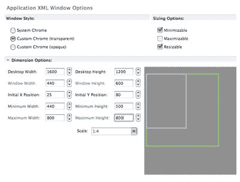
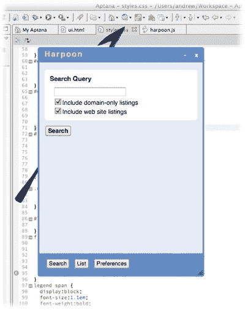
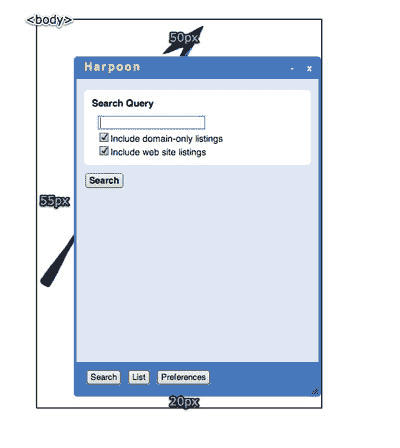
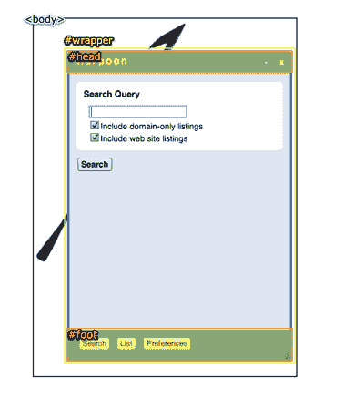
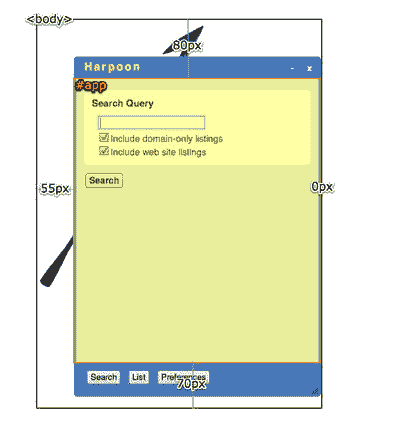
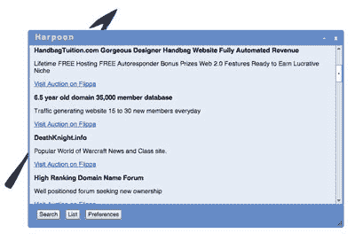
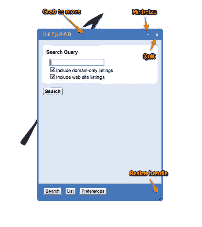

# 使用 Adobe AIR 将您的 CSS 带到桌面上！

> 原文：<https://www.sitepoint.com/css-desktop-adobe-air/>

因此，SitePoint 向我发出了一个挑战，要求我开发一个软件，以便写一篇关于这种体验的文章。我可以诚实地说，到目前为止，这是一次真正的重估——一次让我背叛了我所有根深蒂固的网络标准原则的经历。我是不是完全忘记了语义标记？是的。我是不是完全忽略了跨浏览器兼容性？是的。我是否考虑过使用 HTML 表格进行布局？是的。我是不是觉得不干净，但同时又很兴奋？是啊！

我用 Adobe AIR 构建了一个桌面应用程序，我很喜欢它！

是的，使用免费软件和 HTML、CSS 和 jQuery，我用 Adobe AIR 制作了自己的跨平台桌面应用程序。嗯，至少是一个开始。当你读这篇文章的时候要注意，因为之后会有一次测验。 **[回答测验](https://www.sitepoint.com/quiz/adobe/css-desktop-adobe-air/)，你就可以赢得 100 份免费的*Adobe Flex 3***入门之一。

挑战在于构建一个有用的应用程序(谢天谢地，不是另一个待办事项列表)来利用新的[flippa.com](http://flippa.com)网站——这是一个买卖网站的市场。这是我的想法。假设你有兴趣购买一个附有论坛的摄影网站。您打开这个应用程序，填写自定义搜索表单，然后看到匹配拍卖的列表。该应用程序将让你选择你想观看的拍卖，并在每次有新的出价时通知你。此外，它将继续轮询网站，查看是否有任何新的拍卖与您的搜索查询匹配，只使用 HTML、CSS、jQuery 和来自 flippa.com 的公开可用的 Atom 提要。

而且，我想叫它**鱼叉**。

##### 发展环境

AIR 使用 Safari 和 Chrome 中也使用的 WebKit 渲染引擎，因此即使您使用标准的 web 开发技术，您也只是在为一个渲染引擎进行开发。到目前为止，制作应用程序所需要的只是一个 HTML(ui.html)和 CSS 文件(styles.css)以及一些支持 JavaScript 文件。

有一个`application.xml`配置文件，但是你可以依靠 Aptana 来完成。Aptana 有一个 AIR 插件，使开发按钮变得简单。你可以在阿卡什·梅塔的文章 *[学习 Adobe AIR，第一部分:构建笔记存储应用](https://www.sitepoint.com/article/learn-adobe-air-part-1/)* 中了解如何设置它。除了有一个方便的 run 按钮可以让您测试运行 AIR 应用程序并进行调试之外，它还以选项卡的形式显示 application.xml 文件，以便于编辑。



除了使用 Aptana，您可以在任何您喜欢的编辑器中编辑文件。阿卡什还写了一篇文章描述这个过程，叫做 *[漫步云端:在五分钟内创建一个待办事项清单](https://www.sitepoint.com/article/adobe-air-todo-list-5-minutes/)* 。

##### 窗口布局

你可以用 AIR 做的一个很酷的技巧是制作一个没有窗口镶边和透明机身的应用程序。这使你可以随心所欲地设计你的应用程序。我的演示相当保守，但我想象有更高图形天赋的设计师将能够疯狂地创造各种富有想象力的应用程序布局。

这是我业余的努力:



我们的计划是创建以下内容:应用程序标题的标题栏、最小化控件、退出控件、容纳切换应用程序模式的控件的页脚，以及右下角的窗口大小调整手柄。标题栏和页脚之间是主要的应用区域。

在应用程序 XML 窗口设置中，您需要将窗口样式设置为自定义 Chrome(透明),如上图所示。我还将在调整选项中启用可最小化和可调整大小。

在摆弄了一会儿定位并试图使元素高度正确之后——使用 CSS 制作带有可滚动内容区域的固定页眉和页脚并仍然允许窗口调整大小实际上是相当棘手的——下面是我想到的 HTML:

```
<body> 

  <div id="wrapper"> 

    <div id="app"> 

      ... 

    </div> <!-- app --> 

    <div id="head"> 

      ... 

    </div> 

    <div id="foot"> 

      ... 

    </div> 

  </div> <!-- wrapper --> 

</body>
```

`body`元素是透明的，并且应用了一些填充，以便在我们的自定义窗口镶边之外看到背景图像。



下面是我们的 body 元素的 CSS:
 `body {
 font-family: Helvetica, Tahoma, Arial, sans-serif;
 font-size:14px;
 padding: 50px 0 20px 55px;
 margin: 0;
 background: transparent url(icons/harpoon.png) no-repeat fixed;
}`

应用程序接口被包装在元素`wrapper`中。这个元素的`height`和`max-height`设置为 100%。我们这样做是为了使`wrapper`元素总是填充视口，但不会扩展到比视口更大的尺寸，这将导致难看的滚动条出现并破坏布局。`wrapper`元素也需要相对定位，以便为`head`和`foot`元素提供定位上下文。



这是 CSS:

```
#wrapper { 

  position: relative; 

  padding: 0; 

  margin: 0; 

  height: 100%; 

  max-height: 100%; 

}
```

`head`和`foot`元素都是绝对定位的(相对于包装元素):带有`top: 0;`的 head 元素和用于`foot`元素的`bottom: 0;`。不过还有更多需要考虑的，因为虽然我希望这些元素 100%宽，但我也希望它们有一个圆形的边框。那么，有什么问题呢？嗯，如果你指定 100%的宽度并添加边框，根据盒子模型的规则，边框会增加盒子的宽度，使它们宽于 100%。这将导致各种各样的丑陋问题。

答案是`-webkit-box-sizing`属性。[`box-sizing`属性](https://reference.sitepoint.com/css/moz-box-sizing/)是一个 CSS3 属性，它切换用于该元素的盒子模型。WebKit 在定制的供应商扩展中支持它。如果我们将其设置为`border-box`，边框(和填充)将包含在指定的宽度内(就像旧的 IE5.x box 模型一样！).你知道，我真的以为我永远也不会需要使用那栋房子。这里让我指定 100%的宽度，然后应用填充和边框，不用担心会破坏布局。

同样值得注意的是，我使用了 WebKit 自定义`border-radius`扩展来制作漂亮的圆形边框。[关于这处房产已经写了很多，所以我在此不再赘述。您还会注意到我为 head 元素指定了`move`光标。这是因为它最终会成为移动窗口的把手。](http://www.css3.info/preview/rounded-border/)

这是 CSS:

```
#head, #foot { 

  position: absolute; 

  -webkit-box-sizing: border-box; 

  border: 6px solid #3378be; 

  width: 100%; 

  padding: 0 10px; 

  background-color: #3378be; 

} 

#head { 

  top: 0; 

  height: 35px; 

  -webkit-border-top-left-radius: 6px; 

  -webkit-border-top-right-radius: 6px; 

  cursor: move; 

} 

#foot { 

  bottom: 0; 

  height: 50px; 

  -webkit-border-bottom-left-radius: 6px; 

  -webkit-border-bottom-right-radius: 6px; 

}
```

现在我们到了有趣的部分。`app`元素需要根据窗口大小进行缩放，但也可以滚动。为了在允许`app`元素滚动的同时固定头部和脚部元素，需要使用`position: fixed;` CSS 属性值。固定定位意味着元素相对于视口定位。你可能忘记了`fixed`甚至对`position`地产也有效。缺乏对 IE6 的支持一直让它蒙在鼓里。但是这里不需要担心这个。WebKit 很好地支持它。实际上，IE7 和更高版本现在也支持它，所以你可以在设计网页布局时开始考虑它。

在将`position: fixed;`应用到`app`元素之后，我们还指定了`top`、`bottom`、`left`和`right`属性。这样做就不需要指定`height`或`width`；该元素将自动调整大小以适应需要。我们还添加了一个`min-height`和`overflow: auto;`来显示滚动条，如果需要的话。下面是显示结果的 CSS，如下图所示:

```
#app { 

  position: fixed; 

  top: 80px; 

  bottom: 70px; 

  left: 55px; 

  right: 0; 

  overflow: auto; 

  min-height: 300px; 

  ... 

}
```



好了，我们的布局完成了。为了向您展示它的灵活性，下面的应用程序显示了一个搜索结果列表，同时调整了大小:



##### 窗口控件

暂时忽略中间的应用程序区域，下一步是连接所有的窗口控件，比如最小化和退出按钮、窗口拖动和调整大小手柄。计划是这样的:



事实证明，添加自定义窗口控件非常容易。

最小化和退出按钮只是添加了一些 CSS 的两个 HTML 按钮。下面是标记:

```
<div id="window_control">  

  <button id="minimise_control">-</button>  

  <button id="quit_control">x</button>  

</div>
```

CSS 移除边框并应用`background-color`和一些其他属性:

```
#window_control button {   

  border: none;  

  background-color: #3378be;  

  color: #dae6f3;  

  font-weight: bold;  

  cursor: pointer;  

}
```

CSS 的效果可以在下图中看到，完成按钮在右边:


虽然我们可以使用 jQuery 连接驱动按钮功能的事件，但是我们还需要一个用于窗口 API 的 AIR JavaScript 文件。AIR 提供了一个名为`AIRAliases.js`的文件，它简单地公开了许多 AIR API 函数。我已经在我的`ui.html`文件的 HTML 头中添加了以下内容:

```
<script type="text/javascript" src="lib/air/AIRAliases.js"></script>  

<script type="text/javascript" src="lib/jquery/jquery-1.3.2.min.js"></script>  

<script type="text/javascript" src="scripts/harpoon.js"></script>
```

`harpoon.js`文件是我保存所有驱动应用程序的自定义 JavaScript 的地方。

首先，我们创建一个在应用程序启动时调用的函数。在这个函数中，我们将事件侦听器添加到窗口控件按钮，这些按钮将调用适当的 AIR 函数。我喜欢让我所有的自定义 JavaScript 保持整齐的命名空间，这样我就可以看到代码在哪里调用了自定义函数，而不是 jQuery 或 AIR 函数。事实上，我这样做主要是出于习惯，但这是一个好习惯。所以这里有一个`Harpoon`对象和一个名为`init`的函数，它将在应用程序启动时被调用；标准的 jQuery 方法非常适合这种情况:

```
var Harpoon = {  

  init : function() {   

    // application setup happens here  

  }  

}  

$(document).ready(function() {  

  Harpoon.init();  

});
```

然后我们创建一个名为`setupWindow`的函数，并从我们的`init`函数中调用它:

```
var Harpoon = {  

  init : function() {   

    Harpoon.setupWindow();  

  },  

  setupWindow : function() {  

  }  

}
```

现在我们准备添加事件侦听器。在我们的`setupWindow`函数中，我们将`click`事件的事件监听器绑定到每个按钮。这些函数将依次调用我们的自定义函数:`Harpoon.minimize`和`Harpoon.quit`:

```
setupWindow : function() {  

  $('#minimise_control').bind('click', function(event){  

    event.preventDefault();  

    Harpoon.minimize();  

  });  

  $('#quit_control').bind('click', function(event){  

    event.preventDefault();  

    Harpoon.quit();  

  });  

}
```

自定义函数调用适当的 AIR 函数。我们使用`nativeWindow.minimize`函数进行最小化控制:

```
minimize : function() {  

  nativeWindow.minimize();  

}
```

这就是我们需要为最小化按钮所做的一切(你认为这会很难吗？).quit 按钮的功能稍微复杂一点，但只是一点点:

```
quit : function() {   

  var exitingEvent = new air.Event(air.Event.EXITING, false, true);   

  air.NativeApplication.nativeApplication.dispatchEvent(exitingEvent);   

  if (!exitingEvent.isDefaultPrevented()) {   

    air.NativeApplication.nativeApplication.exit();  

  }   

}
```

这是 Adobe 推荐的标准方法。`air.NativeApplication.nativeApplication.exit`函数是实际关闭应用程序的函数，但是调用这个函数的风险是您可能会丢失未保存的数据。因此，Adobe 建议您首先创建一个名为退出事件的新事件:

```
var exitingEvent = new air.Event(air.Event.EXITING, false, true); 
```

然后将该事件分派给应用程序:

```
air.NativeApplication.nativeApplication.dispatchEvent(exitingEvent); 
```

在您的应用程序中，如果有任何数据在应用程序退出时有丢失的风险，您可以创建一个事件监听器并监听退出的事件。该事件侦听器应该取消退出事件，并在应用程序退出之前保存任何相关数据。这是我们的退出函数正在测试的。如果退出事件没有取消，那么可以退出应用程序:

```
if(!exitingEvent.isDefaultPrevented()) {   

  air.NativeApplication.nativeApplication.exit();  

}
```

我们将在后面的应用程序中使用这个工具。

窗口大小调整手柄是一个透明的 PNG 图像，位于`foot`元素的右下角:

```
  

#resize_control {  

  position: absolute;  

  right: -3px;  

  bottom: -3px;  

  width: 20px;  

  height: 20px;  

}
```

下面是使用的透明 PNG 图像及其在应用程序中的最终外观:


它与最小化和退出按钮的连接方式完全相同。我们向我们的`setupWindow`函数添加了一些代码，这次监听的是`mousedown`事件，而不是`click`事件:

```
$('#resize_control').bind('mousedown', function(event){  

  event.preventDefault();  

  Harpoon.resize();  

});
```

然后我们将自定义函数添加到`Harpoon`对象中:

```
resize : function() {  

  nativeWindow.startResize(air.NativeWindowResize.BOTTOM_RIGHT);  

}
```

您可以添加从不同方向调整窗口大小的调整控制。我们在这里指定了右下方向。

让我们的窗口可拖动就像创建其他窗口控件一样简单。我们将使用`head`元素作为句柄，因为这对用户来说似乎是最直观的。我们再次为我们的事件监听器添加一些代码(再次是`mousedown`事件):

```
$('#head').bind('mousedown', function(event){  

  event.preventDefault();  

  Harpoon.move();  

});
```

和自定义功能:

```
move : function() {  

  nativeWindow.startMove();  

} 
```

我们的自定义 JavaScript 文件现在看起来像这样:

```
var Harpoon = {  

  init : function() {   

    Harpoon.setupWindow();  

  },  

  minimize : function() {  

    nativeWindow.minimize();  

  },  

  resize : function() {  

    nativeWindow.startResize(air.NativeWindowResize.BOTTOM_RIGHT);  

  },  

  move : function() {  

    nativeWindow.startMove();  

  },  

  quit : function() {   

    var exitingEvent = new air.Event(air.Event.EXITING, false, true);   

    air.NativeApplication.nativeApplication.dispatchEvent(exitingEvent);   

    if (!exitingEvent.isDefaultPrevented()) {   

      air.NativeApplication.nativeApplication.exit();  

    }   

  },  

  setupWindow : function() {  

    $('#minimise_control').bind('click', function(event){  

      event.preventDefault();  

      Harpoon.minimize();  

    });  

    $('#quit_control').bind('click', function(event){  

      event.preventDefault();  

      Harpoon.quit();  

    });  

    $('#resize_control').bind('mousedown', function(event){  

      event.preventDefault();  

      Harpoon.resize();  

    });  

    $('#head').bind('mousedown', function(event){  

      event.preventDefault();  

      Harpoon.move();  

    });  

  }  

}  

$(document).ready(function() {  

  Harpoon.init();  

});
```

经过我们所有的努力，我们现在已经为我们的应用程序定制了设计和功能齐全的窗口 chrome。

就鱼叉而言，还有很长的路要走。窗口设计尚未完成，应用程序功能正常，但几乎没有完成。目前你所能做的就是执行一个搜索，它将使用来自[flippa.com](http://flippa.com)的定制搜索结果。未来的一些挑战包括将数据存储在数据库中，利用 flippa.com 上的拍卖竞价信息，自动刷新结果，以及提醒用户。我会随时通知你的！

可以下载所有的[鱼叉文件](https://i2.sitepoint.com/examples/harpoon/Harpoon.zip)自己看看。下载 [Aptana](http://www.aptana.com/) ，开始自己的 AIR 项目；如果您愿意，可以使用 Harpoon 窗口作为起点。一旦你开始了，就会有很多乐趣。

如果你想安装鱼叉，先抓取 [Adobe AIR](https://www.sitepoint.com/blog/) ，然后下载[鱼叉](https://i2.sitepoint.com/examples/harpoon/Harpoon.air)。

记得参加测验并赢得大奖！

## 分享这篇文章