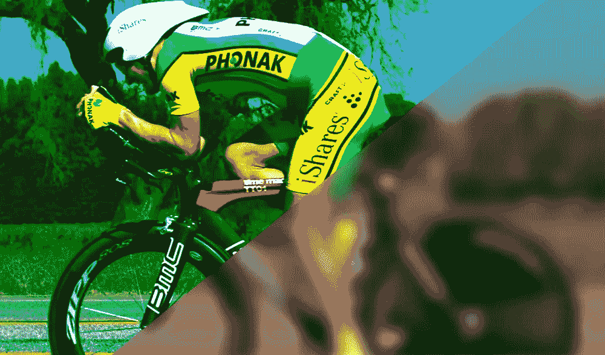

# CSS 滤镜效果:CSS 中的模糊、灰度、亮度等！

> 原文：<https://www.sitepoint.com/css-filter-effects-blur-grayscale-brightness-and-more-in-css/>



一个 CSS 滤镜效果的例子！

过滤器最初是 SVG 规范的一部分。然而，当它们的有用性变得明显时，W3C 也开始致力于向 CSS 添加一些常见的过滤效果。CSS 过滤器非常强大，而且非常容易使用。你可以用它们来模糊、明亮或饱和图像。它们可以单独使用，也可以与其他过滤器结合使用。您需要使用以下语法在 CSS 中应用过滤器:

```
filter: <filter-function> [<filter-function>]* | none
```

现在，让我们简单看一下所有这些过滤器。

## 聪明

此滤镜控制图像的亮度。它接受大于或等于零的值作为其参数。值为 0%会产生完全黑色的输出。类似地，100%的值将给出原始图像。您可以指定大于 100%的值，以获得更亮的图像。例如，300%的值将使图像亮度增加 3 倍:

```
img {
  filter: brightness(300%);
}
```

下面是一个带有亮度 CSS 滤镜的代码笔:

参见 [CodePen](http://codepen.io) 上的笔 [CSS 滤镜示例——site point(](http://codepen.io/SitePoint/pen/oLGoby/)[@ site point](http://codepen.io/SitePoint))亮度。

## 对比

此滤镜控制图像的对比度。就像亮度滤镜一样，它也接受大于或等于零的值。此滤镜控制 CSS 中图像的明暗部分之间的差异。因此，0%的值会产生灰色图像。将对比度设置为 100%会得到原始图像，任何超出该值的值都会进一步增加图像对比度:

```
img {
  filter: contrast(0%);
}
```

下面是一个带有对比 CSS 滤镜的代码笔:

参见钢笔 [CSS 滤镜示例——在](http://codepen.io/SitePoint/pen/zBEPkP/) [CodePen](http://codepen.io) 上通过 SitePoint ( [@SitePoint](http://codepen.io/SitePoint) )对比。

## 灰度等级

顾名思义，这种滤镜可以帮助你使你的图像灰度化。这个滤镜会逐渐将图像中的所有颜色转换成某种灰色。0%的值对我们的图像没有影响，100%的值会使它们完全变成灰度。不允许负值。

```
img {
  filter: grayscale(100%);
}
```

下面是一个使用灰度 CSS 滤镜的代码笔:

参见 [CodePen](http://codepen.io) 上的笔 [CSS 滤镜示例——site point(](http://codepen.io/SitePoint/pen/ZOXaXJ/)[@ site point](http://codepen.io/SitePoint))的灰度。

## 饱和的

此滤镜控制图像中颜色的饱和度。值为 0%会完全移除图像中的所有颜色，而值超过 100%会使图像过饱和。在 100%时，最终结果看起来就像原始图像一样。此筛选器不允许负值。

```
img {
  filter: saturate(0%);
}
```

下面是一个带有饱和 CSS 滤镜的代码笔:

参见钢笔 [CSS 滤镜示例——在](http://codepen.io/SitePoint/pen/EywbbQ/) [CodePen](http://codepen.io) 上用 SitePoint ( [@SitePoint](http://codepen.io/SitePoint) )饱和。

## 乌贼的墨

这个滤镜给你的图像添加了一点褐色，就像一些老照片。加入的乌贼墨的量取决于百分比。在 0%时，最终结果看起来像原始图像，在 100%时，图像将完全呈棕褐色。

```
img {
  filter: sepia(100%);
}
```

下面是一个带有棕褐色 CSS 滤镜的代码笔:

参见 [CodePen](http://codepen.io) 上 SitePoint ( [@SitePoint](http://codepen.io/SitePoint) )的钢笔 [CSS 滤镜示例—棕褐色](http://codepen.io/SitePoint/pen/AXQbxb/)。

## 色调-旋转

此滤镜对图像中的所有颜色应用色调旋转。颜色旋转的角度取决于指定的参数值。值为`0deg`时，图像保持不变。此过滤器没有最大值。然而，`360deg`以上的值的影响会绕回。这意味着值`90deg`和`450deg`将具有相同的效果。

```
img {
  filter: hue-rotate(90deg);
}
```

下面是一个带有色调旋转 CSS 滤镜的代码笔:

在 [CodePen](http://codepen.io) 上用 SitePoint ( [@SitePoint](http://codepen.io/SitePoint) )看笔[滤镜色相-旋转](http://codepen.io/SitePoint/pen/zBEPRR/)。

## 转化的

此滤镜反转图像中的所有颜色。反转的数量取决于传递的参数值。值为 0%不会对原始图像产生任何影响，但值为 100%会将其完全反转。

```
img {
  filter: invert(100%);
}
```

下面是一个带有反 CSS 滤镜的代码笔:

参见钢笔 [CSS 滤镜示例——通过](http://codepen.io/SitePoint/pen/zBEPJj/) [CodePen](http://codepen.io) 上的 SitePoint ( [@SitePoint](http://codepen.io/SitePoint) )反转。

## 虚化

此滤镜对图像应用高斯模糊。它将颜色涂抹在一起，并将它们扩散到边缘之外。传递给此滤镜的半径参数决定了屏幕上有多少像素相互融合。较大的值将提供更多的模糊。该过滤器可以接受除百分比之外的任何长度值。

```
img {
  filter: blur(1px);
}
```

下面是一个带有模糊 CSS 滤镜的代码笔:

参见钢笔 [CSS 滤镜示例——在](http://codepen.io/SitePoint/pen/qNPVrQ/) [CodePen](http://codepen.io) 上用 SitePoint ( [@SitePoint](http://codepen.io/SitePoint) )模糊。

## 不透明

这个过滤器将使你的图像半透明。图像在 100%时完全不透明，在 0%时完全透明。此滤镜类似于众所周知的不透明度属性。这两者的一个区别是性能。filter 属性在某些浏览器上是硬件加速的，这可以获得更好的性能。

```
img {
  filter: opacity(75%);
}
```

下面是一个带有不透明度 CSS 滤镜的代码笔:

在 [CodePen](http://codepen.io) 上用 SitePoint ( [@SitePoint](http://codepen.io/SitePoint) )看钢笔[过滤不透明度](http://codepen.io/SitePoint/pen/QEqOkd/)。

## 阴影

顾名思义，这种滤镜给图像添加了投影效果。它基本上是输入图像的 alpha 蒙版的模糊偏移版本，以您提供的特定颜色绘制。此属性需要 x 和 y 偏移以及投影的颜色。您还可以选择提供一个模糊半径值，该值将决定阴影是清晰还是模糊。

```
img {
  filter: drop-shadow(5px 5px 10px #666);
}
```

下面是一个带有投影 CSS 滤镜的代码笔:

在 [CodePen](http://codepen.io) 上用 SitePoint ( [@SitePoint](http://codepen.io/SitePoint) )看笔[过滤阴影](http://codepen.io/SitePoint/pen/zBEPmj/)。

## Url()

虽然到目前为止我们讨论的所有过滤器都非常有用，但它们都是相当通用的过滤器。你的项目可能需要更具体的东西。如果上面的过滤器都不符合您的要求，您可以创建自己的 SVG 过滤器，并使用它的`id`来引用使用`url()`过滤器的过滤器。

```
<svg style="position: absolute; top: -99999px" xmlns="https://www.w3.org/2000/svg">
  <filter id="greenish">
    <feComponentTransfer>
      <feFuncR type="linear" slope="2" intercept="-0.5"/>
      <feFuncG type="linear" slope="2" intercept="-0."/>
      <feFuncB type="linear" slope="2" intercept="-0.25"/>
    </feComponentTransfer>
  </filter>
  <filter id="bluish">
    <feComponentTransfer>
      <feFuncR type="linear" slope="2" intercept="-0.5"/>
      <feFuncG type="linear" slope="2" intercept="-0.1"/>
      <feFuncB type="linear" slope="2" intercept="0"/>
    </feComponentTransfer>
  </filter>
</svg>

<style type="text/css"> img {
  filter: url('#greenish');
} </style>
```

下面是一个带`url()` SVG CSS 过滤器的代码笔:

参见 [CodePen](http://codepen.io) 上 SitePoint ( [@SitePoint](http://codepen.io/SitePoint) )的 Pen [CSS 滤镜示例— SVG](http://codepen.io/SitePoint/pen/kXGxQx/) 。

## 组合和激活滤镜

您也可以将多个滤镜组合在一起，以获得各种效果。大多数情况下，滤镜的顺序并不重要，但是，滤镜是按照它们在 CSS 中的放置顺序应用的，有些滤镜会覆盖其他滤镜。例如，在`grayscale`滤镜之后使用`sepia`滤镜会产生棕褐色图像，而在`sepia`之后使用`grayscale`会产生灰度图像。

滤镜也可以制作动画。如果你恰当地制作它们的动画，你可以创造一些非常有趣的效果。以下面的代码片段为例:

```
img {
  animation: haunted 3s infinite;
}

@keyframes haunted {
  0% {
    filter: brightness(20%);
  }
  48% {
    filter: brightness(20%);
  }
  50% {
    filter: sepia(1) contrast(2) brightness(200%);
  }
  ....
  96% {
    filter: brightness(400%);
  }
}
```

在上面的代码中，在动画过程中应用了具有不同值的多个滤镜。最终结果可以在下面的演示中看到:

在 [CodePen](http://codepen.io) 上通过 SitePoint ( [@SitePoint](http://codepen.io/SitePoint) )看笔[滤镜动画](http://codepen.io/SitePoint/pen/KrXybm/)。

亮度和对比度的突然变化以及 50%的深褐色产生了戏剧性的效果。更好地理解这个概念的最好方法是尝试使用你自己的滤镜动画！

## 附加注释

即使滤镜导致在元素的长方体模型外部绘制，它也不会对该元素的长方体模型的几何体产生任何影响。请记住，过滤器会影响目标元素的所有部分，包括背景、边框和文本装饰。您还可以对视频和 iframes 应用过滤器。下面的演示说明了这个概念。更多的例子可以在 Bennett Feely 的网站上找到。

参见笔 [CSS 滤镜示例——在](http://codepen.io/SitePoint/pen/rLGYoY/) [CodePen](http://codepen.io) 上通过站点点([@站点点](http://codepen.io/SitePoint))映射。

所有这些过滤器在性能方面都非常出色——除了`blur`过滤器，如果您的浏览器不使用硬件加速，它会很慢。根据您决定应用的 SVG 过滤器，`url()`过滤器的性能会有所不同。

所有主流浏览器都支持`filter`属性。Chrome 和 Opera 需要这个属性的前缀版本才能工作。IE 不支持过滤器，但 Edge 部分支持。在这种情况下，partial 意味着它支持除了`url()`版本之外的所有过滤器。

## 结论

本指南探讨了目前开发人员可以使用的多种 CSS 过滤器。与基于 canvas 的解决方案相比，它们具有良好的浏览器支持，易于使用，性能更好。此外，正如我在上一节中提到的，你可以在视频中使用它们，也可以与其他元素一起使用。

你是否以非常规的方式使用过过滤器？我们很想看看！请在下面给我们留言，以及您可能有的任何问题。