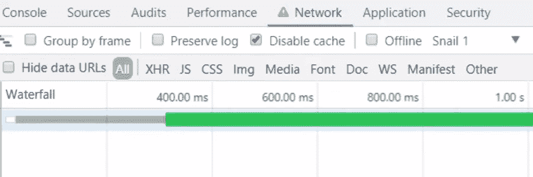

# CSS 字体显示:网络字体渲染的未来

> 原文：<https://www.sitepoint.com/css-font-display-future-font-rendering-web/>

使用网络字体的一个缺点是，如果用户的设备上没有字体，就必须下载。这意味着在字体可用之前，浏览器必须决定如何处理使用该字体的任何文本块的显示。它需要以不会显著影响用户体验和感知性能的方式来实现。

随着时间的推移，浏览器已经采用了几种策略来缓解这个问题。但是他们在[以不同的方式](https://tabatkins.github.io/specs/css-font-display/#intro)做这件事，并且不受开发者的控制，开发者不得不[设计](https://www.zachleat.com/web/comprehensive-webfonts/)几种技术和变通方法来克服这些问题。



输入`@font-face` at-rule 的[字体显示描述符](https://developer.mozilla.org/en-US/docs/Web/CSS/@font-face/font-display)。这个 CSS 特性引入了一种标准化这些行为的方法，并为开发人员提供了更多的控制。

## 使用`font-display`

在详细查看`font-display`提供的各种特性之前，让我们简单考虑一下如何在 CSS 中使用这些特性。

首先，`font-display`不是一个 CSS 属性，但是正如介绍中提到的，它是`@font-face` at-rule 的[描述符](https://www.w3.org/TR/REC-CSS2/fonts.html#font-descriptions)。这意味着它必须在`@font-face`规则中使用，如下面的代码所示:

```
@font-face {
  font-family: 'Saira Condensed';
  src: url(fonts/sairacondensed.woff2) format('woff2');
  font-display: swap;
}
```

在这个代码片段中，我为字体`Saira Condensed`定义了一个`swap`值。

所有可用值的关键字是:

*   `auto`
*   `block`
*   `swap`
*   `fallback`
*   `optional`

`font-display`的初始值是`auto`。

在后面的部分中，我将详细讨论这些值。但首先，让我们看看浏览器用来确定要呈现的字体的时间段。在讨论每个值时，我将解释时间轴的不同方面，以及这些方面对每个值的影响。

## `font-display`时间线

这个特性的核心是**字体显示时间线**的概念。字体加载时间，从请求开始，到加载成功或失败结束，可以分为三个连续的时间段，规定浏览器应该如何呈现文本。这三个时期如下:

*   **封锁期**。在此期间，浏览器用一种*不可见的*备用字体呈现文本。如果请求的字体成功加载，文本将使用请求的字体重新呈现。不可见的备用字体充当文本的空白占位符。这减少了执行重新渲染时的布局偏移。
*   **互换期**。如果所需的字体尚不可用，则使用备用字体，但这一次文本是可见的。同样，如果加载字体进来，就使用它。
*   **故障期**。如果字体不可用，浏览器不会等待，文本将在当前页面访问期间以备用字体显示。请注意，这并不一定意味着字体加载被中止；相反，浏览器可以决定继续使用该字体，这样该字体就可以在同一用户连续访问页面时使用。

调整这些时间段的持续时间允许您配置自定义文本呈现策略。特别是，这些持续时间可以收缩到零，也可以扩展到无穷大，我将在下面几节中向您展示。

但是这些持续时间不能由开发人员明确指定。这种可能性在规范的早期阶段就被检查过，但是[被删除了](https://plus.google.com/+IlyaGrigorik/posts/a3Yn3jB4wjA)。相反，提供了一组预定义的关键字值，可以处理大多数用例，如前一节所述。

让我们看看这些关键字是如何管理字体加载和显示过程的。

## `font-display: auto`

该值告诉浏览器采用浏览器选择的默认字体显示行为。通常这种策略类似于下一个值`block`。

## `font-display: block`

使用此值，在短暂的阻塞期(规范建议持续时间为三秒)后，交换期会延长至无穷大。这意味着在这种情况下，不存在失效期。

当浏览器短暂等待所请求的字体时，它用不可见的后备字体呈现文本；在此之后，如果字体还不可用，则备用字体变得可见；并且每当下载完成时，浏览器用想要的字体重新呈现文本。

您可以在下面的视频中看到这种行为，该视频使用了一个简单的测试页面，它的标题使用了特定的 web 字体:

<video class="wp-video-shortcode" id="video-160016-1" width="900" height="458" preload="metadata" controls=""><source type="video/mp4" src="https://uploads.sitepoint.com/wp-content/uploads/2017/09/1508342334fontdisplay01.mp4?_=1">[https://uploads.sitepoint.com/wp-content/uploads/2017/09/1508342334fontdisplay01.mp4](https://uploads.sitepoint.com/wp-content/uploads/2017/09/1508342334fontdisplay01.mp4)</video>

在页面加载的开始，标题是不可见的，但是它在 DOM 中是存在的。大约三秒钟后，如果字体还不可用，文本将显示为备用字体。在视频演示中，我使用 Chrome DevTools 的[网络节流](https://developers.google.com/web/tools/chrome-devtools/network-performance/network-conditions)功能模拟恶劣的网络条件。最后，当字体成功下载后，标题会随之重新呈现。

## `font-display: swap`

使用此值时，块周期将缩小为 0，交换周期将无限延长。因此，这里也缺少失效期。

换句话说，浏览器不会等待字体，而是立即用后备字体呈现文本；然后，只要字体可用，文本就用它重新呈现。

让我们验证一下:

<video class="wp-video-shortcode" id="video-160016-2" width="900" height="459" preload="metadata" controls=""><source type="video/mp4" src="https://uploads.sitepoint.com/wp-content/uploads/2017/09/1508342017fontdisplay02.mp4?_=2">[https://uploads.sitepoint.com/wp-content/uploads/2017/09/1508342017fontdisplay02.mp4](https://uploads.sitepoint.com/wp-content/uploads/2017/09/1508342017fontdisplay02.mp4)</video>

## `font-display: fallback`

这是包含故障周期的第一个值。在非常短的块周期(建议 100 毫秒)之后，交换周期现在持续时间很短(建议 3 秒)。因此，如果请求的字体在这段时间结束时没有准备好，文本将在页面访问期间使用备用字体显示。这避免了由于后期布局变化而打扰页面访问者，这可能会影响用户体验。

在下面的第一个视频中，字体在超过六秒后加载，因此它永远不会被换入:

<video class="wp-video-shortcode" id="video-160016-3" width="900" height="459" preload="metadata" controls=""><source type="video/mp4" src="https://uploads.sitepoint.com/wp-content/uploads/2017/09/1508342067fontdisplay03.mp4?_=3">[https://uploads.sitepoint.com/wp-content/uploads/2017/09/1508342067fontdisplay03.mp4](https://uploads.sitepoint.com/wp-content/uploads/2017/09/1508342067fontdisplay03.mp4)</video>

在下一个视频中，在交换期超时之前，字体加载更快，因此字体按预期使用:

<video class="wp-video-shortcode" id="video-160016-4" width="900" height="459" preload="metadata" controls=""><source type="video/mp4" src="https://uploads.sitepoint.com/wp-content/uploads/2017/09/1508342070fontdisplay04.mp4?_=4">[https://uploads.sitepoint.com/wp-content/uploads/2017/09/1508342070fontdisplay04.mp4](https://uploads.sitepoint.com/wp-content/uploads/2017/09/1508342070fontdisplay04.mp4)</video>

## `font-display: optional`

当我第一次阅读规范时，我发现分配给字体显示策略的名称不是很清楚。甚至在规范本身中也指出了这一点，其中[建议](https://tabatkins.github.io/specs/css-font-display/#issue-d2da4906)规范的未来版本使用更好地说明每种策略的预期用途的名称，提出了以下替代方案:

*   `requires`为`block`
*   `important`为`swap`
*   `preferable`为`fallback`

但是`optional`值预计保持不变。事实上，这个值很好地抓住了它所触发的行为的本质。在这种情况下，字体被认为是页面渲染的可选字体，本质上是告诉浏览器:*如果字体已经可用，就使用它，否则没关系，继续使用后备字体；该字体可用于未来的页面访问*。

使用这个值，字体显示时间线有一个短的块周期(同样，规范推荐 100 毫秒的时间间隔)和一个零持续时间的交换周期。因此，故障期紧随阻塞期之后，这意味着如果字体不可用，则在页面访问期间不会使用该字体。但是该字体最终可以在后台完全下载，因此可以在未来的页面加载中立即呈现。

但是我应该在这里指出，特别是在糟糕的网络条件下，用户代理可以自由中止甚至不开始字体下载。这是为了不会不必要地影响网络连接的质量。因此，该网站仍然可用，但字体不会立即在未来的页面加载可用。

在下面的视频中，测试页面是在不限制网络的情况下加载的。字体下载速度很快，但仅在短暂的阻塞期后下载，因此在整个访问期间，文本都以备用字体显示。

<video class="wp-video-shortcode" id="video-160016-5" width="900" height="459" preload="metadata" controls=""><source type="video/mp4" src="https://uploads.sitepoint.com/wp-content/uploads/2017/09/1508342072fontdisplay05.mp4?_=5">[https://uploads.sitepoint.com/wp-content/uploads/2017/09/1508342072fontdisplay05.mp4](https://uploads.sitepoint.com/wp-content/uploads/2017/09/1508342072fontdisplay05.mp4)</video>

在下一个视频中，页面在相同的网络条件下重新加载，但这次启用了缓存，以模拟第二次访问:

<video class="wp-video-shortcode" id="video-160016-6" width="900" height="459" preload="metadata" controls=""><source type="video/mp4" src="https://uploads.sitepoint.com/wp-content/uploads/2017/09/1508342073fontdisplay06.mp4?_=6">[https://uploads.sitepoint.com/wp-content/uploads/2017/09/1508342073fontdisplay06.mp4](https://uploads.sitepoint.com/wp-content/uploads/2017/09/1508342073fontdisplay06.mp4)</video>

现在，标题已经用想要的 web 字体呈现出来了。

在继续之前，注意当使用`fallback`和`optional`值时，为`block`周期推荐的大约 100 ms 的极短持续时间。这是为了让快速加载字体(或从缓存加载的字体)在使用后备字体之前显示一段短暂的时间，从而避免“无样式文本闪烁”或 FOUT。

我真的很想知道为什么在使用`font-display: swap`时，块周期崩溃为零，而不是使用与`optional`相同的短间隔。原来，[在 spec 的 GitHub repo 中有一个未解决的问题](https://github.com/tabatkins/specs/issues/53)，让‘swap’和其他人使用相同的“微小块周期”。

## 关于后备字体

在上面的讨论中，我几次提到了回退字体。但这从何而来？

后备字体是字体堆栈中第一个可用的字体，该字体堆栈是使用相关元素上的`font-family`属性定义的。

例如，在测试页面上，标题的`font-family`值是:

```
h1 {
  font-family: 'Saira Condensed', Arial, "Helvetica Neue", Helvetica, sans-serif;
}
```

例如，这可以在使用 Arial 作为渲染字体的 Windows 机器上进行验证(参见上面的视频`optional`)。

## 支持

在编写时，对`font-display`描述符的支持如下:

*   Chrome 从第 60 版开始就支持它了
*   Opera 从版本 47 开始就支持它
*   它正在为火狐开发中，从 46 版开始就可以在旗子后面使用了。
*   关于 Safari，WebKit 平台状态报告称其正在开发
*   没有迹象表明微软 Edge 会很快支持它。在微软 Edge 开发者反馈网站上有一张票，在那里可以投票支持这项功能的实现。

请参考[caniuse.com](http://caniuse.com/#feat=css-font-rendering-controls)获取最新支持信息。

值得注意的是，`font-display`支持不能通过特性查询来测试，因为如上所述，它不是 CSS 属性，而是字体描述符。[在本期 GitHub](https://github.com/bramstein/fontfaceobserver/issues/62#issuecomment-234790586)中，你会发现一些关于如何正确检测这个特性的讨论。

一旦检测到不支持`font-display`,几种回退策略是可能的，但这超出了本文的范围。扎克·莱泽曼的文章[字体加载策略综合指南](https://www.zachleat.com/web/comprehensive-webfonts/)对可用的解决方案进行了详尽的调查。

## 使用谷歌字体

您可能已经注意到，演示页面中使用的字体来自 Google Fonts，但它不是以通常的方式加载的，即链接到字体提供商提供的样式表。相反，我只是复制了在样式表中找到的字体的 URL，并在我的自定义`@font-face`规则中使用该 URL。我必须这样做，因为正如在用法一节中看到的，`font-display`必须在`font-face`规则中指定。

有没有更好更谷歌字体友好的方式？谷歌字体等第三方字体代工厂是不是要支持`font-display`？

在 Google Fonts GitHub repo 上有一个公开的问题,在这里讨论了这个问题。添加您的+1 以显示您对此功能的兴趣！

另外，值得一提的是， [CSS 字体模块 Level 4](https://www.w3.org/TR/css-fonts-4/) 提出使用`font-display`作为 [@font-feature-values](https://www.w3.org/TR/css-fonts-4/#font-display-font-feature-values) 的描述符，使开发人员能够为不受他们直接控制的`@font-face`规则设置显示策略。但是这还没有被任何用户代理实现。

## 最后的话

我希望这能让你对`font-display`描述符有一个大致的了解，以及这个特性如何预示了字体在网络上呈现的美好未来。

虽然本文没有讨论由`font-display`实现的不同策略的具体用例，但是规范用一些清晰的例子说明了用例，并且一些引用的参考文献详细阐述了这个主题。因此，除了我在这里介绍的基础知识之外，您还可以在我引用的参考资料中找到更多内容。

## 分享这篇文章