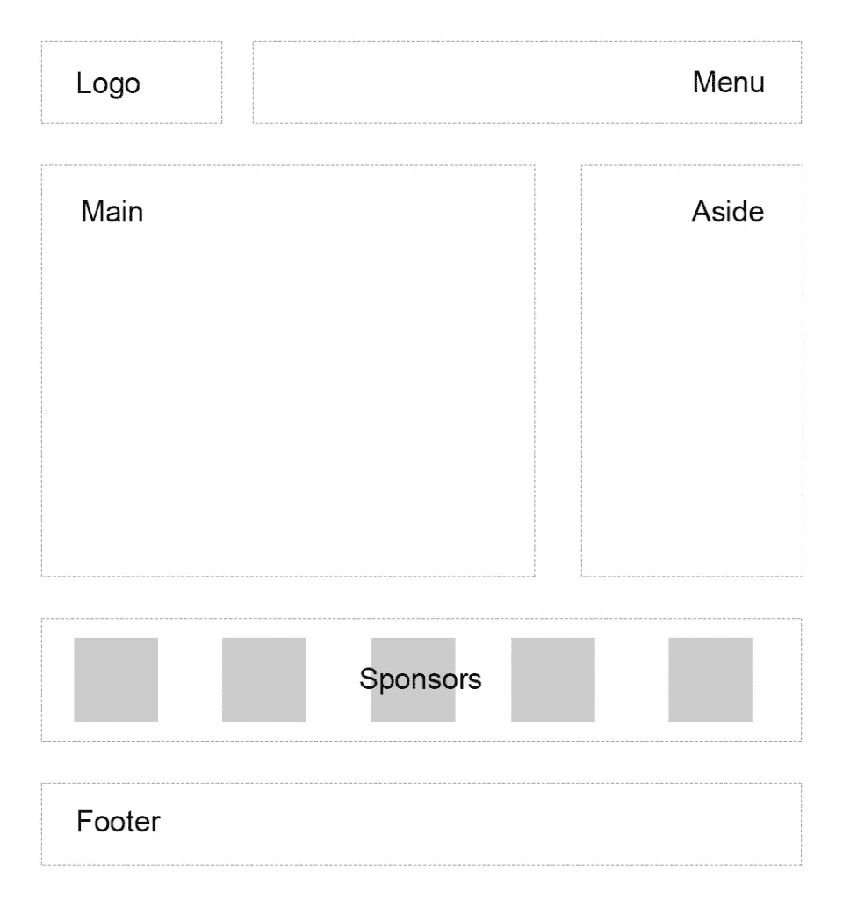

# 重新设计网站以使用 CSS 网格布局

> 原文：<https://www.sitepoint.com/css-grid-retrofit/>

在本文中，我们将通过创建一个响应式多栏网站布局来了解 CSS Grid 的实际应用。

CSS 网格是目前 web 开发中一个新的热门趋势。忘记表格布局和浮动:一种新的网站设计方式已经出现了！这项技术引入了二维网格，用少量 CSS 规则定义了多个布局区域。

网格可以让第三方框架如 [960gs](https://960.gs/) 或 [Bootstrap grid](https://getbootstrap.com/docs/4.1/layout/grid/) 变得多余，因为你可以轻松地自己做任何事情！这个特性[被所有主流浏览器](https://caniuse.com/#feat=css-grid)支持，尽管 Internet Explorer 实现了一个旧版本的规范。

## 我们将要建造的

因此，我们被要求创建一个典型的网站布局，包括标题、主要内容区域、右侧边栏、赞助商列表和页脚:

另一个开发人员已经试图解决这个任务，并提出了一个涉及 floats、`display: table`和一些 clearfix hacks 的解决方案。我们将把这个现有的布局称为“初始的”:

参见 [CodePen](https://codepen.io) 上的 SitePoint ( [@SitePoint](https://codepen.io/SitePoint) )的 Pen [SP:多列浮动布局](https://codepen.io/SitePoint/pen/oMRjda/)。