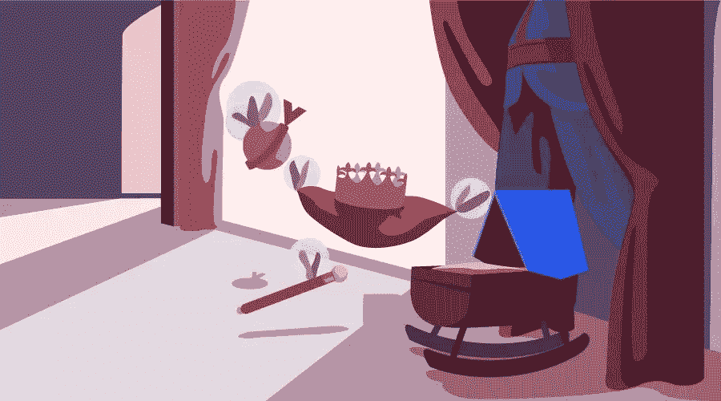

# CSS 继承:简介

> 原文：<https://www.sitepoint.com/css-inheritance-introduction/>

在现实生活中，继承是很常见的。除非有其他因素在起作用，通常情况是高个子的父母有高个子的孩子，等等。我们可以在 CSS 中看到类似的东西。

如果您将容器元素的颜色设置为绿色，那么除非某个规则覆盖了该颜色值，否则容器中所有元素的颜色都将是绿色。某些属性值从父元素传递到子元素的机制称为继承。

在本文中，您将了解继承的不同方面，以及它如何影响不同元素的外观。

## CSS 继承如何有用？

CSS 继承大大减少了创建网站所需的时间和精力。想象一下，要在`body`标签的所有子标签上设置颜色，需要编写多少 CSS 代码。这将耗费时间，容易出错，并且难以维护。同样，你可以想象如果你被迫在容器的每个子元素上设置`font-family`或`font-size`，那将是一场噩梦。

请看下面的演示:

参见 [CodePen](https://codepen.io) 上 SitePoint ( [@SitePoint](https://codepen.io/SitePoint) )的 Pen [CSS 继承示例](https://codepen.io/SitePoint/pen/VzeXzM/)。