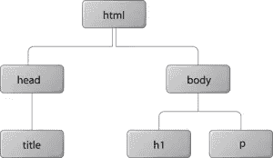

# CSS 布局和格式

> 原文：<https://www.sitepoint.com/css-layout-formatting/>

虽然 CSS1 对文档的图形化布局没有太多贡献，但 CSS2 引入了几个新的布局属性，CSS3 可能会添加更多。虽然 CSS 仍然没有提供对页面布局的完全控制，但它比使用布局表格和表示标记的老派技术要强大得多。

web 浏览器通常读取和呈现 HTML 文档。这分两个阶段进行:解析阶段(T0)和渲染阶段(T3)。

在解析阶段，浏览器读取文档中的标记，将其分解成组件，并构建文档对象模型(DOM)树。

考虑这个示例 HTML 文档:

```
<!DOCTYPE html PUBLIC "-//W3C//DTD HTML 4.01//EN"
    "https://www.w3.org/TR/html4/strict.dtd">
<html>
  <head>
    <title>Widgets</title>
  </head>
  <body>
    <h1>Widgets</h1>
    <p>Welcome to Widgets, the number one company
    in the world for selling widgets!</p>
  </body>
</html>
```

上面的 HTML 文档可以被可视化为下图中的 DOM 树(为了清楚起见，图中省略了文本节点)。

DOM 树中的每个对象称为一个<dfn class="firstterm">节点</dfn>。有几种类型的节点，包括元素节点和文本节点。树的顶部是一个文档节点，其中包含一个名为<dfn class="firstterm">根节点</dfn>的元素节点；这总是 html 和 XHTML 文档中的 HTML 元素，它分支成两个子元素节点——head 和 body——然后又分支成其他子元素。

一个<dfn class="firstterm">子节点</dfn>在结构上从属于其<dfn class="firstterm">父节点</dfn>。在 HTML 术语中，这意味着子标签嵌套在父标签中。例如，我们可以在上图中看到，`h1`元素是`body`元素的子节点，`body`元素是`h1`元素的父节点。如果一个节点是另一个节点的子节点、孙节点等等，那么它可以被称为<dfn class="firstterm">子节点</dfn>。如果一个节点是另一个节点的父节点、祖父节点等等，那么它可以被称为<dfn class="firstterm">祖先节点</dfn>。例如，`h1`元素是`html`元素的后代节点，`html`元素是`h1`元素的祖先节点。具有相同父节点的节点称为<dfn class="firstterm">兄弟节点</dfn>。`h1`和`p`元素是兄弟节点。

当 DOM 树构建完成，所有 CSS 样式表都加载并解析后，浏览器开始呈现阶段。DOM 树中的每个节点将被呈现为零个或多个框。

就像 HTML 中有块级元素和行内元素一样，CSS 中也有块框和行内框。事实上，还有其他几种框类型，但它们可以被看作是块和行内框的子类型。

CSS 盒子总是矩形的。它有四条边，每条边之间成 90 度角。

从某种简化的角度来看，我们可以说是[用户代理样式表](https://reference.sitepoint.com/css/cascade)指定了块级 HTML 元素生成块框，而内联级 HTML 元素生成内联框。当然，我们可以使用`display`属性来改变为任何元素生成的框的类型。

但是，CSS 不会以任何方式影响标记。HTML 中块级和行内元素的分隔是在 HTML 文档类型定义中指定的，并且不能更改。例如，将 span 元素的 display 属性设置为 block 不允许我们在其中嵌套 h1 元素，因为 HTML 文档类型定义禁止这样做。

## 在本节中

1.  [视窗、页面框和画布](https://reference.sitepoint.com/css/viewport)
2.  [CSS 盒子模型](https://reference.sitepoint.com/css/boxmodel)
3.  [格式化概念](https://reference.sitepoint.com/css/formattingcontext)
4.  [定位](https://reference.sitepoint.com/css/positioning)

## 分享这篇文章