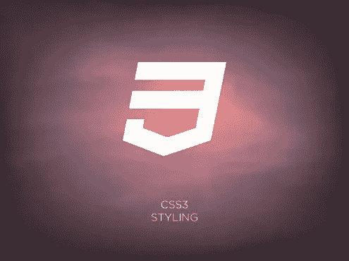
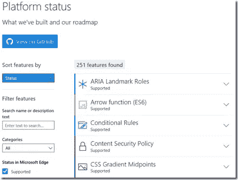

# 现代世界中的 CSS

> 原文：<https://www.sitepoint.com/css-modern-world/>

本文是微软网站开发系列的一部分。感谢您对使 SitePoint 成为可能的合作伙伴的支持。

W3C 最近宣布了一个层叠样式表(CSS) [快照](https://www.w3.org/TR/CSS/)——这是一个“收集到一个定义中的所有规范，这些规范共同构成了截至 2015 年层叠样式表(CSS)的当前状态”的文档。主要受众是 CSS 实施者，而不是 CSS 作者，因为这个定义包括规范稳定性的模块，而不是 Web 浏览器的采用率。”这促使我考虑 CSS 在当今现代 web 开发人员社区中的相关性，以及如何最好地实现它。

因为这些年来发生了太多的变化，所以我认为从开发者的角度对 CSS 的现状以及如何迎接未来做一个“快照”是合适的。我的个人经验不足以满足一个答案，所以我做了很多研究，并采访了行业专家的观点。凭借我获得的所有数据，我知道我有足够的发现来支持写一本书！我决定写一系列关于 CSS 的在线文章会更快推向市场，所以我很自豪地介绍第一篇 ***掌握 CSS 系列*** 的文章。

## CSS 在今天有意义吗？

对于许多 web 开发人员来说，质疑 CSS 的相关性可能看起来很奇怪。然而，网络发展的新趋势对 CSS 的使用提出了质疑。我强烈建议读一读 Louis Lazaris 的文章，他展示了 CSS 在 T2 依然存在的情况。尽管他的文章大部分提供了 CSS 仍然很活跃的原因，但他也提到了通过 JavaScript 使用内联样式的 [React](http://facebook.github.io/react/) 的流行。他还引用了一篇关于“我们还需要 CSS 吗？”的文章它很好地解释了开发人员在实现 CSS 时所面临的一些棘手问题。我引用这些文章是因为它们提供了 CSS 开发人员面临的挑战的背景，以及为什么有些人考虑其他替代方案。那么，这是否意味着 CSS 正在走下坡路？

正如本文开头的话所清楚显示的，CSS 领域的发展势头强劲。主流浏览器仍在努力实现 CSS 功能，热情的开发者社区也在努力继续用 CSS 制作优秀的网站。想想无数使用 [WordPress](https://wordpress.org/) 的博客网站，它们当然使用 [CSS 来补充主题化](http://codex.wordpress.org/CSS)。凭借强大的基础和活跃的社区，CSS 在今天非常重要。

反对 CSS 的有效论据呢？虽然我不会在这里谈论它们，但我很高兴看到“骚动”和一些转向替代方案。为什么？因为对社区来说，质疑事情的处理方式是健康的，这样就有改进的机会。我的愚见是，未来的 CSS 将由今天对它的抱怨所塑造。

## 简单的 CSS 真相

在我们的现代世界中，我发现停下来问一问我们为什么要做我们正在做的事情是有好处的。本着质疑我个人是否继续使用 CSS 的精神，我想拿出证据来证明为什么我还应该这么做。以下是我(在他人的帮助下)总结的一系列陈述，这些陈述进一步说明了为什么 CSS 仍然是我在 web 技术样式方面的主要选择:

CSS 允许[分离关注点](https://en.wikipedia.org/wiki/Separation_of_concerns#HTML.2C_CSS.2C_JavaScript)。 CSS 是 HTML 的补充语言，使样式定义与标记分开维护。更清晰的标记更易于阅读和维护，通常也更易于搜索。

**CSS 快。**在很多方面都很快。进行样式更改的速度更快，加载没有重复内联样式的 HTML 页面的速度更快，在过渡和动画等情况下，处理速度通常比 JavaScript 更快。

CSS 是有反应的。 CSS 基于查看尺寸或打印时应如何呈现来实现内容的最佳查看，这里仅举几个例子。

CSS 有一群被俘虏的观众。以 CSS 为中心的书籍、视频、文章、网站都不缺。越来越多的库/工具/框架致力于使 CSS 实现更容易、更高效。

CSS 无处不在。现代浏览器拥抱 CSS，每种浏览器支持的功能列表保存在 CanIUse.com等网站上(见下面的评论)。当使用像 [ManifoldJS](http://manifoldjs.com/?WT.mc_id=16528-DEV-sitepoint-article64) 或 [Cordova](http://cordova.apache.org/) 这样的服务打包时，CSS 也被用来设计跨多个平台的移动应用。

关于 CSS 在不同浏览器中的状态，通过直接咨询每个特定的供应商，可以获得一个更准确的标准来确定哪些功能目前被支持或正在开发中。例如，查看 dev.modern.ie 的[平台状态部分，了解关于微软 Edge](https://dev.modern.ie/platform/status/?utm_source=SitePoint&utm_medium=article64&utm_campaign=SitePoint/?filter=f3f0000bf&search=css) 的 CSS 路线图。

## 今天使用 CSS

今天有多种方法来实现 CSS。没有一种方法对所有场景都是完美的，因为不同的项目会有不同的需求和约束。有助于确定方法的问题包括:项目需要 CSS 的哪些特性？我的项目需要支持哪些浏览器/平台？有多少开发人员将参与项目，他们的技能水平如何？最快的响应时间是否具有高优先级？

考虑了上面的问题后，现在是时候看看有什么方法了。可能性的组合很高，所以我将它分解为这两个通用术语:

**CSS 的手工实施和维护。**简单来说，开发者负责 CSS 的各个方面。

借助扩展/框架的 CSS。开发人员依靠一个扩展或框架来帮助编写高效的 CSS 和/或发布一个精简的文件。扩展/框架的类型多种多样，其中许多都依赖于一个或多个其他的扩展/框架。

虽然第二种方法显然是采用的趋势，但这并不意味着它总是答案。例如，一个在浏览器/设备方面具有可预测受众的小型内部网站点可能看起来被过度设计以实现多个 CSS 框架——特别是如果该站点只有少量页面的话。在这种情况下，缩小文件是否至关重要？开发人员建立和学习框架会比仅仅写网站花费更多的时间吗？可能只需要手动实现一个 CSS 页面。

现实情况是，许多网站会或多或少地采用第二种方法。例如，精通 CSS 的开发人员可能有很好的技能，但是依赖工具来缩小文件。另一个例子是使用像 [Bootstrap](http://getbootstrap.com/) 这样的完整框架，并购买主题来快速启动和运行网站。另一个例子可能是使用 [W3。CSS](http://www.w3schools.com/w3css/) 用于简单的响应样式。在某种程度上，任何依赖都会帮助(而不是伤害)整个项目，应该强烈考虑使用它。

## 摘要

CSS 在 web 开发中有着悠久的历史、活跃的存在和持续的未来。虽然实现 CSS 存在挑战，但也有很多原因说明为什么它仍然是主导 web 样式的技术。这篇文章关注的是 CSS 在现代社会中的作用。在 ***掌握 CSS 系列*** 中即将发布的文章将涵盖最佳实践、顶级技巧，以及对扩展和框架的深入研究！

## 更多的 Web 开发实践

这篇文章是微软技术倡导者和工程师关于实用 JavaScript 学习、开源项目和互操作性最佳实践的 web 开发系列的一部分，包括[微软 Edge](http://blogs.windows.com/msedgedev/2015/05/06/a-break-from-the-past-part-2-saying-goodbye-to-activex-vbscript-attachevent/?WT.mc_id=16528-DEV-sitepoint-article64) 浏览器和新的 [EdgeHTML 渲染引擎](http://blogs.windows.com/msedgedev/2015/02/26/a-break-from-the-past-the-birth-of-microsofts-new-web-rendering-engine/?WT.mc_id=16528-DEV-sitepoint-article64)。

我们鼓励您在 dev.microsoftedge.com 使用免费工具进行跨浏览器和设备测试，包括 Windows 10 的默认浏览器 Microsoft Edge:

*   [扫描你的网站，寻找过时的库、布局问题和可访问性](http://dev.modern.ie/tools/staticscan/?utm_source=SitePoint&utm_medium=article64&utm_campaign=SitePoint)
*   [下载适用于 Mac、Linux 和 Windows 的免费虚拟机](http://dev.modern.ie/tools/vms/windows/?utm_source=SitePoint&utm_medium=article64&utm_campaign=SitePoint)
*   [跨浏览器检查网络平台状态，包括微软 Edge 路线图](https://dev.modern.ie/platform/status/?utm_source=SitePoint&utm_medium=article64&utm_campaign=SitePoint)
*   [在您自己的设备上远程测试 Microsoft Edge](https://remote.modern.ie/?utm_source=SitePoint&utm_medium=article64&utm_campaign=SitePoint)

从我们的工程师和传道者那里获得更深入的学习:

*   GitHub 上的编码实验室:跨浏览器测试和最佳实践
*   【2015 年微软 Edge 网络峰会(来自我们的工程团队和 JS 社区)
*   哇，我可以在 Mac 电脑上测试 Edge & IE 浏览器& Linux！(来自雷伊·班戈)
*   [在不破坏网络的情况下推进 JavaScript】(来自 Christian Heilmann)](http://channel9.msdn.com/Events/WebPlatformSummit/2015/Advancing-JavaScript-without-breaking-the-web/?WT.mc_id=16528-DEV-sitepoint-article64)
*   使网络正常工作的边缘渲染引擎(Jacob Rossi)
*   [用 WebGL 释放 3D 渲染](https://channel9.msdn.com/Events/WebPlatformSummit/2015/Unleash-3D-rendering-with-WebGL-and-Microsoft-Edge/?WT.mc_id=16528-DEV-sitepoint-article64)(来自 David Catuhe)
*   托管网络应用和网络平台创新(来自律师奶爸和基里尔·赛克谢诺夫)

我们的社区开源项目:

*   伏龙。JS (跨设备远程 JavaScript 测试)
*   [manifoldJS](http://manifoldjs.com/?WT.mc_id=16528-DEV-sitepoint-article64) (部署跨平台托管的 web 应用)
*   [babylonJS](http://babylonjs.com/?WT.mc_id=16528-DEV-sitepoint-article64) (轻松制作 3D 图形)

更多免费工具和后端 web 开发工具:

*   [适用于 Linux、MacOS 和 Windows 的 Visual Studio 代码](https://code.visualstudio.com/?WT.mc_id=16528-DEV-sitepoint-article64)
*   [用节点编码。JS](https://www.microsoftvirtualacademy.com/en-US/training-courses/building-apps-with-node-js-jump-start-8422/?WT.mc_id=16528-DEV-sitepoint-article64) 与

## 分享这篇文章