# CSS 伪类:基于索引设计元素样式

> 原文：<https://www.sitepoint.com/css-pseudo-classes-styling-elements-based-on-their-index/>

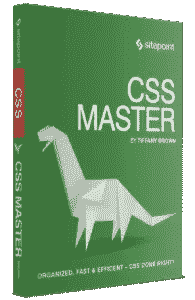

下面是我们的书《CSS 大师》的摘录，作者是蒂芙尼·布朗。世界各地的商店都有出售，或者你可以在这里买到电子书。

CSS 还提供了选择器，用于根据元素在文档子树中的位置匹配元素。这些被称为 **子索引伪类** ，因为它们依赖于元素的位置或顺序，而不是元素的类型、属性或 ID。有五个:

*   `:first-child`

*   `:last-child`

*   `:only-child`

*   `:nth-child()`

*   `:nth-last-child()`

#### `:first-child`和`:last-child`

正如您可能从名称中猜到的那样，`:first-child`和`:last-child`伪类使得选择作为节点(元素)的第一个或最后一个子元素成为可能。与其他伪类一样，`:first-child`和`:last-child`在被简单选择器限定时副作用最小。

让我们看看下面的 HTML 和 CSS:

```
<!DOCTYPE html>
<html lang="en-US">
<head>
<meta charset="utf-8">
<title>:first-child and :last-child</title>
<style type="text/css">
body {
  font: 16px / 1.5 sans-serif;
}
:first-child {
	 color: #e91e63;  
}
:last-child {
color: #4caf50;
}
</style>    
</head>
<body>
   <h2>List of fruits</h2>
	 <ul>
		<li>Apples</li>
		<li>Bananas</li>
		<li>Blueberries</li>
		<li>Oranges</li>
		<li>Strawberries</li>
	</ul>
</body>
</html>
```

你可以在下图中看到它的样子。

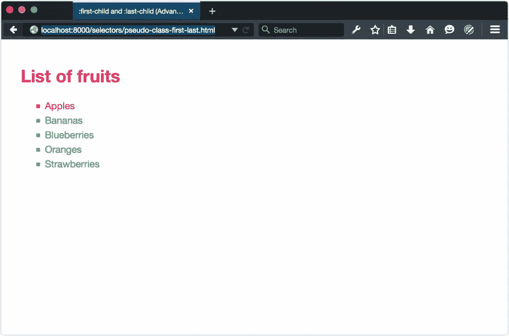

因为`:first-child`不合格，所以`h2`元素和第一个`li`元素都是粉红色。毕竟，`h2`是`body`的第一个孩子，`li`是`ul`元素的第一个孩子。但是为什么剩下的`li`元素是绿色的呢？嗯，那是因为`:last-child`也不合格，`ul`是`body`的最后一个孩子。我们基本上输入了`*:first-child`和`*:last-child`。

如果我们通过添加一个简单的选择器来限定`:first-child`和`:last-child`，那就更有意义了。让我们将选择限制在列表项目上。将`:first-child`改为`li:first-child`，将`:last-child`改为`li:last-child`。下图显示了结果。

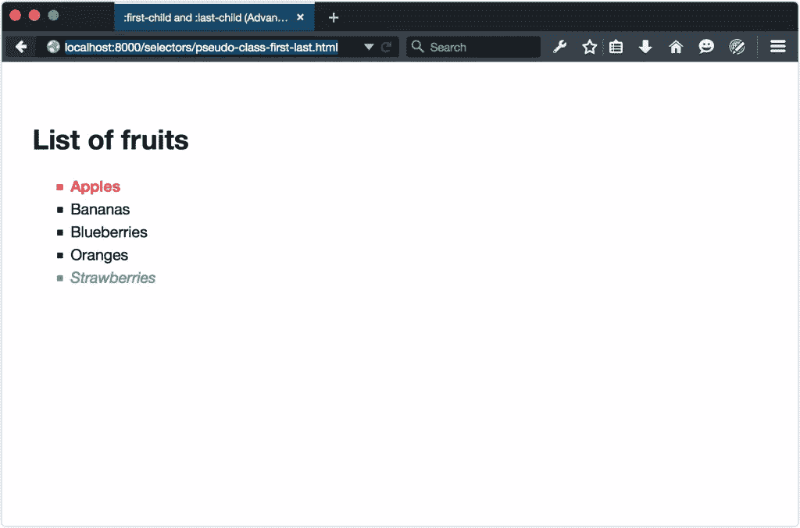

#### `:nth-child()`和`:nth-last-child()`

选择文档的第一个和最后一个子文档的能力很好。但是如果我们想选择奇数或偶数元素呢？也许我们想选择文档子树中的第六个元素，或者每隔三个元素应用一次样式。这就是`:nth-child()`和`:nth-last-child()`伪类发挥作用的地方。

和`:not()`、`:nth-child()`、`:nth-last-child()`一样，也是函数伪类。他们只接受一个参数，应该是:

*   `odd`关键字

*   `even`关键字

*   整数，如 2 或 8，或者

*   形式为*An+B*[<sup class="footnote">【5】</sup>](#ftn.d5e1094)的参数，其中 *A* 是步长间隔， *B* 是偏移量， *n* 是表示正整数的变量。

最后一项有点复杂。我们一会儿会回来。

`:nth-child()`和`:nth-last-child()`有什么区别？起点:`:nth-child()`向前数，`:nth-last-child()`向后数。CSS 索引使用计数数字，并且从 1 而不是 0 开始。

`:nth-child()`和`:nth-last-child()`都适用于交替模式。创建斑马条纹的表格行颜色是完美的用例。下面的 CSS 为偶数编号的表格行提供了浅蓝灰色背景，其结果可以在下图中看到:

```
tr:nth-child(even) {
  background: rgba(96, 125, 139, 0.1);
}
```

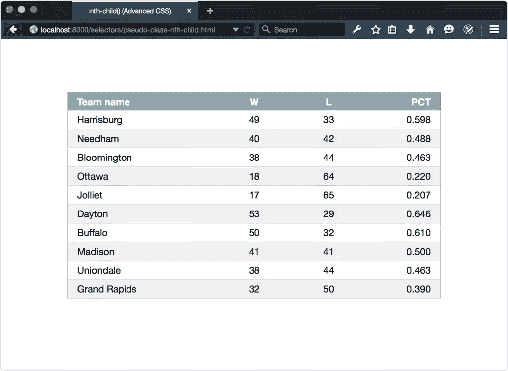

将`:nth-child`切换到`:nth-last-child`会反转该条带，因为计数从底部开始，如下所示。

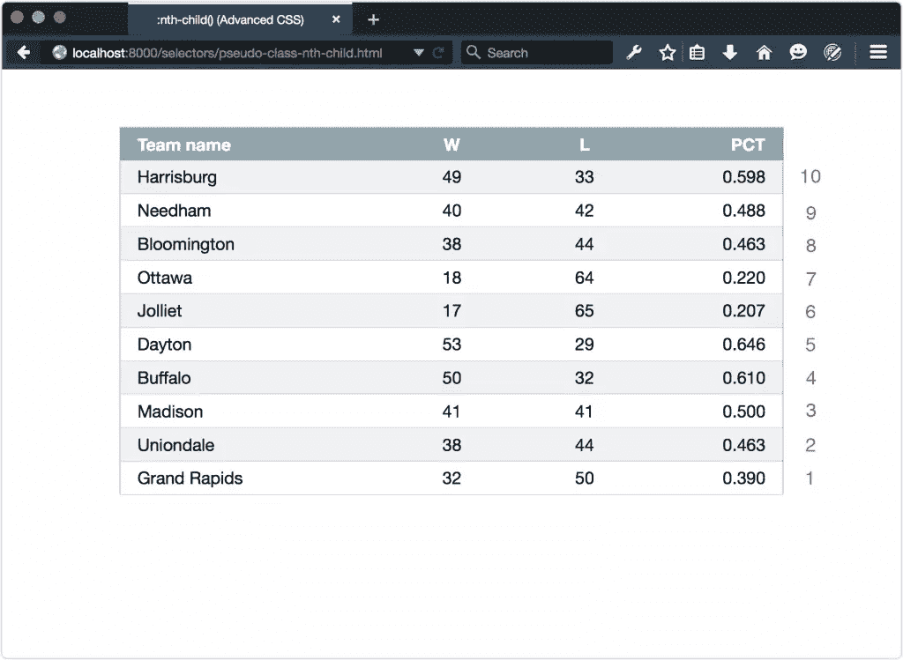

用更复杂的论点尝试一些复杂的例子怎么样？我们将从下面显示的文档开始，它包含 20 个条目。

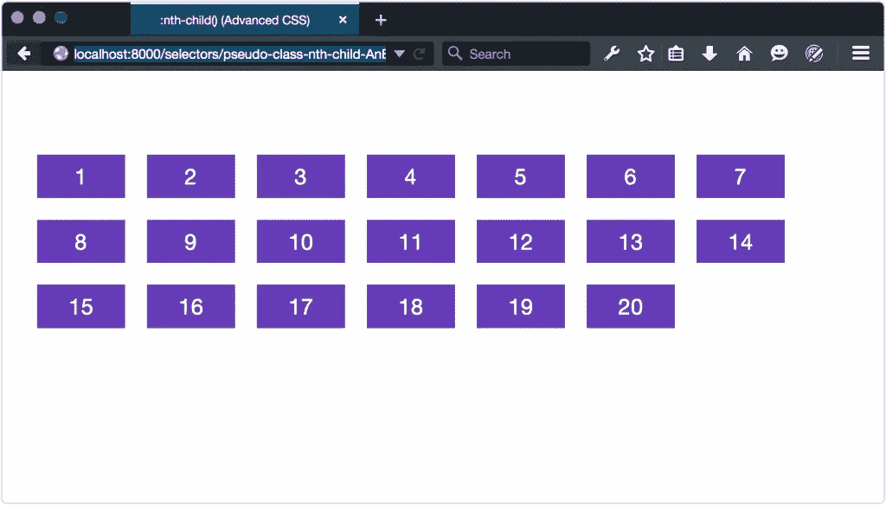

使用`:nth-child()`和`:nth-last-child()`，我们可以在特定位置选择单个孩子。我们可以选择特定位置的 之后的所有子 *，或者我们可以选择多个元素，有一个偏移量。让我们更改第六项的背景颜色:*

```
.item:nth-child(6) {
  background: #e91e63;
}
```

这给了我们下面的结果。

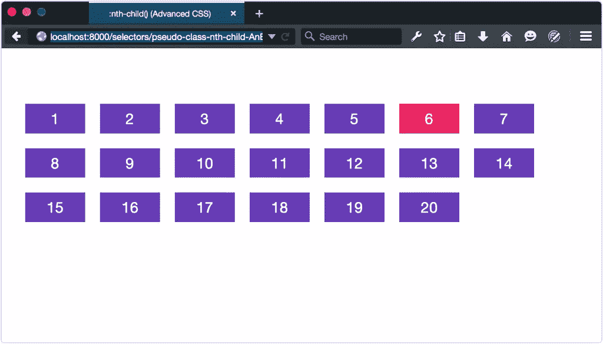

但是如果我们想要选择每三个元素呢？这里是 *An+B* 语法出现的地方:

```
.item:nth-child(3n) {
  background: #e91e63;
}
```

再次， *一个* 是一个音程。这几乎就像是T5【n的乘数，从 1 开始。因此，如果 *A* = 3，那么 *3n* 将匹配第 3、第 6、第 9 等元素。正如你在下面所看到的，这正是所发生的。

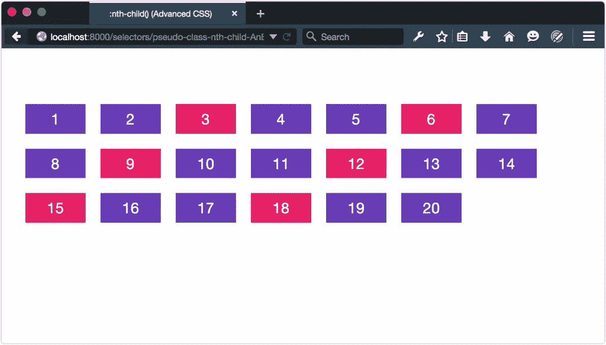

这就是事情变得更有趣的地方。我们可以使用`:nth-child()`和`:nth-last-child()`来选择某一点之后的所有元素。让我们尝试选择除前七个元素之外的所有元素:

```
.item:nth-child(n+8) {
  background: #e91e63;
}
```

在这里，没有步长值。结果，`n+8`匹配从第八个元素开始的每个元素 *n* ，如下所示。

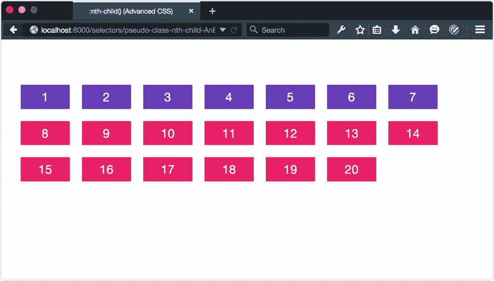

### 注意:负偏移

负偏移和范围值也有效。使用`:nth-child(-n+8)`将反转我们的选择，并匹配前八个元素。

我们还可以使用偏移和步长值来选择第三个元素，从第五个元素开始:

```
.item:nth-child(3n+5) {
  background: #e91e63;
}
```

您可以在下面看到这个选择器的结果。

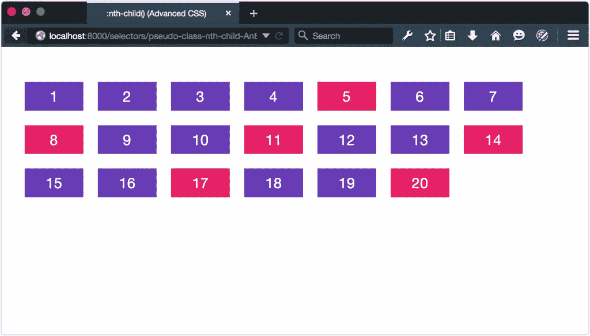

#### :独生子女

如果元素是另一个元素的*的子元素，那么`:only-child`伪类匹配这些元素。下面是两个无序列表。第一个包含一个项目，而第二个包含三个项目:*

```
<ul>
 <li>Apple</li>
</ul>

<ul>
 <li>Orange</li>
 <li>Banana</li>
 <li>Raspberry</li>
</ul>
```

使用`li:only-child{color: #9c27b0;}`将选择`<li>Apple</li>`，因为它是我们第一个列表的唯一子元素。然而，第二个列表中的项目都不匹配，因为有三个兄弟。你可以在下面看到这个样子。

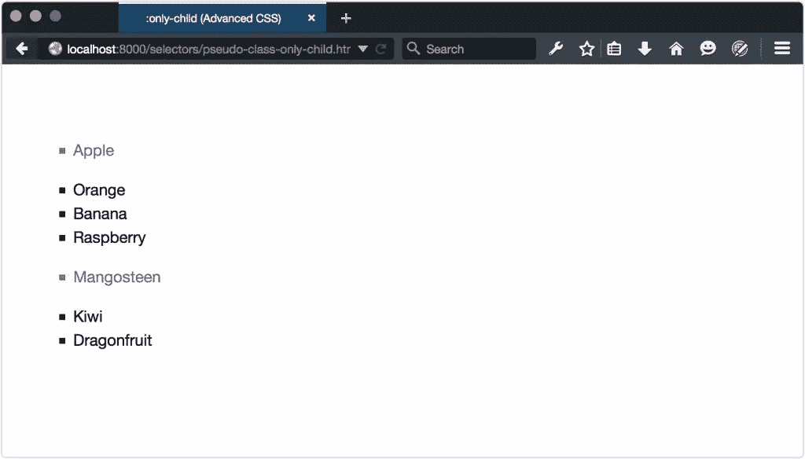

#### :空的

也可以使用`:empty`伪类选择没有 子元素的 *元素。现在我们说`:empty`是指 *空* 。为了让一个元素匹配`:empty`伪类，它不能包含任何其他东西——甚至不能是空白。换句话说，`<p></p>`会匹配，但`<p> </p>`不会。*

有时候 WYSIWYG(所见即所得)编辑器会在你的内容中插入空的`p`元素。您可以结合使用`:empty`和`:not()`伪类来避免对这些元素应用样式；比如`p:not(:empty)`。

### 通过索引选择特定类型的元素

上一节讨论的伪类匹配元素，如果它们在文档子树中占据给定的位置。例如，`p:nth-last-child(2)`选择作为其父元素倒数第二个元素的每个`p`元素。

在这一节中，我们将讨论 **类型化的子索引伪类** 。这些伪类还根据元素索引的值来匹配元素；但是，匹配仅限于特定类型的元素。例如，选择第五个`p`元素或偶数索引的`h2`元素。

有五个这样的伪类，它们的名称反映了它们的非类型化对应类的名称:

*   `:first-of-type`

*   `:last-of-type`

*   `:only-of-type`

*   `:nth-of-type()`

*   `:nth-last-of-type()`

这些伪类和子索引伪类之间的区别很微妙。其中`p:nth-child(5)`仅当第五个项目是一个`p`元素时才匹配它，`p:nth-of-type(5)`匹配所有的`p`元素，然后在这些元素中找到第五个`p`元素。

让我们从一个稍微不同的文档开始。它仍然有 20 个项目，但其中一些是`p`元素，一些是`div`元素。`p`元素有圆角，如下图所示。

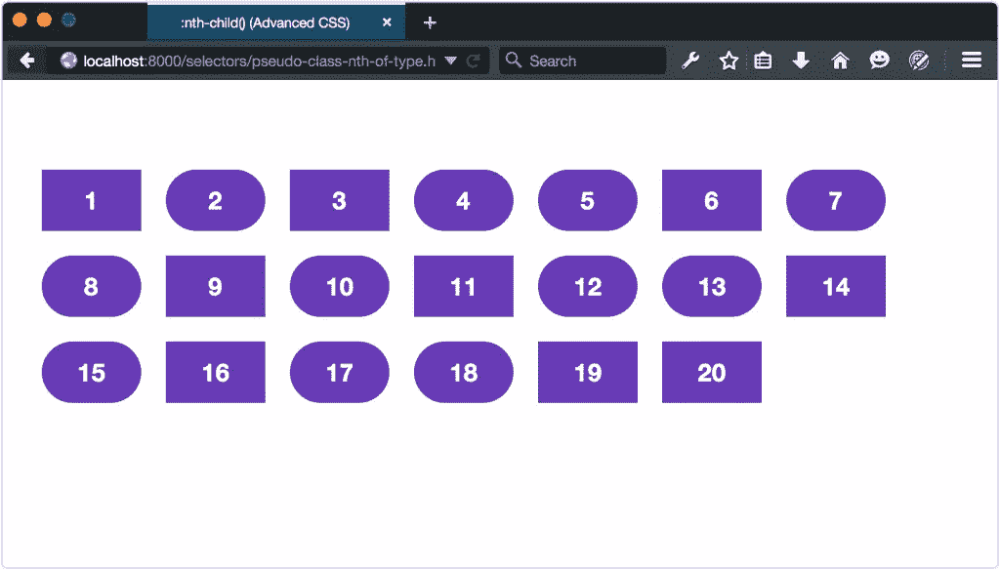

#### 使用`:first-of-type`、`:last-of-type`和`:only-type`

使用`:first-of-type`，我们可以选择匹配选择器的第一个元素。我们给我们的第一个`p`元素一个石灰绿色的背景怎么样:

```
p:first-of-type {
background: #cddc39;
}
```

这将匹配作为其父元素的第一个`p`元素的每个`p`元素，如下所示。

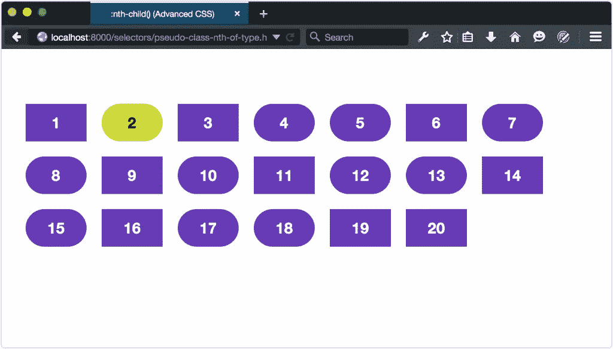

`:last-of-type`伪类的工作方式类似，匹配其父类的最后一个元素，如下所示。然而，`:only-of-type`将匹配一个元素，如果它是其父元素类型的*子元素，如下图所示。*

 *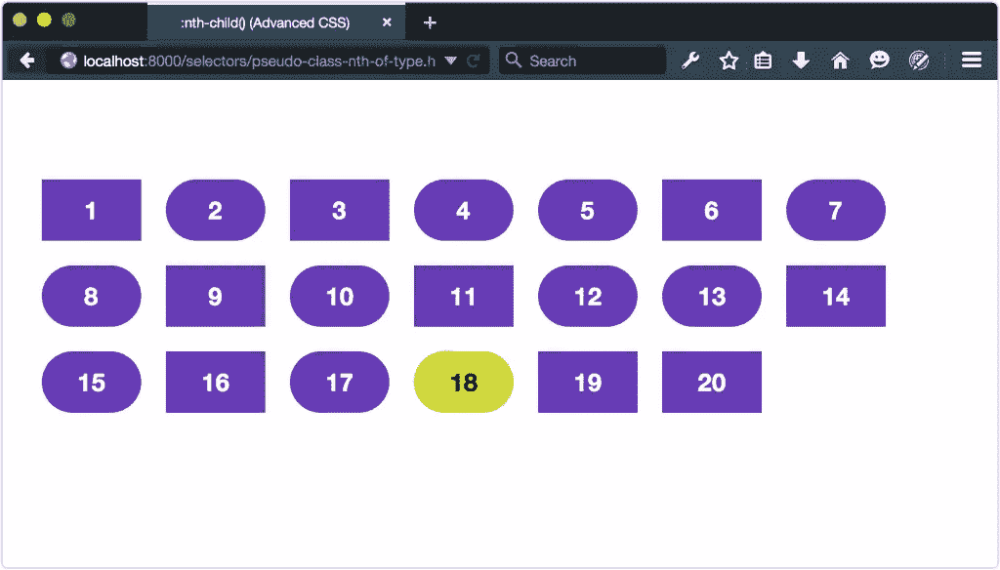


让我们看另一个使用`:first-of-type`的例子，但是这次使用了伪元素。还记得本章前面的`::first-letter`伪元素吗？如你所见，它为每一个应用它的元素创造了一个初始资本。不如我们更进一步，把这个初始大写限制在第一段:

```
p:first-of-type::first-letter {
  font: bold italic 3em / .5 serif;
  color: #3f51b5;
}
```

如下图所示，现在我们的段落将有一个首字母大写，即使它前面有一个标题。

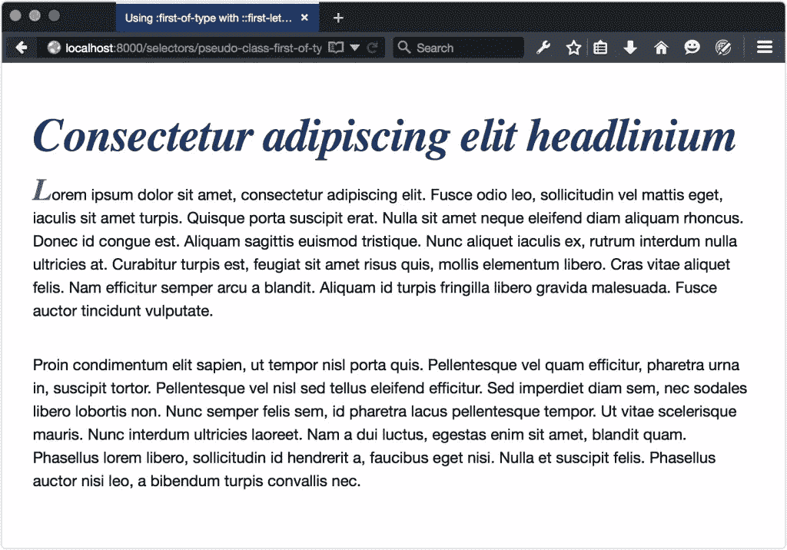

#### 使用`:nth-of-type`和`:nth-last-of-type`

`:nth-of-type()`和`:nth-last-of-type()`也是函数伪类。他们接受与`:nth-child()`和`:nth-last-child()`相同的论点。但是像`:first-of-type`和`:last-of-type`一样，索引解析相同类型的元素。例如，要选择第一个`p`元素和随后的每一个`p`元素，我们可以使用`odd`关键字和`:nth-of-type()`:

```
p:nth-of-type(odd) {
  background: #cddc39;
  color: #121212; 
}
```

正如你在下图中看到的，这只匹配奇数编号的`p`元素，而不是奇数编号的子元素。

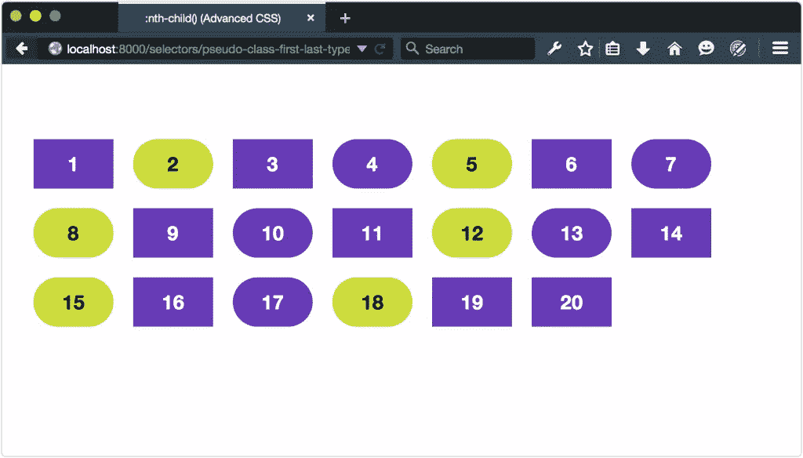

类似地，使用`:nth-last-of-type(even)`选择偶数编号的`p`元素，但是计数从文档中的最后一个`p`元素开始——在本例中是第 18 个元素(如下所示)。

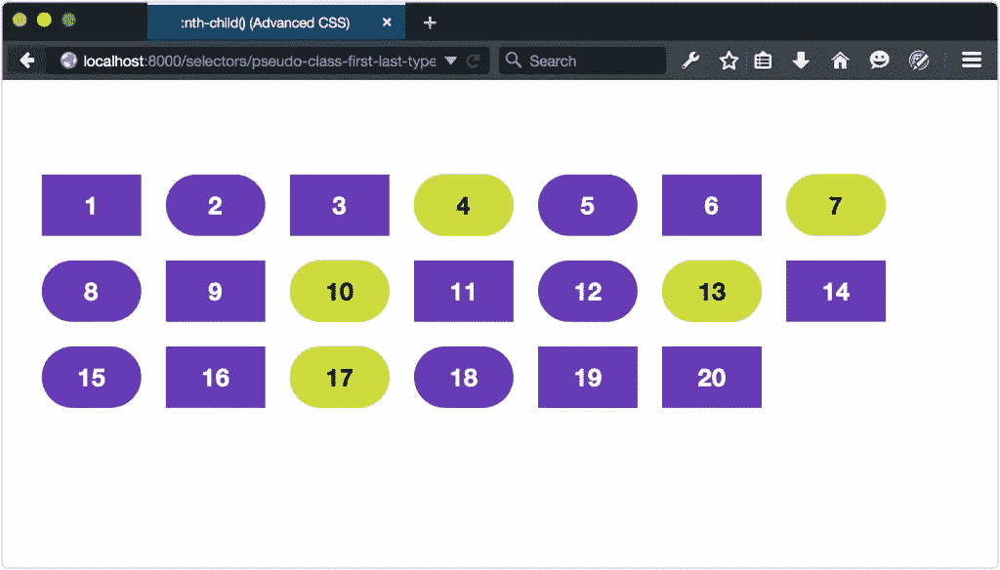

如果这看起来仍然模糊，玩玩保罗·马洛尼的[第 n 次测试工具，](http://nth-test.com/)或查看在[第 n 次硕士的例子。](http://nthmaster.com/)这两个项目都是了解这些伪类的好方法。

* * *

[<sup class="para">【5】</sup>](#d5e1094)这个 *An+B* 语法在 [CSS 语法模块三级中有描述。](https://www.w3.org/TR/css-syntax-3/#anb)** 

## **分享这篇文章**