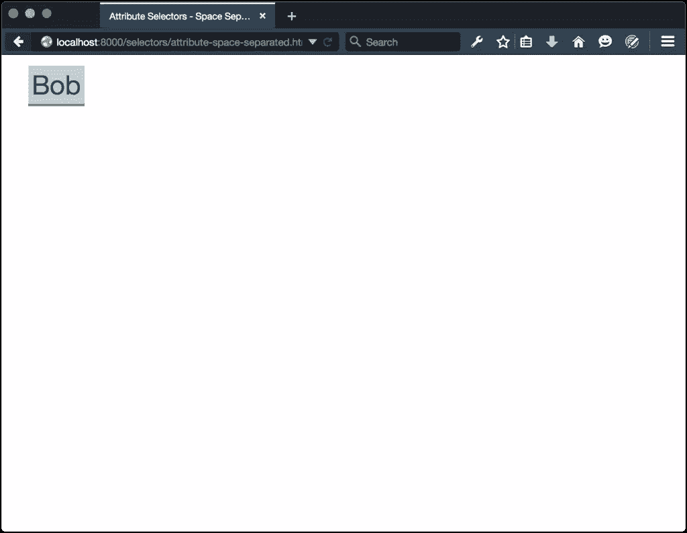
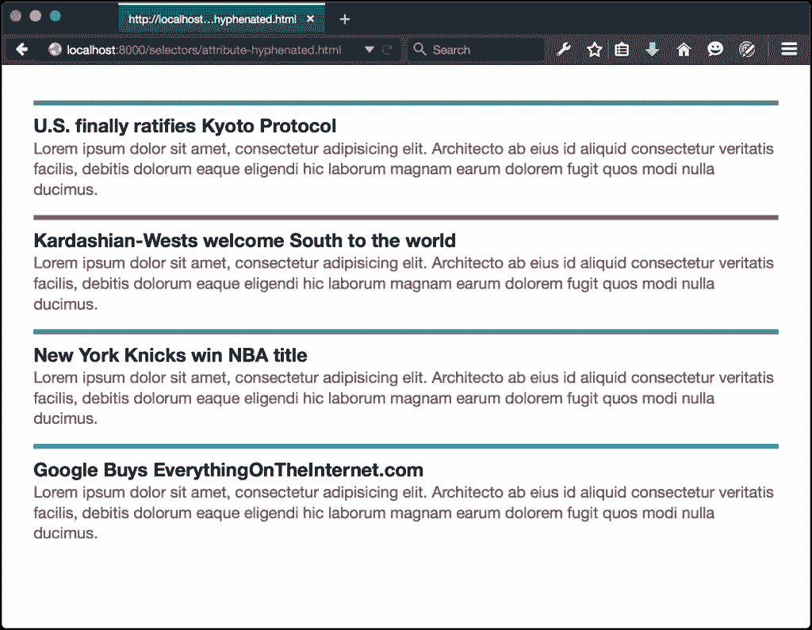

# CSS 选择器:属性选择器

> 原文：<https://www.sitepoint.com/css-selectors-attribute-selectors/>

**属性选择器** 是 [CSS 选择器](https://www.sitepoint.com/css-selectors/)，根据元素的属性匹配元素。这可以是单独的属性，比如`[type]`，也可以是属性和值的组合，比如`[type=checkbox]`或者`[for="email"]`。

我们还可以用属性选择器进行属性存在和子串匹配。例如，我们可以匹配以空格分隔的列表中的属性值，或者我们可以匹配以`tel:`开头的属性值。我们甚至可以匹配带连字符的属性值，如`en-US`。

我们将在这里讨论的一些属性选择器是旧的。用连字符连接的属性值选择器和用空格分隔的属性值选择器都是在 CSS2 中定义的。另一方面，第 3 级选择器增加了一些强大的选择器，让我们可以匹配部分属性值。

在这一节中，我们将重点关注新的和不太为人所知的属性选择器。让我们来看看。

### 匹配属性存在

根据元素属性的确切值来匹配元素是很常见的。重置样式表常用选择器选择器如`[type=text]`和`[type=email]`。但是当有多个空格分隔的值时，我们也可以匹配属性。我们需要使用空格分隔的属性值选择器:`[att~=val]`。

空格分隔的属性值选择器匹配具有属性`att`和一个值列表的元素，其中一个值是`val`。这可以是任何接受空格分隔值的属性，包括`class`或`data-*`。

诚然，用空格分隔的属性列表并不常见。它们有时与`rel`属性和[微格式](http://microformats.org/wiki/existing-rel-values)一起使用来描述人和文档之间的关系。我们可以像这样标记一个外部链接:

```
<a href="http://example.com/" rel="external friend">Bob</a>
```

然后，我们可以使用这个基于存在的属性选择器来匹配这个链接和类似的链接:

```
[rel~=friend] {
font-size: 2em;
background: #eee;
padding: 4px;
text-decoration: none;
border-bottom: 3px solid #ccc;
}
[rel~=friend]:link,
[rel~=friend]:visited {
color: #34444C;
}
[rel~=friend]:hover{
background: #ffeb3b;
border-color: #ffc107;
}
```

这给了我们下图中的图像。



### 匹配带连字符的属性值

我们可以用属性选择器完成的一个更有趣的任务是通过使用`[attr|=val]`来匹配带有连字符属性值的元素。当值用连字符连接并且前缀等于`val`时，该选择器通过属性匹配元素。

乍一看，这似乎是一个无用的选择器；然而，对于使用语言和语言代码来说，这是非常实用的——比如`en-US`或`es-MX`——这是它的预期用途。

假设我们有一个针对说英语的人的网站。我们的网站还支持英语的两种区域变体:英国和美国。这些语言的语言代码分别为`en-GB`和`en-US`。我们还在`html`标签上设置了语言；比如`<html lang="en-US">`。

我们的网站教说英语的人精通法语、西班牙语和葡萄牙语。它包含许多类似于以下示例的标记:

```
<p lang="fr-FR"><q>Tout le monde.</q></p>
<p><q>All the world.</q>, or <q>Everyone</q></p>
```

让我们将法语文本设为斜体，并在其两侧添加适合语言的尖括号(和):

```
[lang|="fr"] {
font-style: italic;
}
[lang|="fr"] q:before{
content: '\00AB'; /* Left angle quote */
}
[lang|="fr"] q:after{
content: '\00BB'; /* Right angle quote */
}
```

这个选择器的酷之处在于，如果属性等于前缀，它也会匹配。这些风格也适用于`<p lang="fr">`。我们可以进一步限制这些选择器的范围，例如，通过在`lang`属性:`p[lang|="fr"]`中添加一个`p`元素。

尽管旨在与语言代码一起使用，但这个选择器并不局限于语言代码。我们可以将它与任何带连字符的属性值一起使用。考虑以下标记:

```
<article class="articlepromo">
<h3>U.S. ratifies Kyoto Protocol</h3>
<p>Lorem ipsum dolor sit amet, consectetur adipisicing ....</p>
</article>

<article class="articlepromo-entertainment">
<h3>Kardashian-Wests welcome South to the world</h3>
<p>Lorem ipsum dolor sit amet, consectetur adipisicing ....</p>
</article>

<article class="articlepromo-sports">
<h3>New York Knicks win NBA title</h3>
<p>Lorem ipsum dolor sit amet, consectetur adipisicing ....</p>
</article>

<article class="articlepromo-business">
<h3>Google Buys EverythingOnTheInternet.com</h3>
<p>Lorem ipsum dolor sit amet, consectetur adipisicing ....</p>
</article>
```

这些都是文章宣传片或预告。它们有一些相同的视觉特征和行为，还有一个`articlepromo`前缀。这里，我们也可以使用带连字符的属性选择器来匹配这些类名:

```
[class|="articlepromo"] {
border-top: 5px solid #4caf50;
color: #555;
line-height: 1.3;
padding-top: .5em;
}

[class|="articlepromo"] h3 {
color: #000;
font-size: 1.2em;
margin:0;
}

[class|="articlepromo"] p {
margin: 0 0 1em;
}
```

接下来，为每种类型的部分使用特定的边框颜色，你会沿着下图中看到的布局线得到一些东西。



我们也可以把它和`id`的名字一起使用；例如，`[id|=global]`将匹配`#global-footer`、`#global-menu`，依此类推。

现在，仅仅因为你 *能* 做某事并不一定意味着你 *就应该* 。用连字符连接的属性值选择器非常适用于不同语言的样式差异。但是，对于任何其他用法，您最好使用类名选择器。在大型项目中，类名降低了意外影响的风险。如果您的项目仍然需要 Internet Explorer 8 支持，它们也是必不可少的，因为 IE8 不支持这个选择器。

### 通过子串匹配属性值

当属性值匹配特定的子字符串时，我们也可以选择元素。三个字符序列允许我们根据子串是位于属性值的开头、结尾还是其他位置来匹配元素:

`^=`

matches when the substring sits at the beginning of the string.

`$=`

matches when the substring sits at the end of the string.

`*=`

matches when the substring is present at any position within the string.

这些选择器什么时候会派上用场？想想使用`tel:`(非标准)或`mailto:`的链接。因为它们的行为与其他超链接不同，所以对它们进行不同的样式设计是有意义的，只是作为对用户的一个提示。拿的*这个业务叫*的链接:

```
<a href="tel:+14045555555">Call this business</a>
```

我们可以通过使用`^=`字符序列:`[href^="tel:"]`来选择这个和其他的`tel:`链接。让我们添加一些声明:

```
[href^="tel:"] {
background: #2196f3 url(img/phone-icon.svg) 10px center / 20px auto no-repeat;
border-radius: 100px;
padding: .5em 1em .5em 2em;
}
```

你可以在下图中看到结果。


当属性值 *以子字符串结束* 时，要匹配元素，将`^`改为`$`。如果出于某种奇怪的原因(让我强调这是奇怪的)，我们希望匹配电话号码(5555)的后四位数字，我们可以使用以下代码:

```
[href$="5555"] {
background: #e91e63;
}
```

显然，匹配以相同后缀结尾的元素更有用。例如，您可以将`<aside class="sports-sidebar">`和`<aside class="arts-sidebar">`与`[class$=sidebar]`匹配。

然而，使用`$=`不会将一个元素与类名`sports-sidebar-a`匹配。为此，我们需要使用`*=`序列。将我们的选择器切换到`[class*=sidebar]`就可以了。

CSS3 和 CSS4 中增加的大部分新选择器根本不是属性选择器。它们是伪类或伪元素。我们将在接下来的几节中讨论这些内容。

## 分享这篇文章