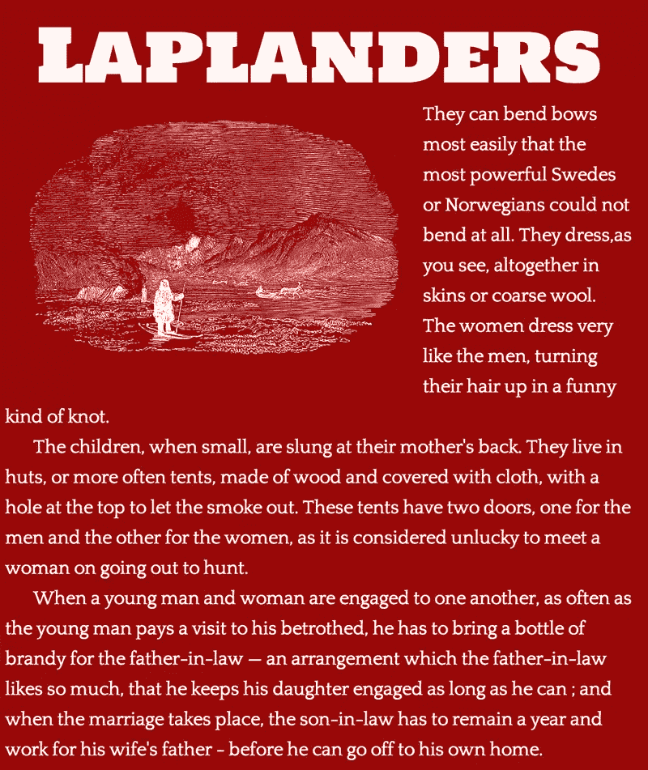
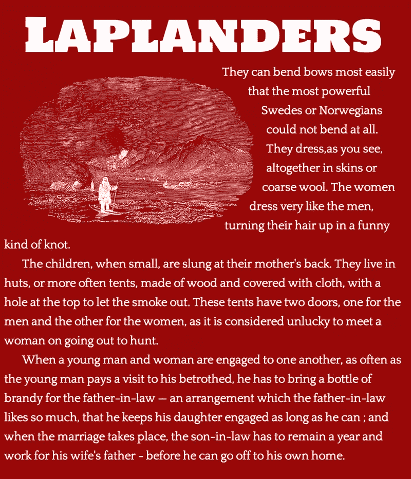

# CSS 形状:打破矩形设计的桎梏

> 原文：<https://www.sitepoint.com/css-shapes-breaking-rectangular-design/>

五年前，HTML5 和 CSS3 的能力完全超越了我们在网络上的能力。CSS 形状模块 1 级规范有潜力打破网页的矩形限制，将网页设计提升到新的高度。它允许将元素设计成各种形状(考虑圆形或五边形 div ),并允许文本以更自然的方式环绕元素(将文本环绕在弯曲设计的边缘，而不是坚持方形边界)。这篇文章将通过一些小演示来展示 CSS 形状的可能性，并帮助你开始探索！

## 关于形状规格

该规范是一个候选推荐标准，它是“对相关工作组或 W3C 本身之外的人的明确呼吁，以获得实现和技术反馈”。

基本上，这意味着社区中的 web 开发人员已经准备好进入那里，尝试一下，并分享他们的想法和想法，以帮助尽可能完善这个规范。它还没有为主流使用做好准备，但它正处于 web 开发社区参与进来并帮助探索如何在野外使用它的关键阶段。

如果您是一名开发人员，不经常修补那些不广泛可用且不兼容跨浏览器的东西，那么这篇文章可能不适合您——但是，如果您有时间，我会鼓励您尝试一两个演示，看看您在未来的设计中可以将这些新功能带到哪里。

## 你需要什么来试验 CSS 形状

为了开发和试验该规范，您需要确保使用受支持的浏览器。它目前在以下情况下工作:

*   [铬 34 及以上](https://www.google.com/intl/en/chrome/browser/)，带特殊标志(见下)
*   [Chrome 金丝雀](https://www.google.com/intl/en/chrome/browser/canary.html)
*   [WebKit Nightly](http://nightly.webkit.org/)

如果使用 Chrome(非金丝雀),将此粘贴到地址栏中:

```
chrome://flags/#enable-experimental-web-platform-features
```

然后点击“启用实验性网络平台功能”下的“启用”并选择“立即重新启动”来重启你的浏览器并赋予它全新的 CSS 超能力。

说完这些介绍，让我们直接进入 Shapes spec 必须提供的内容。

## `shape-outside`属性

我们将探索的第一个领域是新的`shape-outside`酒店。这可以在元素周围定义一个不同的浮动区域。除了文本以矩形环绕浮动元素，元素还可以以圆形、多边形或椭圆形环绕文本。它在元素的浮动框边界内剪切出一个新区域，允许文本在其中换行。

在我的演示中，我会从 F. Winslow 的《儿童童话地理》或《快乐的欧洲之旅》中选取一些片段。大英博物馆非常友好地向公共领域发布了一批作品，这本儿童书籍恰好是其中之一(而且也恰好有一批大小不同的图片！).

我们的第一个超级简单的例子是这样的:



HTML 看起来像这样:

```
<h1>Laplanders</h1>

<p>They can bend bows most easily that the most powerful Swedes or Norwegians
could not bend at all. They dress,as you see, altogether in skins or coarse wool. 
The women dress very like the men, turning their hair up in a funny kind of knot.</p>
```

我们将把`shape-outside`属性添加到图像(`.lapland`)元素的 CSS 中:

```
.lapland {
  float: left;
  shape-outside: inset(1% round 45%);
}
```

因此，图像的角变得非常圆，与插图的自然边界半径相匹配:



对于那些在支持浏览器上观看的人，这里有一个 CodePen 演示:

参见 [CodePen](http://codepen.io) 上 SitePoint ( [@SitePoint](http://codepen.io/SitePoint) )的钢笔 [CSS 形状演示#2](http://codepen.io/SitePoint/pen/LskqC/) 。