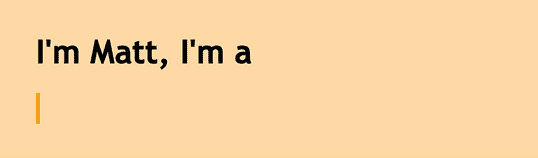

# 如何为你的网站创建 CSS 打字机效果

> 原文：<https://www.sitepoint.com/css-typewriter-effect/>

在这篇文章中，你将学习如何在纯 CSS 中使用打字机效果来使你的网站的文本更动态、更吸引人。

打字机效果包括文本逐渐显现，就好像它正在你眼前被打字。



给你的文本添加打字机效果可以帮助吸引你网站的访问者，让他们有兴趣继续阅读。打字机效果可以用于许多目的，例如制作引人入胜的登录页面、行动号召元素、个人网站和代码演示

## 打字机效果很容易创造

打字机效果很容易制作，为了理解本教程，你所需要的只是 CSS 和 CSS 动画的基础知识。

打字机效果是这样工作的:

*   打字机动画将显示我们的文本元素，通过使用 CSS `steps()`函数一步一步地将其宽度从 0 改变到 100%。
*   一个闪烁动画将动画显示“打出”文本的光标。

## 为我们的打字效果创建网页

让我们首先为打字机演示创建网页。它将包含一个用于我们的打字机文本的`<div>`容器，带有一个`typed-out`类:

```
<!doctype html>
<html>
  <head>
    <title>Typewriter effect</title>
    <style> body{
        background: navajowhite;
        background-size: cover;
        font-family: 'Trebuchet MS', sans-serif; 
      } </style>
  </head>
  <body>
    <div class="container">
      <div class="typed-out">Web Developer</div>
    </div>
  </body>
</html> 
```

## 为打字机文本设置容器样式

现在我们已经有了网页的布局，让我们用“打出”类来设计`<div>`的样式:

```
.typed-out {
  overflow: hidden;
  border-right: .15em solid orange;
  font-size: 1.6rem;
  width: 0;
} 
```

请注意，为了让打字机效果生效，我们添加了以下内容:

*   `"overflow: hidden;"`和一个`"width: 0;"`，以确保在输入效果开始之前文本内容不会显示。
*   `"border-right: .15em solid orange;"`，创建打字机光标。

在制作打字效果之前，为了让光标停留在`typed-out`元素的最后一个字母，就像打字机(或者文字处理器)一样，我们将为`typed-out`元素创建一个容器并添加`display: inline-block;`:

```
.container {
  display: inline-block;
} 
```

## 制作显示文本动画

打字机动画将创建一个字母接一个字母地打出`typed-out`元素中文本的效果。我们将使用`@keyframes` CSS 动画规则:

```
@keyframes typing {
  from { width: 0 }
  to { width: 100% }
} 
```

正如您所看到的，这个动画所做的只是将元素的宽度从 0 更改为 100%。

现在，我们将这个动画包含在我们的`typed-out`类中，并将其动画方向设置为`forwards`，以确保在动画完成后文本元素不会返回到`width: 0`:

```
.typed-out{
    overflow: hidden;
    border-right: .15em solid orange;
    white-space: nowrap;
    font-size: 1.6rem;
    width: 0;
    animation: typing 1s forwards;
} 
```

我们的文本元素将在一个平滑的步骤中显示，从左到右:

通过 site point([@ site point](https://codepen.io/SitePoint))[code Pen](https://codepen.io)上的
看笔 [平滑步](https://codepen.io/SitePoint/pen/OJjLXqE)。