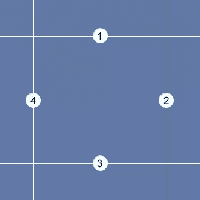
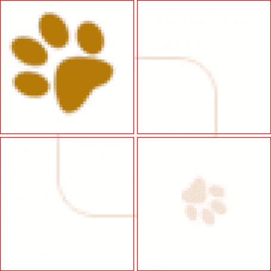

# 漂亮、灵活的框的 CSS3 边框图像

> 原文：<https://www.sitepoint.com/css3-border-images/>

CSS3 的热潮正如火如荼地进行着，CSS3 的许多最有用的属性也受到了相当多的关注。像边框半径、文本阴影、自定义渐变甚至 CSS3 过渡这样的属性已经被证明是非常实用的，可以用最少的标记和可维护的代码解决现实世界中的设计问题。

然而，CSS3 的一个被忽略的属性是`border-image`属性。具有讽刺意味的是，这个属性如此有用的原因，恰恰是它非常令人困惑的原因。

在这篇文章中，我将试图揭开这个非常实用的属性。我将使用一些比目前善意的博客和网站更有吸引力的例子来演示如何实现它。

## 语法

目前，浏览器对 CSS3 边框图像的唯一支持是通过边框图像简写符号。下面是语法的样子，包括必要的专有语法:

```
.border-image-example {  -webkit-border-image: url(border-image.jpg) 45 20 45 30 repeat;  -moz-border-image: url(border-image.jpg) 45 20 45 30 repeat;  border-image: url(border-image.jpg) 45 20 45 30 repeat;}
```

这个符号被分成三个部分。第一个是指向图像的 URL。这对于大多数 CSS 开发人员来说应该很熟悉，因为它与 CSS `background`属性使用的语法相同。

下一部分(四个数值)表示`border-image-slice`属性。[规格](https://www.w3.org/TR/css3-background/#border-image-slice)解释道:

> 四个`border-image-slice`值分别表示从图像的顶部、右侧、底部和左侧边缘向内偏移，将图像分为九个区域:四个角、四个边缘和一个中间。

因此，您提供的单个图像将被分割成九块，然后用于构建边界。切片的制作方法如图 1[所示，“边界图像切片模型”](#fig_slice "Figure 1. The border-image-slice model")。

**图一。`border-image-slice`模型**



您会注意到创建区域的线是单独编号的。当这些假想线相交时，它们就形成了图像将被分割成的九个区域。

那么，这四个数值是如何与上图相关联的呢？

*   第一个值是图像最顶端边缘和第 1 行之间的距离(以像素或百分比为单位)。
*   第二个值是最右边和第 2 行之间的距离。
*   第三个值是最底部边缘和线#3 之间的距离。
*   最后，第四个值是最左边和第 4 行之间的距离。

**note:** Values and Units

应该注意，语法要求在使用百分比值时包含%符号，但是在使用像素值时应该省略`px`。

图像的角片以一种简单的方式处理，每个角片分别用于应用了`border-image`的元素的各个角。然而，中间部分更棘手；毕竟，大小可能是任何长度。这就是`border-image`简写符号中最后一个值发挥作用的地方。它将决定如何处理图像的非角落部分。四个可能的值是`stretch`、`repeat`、`round`和`space`。

前两个非常简单:`stretch`将拉伸切片以填充所需的空间，`repeat`将平铺切片。后两个(`round`和`space`)是`repeat`的变种；它们指定在可用空间不允许全部切片数量的情况下应采取的行为。使用`repeat`，一旦所有空间都被填满，最后一块瓷砖将被简单地切掉。相比之下，如果你使用`space`，多余的空间将分布在每个磁贴周围；如果你使用`round`，图像会被拉伸一点，这样一个整数或切片就足以填满这个空间。

还可以为此属性指定两个值，第一个值应用于顶部和底部，第二个值应用于左侧和右侧:

```
border-image: url(border-image.jpg) 45 20 45 30 repeat stretch;
```

关于如何使用这些值构建边界的深入解释，[查看规范](https://www.w3.org/TR/css3-background/#border-image-repeat)。

## 它是如何工作的？

为了让`border-image`正确工作，它所应用到的元素必须具有`border`(或`border-width`)属性，该属性设置有四个值，对应于简写符号中给定的值。(否则，您的图像切片将被拉伸以填充边框宽度，这很少是您想要的)。

这四个值的行为类似于边距和填充值；没有必要显式声明所有四个值。你可以声明一个值，它将代表所有四个值。或者您可以只包含前两个值，这两个省略的值将与声明的值相匹配。因此，以下两个示例将具有完全相同的结果:

```
.border-image-example {border-image: url(bg-border.jpg) 45 20 45 20 repeat;}.border-image-example {border-image: url(bg-border.jpg) 45 20 repeat;}
```

## 一些演示

如前所述，各种博客上展示的许多`border-image`的例子是彻头彻尾的丑陋。对于本文，我决定创建几个更简洁、更实用的例子来展示当所有正在使用的浏览器都完全支持这个属性时，它将变得多么有价值。[看看](http://sitepoint-examples.s3.amazonaws.com/css3-border-image/demos.html)，并确保查看源代码，以了解这些演示的具体内容。

三种不同的图像用于创建演示页面上显示的边框图像。[图 2，“演示中使用的三个图像”](#fig_allimages "Figure 2. The three images used in the demo")显示了所有三个图像，因此您可以看到该属性的灵活性。

**图二。演示中使用的三张图片**


上面的三张图片都很小，但是由于`border-image`属性的灵活性，它们可以适合任何大小的盒子，只要在 CSS 中正确地声明了设置。

## 构建要使用的图像

不可否认，创建边框图像所需的图像一开始可能有点乏味。但是一旦你理解了这个属性是如何工作的，就很容易创建你的边界框的模型，然后将图像压缩到最低限度以便插入到页面中。

为了准确理解这些图像是如何构建的，下面是放大并分成几部分的第一张图像:

**图 3。仔细查看其中一张演示图片**



红色的框表示四个角部分，而框之间的区域(在这种情况下只有一个像素)表示将重复或拉伸以适应框的大小的边框部分。

在这个例子中，角图像之间的单个像素就足够了，因为重复的边界是单个像素。

在演示页面上，您会注意到第三个示例的一个变体，在整个图像周围有爪印，并且用空白分隔爪印。在这种情况下，如果不在 CSS 符号中使用`round`或`space`值，就很难让边框图像在不同大小的盒子中正常工作。事实上，如果你在 Chrome 或 Safari(缺乏对`round`值的支持)中查看这些例子，你会注意到第三个例子中的一些爪印在角落附近被剪掉了；反过来，Firefox 3.5+和 Opera 10.5+(都支持值`round`)就没有这个缺陷。

## 记住你的后备选项！

由于缺乏对所有现代浏览器的支持，图像边框在这一点上不太可能被广泛使用。如果您决定使用它们，不要忘记在不支持的浏览器中进行测试，并为边框的外观和大小提供可靠的后备选项。

有关`border-image`属性的更详细的讨论，请务必查看下面的参考资料:

*   [W3C 关于边框图像的规范](https://www.w3.org/TR/css3-background/#border-images)
*   [理解边框图像](http://css-tricks.com/understanding-border-image/)，在 CSS-Tricks

你知道在实时网站上使用边框图像的例子吗？请在评论中告诉我们。

## 分享这篇文章