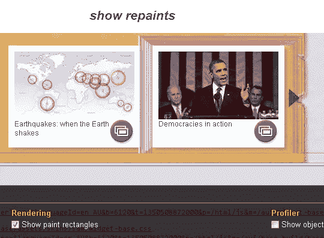
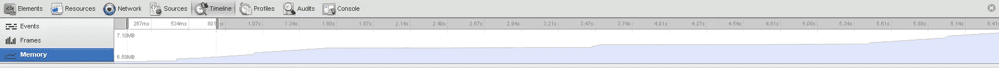
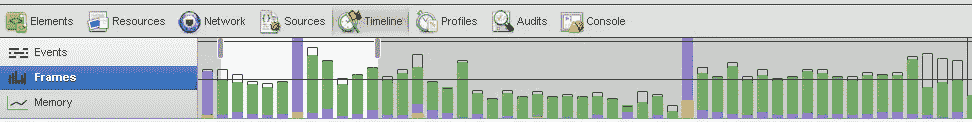
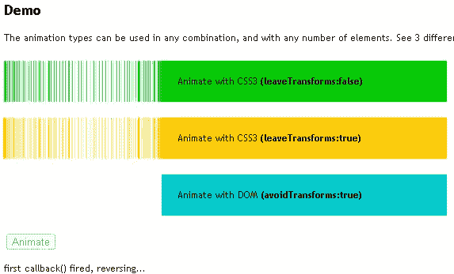
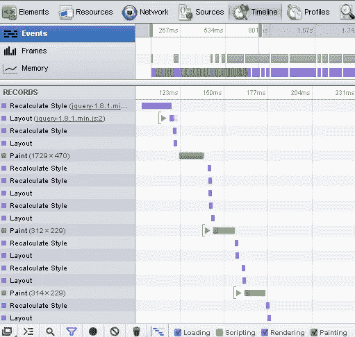
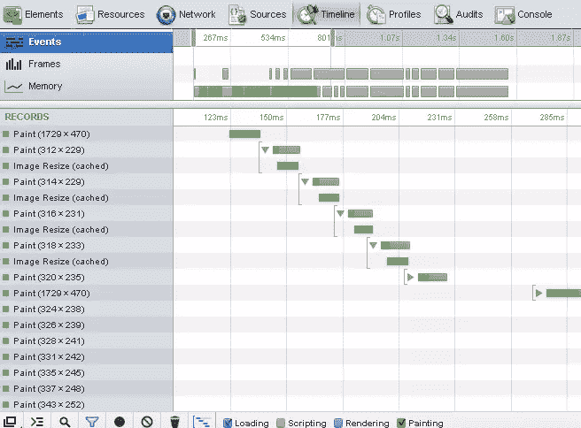
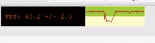
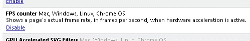
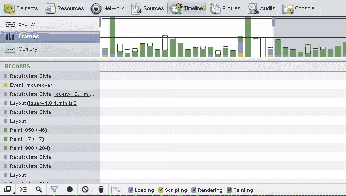
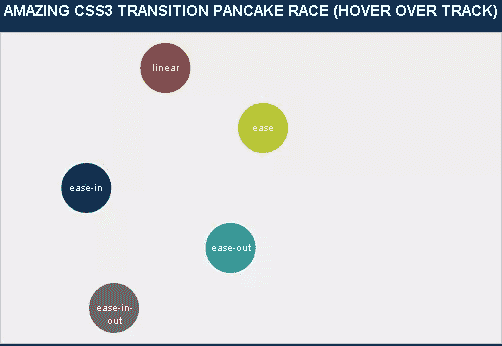

# 使用 GPU 来执行 flickr 和 trails(重画)CSS3 过渡

> 原文：<https://www.sitepoint.com/css3-pevent-flickr-trails/>

所以今天我仔细研究了如何使用 **GPU 来执行 flickr 和 trails(重画)CSS3 过渡**。截图显示 CSS3 scale repaint 在 chrome 上留下痕迹。然后在这篇文章的后面，快速看一下 CSS3 控件的一些属性。



## 硬件加速

> 硬件加速是浏览器整体渲染性能的一个重要里程碑。一般方案是将原本由主 CPU 计算的任务卸载到计算机图形适配器中的图形处理单元(GPU)。这可以带来巨大的性能提升，还可以减少移动设备上的资源消耗。



帧速率。



没有踪迹。？！？



### 重新布局/重画

一个可能的结果是，当动画发生时，在屏幕上被动画化的对象不需要页面的单一“重新布局”。因为 CSS 转换是由浏览器管理的，所以它的动画的保真度可以大大提高，并且在许多情况下是硬件加速的。

在开发工具中重新绘制。



仅重涂。



### FPS 计数器

要做到这一点，只需在 chrome 中输入“chrome:flags ”,向下滚动到 FPS 计数器，启用它，然后点击屏幕底部的重新启动按钮。启用它后，您应该可以在窗口的左上角看到显示的 FPS 速率，这表明该页面确实经过了 GPU 加速。





### 那么我们用 Scale 还是 Scale3d 呢？

查看规模与规模的示例 3d:[https://jsfiddle.net/Hw6AM/2/](https://jsfiddle.net/Hw6AM/2/)

开发工具中的 Scale3D 框架。



### 三次贝塞尔曲线和计时函数

对于 3D 动画，贝塞尔曲线通常用于定义 3D 路径，2D 曲线用于关键帧插值。本质上是通过设置从比率中导出的固定 css 坐标点来控制动画速度的缓和函数。

```
-webkit-transition: -webkit-transform 0.2s ease-in-out;
-moz-transition: -moz-transform .2s ease-in-out;
-o-transition: -o-transform .2s ease-in-out;
-ms-transition: -ms-transform .2s ease-in-out;
transition: transform .2s ease-in-out;
```

与上面的例子相同，但是速度曲线是用三次贝塞尔函数指定的:

```
-webkit-transition: all 300ms cubic-bezier(0.420, 0.000, 0.580, 1.000);
   -moz-transition: all 300ms cubic-bezier(0.420, 0.000, 0.580, 1.000);
    -ms-transition: all 300ms cubic-bezier(0.420, 0.000, 0.580, 1.000);
     -o-transition: all 300ms cubic-bezier(0.420, 0.000, 0.580, 1.000);
        transition: all 300ms cubic-bezier(0.420, 0.000, 0.580, 1.000); /* ease-in-out */
```

关于计时功能的更多信息，请参见 [Mozila 计时功能。](https://developer.mozilla.org/en-US/docs/CSS/timing-function)

## 计时功能–更多示例

煎饼定理！令人惊叹的 CSS3 过渡煎饼赛(悬停在赛道上空)
[](http://pancaketheorem.com/stuff/demos/cubicbezier-transitions.php)

谷歌 CSS3 用三次贝塞尔曲线旋转。
[](https://jsfiddle.net/3xGss/)

## CSS3 过渡控件属性

让我们来看看 CSS3 的一些过渡控件属性以及使用它们的限制。

```
-webkit-backface-visibility: hidden;
```

有用，注意 Chrome 默认显示背面可见。阅读更多关于 [CSS 技巧背面可视性](http://css-tricks.com/almanac/properties/b/backface-visibility/)的内容。

```
-webkit-perspective: 1000;
```

不太好用，只受 Chrome 和 Safari 支持。阅读更多关于 [W3 CSS3 透视图](http://www.w3schools.com/cssref/css3_pr_perspective.asp)的信息。

```
-webkit-font-smoothing: subpixel-antialiased;
```

对那些开发 safari 的人来说很有趣。阅读更多关于 maxvoltar 字体平滑的信息。

```
-webkit-transform-style: preserve-3d;
```

酷炫效果查看[变换风格演示](http://www.webkit.org/blog-files/3d-transforms/transform-style.html)。

```
useTranslate3d: true;
```

谷歌表示:“将 Translate3d 选项设置为 true，可以在 iDevices 上实现更流畅的(硬件加速)动画。”阅读更多关于 [CSS 动画属性](http://oli.jp/2010/css-animatable-properties/)的内容。

## 资源和进一步阅读

HTML5 在速度上摇摆。

jQuery 动画增强。

Paul Irish 在 requestAnimationFrame 上。

高级动画演示(使用原型)。

关于 css 转换的非常酷的文章。

[GPU CSS。](http://blog.urbaninsight.com/2013/01/04/improving-html5-app-performance-gpu-accelerated-css-transitions)

[三次贝塞尔缓和工具。](http://matthewlein.com/ceaser/)

## 分享这篇文章