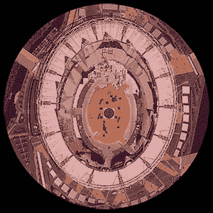

# CSS3 Gems:指针事件属性

> 原文：<https://www.sitepoint.com/css3-pointer-events/>

跟上 CSS3 的进步变得越来越困难。就在你认为你什么都见过的时候，你发现了一个非常有用的新特性。

考虑一个元素与另一个元素重叠时的 HTML 问题。底部元素中的所有控件和链接都不能使用或单击。有时候这很有用，比如显示一个模态对话框。有时候不是。

让我们考虑一个热门的例子。假设你刚刚成功地在火星表面着陆了一个探测器。但是，你没有分析无聊的岩石样本或寻找原始的外星生命，而是决定将你强大的望远镜对准地球[观看一场受欢迎的体育赛事](http://www.london2012.com/) *(我意识到这有点太晚了，但我们会假设时空异常已经打开，距离似乎更远，你正在观看最近的历史)*。

好吧——复杂的例子，但是请耐心听我说！本质上，探测器将通过红色的望远镜看到地图…

如果我们想在网页上复制这个，我们可以使用 Google、Bing 或任何其他提供商的地图 API，并覆盖望远镜图形。不幸的是，地图将变得不可操作，您无法拖动或缩放，因为控件被透明图形遮挡。

## 指针-救援事件！

默认的`pointer-events`设置是*自动*，覆盖的图像将接收所有的鼠标事件，即使它没有等待任何事件。然而，将它设置为 *none* 意味着它永远不会成为鼠标事件的目标。换句话说，可以拖动和使用地图，就像没有覆盖图一样。

[**查看 CSS3 指针事件火星探测器奥运浏览器演示页面……**](https://blogs.sitepointstatic.com/examples/tech/css3-pointer-events/index.html)

在 Firefox、Chrome 或 Safari 中尝试一下，地图仍然可用。IE 和 Opera 不支持 HTML `pointer-events`所以拖动和缩放会失败。

将`pointer-events`设置为 none 并不一定意味着元素*永远不会*接收鼠标事件。如果一个子元素允许捕获，那么当这些事件沿着父链向上冒泡时，它将接收这些事件。

此外，`pointer-events`起源于 SVG CSS，它提供了其他几个选项，例如笔画——当指针在笔画边界上时，元素只能接收鼠标事件。所有浏览器都支持 SVG `pointer-events`，包括 IE9 和 Opera。

更多信息，请参考 [MDN 指针事件文档](https://developer.mozilla.org/en-US/docs/CSS/pointer-events)。我怀疑你能想出该属性有用的许多情况。

## 分享这篇文章