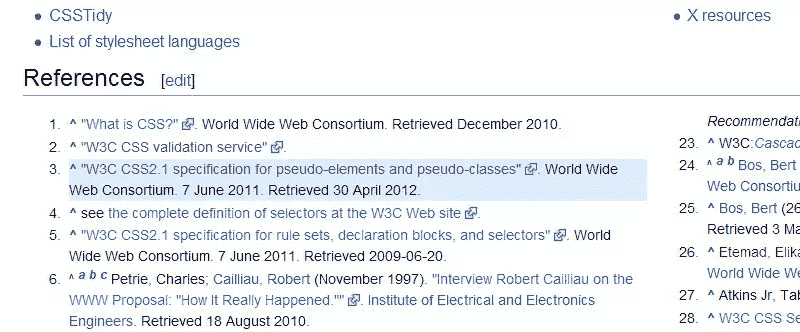

# 当前一代的 CSS3 选择器

> 原文：<https://www.sitepoint.com/current-generation-css3-selectors/>

在 CSS 2.1 之后，W3C 增加了一系列新的选择器来帮助我们以独特的方式定位元素。几乎所有这些选择器都有出色的浏览器支持，所以您可以——也可能应该——已经在使用它们了。

如果你对它们不太熟悉，这篇文章会给你一个关于这些 CSS3 选择器的概述，我想称之为“当代”的 CSS 选择器。在适用的地方，我包含了一个演示选择器的简单嵌入式演示。

## :目标伪类

如果通过 URL 中的片段标识符选择了一个元素，那么`:target`伪类将样式化该元素。如果这听起来令人困惑，让我们看一个例子。这是一个会出现在地址栏中的 URL:

```
https://www.sitepoint.com/example-page/#section-1
```

这个 URL 指向一个 ID 为“section-1”的元素，将页面滚动到该位置。你可能以前做过这种非正式的叫做*页内链接*或者*本地*链接的事情。

当您在 CSS 中声明一个`:target`伪类时，URL 中以这种方式“定位”的任何元素都将按照`:target`规则集中的定义进行样式化:

```
:target {
    background-color: yellow;
    color: black;
}
```

在这种情况下，`:target`选择器被普遍使用(也就是说，它没有附加到任何特定的元素)，这很好。但是，我们可以将其限制在某些元素上:

```
p:target {
    background-color: yellow;
    color: black;
}
```

你可能已经在维基百科的脚注引用中看到了这个选择器[，如下图所示:](http://www.impressivewebs.com/dynamically-highlight-content-wikipedia-css3/)



在 [CodePen](http://codepen.io) 上看笔[:site point(](http://codepen.io/SitePoint/pen/HJDIa)[@ site point](http://codepen.io/SitePoint))目标演示。