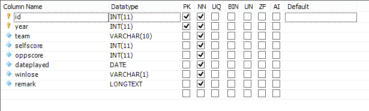
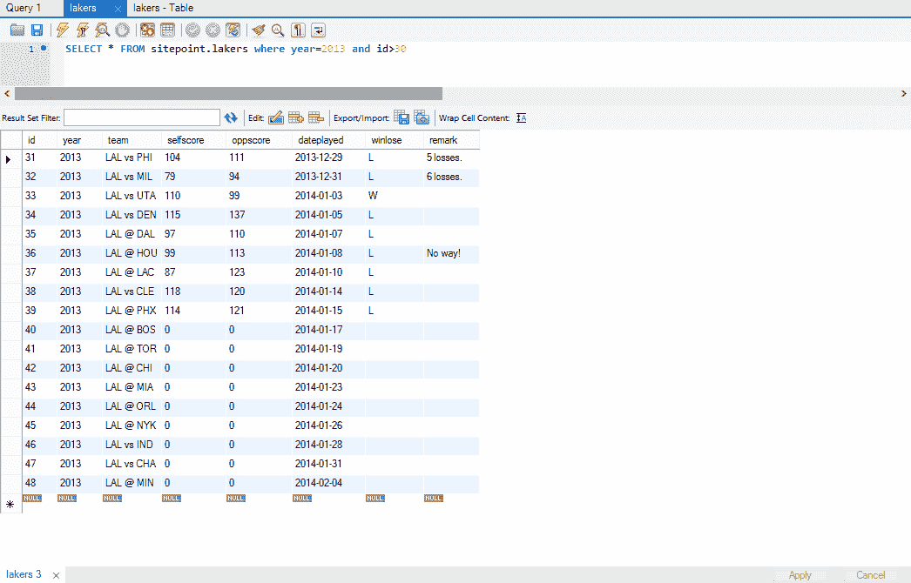
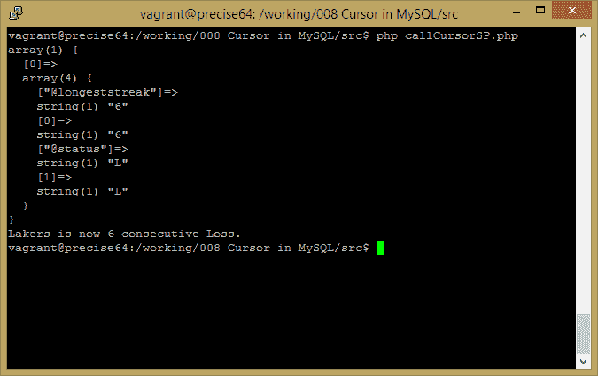
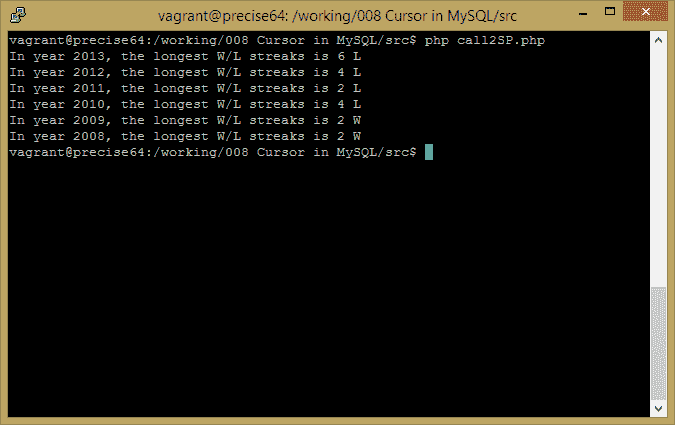

# MySQL 存储过程中的游标

> 原文：<https://www.sitepoint.com/cursors-mysql-stored-procedures/>

在我的上一篇关于存储过程的文章发表在 SitePoint 上之后，我收到了很多评论。其中一个建议进一步阐述游标，这是存储过程中的一个重要特性。

由于游标是存储过程的一部分，我们将在本文中对 SP 进行更详细的阐述。特别是，我们将看到如何从 SP 返回数据集。

### 什么是光标？

在 MySQL 中，游标不能单独使用。它是存储过程中的一个基本组件。我倾向于将 C/C++中的光标视为“指针”,或者 PHP 的`foreach`语句中的迭代器。

有了游标，我们可以遍历数据集并操纵每条记录来完成某些任务。当对记录的这种操作也可以在 PHP 层完成时，它节省了数据传输量，因为我们可以将处理过的聚合/统计结果返回给 PHP 层(从而消除了客户端的`select`–`foreach`–操作过程)。

因为游标是在存储过程中实现的，所以它具有 SP 的所有优点(和限制)(访问控制、预编译、难以调试等)。

关于光标的官方文档位于[这里](http://dev.mysql.com/doc/refman/5.6/en/cursors.html)。它只包含四个与游标声明、打开、关闭和获取相关的命令。如上所述，我们还将涉及一些其他的存储过程语句。让我们开始吧。

### 一个现实世界的问题

我的个人网站有一个页面显示了我最喜欢的 NBA 球队:洛杉矶湖人队的比分。其背后的表结构很简单:



*图一。湖人比赛状态表结构*

我从 2008 年开始更新这个表格。显示湖人 2013-14 赛季的一些最新记录如下:



*图二。2013-2014 赛季湖人比赛状态表数据(部分)*

(我使用 MySQL Workbench 作为 GUI 工具来管理我的 MySQL 数据库。你可以使用你最喜欢的工具。)

嗯，我不得不承认湖人最近打得不是很好。截至 1 月 15 日，连续 6 次亏损。我通过手动计算从最后一场比赛一直到更早的比赛得到这个“6 连败”,并查看在`winlose`栏中的“L ”(意味着失败)会出现多长时间。这当然是可行的，但是如果在一个更大的表中需求变得更加复杂，那么它将花费更多的时间并且更容易出错。

我们能用一条 SQL 语句做到这一点吗？我不是 SQL 专家，也不知道如何从一条 SQL 语句中获得想要的结果(“6 连败”)。大师们的意见将受到高度赞赏——在下面的评论中留下吧。

我们可以用 PHP 实现吗？是的，当然。我们可以检索当前赛季的比赛数据(特别是`winlose`列),并遍历记录来计算当前最长的胜败记录。但要做到这一点，我们将不得不获取那一年的所有数据，而大部分数据都将被浪费掉(因为在一个 82 场比赛的常规赛中，一支球队不太可能连续赢/输超过 20 场比赛)。但是，我们不知道应该将多少记录检索到 PHP 中来确定 streak，所以这种浪费是必须的。最后，如果当前的输赢是我们唯一想从表格中了解的，为什么要提取所有的原始数据呢？

我们能通过其他方式做到这一点吗？是的，这是可能的。例如，我们可以创建一个冗余表，专门用于存储当前的输赢记录。每次插入记录都会更新该表。但是这太麻烦了，而且容易出错。

那么，有什么更好的方法来达到这个结果呢？

### 在存储过程中使用游标

正如本文的名字所暗示的，我们将会看到一个更好的替代方法(在我看来)来解决这个问题:在存储过程中使用游标。

让我们在 MySQL Workbench 中创建第一个 SP，如下所示:

```
DELIMITER $$

CREATE DEFINER=`root`@`localhost` PROCEDURE `streak`(in cur_year int,  out longeststreak int,  out status char(1))  BEGIN declare current_win char(1); declare current_streak int; declare current_status char  (1); declare cur cursor for  select winlose from lakers where year=cur_year and winlose<>'' order by id desc;  set current_streak=0; open cur; fetch cur into current_win;  set current_streak = current_streak +1; start_loop: loop
        fetch cur into current_status;  if current_status <> current_win then leave start_loop;  else  set current_streak=current_streak+1;  end  if;  end loop; close cur;  select current_streak into longeststreak;  select current_win into  `status`;  END
```

在这个 SP 中，我们有一个输入参数和两个输出参数。这定义了 SP 的签名。

在 SP 主体中，我们还声明了几个局部变量来保存特定比赛的连胜状态(赢或输，`current_win`)、当前连胜和当前输赢状态。

```
declare cur cursor for  select winlose from lakers where year=cur_year and winlose<>'' order by id desc;
```

上面一行是游标声明。我们声明了一个名为`cur`的游标，绑定到该游标的数据集是在特定年份按`id`(最近玩的游戏将具有最高 ID)降序排序的那些比赛的输赢状态(因此它的`winlose`列是“W”或“L”而不是什么都没有)。

虽然没有明确显示，但我们可以想象这个数据集将包含一系列“L”和“W”，根据上面图 2 中显示的数据，它应该是:“llllllllll……”(6ls，1 Ws，等等)。

为了计算输赢，我们从最新的(也是数据集中的第一个)比赛数据开始。当游标打开时，它总是从关联数据集中的第一条记录开始。

抓取第一个数据后，光标将移动到下一条记录。这样，游标的行为非常像队列，以 FIFO(先进先出)的方式遍历数据集。这正是我们想要的。

在获得了当前的赢/输状态并设置了条纹数之后，我们继续循环(遍历)数据集的剩余部分。在每次循环迭代中，光标将“指向”下一条记录，直到我们中断循环或所有记录都被消耗掉。

如果下一个赢/输状态与当前的赢/输状态相同，这意味着连胜继续，我们将连胜次数增加 1 并继续遍历；否则，这意味着连胜中断，我们可以更早地离开循环。

最后，我们关闭光标并释放资源。然后我们返回期望的输出。

接下来，我们可以增强 SP 的访问控制，如我在[上一篇文章](https://www.sitepoint.com/stored-procedures-mysql-php/)中所述。

为了测试这个 SP 的输出，我们将编写一个简短的 PHP 脚本:

```
<?php
$dbms =  'mysql'; $host =  'localhost'; $db =  'sitepoint'; $user =  'root'; $pass =  'your_pass_here'; $dsn =  "$dbms:host=$host;dbname=$db"; $cn=new PDO($dsn, $user, $pass); $cn->exec('call streak(2013, @longeststreak, @status)'); $res=$cn->query('select @longeststreak, @status')->fetchAll(); var_dump($res);  //Dump the output here to get a raw view of the output $win=$res[0]['@status']='L'?'Loss':'Win'; $streak=$res[0]['@longeststreak']; echo "Lakers is now $streak consecutive $win.\n";
```

这将输出如下图所示的内容:



(此输出基于湖人队截至 2014 年 1 月 15 日的比赛。)

### 从存储过程返回数据集

关于如何从一个 SP 返回一个数据集进行了一些讨论，该数据集是从对另一个 SP 的几次重复调用的结果中构造出来的。

用户可能想从我们以前创建的 SP 中了解更多信息，该 SP 仅返回一年的赢/输记录；因此，我们可以得到一个表格，以如下形式显示所有年份的输赢情况:

| 年 | 赢/输 | 倾向 |
| --- | --- | --- |
| Two thousand and thirteen | L | six |
| Two thousand and twelve | L | four |
| Two thousand and eleven | L | Two |

(嗯，更有用的结果可以是返回某个特定赛季最长的连胜和连败记录。这个要求可以很容易地从以前的 SP 扩展，所以我将把它留给感兴趣的人来实现。出于本文的目的，我们将坚持当前的胜败记录。)

MySQL SP 只能返回标量结果(整数、字符串等)，除非结果是由`select ... from ...`语句返回的(并且它变成了数据集)。这里的问题是，我们希望看到的表格形式的数据在我们当前的数据库结构中不存在，而是从另一个 SP 构造的。

为了解决这个问题，我们需要一个临时桌子的帮助，或者如果情况允许和需要，一个多余的桌子。让我们看看如何通过临时表格实现我们的目标。

首先，我们将创建第二个 SP，如下所示:

```
DELIMITER $$

CREATE DEFINER=`root`@`%` PROCEDURE `yearly_streak`()  begin declare cur_year, max_year, min_year int;  select max(year), min(year)  from lakers into max_year, min_year; DROP TEMPORARY TABLE IF EXISTS yearly_streak; CREATE TEMPORARY TABLE yearly_streak (season int, streak int, win char(1));  set cur_year=max_year; year_loop: loop if cur_year<min_year then leave year_loop;  end  if; call streak(cur_year,  @l,  @s); insert into yearly_streak values (cur_year,  @l,  @s);  set cur_year=cur_year-1;  end loop;  select  *  from yearly_streak; DROP TEMPORARY TABLE IF EXISTS yearly_streak;  END
```

这里需要注意几个关键事项:

1.  我们通过从表`lakers`中选择来确定最大年份和最小年份；
2.  我们创建了一个临时表来保存输出，其结构由输出请求(`season`、`streak`、`win`)；
3.  在循环中，我们首先使用必要的参数(`call streak(cur_year, @l, @s);`)执行之前创建的 SP，然后获取返回的数据并插入到临时表中(`insert into yearly_streak values (cur_year, @l, @s);`)。
4.  最后，我们从临时表中选择并返回数据集，然后进行一些清理(`DROP TEMPORARY TABLE IF EXISTS yearly_streak;`)。

为了得到结果，我们创建了另一个简短的 PHP 脚本，如下所示:

```
<?php ...  // Here goes the db connection parameters $cn=new PDO($dsn, $user, $pass); $res=$cn->query('call yearly_streak')->fetchAll();  foreach  ($res as $r)  { echo sprintf("In year %d, the longest W/L streaks is %d %s\n", $r['season'], $r['streak'], $r['win']);  }
```

显示会是这样的:



请注意，以上与调用我们的第一个 SP 有点不同。

第一个 SP 不返回数据集，只返回两个参数。在这种情况下，我们使用 PDO `exec`然后使用`query`来获取输出；而在第二个 SP 中，我们从 SP 返回一个数据集，所以我们直接使用 PDO `query`来调用对 SP 的调用。

瞧啊。我们做到了！

### 结论

在本文中，我们深入探讨了 MySQL 存储过程，并研究了游标功能。我们已经演示了如何通过输出参数(在 SP 声明中定义为`out var_name vartype`)获取标量数据，以及如何通过临时表获取计算数据集。在这个过程中，一些在存储过程中使用的语句也浮出了水面。

关于存储过程和各种语句语法的官方文档可以在 MySQL 网站上找到。要创建一个存储过程，请参考[这些文档](http://dev.mysql.com/doc/refman/5.6/en/create-procedure.html)，要理解这些语句，请参见[这里的](http://dev.mysql.com/doc/refman/5.6/en/sql-syntax-compound-statements.html)。

欢迎评论，让我们知道你的想法！

## 分享这篇文章