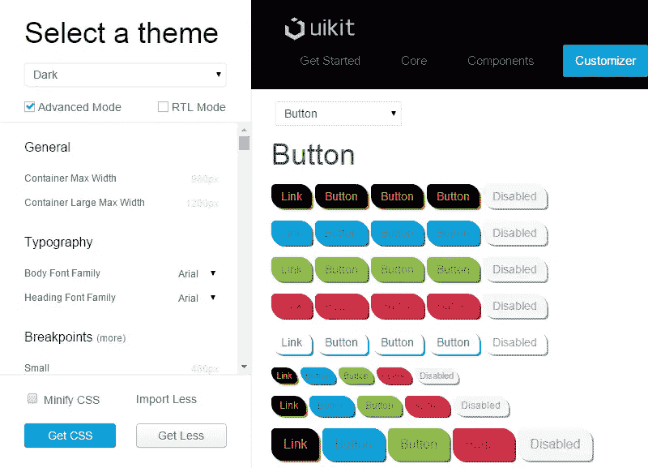

# 使用 Gulp 和 Less 创建自定义 UIkit 主题

> 原文：<https://www.sitepoint.com/custom-uikit-theme-with-gulp-less/>

每个人都想独一无二。我想如果在你的周围有很多和你长得一样的人，你不会超级开心，对吗？这也适用于其他人。你的朋友也不会乐意看到到处都是你的克隆体。我们的网站也是如此。

现在用前端框架搭建网站很常见。但问题是，许多人指责这种框架让所有网站“看起来都一样”。但是，如果开发人员不愿意进行必要的定制，也不能责怪这个工具。

对于那些希望自己构建的网站脱颖而出的人，我将演示如何使用 [UIkit 的定制器](http://getuikit.com/docs/customizer.html)来创建不同的主题和主题变体(风格)。这个过程很简单，但是您需要一个合适的工作流程来完成它，同时又不太麻烦。

## 设置自定义

假设您想为您的网站创建一个深色主题，并以橙色作为强调色。此外，您还希望该主题有两种不同的颜色，分别是蓝色和绿色。让我们看看我们如何能做它。(注意:为了简洁起见，我将只使用按钮来演示这个过程)。

我们需要首先确保完成以下步骤:

*   下载或克隆 [UIkit 库](https://github.com/uikit/uikit)。
*   安装[节点](https://nodejs.org/)和[大口](http://gulpjs.com/)，如果你还没有的话。
*   安装 UIkit 的开发依赖项。您可以通过导航到 UIkit 根目录并从终端运行`npm install`来做到这一点。

当所有这些设置正确后，我们就可以开始创建我们的主题了。

## 创造我们的主题

还是在根目录下，创建一个名为“custom”的文件夹。在该文件夹中，创建另一个名为“dark”的文件夹，并在其中创建一个名为`uikit.less`的文件。打开文件并添加以下内容:

```
@import "../../src/less/uikit.less";
@import "button.less";
```

第一行将从核心框架中获取所有较少的文件，第二行将导入用于修改默认 UIkit 按钮的文件。保存并关闭该文件，并在同一目录下创建上述`button.less`文件。

在进行任何进一步的定制之前，您需要使您的主题在定制器中本地可用。为此，在 UIkit 根目录下，在终端中运行以下命令:

```
gulp indexthemes
```

现在启动 UIkit 网站的本地副本(您安装的那个),并单击导航栏中的“Customizer”。当你打开“选择一个主题”下拉列表时，你应该在它的末尾看到“黑暗”。此时，当您选择它时，您会看到没有样式。为什么不呢？让我们看看。

UIkit 文档中没有提到的一件事可能会让你很头疼，那就是你的主题需要一个名为`uikit-customizer.less`的文件。创建文件并添加以下行:

```
@import "uikit.less"
```

您必须将上面一行文件放在主题的根目录中(在我们的例子中，在“dark”文件夹中)。如果这个文件不存在，您就不能正确使用定制器——主题的名称会出现在列表中，但是样式会丢失。

注意:根据经验，`uikit-customizer.less`文件应该导入你的主题使用的所有文件。在我们的例子中，导入`uikit.less`符合这个要求，因为它包含了默认的 UIkit 样式和您的定制按钮样式。

添加完`uikit-customizer.less`文件后，您会看到这次所有组件都被正确地样式化了。所以，我们准备好继续前进了。

在组件的下拉列表中，位于定制器右侧面板的左上角，切换到“按钮”。这样你就可以看到所有可用的按钮样式。现在我们可以打开`button.less`文件并开始添加我们的修改:

```
@button-color: #f90;
@button-hover-color: fade(@button-color, 75%);
@button-active-color: @button-color;

@button-background: #000;
@button-hover-background: lighten(@button-background, 20%);
@button-active-background: @button-hover-background;
```

在上面的代码中，我们修改了默认按钮的文本和背景颜色在正常、悬停和活动状态下的变量。对于其他特定的按钮，我们也需要更改这些变量:

```
@button-primary-color: darken(@button-primary-background, 20%);
@button-success-color: darken(@button-success-background, 20%);
@button-danger-color: darken(@button-danger-background, 20%);

@button-primary-hover-color: fade(@button-primary-color, 75%);
@button-success-hover-color: fade(@button-success-color, 75%);
@button-danger-hover-color: fade(@button-danger-color, 75%);

@button-primary-active-color: lighten(@button-primary-color, 35%);
@button-success-active-color: lighten(@button-success-color, 35%);
@button-danger-active-color: lighten(@button-danger-color, 35%);
```

## 在 UIkit 中使用钩子

在处理简单的修改时，修改 UIkit 的变量是改变框架组件外观的最简单的方法。但是对于更复杂的定制，比如添加新规则和/或在不破坏核心的情况下更改现有规则，UIkit 提供了一种特殊的机制。它使用*钩子*安全地附加你的修改。让我们来看看实际情况。将以下代码放在变量下方的`button.less`文件中:

```
.hook-button() {
 border-radius: 5px 15px; 
 box-shadow: 2px 2px;
}
```

这里，按钮组件的钩子用于添加边框半径和投影效果。

对于更具体的变化，UIkit 提供了各种钩子。每个组件都有这样一个钩子。这对于创建新的选择器或者修改那些既没有变量也没有钩子可供定制的选择器非常有用。让我们通过添加以下代码来演示这一点:

```
.hook-button-misc() {
 .uk-button:active:not(:disabled) { 
 box-shadow: none; 
  }
 .uk-button-link:hover,
 .uk-button-link:focus,
 .uk-button-link:active,
  .uk-button-link.uk-active {
 text-decoration: none;
  }
 .uk-button-link:focus { 
 outline: none; 
 border: 1px solid @button-link-hover-color;
  }
}
```

在这里，我们为每个没有被禁用的活动按钮去除阴影。然后我们移除所有状态中链接的下划线。最后，我们移除按钮链接的轮廓，代之以添加一个漂亮的边框，当链接被聚焦时显示出来。保存`button.less`文件。

注意:通过查看相应的`.less`文件的最末尾，您可以看到特定组件的所有可用钩子。下面是按钮组件的一个示例。

```
// Hooks

.hook-button-misc;

.hook-button() {}
.hook-button-hover() {}
.hook-button-active() {}
.hook-button-primary() {}
.hook-button-primary-hover() {}
.hook-button-primary-active() {}
.hook-button-success() {}
.hook-button-success-hover() {}
.hook-button-success-active() {}
.hook-button-danger() {}
.hook-button-danger-hover() {}
.hook-button-danger-active() {}
.hook-button-disable() {}
.hook-button-link() {}
.hook-button-large() {}
.hook-button-misc() {}
```

现在主题已经准备好了，您可以在定制器中查看它。只需重新加载页面并享受。



## 为我们的主题创建样式

现在我们准备创建主题的样式。在我们的黑暗主题的目录中，我们将创建一个名为“样式”的新文件夹，并在其中创建另一个名为“蓝色”的文件夹。在该文件夹中创建一个空白的`style.less`文件。从你的`button.less`文件中复制前三行代码并粘贴到文件中，然后将`@button-color`的值改为`#09f`并保存文件。该文件的内容将如下所示:

```
@button-color: #09f;
@button-hover-color: fade(@button-color, 75%);
@button-active-color: @button-color;
```

再次在终端中运行`gulp indexthemes`以包含新创建的样式，然后返回定制器并刷新页面。现在在主题列表的末尾，你应该会看到一个“深蓝色”选项。选择它，你会看到现在按钮出现了一个漂亮的蓝色口音。对于绿色样式，重复相同的步骤，但使用颜色值`#9c0`。

当你对你的主题满意时，你可以通过运行这个任务来构建它:

```
gulp dist -t dark
```

这将建立黑暗主题，并将它放在 UIkit 根目录下的“dist”文件夹中。然后，在“css”文件夹中你会找到`uikit.dark.css`和`uikit.dark.min.css`文件。不幸的是，这些文件只包含你的主题风格。不包括蓝色和绿色款式。但是您也可以通过使用 GUI 定制器来获得这些文件的 CSS 文件，我将在下面解释。

## 使用 GUI 定制器

我向您展示了如何手动创建主题，因为了解特定流程的底层机制总是有好处的。但是如果不需要复杂的修改，可以直接使用 GUI 定制器。让我们探索一下所需的步骤。

*   转到定制，并选择您想要定制的主题。
*   使用左侧面板修改变量。通常，只显示全局变量。要使组件的变量可见，您需要激活“高级模式”选项。默认情况下，其值通过另一个变量定义的变量是隐藏的。在高级模式下，您可以在包含这些变量的组旁边看到一个“(更多)”按钮。
*   做出你想要的改变，点击“获取 CSS”按钮。这将为你的主题提供最终的 CSS 文件。您可以使用此按钮来获取蓝色和绿色样式的 CSS 文件。只需选择“深蓝色”或“深绿色”并点击按钮。
    *   如果你想要一个缩小的版本，选择“缩小 CSS”选项
    *   如果你使用从左到右的语言，选择“RTL 模式”，整个主题将自动转换。
*   如果你点击“Get Less”按钮而不是“Get CSS”按钮，输出文件将只包含改变后的变量。通过这种方式，您可以在创建主题变体时自动创建样式。

每个主题都使用一个`customizer.json`文件来定义哪些变量默认显示或者只在高级模式下显示。通过修改该文件，您可以控制定制器左侧面板中变量的可见性和可用性。有关这方面的更多细节，请参见 [Customizer.json 页面](http://getuikit.com/docs/documentation_customizer-json.html)。

注意:当您运行`indexthemes`任务时，如果您的主题没有自己的`customizer.json`文件(当您创建一个新主题时就是这种情况)，UIkit 将使用默认主题的文件(`/themes/default/customizer.json`)。如果你计划定制这个文件，你需要将它复制并粘贴到你的主题的根目录中，然后再次运行`gulp indexthemes`来更新主题。

## 结论

您已经看到，定制一个特定的前端框架并不像一开始看起来那么困难。有了 Gulp 的一些知识和一些额外的努力，你可以让你的网站足够独特，从人群中脱颖而出，而不会被贴上用特定框架构建的标签。

## 分享这篇文章