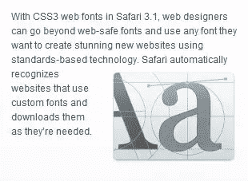

# 自定义网页字体:选择你的毒药

> 原文：<https://www.sitepoint.com/custom-web-fonts-pick-your-poison/>

每个网页设计师的早期经历都是一个令人崩溃的实现时刻:当你发现你只能在网上使用一小部分字体——而且所有好的字体都已经被用死了。

“万岁！”天真的网络新手认为，第一次检查`font-family`属性。“我可以花一下午的时间为我的新博客挑选完美反映我个性的字体！”

当然，你可以在你的 CSS 中粘贴任何你喜欢的字体名称，你的浏览器将使用你系统中的字体来显示它:

```
.post {
  font-family: **Papyrus**, sans-serif;
}
```

问题是其他人访问你的网站时看到的是什么。如果他们没有那种字体，那就是“正是如此*你*！”安装在他们自己的系统上，他们会看到一种通用字体，很可能是一种彻头彻尾的无聊字体，比如 Arial 或 Helvetica 字体。

早在 1998 年，CSS2 就以 [`@font-face`](https://reference.sitepoint.com/css/at-fontface) at-rule 的形式提出了一个解决方案，从理论上讲，它允许你定义自定义字体，供浏览器从你的网站下载:

```
@font-face {
  font-family: Papyrus;
  src: url(/fonts/papyrus.ttf);
}
```

从表面上看，`@font-face`似乎是网页设计师的天赐良机。那么，为什么直到最近才出现对它的有意义的支持呢？请继续阅读，了解……

## 首先到达现场

自定义字体的问题是字体不是免费的。它们需要大量的设计工作，尤其是那些包含了大部分网络上可用字符的设计。因此，绝大多数字体(是的，甚至是电脑自带的字体)都是根据描述如何使用它们的条款获得许可的。

假设你是诚实地得到它们的，你被允许使用你电脑上的所有字体来设计从 Word 文档到网页上的徽标的东西，你可以对这些东西做任何你想做的事情——把它们送人，或者卖钱——但是你不能送人或者卖掉字体文件本身。

这给第一批支持自定义字体的浏览器带来了问题。微软 Internet Explorer 5.5 和 Netscape Navigator 4 都不得不通过开发自己的字体文件格式来规避法律问题，这些格式强制执行字体许可证中规定的限制。

当然，Netscape 4 最终寿终正寝，重生为 Firefox，它没有自定义字体支持。然而，Internet Explorer 现在仍然支持嵌入式 OpenType (EOT)格式的自定义字体。然而，没有人使用它，因为 a)它是 IE 专用的，b)没有一家字体公司说过以 EOT 格式发行字体是可以的。

## 苹果引领了一场复兴

网景/微软的僵局让设计师们对定制字体技术持怀疑态度，他们习惯了与 Verdana 合作。有一段时间，网络上的文本看起来永远都是一样的。

然后，去年年底，苹果[宣布](http://webkit.org/blog/124/downloadable-fonts/)将为 Safari 添加对`@font-face`的支持，并且它可以处理普通的、旧的 TrueType 字体文件——就像设计师们收集的成百上千的字体文件一样！其他浏览器会迅速效仿吗？



2008 年 3 月，Safari 3.1 大张旗鼓地发布了。在发布会的营销中，苹果[大胆地吹捧](http://www.typophile.com/node/43971)这样一个事实，即设计师可以“使用任何他们想要的字体，利用基于标准的技术来创建令人惊叹的新网站。”这个声明似乎忽略了世界上几乎所有字体的许可条款——包括苹果自己的字体！字体设计师被激怒了。

其他浏览器并不急于重复苹果的错误，但苹果*已经激起了足够多的对自定义字体的兴趣，让他们重新审视。作为回应，微软[重申了对嵌入式 OpenType (EOT)格式的承诺](http://blogs.msdn.com/ie/archive/2008/07/21/font-embedding-on-the-web.aspx),将其开放给其他浏览器实现，并提交给 W3C 进行标准化。*

一个主要的字体生产商[宣布支持 EOT](http://www.ascendercorp.com/pr/pr2008_07_20.html) ，并且[推出了一个网站](http://www.fontembedding.com/)来游说其他生产商也这样做。

## 嵌入与链接

Safari 允许的链接到简单 TrueType 字体文件的方式与使用微软的 EOT 格式的最大区别在于，EOT 可以有效地将字体“嵌入”到您的网站中。EOT 格式将字体文件与您站点的域名绑定在一起，因此它不能被简单地下载并在另一个站点上重复使用。

这实际上与您在 PDF 文件或 Flash 电影中使用自定义字体的情况相同。在所有这些格式中，有动机的黑客可以提取字体数据，并将其重新组装为不受限制的 TrueType 文件，但是字体数据是在一个软件包中分发的，该软件包明确指出在许可证下不允许这样使用。字体嵌入并不是为了防止 T2 盗版，而是为了让人们明白重新分发商业字体是 T4 盗版。

网页设计者、字体制作者和浏览器供应商现在都加入了关于哪种自定义字体的方法对网页最有意义的争论。一方面，许多设计师认为字体生产商应该相信我们会做正确的事情。我们不需要为我们网站上使用的图片设计特殊的嵌入格式，那么为什么我们需要为字体设计呢？

另一方面，字体制作者认为字体文件是创建内容的软件工具，而不是内容本身。正如不允许您分发 Microsoft Word 以允许网站访问者查看您在网站上发布的 Word 文档一样，您也不能发布原始字体文件以允许人们查看用该字体设计的内容。

许多网络开发者认为嵌入像 EOT 这样的格式相当于数字版权管理(DRM)，一种已经被证明对音乐产业是灾难性的技术。有些人甚至建议网络完全不需要商业字体，我们应该使用免费字体。事实证明，即使是流行的“免费”字体，如由 Ray Larabie 创作的[字体，也带有许可证，限制了它们的分发方式。Larabie 在讨论 Safari 的字体链接方法时这样说道:](http://www.larabiefonts.com/)

> 当涉及到我的免费软件字体时，我更不愿意让它们被这样使用。

在他的个人博客上，微软的克里斯·威尔逊对形势进行了务实的分析:商业字体生产商永远不会同意 Safari 所支持的字体链接，开源字体不太可能在短期内在质量或多样性方面有所提升。如果我们想合法地在网络上使用商业字体，就必须使用某种形式的嵌入，而 EOT 是目前唯一公开的字体嵌入格式。

你怎么想呢?不管字体制作者怎么说，其他浏览器应该实现微软的 EOT 格式，还是应该推动 Safari 风格的字体链接？

## 分享这篇文章