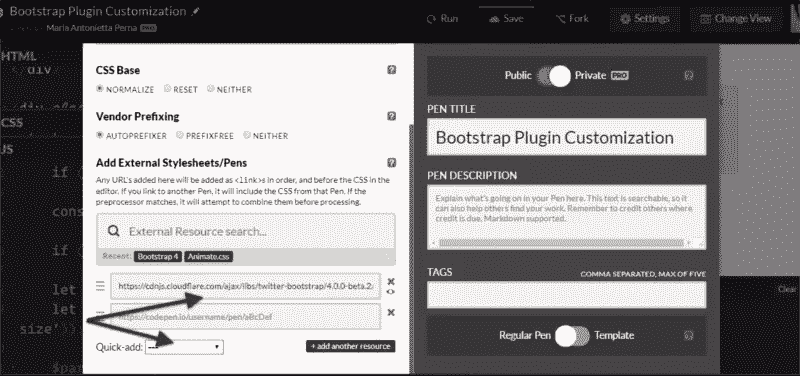
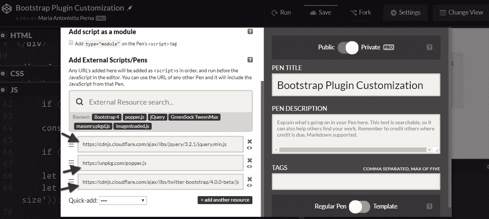
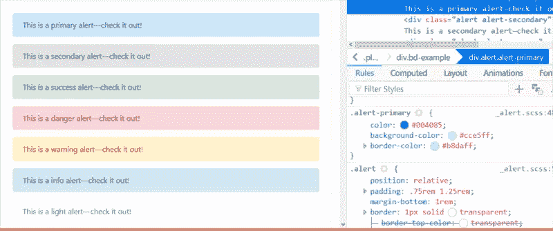

# 定制引导 jQuery 插件

> 原文：<https://www.sitepoint.com/customizing-bootstrap-jquery-plugins/>

**[Bootstrap](http://getbootstrap.com) 附带了大量现成的 [jQuery](http://jquery.com/) 驱动的插件。Bootstrap 插件的美妙之处在于，您可以将它们嵌入到您的项目中，使用`data-`属性编写适当的标记，JavaScript 就会自动运行。不需要写任何 JavaScript 代码。**

有时，您可能想要向 Bootstrap 的插件添加自己的定制，以满足项目的需求。

如果这是你，请继续读下去。我将向你展示一种你可以做到的方法。

## 如何定制引导插件的外观

你可以通过使用 CSS 来定制引导插件的外观。另一方面，如果你想修改插件的*功能*，你需要写一些 JavaScript 代码。

定制引导 CSS 应该在你自己的定制文件中完成，无论你使用的是 Sass 源代码还是编译版本。

为了保持简单和 CodePen 友好，从 CDN 中拉预编译的引导包。

这包括样式表…



…以及 JavaScript 文件。另外，不要忘记包括 [jQuery](https://jquery.com) ，如果你打算使用下拉菜单，也要包括 [Popper.js](https://unpkg.com/popper.js) :



为了使修改 CSS 代码更加容易，Bootstrap 背后的开发人员在样式表顶部的`:root`元素中包含了一个颜色和断点的 CSS 变量列表。

例如，绿色成功颜色的变量是`--success: #28a745;`

要将其更改为不同的绿色，请在您自己的样式表中替换变量的颜色值，并将以下代码添加到您选择的选择器中:

```
 selector {
  background-color: var(--success);
} 
```

要改变一个特定插件的外观和感觉，最简单的方法是使用浏览器的开发工具找到引导样式，并用你自己的样式覆盖它们。



让我们关注本文中简单的[警报组件](http://getbootstrap.com/docs/4.0/components/alerts/)。

例如，尝试在您的定制 CSS 文档中更改警报的`padding`、`margin-bottom`和`border-radius`的原始值:

```
 .alert {
  padding: 2rem 1.50rem;
  margin-bottom: 1.5rem;
  border-radius: 50rem;
} 
```

现在，所有带有`.alert`类的元素将如下所示:


接下来，让我们继续扩展引导警报的功能。

## 定制引导插件的功能

修改 Bootstrap 插件的功能经常涉及到使用 CSS 和 JavaScript 文档。

大多数动态效果都是通过添加和删除 CSS 类来实现的，总体来说功能非常简单。

在本文中，我将为[警报组件](http://getbootstrap.com/docs/4.0/components/alerts/)添加一些额外的功能。

警报显示一条信息，用户只需点击一个按钮就可以将它们从页面中删除。

我将在警告中添加*放大*和*缩小*按钮，用户可以分别放大或缩小警告。我还将包括一个*高对比度*按钮，允许用户在高对比度模式下查看警报内容，即反转背景颜色和文本颜色。

我们开始工作吧！

### 警报的结构

要继续操作，首先要为警报添加标记:

```
 <div class="alert alert-info alert-zoom-in-out">
  <a href="#" class="close" data-dismiss="alert" aria-label="close">×</a>
  <a href="alert" class="close zoomIn" data-zoomIn="alert" aria-label="zoom in">+</a>
  <a href="alert" class="close zoomOut" data-zoomOut="alert" aria-label="zoom out">-</a>
  <a href="alert" class="close high-contrast" data-highContrast="alert" aria-label="high contrast mode"><i class="fa fa-adjust"></i></a>
  <p><strong>New Bootstrap Alert</strong></p>
  <p>Zoom in and out, or enable contrast mode.</p>
</div> 
```

上面是一个简单的警告框，有三个链接:第一个是本地引导*解除警告*链接。这是您将要创建的自定义三个链接的模板。*–*链接允许用户缩小警告框的大小和内容，而 *+* 链接的作用正好相反——也就是放大警告框和里面的文本。

对比度链接启用警报的高对比度模式。

注意每个自定义链接标记上的`data-zoomIn`、`data-zoomOut`和`data-highContrast`。这些是 click 事件的钩子:具有这些自定义数据类型的按钮将负责触发警告框上的动作。

### 修改 CSS

下一步是为警报插件创建您自己的自定义 CSS 文件，并添加以下代码:

```
 .alert-zoom-in-out {
  font-size: 16px;
  height: auto;
  top: 20px;
  color: rgb(12, 84, 96);
  background-color: rgb(209, 236, 241);
}

.high-contrast-on,
.high-contrast-on a,
.high-contrast-on i {
  background-color: rgb(12, 84, 96);
  color: rgb(209, 236, 241);
} 
```

`alert-zoom-in-out`是我为警告框选择的类。因为您构建的功能包括修改警告框的大小和颜色组合，所以您需要为`alert-zoom-in-out`类设置这些。

警告框上的`high-contrast-on`类将使用 JavaScript 动态添加和删除。相加后，`color`和`background-color`值会反转。移除后，警告框将恢复其默认外观。

### 添加放大功能

在编程中，通常有不止一种方法可以达到相同的效果。我的方法很大程度上归功于[本杰明·雅各布斯](http://www.dotnetcurry.com/author/benjamin-jakobus)和[杰森·马拉赫](https://twitter.com/jasonmarah)。对于这个简单的定制，我选择了 Bootstrap `alert.js`文件上的公共`close()`方法作为我的参考点。

首先将代码封装在一个[立即调用的函数表达式](https://developer.mozilla.org/en-US/docs/Glossary/IIFE)(life)中，这样可以避免插件代码污染全局范围。另外，将该函数添加到 jQuery 对象中:

```
 (function ($) {
  'use strict';
})(jQuery); 
```

[Bootstrap JavaScript 文档](http://getbootstrap.com/docs/4.0/getting-started/javascript/)声明每个插件在`Constructor`属性上公开其原始构造函数，您可以在代码中访问该属性以添加自定义功能:

```
 (function ($) {
  'use strict';

  const Alert = $.fn.alert.Constructor;

})(jQuery); 
```

此时，常量`Alert`包含一个对警报插件的构造函数的引用。这允许您访问插件的原型，因此您现在可以向它添加自定义方法:

```
 Alert.prototype.zoomIn = function(e) {
  // zoom-in code here
}; 
```

现在您已经准备好添加您的自定义方法了。下面是 Bootstrap `close()`方法，它将作为`zoomIn()`的模板:

```
 close(element) {
  element = element || this._element

  const rootElement = this._getRootElement(element)
  const customEvent = this._triggerCloseEvent(rootElement)

  if (customEvent.isDefaultPrevented()) {
    return
  }

  this._removeElement(rootElement)
} 
```

下面是`zoomIn()`方法的代码:

```
 // prevent default action on the link
if (e) e.preventDefault();

// cache the element which has been clicked
const $this = $(this);

// find the parent of the element that has
// been clicked, which is the Alert
const $parent = $this.closest('.alert');

// trigger the custom event on the element
$this.trigger(e = $.Event('zoomIn.bs.alert'));

// grab the alert's current width and font-size
let $parentWidth = parseInt($parent.css('width'));
let $parentFontSize = parseInt($parent.css('font-size'));

// allow devs to run their own custom functionality
if (e.isDefaultPrevented()) return;

// increment alert's width by 20px on each click
// and the font-size by 2px
$parent.css({
  width: $parentWidth += 20,
  fontSize: $parentFontSize += 2
}); 
```

上面的代码不言自明。可能有点令人困惑的是`e.isDefaultPrevented()`。我发现了这个[堆栈溢出线程](https://stackoverflow.com/questions/30483721/understanding-how-preventdefault-and-defaultprevented-work-with-custom-events)的一个很好的解释。

代码的工作方式应该是，每次点击 **+** 链接时，警告框及其文本内容都会变大。

缩小功能的代码与上面的代码相同，但不是增加`width`和`font-size`的像素值，而是使其变小:

```
 $parent.css({
  width: $parentWidth -= 20,
  fontSize: $parentFontSize -= 2
}); 
```

### 添加高对比度功能

`highContrast()`函数遵循与`zoomIn()`和`zoomOut()`相同的模式，但是它没有使用内联 CSS 样式来动态修改警报的外观，而是添加和删除了`high-contrast-on`类:

```
 Alert.prototype.highContrast = function(e) {
  if (e) e.preventDefault();

  const $this = $(this);

  const $parent = $this.closest('.alert');

  $this.trigger(e =
  $.Event('highContrast.bs.alert'));

  if (e.isDefaultPrevented()) return;

  $parent.toggleClass('high-contrast-on');
}; 
```

### 设置事件监听器

这个难题的最后一部分是用指定的`data`属性将动作与 DOM 元素挂钩。Bootstrap `alert.js`文件给出了一些提示，告诉你如何做到这一点。

在数据 API 实现部分，您会发现:

```
 $(document).on(
  Event.CLICK_DATA_API,
  Selector.DISMISS,
  Alert._handleDismiss(new Alert())
) 
```

文档监听任何具有`data-dismiss`属性及其值的元素上的点击事件。事实上，`Selector.DISMISS`是在文件的顶部定义的，还有 EVENT_KEY 和 DATA_API_KEY:

```
 const Selector = {
  DISMISS : '[data-dismiss="alert"]'
}

const DATA_KEY       = 'bs.alert'
const EVENT_KEY      = `.${DATA_KEY}`
const DATA_API_KEY   = '.data-api' 
```

因此，您可以将`zoomIn()`、`zoomOut()`和`highContrast()`方法挂接到具有`data-zoomIn`、`data-zoomOut`和`data-highContrast`属性的 DOM 元素，如下所示:

```
 // hook up zoomIn()
$(document).on('click.bs.alert.data-api', '[data-zoomIn="alert"]', Alert.prototype.zoomIn);

// hook up zoomOut() 
$(document).on('click.bs.alert.data-api', '[data-zoomOut="alert"]', Alert.prototype.zoomOut);

// hook up highContrast()
$(document).on('click.bs.alert.data-api', '[data-highContrast="alert"]', Alert.prototype.highContrast); 
```

就是这样！

在 [CodePen](https://codepen.io) 上通过 SitePoint ( [@SitePoint](https://codepen.io/SitePoint) )查看笔[定制引导提醒](https://codepen.io/SitePoint/pen/OQVoyZ/)。