# 使用意图和上下文定制您的 Api.ai 助手

> 原文：<https://www.sitepoint.com/customizing-your-api-ai-assistant-with-intent-and-context/>

如果你渴望了解更多关于人工智能的知识，请查看我们的截屏视频[微软认知服务和文本分析 API](https://www.sitepoint.com/premium/screencasts/microsoft-cognitive-services-and-the-text-analytics-api) ，了解你的机器人中的人工智能情感。

Api.ai 是一个非常简单的服务，允许开发者创建自己的基本个人人工智能助理/聊天机器人，有点像 Siri 和亚马逊的 Alexa。我最近报道了[如何使用 Api.ai](https://www.sitepoint.com/how-to-build-your-own-ai-assistant-using-api-ai/) 构建自己的 ai 助手，在那里我展示了设置 AI 助手的基础知识，并教它一些基本的闲聊。在这篇文章中，我想更进一步，介绍“意图”和“上下文”，这是一种教我们的人工智能助手更具体的行动的方式，这些行动是根据我们自己的需求个性化的。这是事情变得真正令人兴奋的地方。

*注意:本文于 2017 年更新，以反映 Api.ai 的最新变化*

## 用 Api.ai 构建 AI 助手

本文是系列文章之一，旨在帮助您使用 Api.ai 运行简单的个人助理:

1.  [如何使用 Api.ai 构建自己的 AI 助手](https://www.sitepoint.com/how-to-build-your-own-ai-assistant-using-api-ai/)
2.  用意图和上下文定制你的 Api.ai 助手(这个！)
3.  [用实体赋予你的 Api.ai 助手](https://www.sitepoint.com/teaching-our-api-ai-assistant-concepts-via-entities/)
4.  [如何将您的 Api.ai 助手连接到物联网](https://www.sitepoint.com/how-to-connect-your-api-ai-assistant-to-the-iot/)

## 什么是意图？

意图是一个概念，你的助手可以被教会去理解并以一个具体的行动来回应。意图包含一系列的上下文，我们可以输入这些上下文作为用户可能对我们的助手说的句子。几个例子可以包括“给我订午餐”、“给我看看今天的加菲猫连环漫画”、“给 Slack 上的 SitePoint 团队发送一个随机的 GIF”、“让我振作起来”等等。这些都是我们可以训练我们的助手理解的习惯意图。

## 创建意图

要创建意图，请在 [Api.ai 控制台页面](https://console.api.ai/)中登录您想要添加新功能的代理，并点击页面顶部“意图”标题旁边的“创建意图”按钮或左侧菜单中的“意图”加号图标:

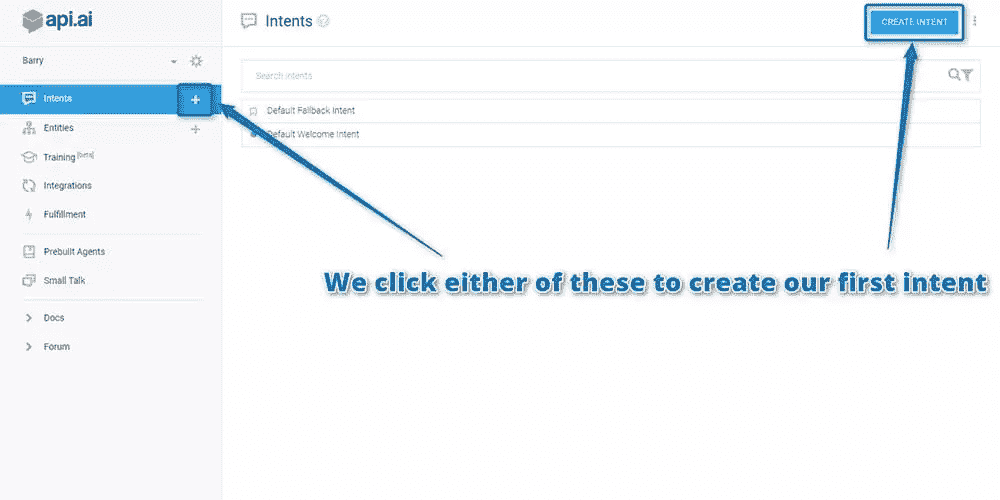

这个演示助手的示例意图是教我们的助手在人们情绪低落的时候用电影台词、笑话和其他事情让他们振作起来。首先，将新的意图称为“让我高兴起来”，并在“用户说”下面写下你的第一个触发句。我在下面加的第一句话是“让我振作起来”。按回车键或点击“添加”来添加您的句子:

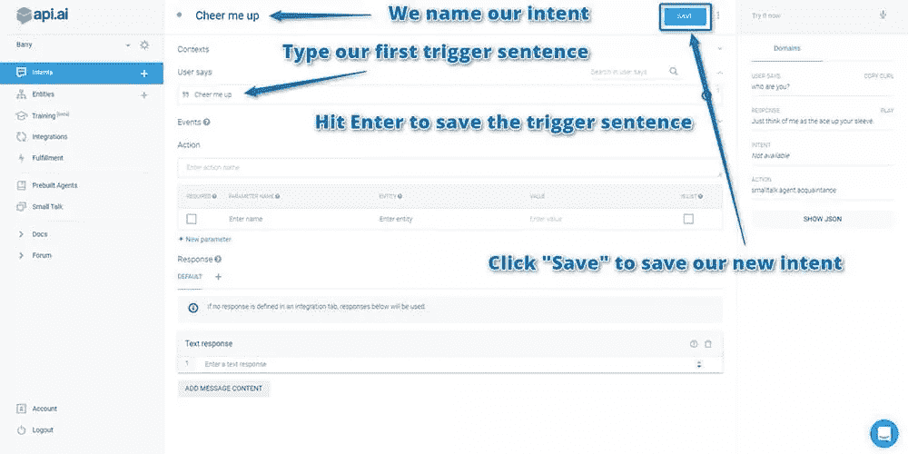

通常情况下，我们可以用一系列不同的方式来表达同一件事。为了说明这些，添加一系列陈述，代表用户可能表示他们喜欢振作起来的各种方式，例如“让我微笑”和“我感到悲伤”:

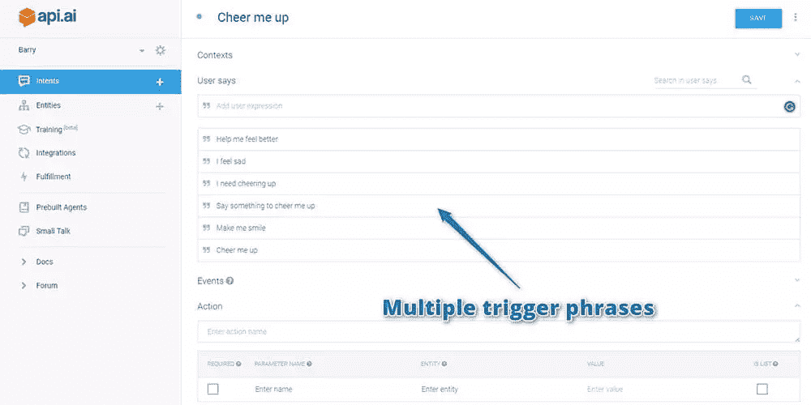

现在，助手应该理解一系列句子，但你没有告诉它听到这些句子时应该采取什么行动。为此，创建一个“操作”。助手会将“动作”名称返回到您的 web 应用程序，让它做出响应。

在这种情况下，您不会对第一个被称为“cheermeup”的动作做出响应，但它会在将来响应您的 web 应用程序中的动作时派上用场。我建议在你的意图中包含行动名称。

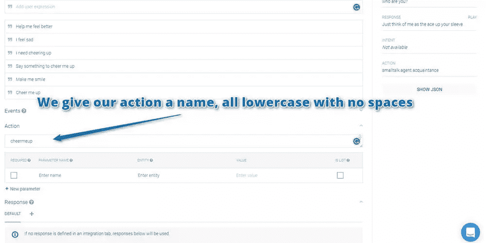

您也可以在动作中添加参数，但是我将在我们关于 Api.ai 的下一篇文章中详细介绍这一点！

## 通过语音响应进行引导

在你的用户告诉代理他们想要振作起来后，你要把谈话引向用户，告诉代理他们想要什么。这有助于提供智能的假象，同时限制聊天机器人需要处理的数量。要做到这一点，您需要在“语音响应”部分以问题的形式提供语音响应。比如“让我们给你加油！你想听笑话还是电影台词？”

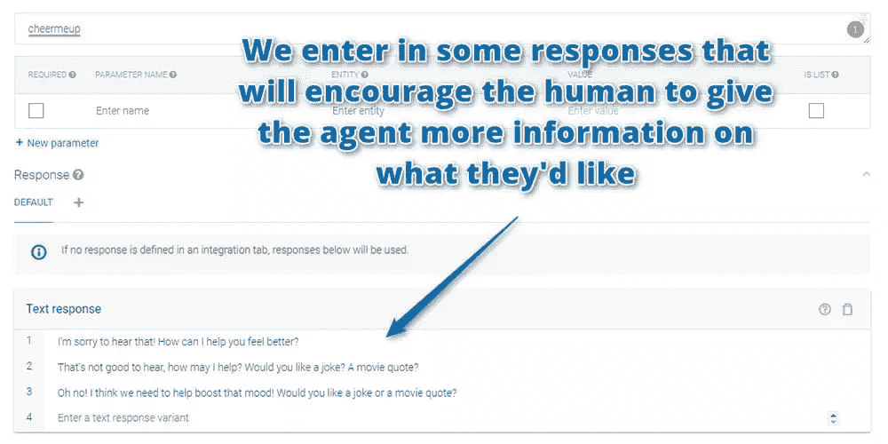

最后，单击您的意向名称旁边的“保存”按钮保存您的进度。

## 测试您的代理

您可以通过在右侧的测试控制台中键入测试语句来测试您的新意图。通过说“让我振作起来”来测试一下:

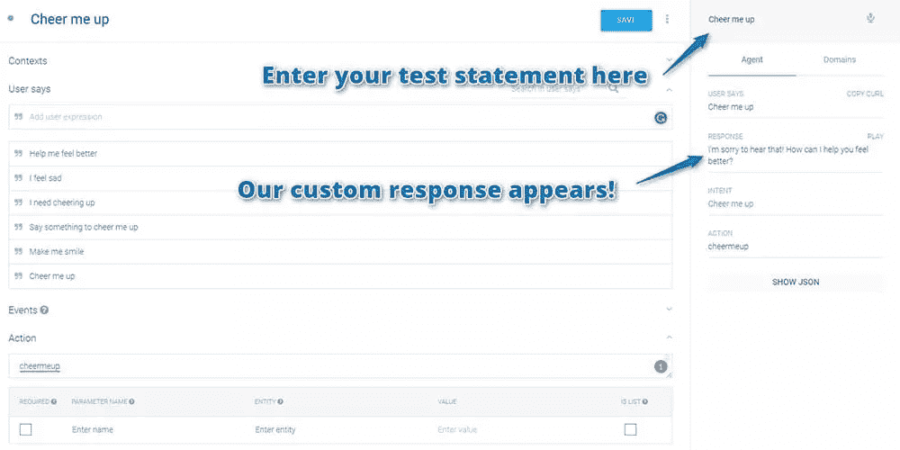

代理会根据您的意图，用一个经过训练的回答进行回应。一旦你提供了这个短语，Api.ai 就会学习！这样你就可以对陈述的措辞有所变化。例如，“请让我笑一笑”，“说点什么让我笑一笑”或“我现在感到悲伤”也会导致你的意图运行:

这些变化似乎只有在我首先使用机器人的原始短语后才会触发。我不确定这是否只是对相似短语产生理解所需时间的延迟，但如果一个变体不起作用，请尝试先问它原始陈述。如果你的变化太不一样，你需要把它添加到上下文的陈述中。您在此处添加的陈述越多，我们的代理就越能做出更好的回应。

如果你用“听到这个消息我很难过”这样的陈述，你可能会注意到一件事。我怎样才能让你感觉好一点？”它不够具体，不足以指导用户。如果他们不知道“电影台词”或“笑话”的选项，那么他们可能会问一些你没有提到的东西！随着时间的推移，您可以训练您的代理理解许多其他概念。然而，现在我建议你的问题要具体！

## 使用上下文

通过使用您的语音响应来引导对话，您的代理需要一种方法来在用户下次与他们交谈时了解对话的内容。如果用户在没有任何对话的情况下说出“一个笑话”甚至“任何一个”这样的话，断章取义的话，这句话对代理来说可能不太清楚。如果我跟你说话，只是说“一个笑话”，你会怎么回应？这将是你的助手此刻将被给予的，因为它没有办法记住之前对话的方向。

这就是在 Api.ai 中设置上下文的原因。我们创建上下文来跟踪用户和代理谈论的内容。没有上下文，每个句子都将与前一个句子完全分离。

要创建上下文，请单击 Api.ai 控制台顶部的“定义上下文”链接，了解您的意图:

这里有一个输入上下文部分和一个输出上下文部分。输入上下文告诉代理应该在哪个上下文中运行意图。对于您的第一个意图，您希望它随时运行，因此将输入上下文留空。输出上下文设置了在未来消息中被拾取的意图。这是你想要的:

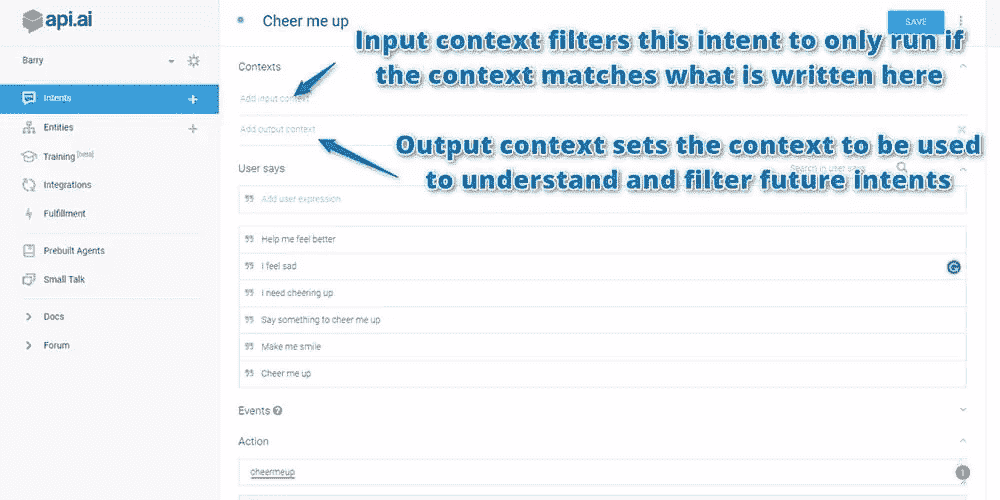

现在创建一个名为“加油”的输出上下文。命名上下文时，Api.ai 建议使用不带空格的字母数字名称。键入您的上下文并按回车键添加它。然后单击“保存”保存您的更改:

如果你再一次让你的代理人“让我振作起来”来测试他们，结果显示你的情境现在也出现了:

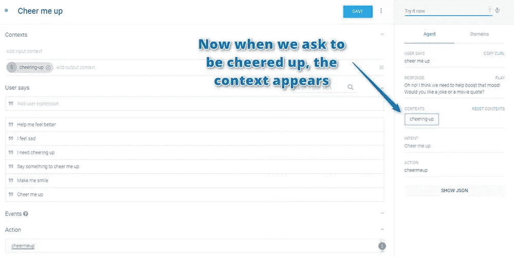

## 用上下文过滤意图

你的代理现在知道有一个“振作起来”的对话上下文。现在，您可以设置一个仅在该上下文发生时运行的意图。例如，为代理的问题创造一个可能的答案——“一句电影台词”。返回左侧菜单，单击加号图标创建新的意向:

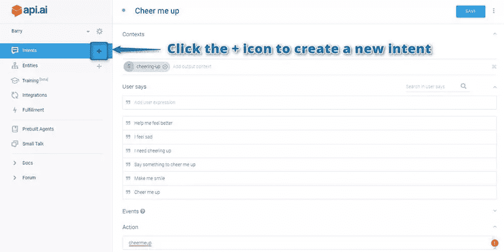

将您的意图称为“电影引用”，并将输入上下文设置为“加油”。这告诉你的代理，他们应该只考虑这个回复给我们的用户，如果他们以前要求振作起来。我们添加了一些用户可能会回答“我想要一段电影台词”的示例方式:

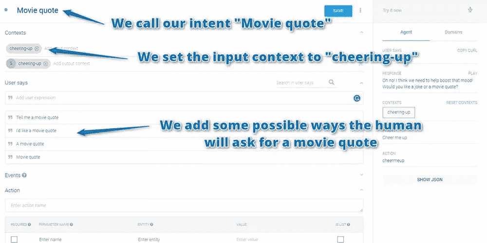

然后向下滚动，在您的回复中加入一系列电影对白(请随意加入您最喜欢的内容):

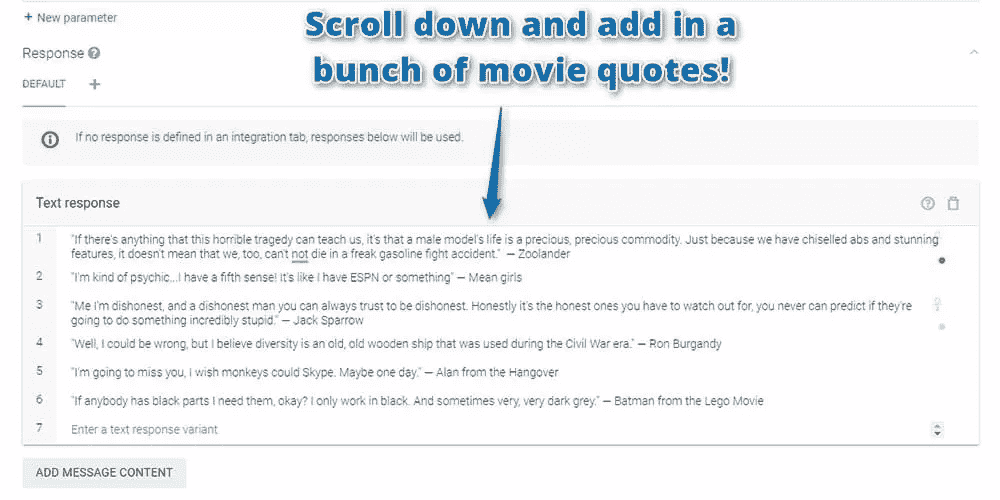

再次单击您的意向名称旁边的“保存”以创建您的电影引用意向。然后在旁边的测试控制台里，尝试输入“给我加油”，跟着输入“电影语录”。代理现在应该会告诉你一句电影台词！

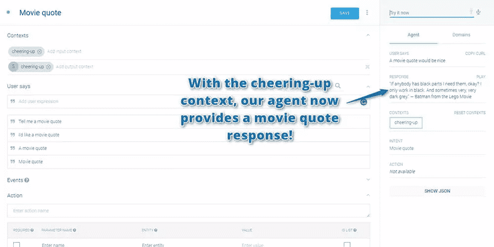

然后，您也可以按照相同的过程添加对“一个玩笑”意图的响应。

你也不必局限于向你的代理提供一个硬编码的响应列表。相反，您可以为每个意图设置一个动作名称，并在您的 web 应用程序中响应该动作。这是我将在以后的文章中讨论的另一个概念！您可以为将来的添加做好准备，为您的“电影引用”意图提供一个名为“cheermeup.moviequote”的动作(圆点有助于确保该动作不会与您将来添加的任何通用“电影引用”动作混淆)。

## 在活动

如果您将这些意图添加到上一篇文章中用于 web 应用程序的个人助理中，新功能应该会自动出现！如果你创建了一个新的，你需要首先更新你的网络应用中的 API 密钥。在您的网络浏览器中打开您的个人助理网络应用程序，尝试让您的助理为您加油鼓劲:

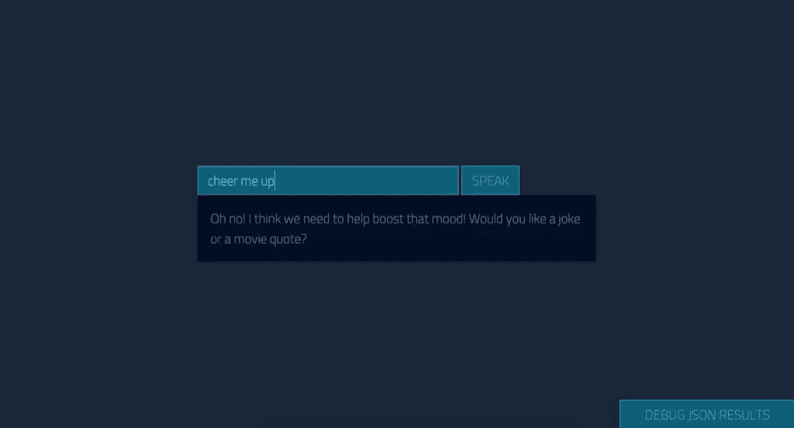

然后，告诉它你想要一句电影台词，看看会发生什么:

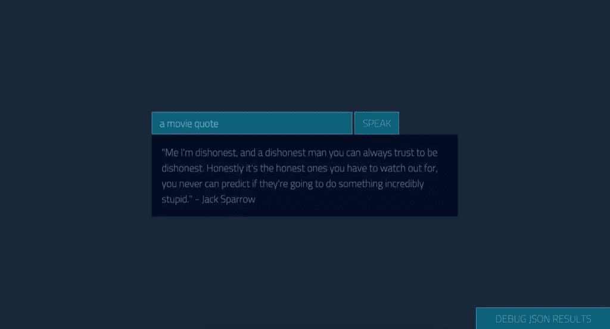

## 结论

有很多方法可以使用意图和上下文的概念来个性化你的助手。你可能已经有一些想法了！我们还可以做更多的事情来训练我们的 Api.ai 助手，方法是教它识别您的自定义意图中的概念(称为实体)，这将在本系列的下一篇文章中讨论！

如果你正在使用 Api.ai 构建你自己的个人助理，我很想听听你的想法！你想出了什么样的定制意图？请在下面的评论中告诉我，或者在 Twitter 上通过 [@thatpatrickguy](https://www.twitter.com/thatpatrickguy) 与我联系。

用情感工具赋予你的人工智能人情味。查看我们在[微软认知服务和文本分析 API](https://www.sitepoint.com/premium/screencasts/microsoft-cognitive-services-and-the-text-analytics-api) 上的截屏。

## 分享这篇文章