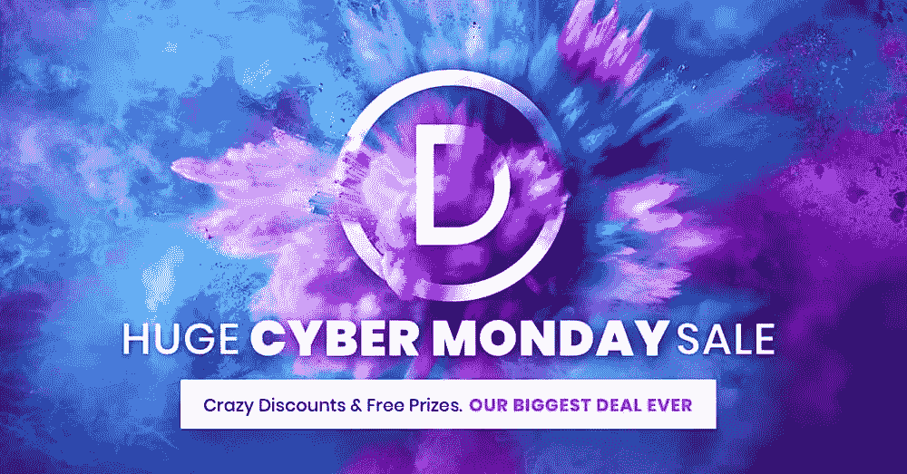
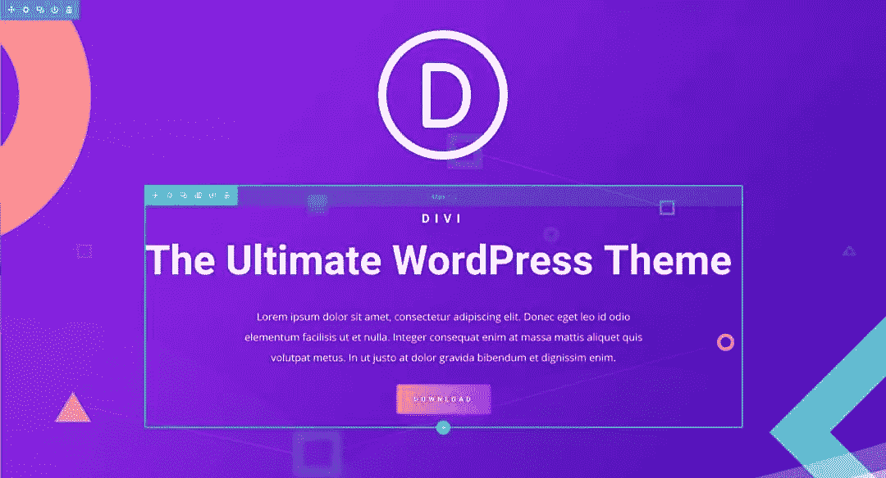
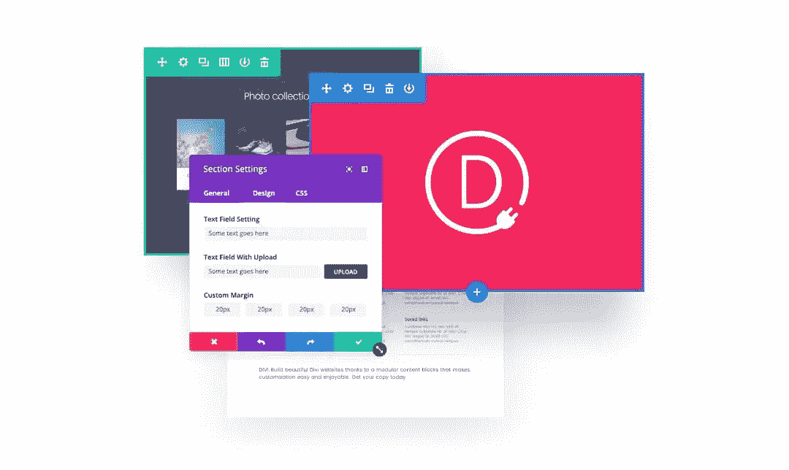
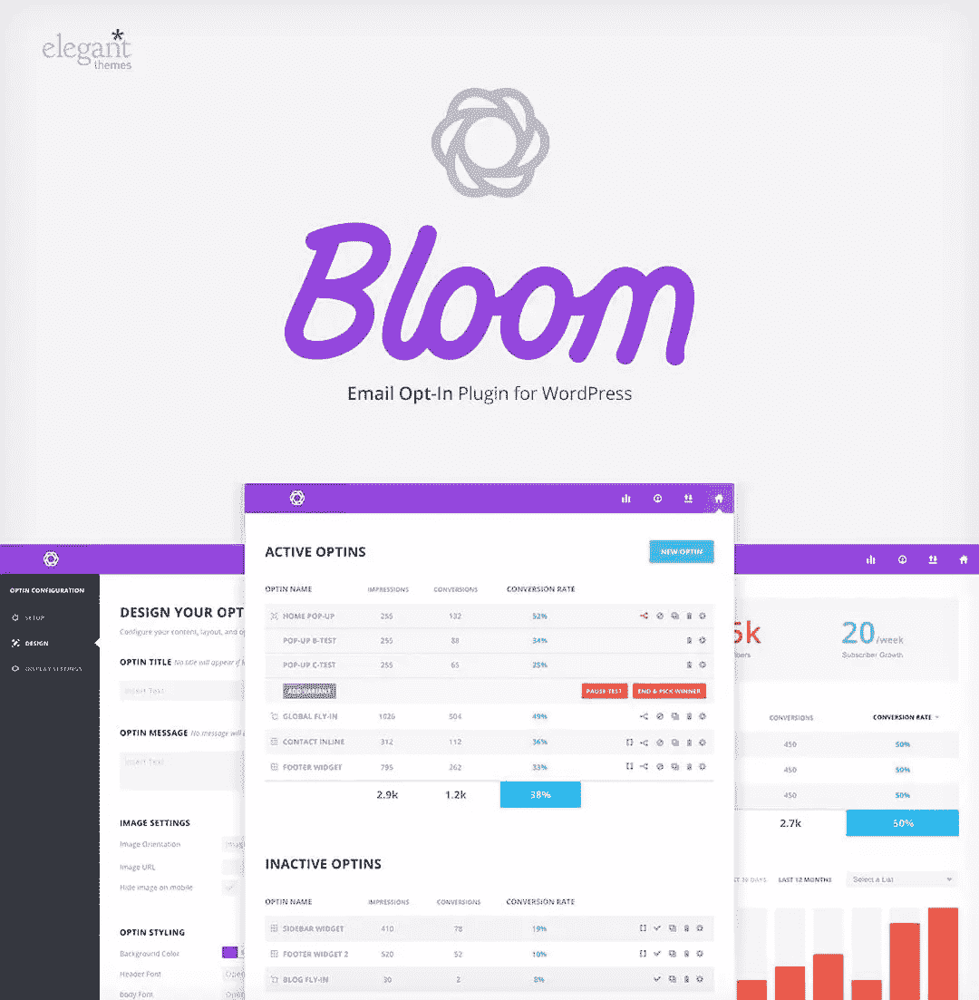
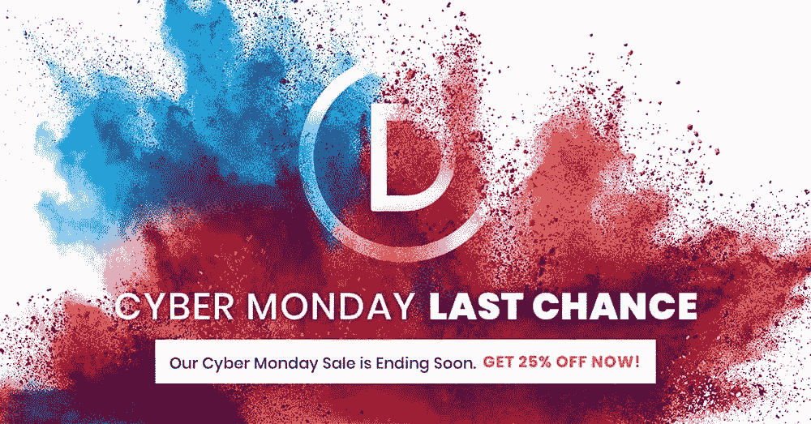

# 网络星期一:优雅主题提供 25%的最大折扣

> 原文：<https://www.sitepoint.com/cyber-monday-elegant-themes-offers-25-off-in-biggest-discount-ever/>

*这篇赞助文章由我们的内容合作伙伴 [BAW 媒体](https://bawmedia.com/)创作。感谢您对使 SitePoint 成为可能的合作伙伴的支持。*

隐藏在一系列网络星期一细节中的小宝石很容易被忽略。如果你正在寻找那种不经常出现的高价值交易，你不会想错过这一次。

也许你已经找到了让你兴奋尖叫的东西。如果是这样，你没有就此打住是件好事，因为你刚刚遇到了今年排名第一的网络星期一交易。

这个提议来自优雅主题，Divi 的创造者，世界上最受欢迎的高级 WordPress 主题。

他们全力以赴，打出了有史以来最大的折扣: [**开发者和终身账户**](https://baw.agency/a/3ak5k) 七五折，他们还增加了免费的 Divi 布局。

## 关于优雅的主题

关于优雅主题广受欢迎的 WordPress 工具包，以下是你需要知道的，如果你还不知道的话:

### 1.这是终极的 WordPress 工具包

一个优雅的主题会员给你 87 个主题和 3 个插件，其中一个是 Divi，终极 WordPress 主题和可视化页面生成器。Divi 将永远改变你的网站建设方式。

### 2.你会得到无限的使用

一次性费用给你无限的使用，所以你不必担心每个网站的价格。顺便说一句，在费用上有 25%的网络星期一折扣，这意味着你的会员资格可以让你获得市场上最有价值的 WordPress 工具。

### 3.定价计划很简单

没有“这个计划给你这个，那个计划给你那个”的废话。这是一个单一的会员资格，一次性付费，你可以得到所有的主题和插件。句号。

### 4.你会得到值得信赖的产品

优雅主题在 WordPress 主题和插件开发中没有很好的理由来确立自己的领导地位。在过去的十年里，他们一直在这样做，在此期间，每一个产品的不断改进已经成为常态。

## 你从网络星期一交易中得到了什么

让我们来了解一下让这笔网络星期一交易成为不容错过的机会的一些细节。我们强烈怀疑你会喜欢你所看到的。

### divi——世界上最受欢迎的高级 WordPress 主题

Divi 是优雅主题的旗舰主题。如果 BuiltWith.com 的统计数据是一个指标的话，Divi 是世界上使用最广泛的 WordPress 主题。然而，将 Divi 称为主题有点过于简单化了。

一个网站建设框架将是一个更准确的描述；一个允许你设计漂亮网站的框架，不需要编码，也不需要一堆杂乱无章的插件的帮助。

迄今为止，有 500，591 名用户正在或已经建立了 Divi 网站。他们组成了网络上最强大的 WordPress 社区之一。

### 多功能 Divi 生成器

Divi Builder 是一个可视化的拖放构建器，可以用于任何主题。这个页面构建插件使用了同样的可视化页面构建技术，帮助 Divi 主题取得了巨大的成功。唯一的区别是，它是一个独立的产品，所以它可以用于任何主题。

与 Divi 主题一样，您可以使用 Divi Builder 的可视化设计界面来构建任何东西和定制任何东西。

### extra——由 Divi Builder 提供支持的终极杂志 WordPress 主题

Extra 是一个杂志主题，采用了 Divi Builder 框架，并添加了一组新设计的 40 多个基于帖子的模块，以进一步扩展其功能。Extra 是创建博客和在线出版物的理想选择。内容模块充当页面构建内容块(简单的方法)。

选择您需要的内容元素，定制它们，排列它们，您就可以开始了！

### bloom——WordPress 的电子邮件选择加入和潜在客户生成

Bloom 提供了一种收集线索和建立邮件列表的简单方法。它提供了六种不同的可定制的选择加入类型和一套复杂的访问者定位方法。

电子邮件作为营销工具占据着至高无上的地位。这个易于操作的插件可以帮你建立列表，并让你将网站的访问者转化为追随者和顾客。

### monarch——WordPress 首要的社交媒体分享插件

社交媒体已经成为互联网的命脉，社交分享将其作为企业的积极力量。优雅主题的君主插件使其用户能够参与和授权在线社区。

Monarch 将帮助你获得更多的份额和关注者，而且不会对网站性能产生负面影响。

### 包扎

考虑到它所提供的一切，[优雅主题公司的网络星期一交易](https://baw.agency/a/3ak5k)给你的投资带来了绝对疯狂的价值。毕竟，Element Theme 的产品非常受欢迎(Divi 就是最好的例子)，从来没有必要像这样提供折扣来吸引新客户。

Divi、Divi Builder、Extra、Bloom 和 Monarch。你已经看到他们能做什么，这使得这是一个非常明智的投资。

## 分享这篇文章