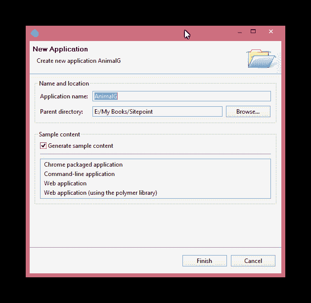
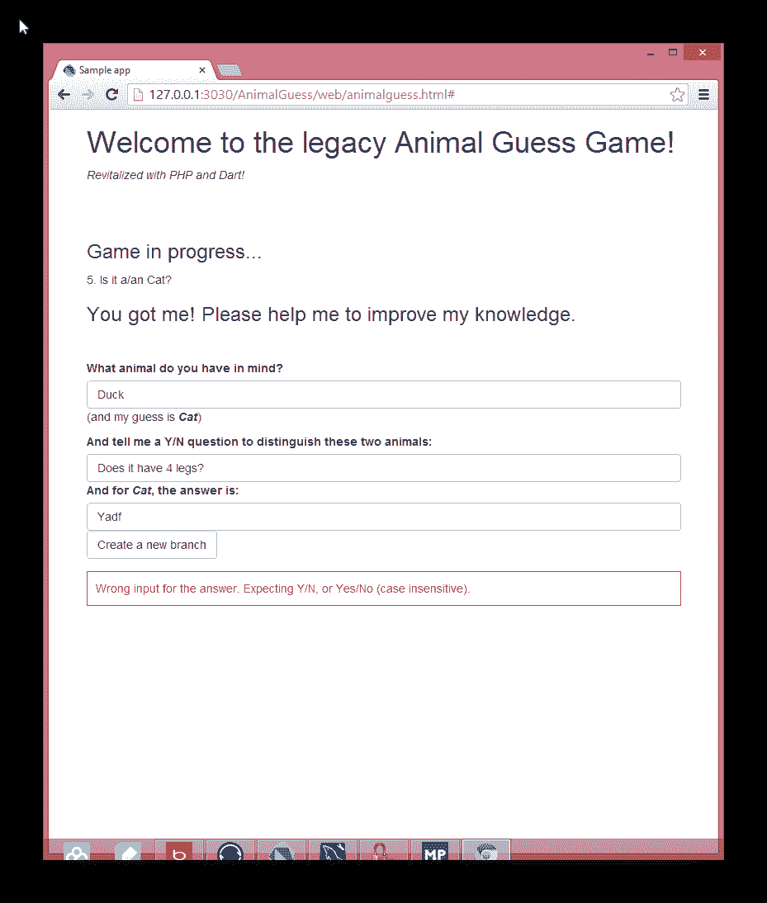

# Dart 和 PHP:传统的动物猜谜游戏

> 原文：<https://www.sitepoint.com/dart-php-legacy-animal-guess-game/>

当我用 BASIC 在 Apple II 上学习编程时，有一个动物猜谜游戏。这个游戏是一个非常原始的人工智能游戏:计算机试图问一些是/否的问题，并从用户那里接收答案。根据答案，它可能会问更多的 Y/N 个问题，直到它试图猜测动物。

在本教程中，我们将学习如何使用 PHP 作为后端和 Dart 作为前端来重新激活这个程序。当然，一个数据库将被用来存储动物的所有问题和猜测。

完整的代码已经上传到 Github。你可以从[这里](https://github.com/taylorren/AnimalGuess)克隆。

### 数据库设置

这个程序的数据库结构很简单。我们只需要一张桌子:

```
CREATE TABLE `animal` (
  `id` int(11) NOT NULL,
  `question` varchar(140) DEFAULT NULL,
  `y_branch` int(11) DEFAULT NULL,
  `n_branch` int(11) DEFAULT NULL,
  PRIMARY KEY (`id`)
)
```

`id`用于标识每个问题/猜测；`question`是要问的问题还是要提示的猜测；`y_branch`和`n_branch`在用户回答“是”或“否”时识别问题 id。特别是，如果这两个字段都是“-1”，则意味着没有问题要问了(并且程序已经到了猜测阶段)。

SQL 结构和初始数据(一题两兽)可以在 [`animal.sql`](https://github.com/taylorren/AnimalGuess/blob/master/animal.sql) 文件中找到。

### 后端

由于后端相对简单，我将使用普通的 PHP(与 PDO)。这些文件位于存储库中的`server`目录下。服务器基本上有两个功能:

1.  通过 ID 获取问题或提示猜测；
2.  用用户输入的新问题和新猜测拆分一个节点；

我们来看一下获取问题功能:

```
 <?php

    require_once 'pdo.php';

    $id=filter_input(INPUT_GET, 'id', FILTER_VALIDATE_INT);

    if(!$id)
        $id=1;

    $res=$cn->prepare('select * from animal where id = :id');
    $res->bindParam(':id', $id);
    $res->execute();

    $r=$res->fetch();

    $ret=array();
    $ret['q']=$r[1];
    $ret['y']=$r[2];
    $ret['n']=$r[3];

    setExtraHeader();

    echo json_encode($ret);
    ?>
```

在这个`get.php`文件中，我们包含了一个`pdo.php`文件来设置数据库连接。然后我们处理输入并进行查询。最后，我们将结果输出到前端(本例中是 Dart 应用程序)。

这里需要注意一些事情:

1.  所有返回到 Dart 应用程序的结果都应该是 JSON 格式。因此，我们使用`json_encode`函数对数组进行编码。
2.  在我们实际返回结果之前，我们设置了一些额外的 HTTP 头来启用 [CORS](https://www.w3.org/TR/cors/) 。虽然我们所有的文件“物理上”都在同一台机器上，但 Dart 应用和后端实际上运行在两个不同的域上。如果没有额外的头，从前端到后端的调用将会失败。`setExtraHeader`功能也在`pdo.php`中定义。

### 前端

前端 web 编程已经非常方便(或者复杂？)通过 HTML5、JavaScript 和其他第三方库。只是需要更有条理一些。

在本教程中，我们将使用 Google 的 Dart 作为前端开发的工具。

#### 装置

要获得 Dart IDE，请访问[https://www.dartlang.org](https://www.dartlang.org)并下载适用于您平台的软件包。安装很简单。或者，[下载 Webstorm](http://www.jetbrains.com/webstorm/) ,它包含本地 Dart 支持，比基于 Eclipse 的 Dart 编辑器更稳定，性能更好。

Dart 刚刚发布了稳定版，摘掉了戴了很久的“BETA”帽子，但它正在快速进化。在撰写本文时，我正在使用 Dart 编辑器和 SDK 版本 1.0.0_r30188(稳定)。

为了充分利用 Dart 提供的交互性，我们将使用新的聚合物库。

**注意:**聚合物取代了旧 Dart 版本中的`web_ui`库。像 Dart 一样，聚合物也在快速发展。这个程序我用的是 0.9.0+1 版本。在未来的版本中，某些语法和功能可能会有所不同。

Polymer 在开发前端时提供了一些有用的特性，如定制 HTML 元素、双向数据绑定、条件模板、异步远程函数调用等。所有这些功能都将在这个程序中使用。

#### 创建聚合物应用程序

启动 Dart IDE，选择“文件|新建应用程序”。请务必选择“Web 应用程序(使用聚合物库)”作为应用程序类型。



向导将创建应用程序目录并设置所有必要的依赖项。由于我们选择了“生成示例内容”，它也将创建几个示例文件。我们可以删除所有这些样本文件，除了`pubspec.yaml`。

右击`pubspec.yaml`文件，从菜单中选择`Pub Get`。这将有助于安装 Dart/Polymer 应用程序所需的所有库。

典型的聚合物应用程序至少包含 3 个文件:

1.  作为应用入口点的 HTML 文件。这种情况:`web/animalguess.html`。在这个文件中，通常我们会设置一个 HTML 文件的基本结构，并且**必须**实例化一个定制的 HTML 元素。
2.  定义自定义 HTML 元素、布局、该元素的脚本等的 HTML 文件。这种情况:`web/animalguessclass.html`。
3.  实现该自定义 HTML 元素功能的 DART 文件。

我们来讨论一下每个文件的要点。

##### animalguess.html

`animalguess.html`文件定义了 app 的整体布局。这是一个 HTML5 兼容文件，包含所有常规的 HEAD、TITLE、LINK、SCRIPT、META 元素，以及一个定制的 HTML 元素标签。

```
 <!DOCTYPE html>

    <html>
    <head>
    <meta charset="utf-8">
    <title>Welcome to Animal Guess Game!</title>
    <link rel="stylesheet" href="css/bootstrap.css">
    <link rel="stylesheet" href="css/animal.css">

    <!-- import the underlying class -->
    <link rel="import" href="animalguessclass.html">
    <script type="application/dart">import 'package:polymer/init.dart';</script>
    <script src="packages/browser/dart.js"></script>
    </head>
    <body>
          <div class="container">
            <h1>Welcome to the legacy Animal Guess Game!</h1>
            <p><em>Revitalized with PHP and Dart!</em></p>
          </div>
          <hr>
        <animal-guess></animal-guess>
    </body>
    </html>
```

对于`<head></head>`部分的大部分，我们真的不需要改变任何东西。对于这个应用程序，我只改变了两个 CSS 链接，以链接到 Bootstrap CSS 和我进一步定制的 CSS。

在 BODY 部分，我们包含了定制的 HTML 元素`<animal-guess>`。该元素在`animalguessclass.html`中定义，并通过`<link rel="import" href="animalguessclass.html">`语句导入。

##### animalguessclass.html 和风俗元素

此文件定义自定义 HTML 元素的布局、模板和行为。然而，实现该行为的实际代码通常在一个单独的 DART 文件(`animalguessclass.dart`)中定义。

```
 <polymer-element name="animal-guess"> 
        <template>

            <div class="container">    
              <template if="{{!gameinprogress}}">
                  <h3>Let's get started!</h3>
                  <button on-click="{{newGame}}">Click me</button>
              </template>

          ...
              <template if="{{gameinprogress}}">
                  <div class="row">
                    <div class="col-md-6">{{qid}}. {{question}}</div>
                        <template if="{{!reachedend}}">
                            <div class="col-md-6">
                                  <a href="#" on-click="{{YBranch}}">Yes</a>&nbsp;&nbsp;<a href="#"
                            on-click="{{NBranch}}">No</a>
                            </div>
                        </template>
                      </div>
              </template>
        ...          
        </template>
        <script type="application/dart" src="animalguessclass.dart"></script>
    </polymer-element>
```

上面的摘录显示了一个聚合物元素的 HTML 文件的基本结构。

`<polymer-element name="animal-guess"></polymer-element>`必须被提出来定义一个元素。请注意`name`属性。它与我们在`animalguess.html` ( `"animal-guess"`)中使用的值相同。

有条件模板实例。例如:

```
 <template if="{{!gameinprogress}}">
          <h3>Let's get started!</h3>
        <button on-click="{{newGame}}">Click me</button>
      </template>
```

除非`gameinprocess`为假，否则`<template></template>`之间的 HTML 代码不会被呈现。`gameinprogress`是一个变量，将在后面详述。

另外，请注意，我们已经将一个按钮元素的 click 事件挂接到一个事件处理程序(`"newgame"`)。这个我们后面也会讨论。

一般来说，这个 HTML 文件与传统的 HTML 文件或 HTML 模板没有什么不同。我们可以在这个文件中使用各种 HTML 元素。

**注意:**可以使用单选按钮。但是有一些与值的绑定相关的问题。所以在这个实现中，我们只使用文本框进行输入。对于其他类型的表单控件，可能存在与数据绑定相关的问题，但我们在这里不讨论这个主题。

同样，在这个文件中，我们声明我们将使用`animalguessclass.dart`作为这个元素的脚本。

`animalguessclass.html`的完整代码可以在`web`目录中找到。

##### animalguessclass.dart

此文件是此应用程序的驱动程序。它拥有驱动程序行为的所有逻辑。让我们来看看一些关键部分。

```
import 'package:polymer/polymer.dart';
import 'dart:html';
import 'dart:convert';

@CustomTag('animal-guess')
class AnimalGuess extends PolymerElement {
  @published bool gameinprogress=false;
  @published String question='';
  @published String myguess='';
  @published int qid=1;
  int yBranch;
  int nBranch;
  ...

  AnimalGuess.created() : super.created() {
    // The below 2 lines make sure the Bootstrap CSS will be applied
    var root = getShadowRoot("animal-guess");
    root.applyAuthorStyles = true;
  }

  void newGame() {
    gameinprogress=true;
    win=false;
    lost=false;
    reachedend=false;
    qid=1;
    getQuestionById(qid);
  }

  void getQuestionById(qid)
  {
    var path='http://animal/get.php?id=$qid';
    var req=new HttpRequest();
    req..open('GET', path)
      ..onLoadEnd.listen((e)=>requestComplete(req))
      ..send('');
  }

  void requestComplete(HttpRequest req)
  {
    if (req.status==200)
    {
      Map res=JSON.decode(req.responseText);
      myguess=res['q'];
      yBranch=res['y'];
      nBranch=res['n'];

      if (yBranch==-1 && nBranch==-1) // No more branches and we have reached the "guess"
      {
        question='Is it a/an $myguess?';
      }
      else
      {
        question=myguess;
      }
    }
  }
}
```

前 3 个`import`语句导入该脚本中使用的必要库。在使用 Polymer 和 DOM 时，需要前两个，在解码 JSON 时我们还需要第三个。要查看其他包和库，请查看[API 参考](http://api.dartlang.org/docs/channels/stable/latest/)和[包库](http://pub.dartlang.org/)。

`@CustomTag('animal-guess')`定义我们将使用的自定义标签。它与出现在`animalguess.html`和`animalguessclass.html`中的名字相同。

在类定义中，我们看到一些变量声明。Polymer 使用`@published`关键字来声明一个“公共”变量(就像`gameinprogress`标志，指示游戏是否开始，并用于决定显示哪个模板)，它将在脚本以及相关的 html 文件(`animalguessclass.html`)中可访问。通过这样做，我们创建了“双向”数据绑定。

剩下的就是函数声明了。大多数函数将是前面提到的`animalguess.html`中的`on-click`事件的“事件处理程序”。其他类型的事件处理程序也是可用的。

需要注意的几件事:

*   在类构造函数中，我们使用了一个技巧来确保引导 CSS 可以应用到我们的自定义 HTML 标签("`animal-guess`")。Stackoverflow 的这篇文章详细阐述了这个问题。基本上，Bootstrap“不知道 ShadowDOM，并试图使用全局选择器从 DOM 中获取节点。”但是在 Polymer 中，我们几乎被强制使用一个自定义元素，并且影子 DOM 已经存在。所以“转变”只是为了确保我们创建的 ShadowDOM 将与 Bootstrap 一起工作，并具有我们想要的 CSS 样式。
*   回调函数(`requestComplete`)连接到 HttpRequest 对象。使用的语法在 Polymer 中是新的，称为“链式”方法调用。它不同于单点符号，而是使用两个点。它相当于下面 3 条语句:

```
req.open(...);
req.onLoadEnd(...)...;
req.send(...);
```

*   在`requestComplete`函数中，我们首先测试 HTTP 状态码(200 表示一切正常)，然后使用一个 Map 类型变量来存储解码后的 JSON 对象。该变量将有一个精确的“键-值”对，作为从我们的远程服务器返回的 JSON 结果。在我们的例子中，后端“远程”服务器在同一台机器上(运行在 80 端口上),当应用程序在 Dart 中启动时，将在 3030 端口上运行。因此，从这个意义上说，它们位于两个不同的域中，并且 CORS 报头必须出现在返回的 HTTP 响应中。

下面是一个屏幕截图，当计算机用尽它的问题，但作出了错误的猜测。然后，它会提示输入一个新问题，以区分它的猜测和用户的动物:



此时，应用程序已经具备了功能:后端提供数据，前端提供应用程序逻辑和表示。至少可以做一个改进:使用单选按钮表单控件来接收新问题的答案，并限制用户的输入。我将把那件事留给你。

#### 部署为独立的应用程序

当前程序只能在 Dart 自己的浏览器中运行(一个高度定制的基于 Chrome 的浏览器，支持 Dart 解释器——你下载 Dart SDK 的时候自动下载)。为了使应用程序独立，我们可以将 Dart 应用程序编译成 JavaScript。

为此，单击项目根目录中的“`build.dart`”文件，并选择“`Tools | Pub Build`。经过一些处理后，一个新的“`build`”目录将出现在项目根目录中，其中包含了作为独立应用程序运行所需的所有文件。我们只需将所有这些文件复制到一个网站上，它就会开始运行。

### 结论

在本教程中，我们使用现代技术:数据库、Dart 和 PHP，重新激活了一个传统的猜动物人工智能游戏。本教程的目的是演示所有部分的无缝集成，并以一种非常结构化的方式创建一个有用的富 web 应用程序。

如果你有一些反馈或问题，请在下面的评论中留下，我会尽快解决。如果你觉得这篇文章很有趣，并希望看到它的扩展，请与你的朋友和同事分享，这样我们就可以衡量兴趣和相应的计划。

## 分享这篇文章