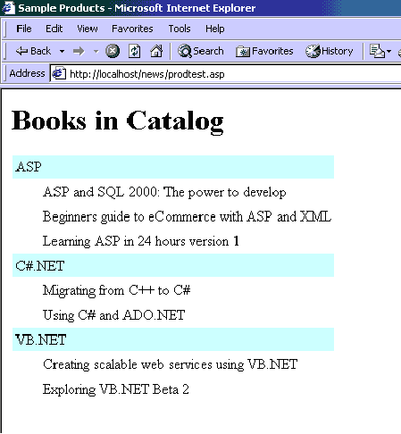

# 从 SQL Server 项目中检索 XML 格式的数据

> 原文：<https://www.sitepoint.com/data-as-xml-sql-server-3/>

##### 显示结果:

既然我们已经创建了名为`sp_GetExplicitXML`的存储过程，我们希望能够用它做一些有用的事情。我们可以通过在新的 query analyser 窗口中键入以下代码来确保存储过程返回我们期望的结果:

```
use myProducts   

go   

exec sp_GetExplicitXML
```

如果一切顺利，您将看到一行包含存储过程结果的 XML。为了在浏览器中显示结果，我们将创建一个 ASP 脚本，该脚本将执行存储过程，将结果加载到一个 MSXML DomDocument 对象中，然后使用 XSL 样式表转换结果。创建一个新的 ASP 脚本，并将其称为 prodtest.asp。将以下代码输入 prodtest.asp 并保存:

```
<!-- METADATA Type="TypeLib" File="c:program filescommon   

filessystemadomsado15.dll" -->   

<%   

dim objStream   

dim objConn   

dim objComm   

dim objXML   

set objStream = Server.CreateObject("ADODB.Stream")   

set objConn = Server.CreateObject("ADODB.Connection")   

set objComm = Server.CreateObject("ADODB.Command")   

set objXML = Server.CreateObject("MSXML2.DOMDocument")   

objConn.Open "Provider=SQLOLEDB; Data Source=(local); Initial    

Catalog=myProducts; UId=sa; Pwd="   

objComm.ActiveConnection = objConn   

objComm.CommandType = adCmdStoredProc   

objComm.CommandText = "sp_GetExplicitXML"   

objStream.Open   

objComm.Properties("Output Stream").Value = objStream   

objComm.Execute ,, adExecuteStream   

objStream.Position = 0   

objXML.LoadXML("<?xml version='1.0'?><?xml-stylesheet type='text/xsl'    

href='prodtest.xsl'?><My_Products>" &   

objStream.ReadText & "</My_Products>")   

if objXML.parseError.errorCode <> 0 then   

  Response.Write "Error loading XML: " & objXML.parseError.reason   

  Response.End   

end if   

Response.ContentType = "text/xml"   

Response.Write objXML.xml   

%>
```

我不会对我们的 prodtest.asp 页面的代码进行过多的描述。简而言之，我们使用 ADO 命令和流对象来执行我们的存储过程，并将结果读取到 MSXML DOMDocument，然后对其进行解析和错误检查。如果没有错误，我们将输出的内容类型更改为 text/xml，并将 xml 写入浏览器。

请注意，在我们的 XML 文档中设置了一个样式表，将结果呈现为易于阅读的格式。样式表 prodtest.xsl 如下所示:

```
<?xml version="1.0" ?>   

<xsl:stylesheet xmlns:xsl="https://www.w3.org/TR/WD-xsl">   

<xsl:template match="/">   

<html>   

<head>   

<title> Sample Products </title>   

</head>   

<body>   

<h1>Books in Catalog</h1>   

<table border="0" cellspacing="2" cellpadding="3">   

<xsl:for-each select="My_Products/Category">   

<tr>   

<td width="100%" bgcolor="#C0FFC0">   

<xsl:value-of select="@CatName"/>   

</td>   

</tr>   

<xsl:for-each select="Product">   

<tr>   

<td width="100%" bgcolor="#E9E9E9">   

  <p style="margin-left:30"><xsl:value-of select="@ProdName"/></p>   

</td>   

</tr>   

</xsl:for-each>   

</xsl:for-each>   

</table>   

</body>   

</html>   

</xsl:template>   

</xsl:stylesheet>
```

一旦我们将样式表保存在与 prodtest.asp 文件相同的目录中，我们就可以启动浏览器并运行`prodtest.asp`(确保您将文件保存在 IIS 可以处理的目录中)。结果如下所示:



##### 结论:

微软已经成功地将 XML 支持实现到他们的总体 Web 策略中，这在 SQL Server 2000 中非常明显。如果上面的一些代码有点难以理解，坚持下去。刚开始学的时候花了差不多两周的时间！

我们创建的存储过程只是将 XML 合并到任何 n 层应用程序的业务逻辑层的许多方法之一，记住，许多(如果不是所有的话)世界顶级开发公司已经将/正在计划将 XML 支持合并到他们现在或将来的产品中。尝试以下链接来扩展您对 SQL Server 2000 中 XML 的了解:

*   [微软图书馆](http://msdn.microsoft.com/library/default.asp?url=/library/en-us/dnsqlmag01/html/xmlExplicit.asp)
*   [SQLMag](http://www.sqlmag.com/Articles/Index.cfm?ArticleID=9790)

**Go to page:** [1](/data-as-xml-sql-server) | [2](/data-as-xml-sql-server-2/) | [3](/data-as-xml-sql-server-3/)

## 分享这篇文章