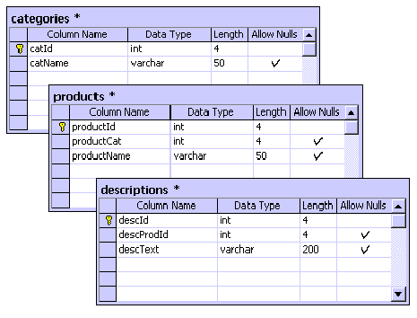

# 从 SQL Server 项目中检索 XML 格式的数据

> 原文：<https://www.sitepoint.com/data-as-xml-sql-server/>

曾经围绕 XML 的所有宣传终于开始平息，开发人员真正开始利用这种语言的力量和灵活性。XML 是一种数据描述语言，它使用一组用户定义的标记以分层结构的格式描述数据。

几个月前发布的 Microsoft SQL Server 2000 也见证了微软对 XML 潮流的追逐——它们包含了许多不同的方法来操作数据作为格式良好的 XML。首先，有 SQL XML 支持。Microsoft 的 SQL XML 实现提供了一个简单的配置工具，允许开发人员通过 HTTP 使用基于 URL 的查询来远程访问数据库。例如，我们可以在名为“myVirtual”的 Web 服务器上设置一个 SQL XML 虚拟目录。然后，假设我们有适当的安全许可，我们可以使用任何浏览器通过简单的基于 URL 的查询(比如:`http://www.myserver.com/myVirtual?SQL=select+*+from+products+for+xml+auto`)来查询我们的数据库。然后，这将我们的结果作为基于 XML 的记录集返回。

注意上面查询中的“for xml auto”部分吗？这决定了 SQL Server 2000 形成数据的方式。有三种成型方法:

1.  **"for xml auto"** :根据查询的“from”部分列出的表和“select”部分列出的字段，返回嵌套的 xml 元素。

*   **“for xml raw”**:返回带有“row”前缀的 XML 元素(例如:“`<row tProduct ...>`”)。表中的每一列都表示为一个属性，不包括空列值。*   **" for XML Explicit "**:Explicit 模式是 SQL Server 2000 中使用的最复杂的整形方法。它允许用户以这样的方式查询数据源，即在执行查询批处理之前指定返回的 XML 的名称和值。

我今天要讨论的是第三种方法，“for xml explicit”。在我看来，显式方法是 SQL Server 2000 最强大的功能。我们不仅可以指定如何将 XML 数据返回给我们，还可以使用记录过滤器和排序模式，因为众所周知，以任何其他方式对 XML 文档进行排序几乎是不可能的。

现在，让我们开始吧。本文的目标读者是希望在基于 n 层的应用程序的 BLL(业务逻辑层)中使用 XML 的中高级开发人员，在这种应用程序中，速度是一个关键问题。要从本文中获益，您需要具备以下条件:

*   运行 IIS 和 SQL Server 2000 并支持 XML 的 Win2k 机器
*   基本的 ASP，SQL，XML 和 XSL 知识

##### 步骤 1:创建我们的示例数据库

在您的 SQL Server 2000 服务器上，打开企业管理器并创建一个名为`"myProducts"`的新数据库。然后，使用企业管理器或查询分析器，创建如下所示的表:

(注意:catId、productId 和 descId 都是自动递增的身份字段)

正如您可能已经猜到的，我们使用三个表来模拟一个非常简单的产品描述数据库(假设我们销售书籍)。上图显示了我们的数据的层次结构:列出产品的类别，列出它们的描述。在我们进入下一步之前，我们需要在表中创建一些虚拟数据。为了最大限度地提高工作效率和缩短本文的长度，我创建了一个简单的 T-SQL 脚本，它将根据需要填充我们的表，您可以在这里下载它。该脚本将创建 3 个类别，7 个产品和 7 个描述。

**Go to page:** [1](/data-as-xml-sql-server) | [2](/data-as-xml-sql-server-2/) | [3](/data-as-xml-sql-server-3/)

## 分享这篇文章