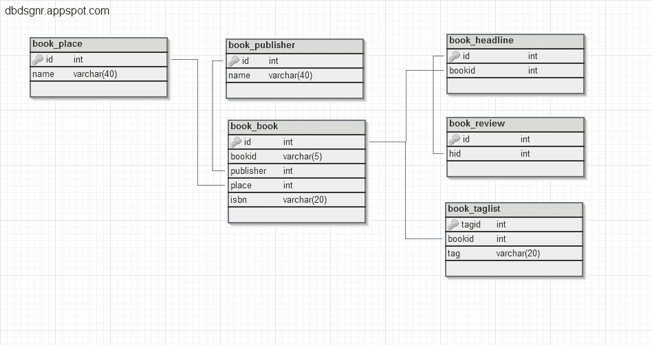
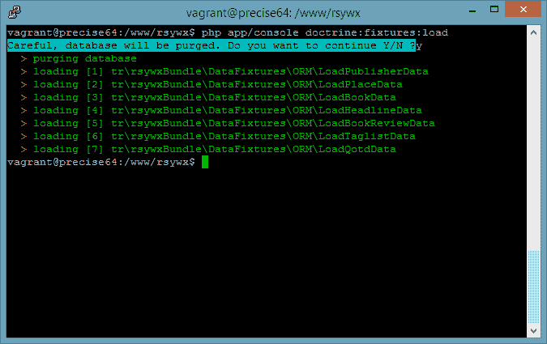
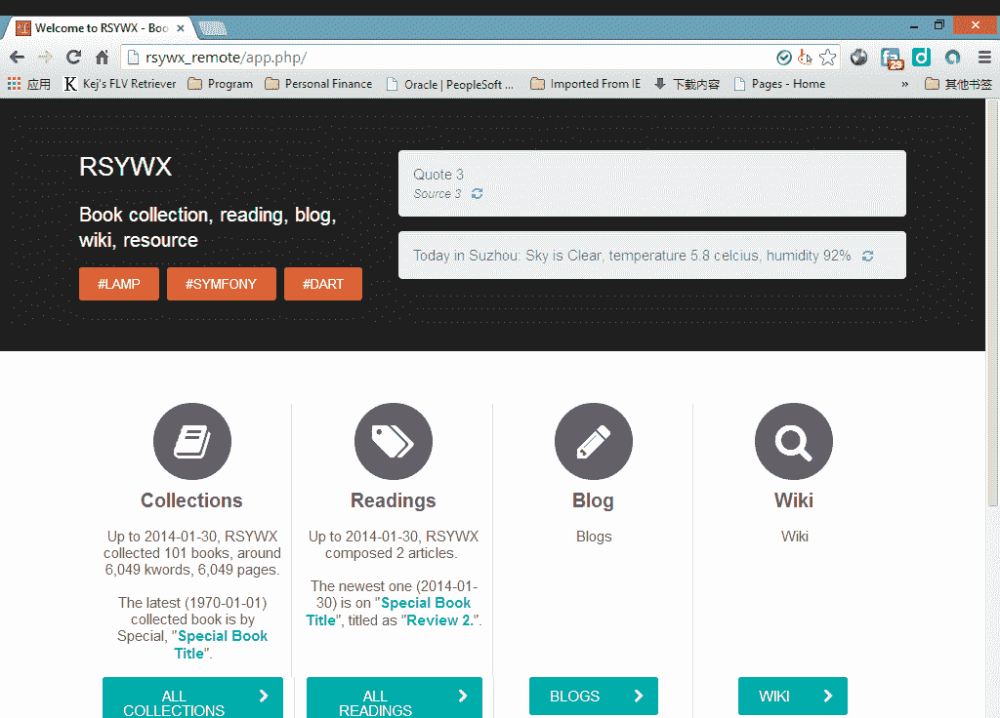

# Symfony2 中的数据装置

> 原文：<https://www.sitepoint.com/data-fixtures-symfony2/>

当我第一次开始学习 Symfony (1.x)及其 Jobeet 项目时，我认为将大量测试数据加载到数据库中的能力非常有用。

在本文中，我们将重新审视这个特性，它已经被完全重新建模，因此有很多东西可以教给我们。

### 准备

在本文中，我们将有两个第三方库来进一步增强 Symfony 的功能。

第一个是`DoctrineFixturesBundle`，用于用[主义 ORM](http://www.doctrine-project.org/) 加载测试数据，这是 Symfony 中默认的 ORM。

请按照 Symfony [官方文档](http://symfony.com/doc/current/bundles/DoctrineFixturesBundle/index.html)中的说明来设置和配置 DoctrineFixturesBundle。如果你熟悉 Composer，这个过程应该简单明了，没有麻烦。

接下来，我们将安装 PHPUnit，Symfony 使用的默认测试框架。它的[官方网站](http://phpunit.de/)提供最新`phpunit.phar`文件的下载。只需将文件保存到 Symfony 根目录，我们就完成了。Symfony 附带了一个默认的、可使用的 PHPUnit 配置文件(`app/phpunit.xml.dist`)。在正常情况下，我们应该保持这个文件不变，PHPUnit 会工作得很好。我们将在本文的后续部分使用 PHPUnit，所以请确保您已经拥有了它。

当然，要让上述两个库在我们的应用程序中工作，我们必须首先设置 Symfony 项目/应用程序。这个话题在我之前的文章[“用 Symfony 2 构建 Web 应用:引导”](https://www.sitepoint.com/building-a-web-app-with-symfony-2-bootstrapping/)中有所涉及。如果你还不熟悉 Symfony 2 的设置，请看看。事实上，本文与我们之前创建的图书收集应用程序非常相关(尽管对数据库模式做了一些修改)。

### 编写我们的第一个数据固定文件

在我们构建图书收藏应用程序时，我们需要一些表格来描述图书相关信息之间的关系:

*   `book_book`:包含一本书的信息，包括书号、书名、作者、ISBN、出版商(FK 到另一个`book_publisher`表)、购买地点(FK 到另一个`book_place`表)、购买日期等。
*   `book_place`、`book_publisher`:分别包含购买地点和发行商的信息。
*   `book_taglist`:包含一本书的标签，与`book_book`表形成多对多关系。
*   `book_headline`、`book_review`:包含我对某本书的阅读想法。头条是主表，与`book_review`形成一对多关系，与`book_book`形成一对一关系。
*   获取附加信息的其他表。

在这个应用程序中，我用下面的结构设置数据库(`rsywx_test`)。该模式是在这个在线工具的帮助下绘制的。



**注意**:我没有在这个模式图中列出所有的表/字段，只是列出了那些主键和外键来说明表之间的关系。完整的 SQL 转储可以在[为本文创建的 Github 存储库](https://github.com/taylorren/rsywx_test)中找到。

首先，我们将为`book_place`创建数据夹具。

```
<?php namespace tr\rsywxBundle\DataFixtures\ORM;  use \Doctrine\Common\DataFixtures\AbstractFixture;  use \Doctrine\Common\DataFixtures\OrderedFixtureInterface;  use \Doctrine\Common\Persistence\ObjectManager;  use \tr\rsywxBundle\Entity\BookPlace as  BookPlace;  class  LoadPlaceData  extends  AbstractFixture  implements  OrderedFixtureInterface  {  /**
     * 
     * {@inheritDoc}
     */  public  function load(ObjectManager $manager)  {  //Create a common place $place1=new  BookPlace(); $place1->setName('Common'); $this->addReference('commonPlace', $place1);  //Create a special place $place2=new  BookPlace(); $place2->setName('Special'); $this->addReference('specialPlace', $place2); $manager->persist($place1); $manager->persist($place2); $manager->flush();  }  /**
     * 
     * {@inheritDoc}
     */  public  function getOrder()  {  return  2;  }  }
```

这里要强调几件事:

1.  共有 4 个`use`语句。前 3 个是非常标准的，几乎所有数据夹具文件都需要。最后一个`use`是包含表`book_place`的名称空间。这必须与我们要加载数据的表相匹配。
2.  一个数据 fixture 文件将包含一个定制类(从`AbstractFixture`扩展并实现`OrderedFixtureInterface`)，其中至少有两个函数:`load`(加载样本数据)和`getOrder`(指定加载顺序并保持 PK/FK 之间的引用完整性)。
3.  在`load`函数中，我们创建了几个`book_place`的实例，并为`name`赋值。`id`字段不会被分配，因为它是一个自动递增字段。
4.  此外，在创建了一个对象`book_place`之后，我们通过`$this->addReference()`添加了一个对这个对象的引用。这是一个**必须**，因为我们需要在`book_book`表数据加载中再次引用这个对象。您可能还记得在`book_book`表中，它的字段`place`是 FK 到`book_place`表的`id`字段。
5.  最后，我们持久化对象，并在表中进行物理插入。
6.  在`getOrder`函数中，我们明确指出这个 fixture 文件应该在第二个位置加载(在我的例子中，只在`book_publisher`之后)。

这个数据夹具文件应该放在`your project root/src/your bundle namespace/DataFixtures/ORM`下。在我的流浪 Symfony 设置中，目录是`/www/rsywx/src/tr/rsywxBundle/DataFixtures/ORM`，文件名是`LoadPlace.php`。

现在我们可以加载数据夹具文件了:

> php 应用程序/控制台原则:设备:加载

这个 Symfony 控制台命令将抓取驻留在上述目录中的所有文件，并开始按照每个文件的`getOrder()`函数指定的顺序插入样本数据。



搞定了。回到您最喜欢的 MySQL 管理工具，做一个`select * from book_place`或类似的操作，我们会看到两个记录被插入到`book_place`表中。

### 加载帐簿数据和对其他对象的引用

接下来，让我们加载图书数据。这个 fixture 文件会有点复杂，因为它将使用一个循环来创建许多 book 对象，并使用以前创建的对象引用来设置外键的值。

`LoadBook.php`摘录如下:

```
<?php namespace tr\rsywxBundle\DataFixtures\ORM;  ...  use \tr\rsywxBundle\Entity\BookBook as  BookBook;  class  LoadBookData  extends  AbstractFixture  implements  OrderedFixtureInterface  {  /**
     * 
     * {@inheritDoc}
     */  public  function load(ObjectManager $manager)  {  //Now we create a 100 general book  for  ($i =  1; $i <=  100; $i++)  { $p =  new  BookBook(); $p->setAuthor('Normal');  ... $p->setPurchdate(new \DateTime()); $p->setPubdate(new \DateTime());  ... $p->setPage($i);  ... $p->setPublisher($this->getReference('commonPub')); $p->setPlace($this->getReference('commonPlace')); $manager->persist($p);  }  //Create a special book $s =  new  BookBook();  ... $s->setPurchdate(new \DateTime('1970-1-1')); $s->setPubdate(new \DateTime('1970-1-1')); $s->setPrintdate(new \DateTime('1970-1-1'));  ... $this->addReference('aBook', $s); $manager->persist($s); $manager->flush();  }  /**
     * 
     * {@inheritDoc}
     */  public  function getOrder()  {  return  3;  }  }
```

在这个 fixture 文件中，我们总共创建了 101 条记录。其中一个比较特殊，因为它是在最后创建的(因此有一个最大的`id`)，并且它的日期相关字段被设置为 EPOCH。

注意我们是如何设置 FK 字段的(`publisher`和`place`)。由于这两个字段是其他表的 FK，我们不能简单地将一个整数赋给这两个字段。我们将不得不使用`$this->getReference()`来抓取先前创建的对象。是的。这就是为什么我们需要`getOrder()`来指定加载的顺序，即 book 表必须在 publisher 和 place 表之后加载。

此外，我们为我的“特殊书籍”创建了一个引用，这样这个对象以后可以用于其他表(`book_headline`、`book_taglist`)。

在我的应用程序中，共有 6 个数据夹具文件。加载完这 6 个文件后，我的应用程序的数据库差不多准备好了。在控制器、视图上进行一些编码后，站点将运行:



有了样本数据，这个站点就更有意义，可以帮助我们进一步的微调和功能测试。

在这个索引页面中，我们确实有很多本文中没有涉及到的功能。例如，有两个显示 QOTD(当日行情)和当地天气信息的 Dart 小部件。这在我之前在 Sitepoint ( [第一部分](https://www.sitepoint.com/integrating-polymerdart-symfony-part-1/)和[第二部分](https://www.sitepoint.com/integrating-polymerdart-symfony-part-2/))的文章中有所涉及。

我们几乎完成了 Symfony DataFixturesBundle 的处理，只差一件事了。回想一下[我关于唯一索引](https://www.sitepoint.com/stored-procedures-mysql-php/)的文章？在某种程度上，我强烈反对使用自动递增的整数字段作为表的主键。同样作为一个完美主义者，一旦我创建了一个有意义的惟一索引，我将简单地消除另一个自动递增的整数字段的存在，并使用那个 UI 作为我的 PK。

但是为了遵守数据固定包的约束，需要做出一个妥协。Symfony DataFixturesBundle 说:

> **必须有一个自动递增的整数字段作为主键，以建立关系引用**

当然，如果你愿意，你可以创建一个 UI 和更多的索引。

因此，在我的`book_book`表中，即使我有一个自给自足的字段(`book_id`，以类似“12345”的形式，一个标记我的书的字符串)，我也必须创建另一个字段(`id`，自动递增的整数)来充当 PK！

如果我们跳过这一步，数据库结构本身仍然有效，所有 FK/PK 关系仍然可以建立。但是，至少会有一个怪异且难以理解的错误:`$this->getReference()`任何引用`book_book`(没有自动递增的整数字段作为 PK)的表都会失败，提示“未定义索引”错误。

## 结论

在本文中，我们讨论了数据设备，以及通过原则向我们的应用程序提供样本数据的正确方法。在下周一发布的后续文章中，我们将进行功能测试，并使用我们在这里播种的数据。

请随意评论，如果您感兴趣，我们将很乐意更详细地介绍这个主题。

## 分享这篇文章