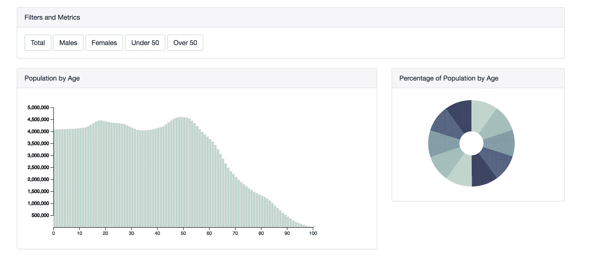

# JavaScript 中的数据管理和可视化介绍

> 原文：<https://www.sitepoint.com/data-management-visualization-javascript/>


为了创建我们的数据的有意义的可视化表示，以及分析所述数据的补充工具，拥有一个构思良好的数据管理框架是很重要的。这需要合适的后端存储、数据访问模式以及用于呈现和分析的引人入胜的前端。有各种各样的工具可以用来在 web 应用程序中构建数据访问堆栈，我们将在这里探讨这些工具。

如果你收集的数据是与你的访问者相关的，那么他们会希望通过某种方式来消费这些数据。我们的责任是向我们的访问者提供透明性，给他们最好的体验，并建立直观和高性能的工具，让他们获得这些见解。数据的可视化表示只是其中的一部分。正是我们用来存储、转换和传输数据的机制，在提供这些丰富体验的过程中扮演了同样重要的角色。

## 数据存储选项

近年来，数据存储已经成为一个巨大的市场。决定在您的应用程序中使用哪种技术可能是一项艰巨的任务。有一些事情需要考虑:性能、可伸缩性、实现的容易程度，以及您和您的团队的特殊技能。这最后一点非常重要，但经常被忽视。如果您的团队中有一个 SQL 开发人员团队，为了说服您走上这条路，迁移到 [MongoDB](https://www.mongodb.com/cloud/atlas) 实现的好处将是压倒性的。

除了“坚持你所知道的”，没有你应该使用的快速简单的答案。平面数据集相对容易处理。它们被构造成单个表格(想想 CSV 文件),相对容易理解。这些资源的局限性很快显现出来，因为随着它们的增长，它们的性能会很差，并且很难维护。如果您有一个平面数据集，您很可能希望将它拆分成其他存储选项之一。

关系数据库(MySQL、SQL Server)非常适合在单独的表中存储数据，这些表可以使用唯一的键连接起来。这些方法的优点是它们减少了数据集的大小，性能更好，并且可以使用成熟的查询语言(SQL)进行访问。这个解决方案还需要大量的规划，为建立关系创建唯一的键，并为性能进行调优。

越来越受欢迎的是面向文档的数据库(例如 [MongoDB](https://www.mongodb.com/cloud/atlas) )，它允许您在 JSON 对象中存储数据。这也比平面文件更有效，因为数据是结构化的，以减少冗余。以 JavaScript 原生格式存储数据还有额外的好处，但是如果您试图连接多个数据集或汇总/创建聚合，这可能会变得越来越复杂。

非结构化数据库(例如 Hadoop)适用于非常大的数据集，不在本次讨论的范围之内。如果您正在处理这种规模的数据集，您可能希望在将数据引入应用程序之前使用一个 [ETL](https://en.wikipedia.org/wiki/Extract,_transform,_load) 过程来规范化数据。

在客户端存储数据的选项也很吸引人，但它也有缺点。在客户端机器上存储文件和缓存数据在某些用例中有一些优势，但是它需要您和用户之间有一定程度的信任。如果这是一项受信任的服务，或者如果用户知道他们将处理大量数据，那么期望他们允许访问文件存储是合理的。然而，默认情况下，除了最苛刻的用例之外，我不建议将这作为一种期望。

## 创建访问层

有几种方法可以在数据中创建访问图层。在关系数据库中，视图一直是这样做的标准方式。视图允许您围绕数据编写查询，并以表格的形式呈现出来。使用数据侵略技术，如 group by、order by、sum 等，您可以为可视化和分析创建更小、更有针对性的数据集。

```
CREATE VIEW population_vw AS
SELECT country, age, year,
sum(total) AS TOTAL
FROM census_data
WHERE year IN ('2010')
AND country IN ('United States')
GROUP BY country, age, year; 
```

大多数关系数据库也允许创建物化视图，这需要 ETL 来创建视图，但是性能更好，因为它们只需要访问一个表。

混合方法也是有效的。通常，这可以通过为存储在 SQL Server 中的大型数据集创建更有针对性的 MongoDB 层来实现。将最重要的数据卸载到面向文档的数据库，以便快速访问和使用，同时将全部数据存储在后端 SQL 数据库中。如果使用 Node，可以使用 Express 来管理这些数据集的创建，并将它们存储在 MongoDB 服务器上。

[OLAP](http://olap.com/olap-definition/) 还允许您创建可以聚合的数据集，但允许您预先建立想要用来表示数据的维度和度量。OLAP 使用多维表达式(MDX)来访问数据类型，但在 web 应用程序中不太受支持。

## 网络依赖性

在将数据发送给客户端之前将其聚合一直被认为是最佳实践。最有可能的情况是，在将数据呈现给用户之前，您希望尽可能地减少服务器上的数据。然而，这可能会很麻烦，因为您经常想在服务器上将它简化为最聚集的形式。如果用户想要更改数据的布局，您最终会遇到网络问题，因为您需要不断地从服务器上获取具有适当聚合级别的数据集。


您必须找到一种介质，在这种介质中，数据聚合的大小既要符合带宽要求，又要提供足够的细节以供分析。这可以通过需求收集和建立最终用户分析所需的关键指标和维度来实现。


访问数据的一种常见方式是通过 RESTful API。RESTful APIs 允许您从远程服务器请求数据，并在应用程序中使用它。通常这是 JSON 格式的。在实践中，建议减少 HTTP 调用的数量，因为每个请求都有一定程度的延迟。您应该尝试在服务器上将数据减少到不太详细但不完全聚合的级别，并在客户端存储数据集以进一步减少。

为了使 API 请求更加明确，您可以使用 [GraphQL](https://www.sitepoint.com/rest-2-0-graphql/) ，它允许您针对您的 API 制定一个查询。使用 GraphQL 这样的语言，您可以轻松地提取特定的数据子集。GraphQL 正迅速成为跨多个分类法(如脸书)拥有复杂关系的应用程序的标准。

## 功能、工具和技术

从 ES5 开始，JavaScript 在数组原型中内置了一套很棒的工具。这包括`filter()`，它允许您获取一个数组并只返回那些与您的查询相关的元素；`reduce()`，它聚合您的数据并返回一个易于使用的汇总数据集；以及`map()`，它可用于更改数据中的值的呈现方式。这些都得到很好的支持，不改变原始数组，也不需要任何额外的库。

> **要了解更多关于这些内置 JavaScript 函数的**，请查看我们关于[函数式 JavaScript 编程的高级课程](https://www.sitepoint.com/premium/courses/functional-javascript-programming-2922)

对于数据表示，我的个人偏好是 [D3](https://d3js.org/) ，它允许您操作 DOM，特别是 SVG 元素，以独特的方式表示您的数据。从简单的条形图、折线图和饼图到复杂的交互式数据可视化。我在 D3 中创建了一个全功能仪表板的[演示。在本文的其余部分，我们将引用来自](https://sitepoint-editors.github.io/dataviz/)[这个回购](https://github.com/sitepoint-editors/dataviz)的代码。

如果您只是想添加一些快速的可视化工具，而不需要大量的自定义代码，那么其他一些使用起来更简单但可定制性较差的工具(如 [Chart.js](http://www.chartjs.org/) )会非常有用。

通常，当我在屏幕上呈现可视化效果时，我会将一个事件绑定到表单字段，该字段将调用与页面上的 SVG 元素相关联的对象上的呈现函数:

```
document.getElementById("total").addEventListener('click', function() {
  barGraph.render(d, "total")
}); 
```

我们将向其传递我们的数据集`d`，以及我们将呈现的指标 **total** 。这将允许我们做两件事:

1.  通过获取数据集，我们可以初步减少和过滤数据，并将值映射到“友好”的名称
2.  它将允许我们从数据集中的各种不同指标中选择一个指标

在渲染函数中，我们将处理添加轴、工具提示、渲染视觉效果和更新。这通常分三步进行:

```
render: function(d, m) {
  this._init(d, m);
  this._enter(d);
  this._update(d);
  this._exit();
} 
```

这是 D3 应用程序的四个主要步骤:

*   **init**–初始化刻度、轴和数据集
*   **输入**–生成初始视图更新
*   **刷新**–数据集改变时的视图
*   **退出**–清理

其他 API，如 Chart.js，将允许您使用配置创建图表，而不是从头开始构建图表。这可以通过调用其 API 并传入所需的配置来实现:

```
var chartInstance = new Chart(ctx, {
  type: "bar",
  data: data,
  options: {
    legend: {
      display: true,
      labels: {
        fontColor: "rgb(255, 99, 132)"
      }
    }
  }
}); 
```

这里的区别在于，您受限于 API 中定义的形式和功能，并且在构建独特和定制的可视化方面没有太大的灵活性。

这是我使用最多的两个库(D3 和 Chart.js ),但是还有许多其他可用的选项(免费的和付费的),可以用来向用户公开数据。在选择产品时，我会推荐一些建议:

1.  获取用 Canvas/SVG 构建的东西。仍然有令人惊讶的许多基于 Flash 的应用程序(甚至 SilverLight)。这些都不是按照 HTML 标准构建的，当你试图集成你的应用程序时，你会后悔的。
2.  考虑你的团队的技能。像 D3 这样的东西对于一个熟练的 JavaScript 开发团队来说是很棒的，但是一些不太容易定制的东西(比如 ChartJS)可能就足够了，并且更好地符合您团队的技能集。
3.  编程到接口。如果您最终将数据与应用程序过于紧密地耦合在一起，如果您不得不更改工具，那么工作量将会显著增加。

很多时候，你会发现自己在处理多个数据集。重要的是，如果你要在前端组合它们，你要异步加载它们，并在加入它们之前等待它们都被完全加载。D3 有处理多个数据集的内置方法:

```
d3.queue()
  .defer(d3.json, "data/age.json")
  .defer(d3.json, "data/generation.json")
  .await(function(error, d, g) { 
```

如果你要在一个汇总中显示数据，D3 的 *[嵌套](https://github.com/d3/d3-collection/blob/master/README.md#nest)* 和 *[汇总](https://github.com/d3/d3-collection/blob/master/README.md#nest_rollup)* 函数提供了这个功能。这将允许您轻松选择要汇总的维度(键)和指标

```
 var grp = d3.nest()
      .key(function(d) {
        return d.generation;
      })
      .rollup(function(v) {
        return d3.sum(v, function(d) {
          return d.total;
        })
      })
      .entries(dg); 
```



## 性能和功能

当你向用户传递数据时，最重要的事情是什么？给他们分析数据的能力，但不要让他们搞砸。这意味着要控制他们可以尝试多少不同的维度/尺度。从性能的角度来看，这将有所帮助，因为您不需要通过网络传递大型数据集，并且限制了需要在客户端完成的数字处理量。

请注意:这并不意味着将数据集缩减为一个完全聚合的数据集。你希望它是灵活的。提供一组可供选择的四个或五个关键指标。在数据集中保留一些不同的维度，以便使用 JavaScript 的数组函数(`filter`、`reduce`和`map`)或像 D3 这样的库对数据进行分组和聚合。应该考虑用户如何分析数据的性能和功能。

一旦有了数据集，知道如何呈现数据就很重要了。下面是一个 JSON 数据集的例子:

```
[{
  "females": 1994141,
  "country": "United States",
  "age": 0,
  "males": 2085528,
  "year": 2010,
  "total": 4079669
}, {
  "females": 1997991,
  "country": "United States",
  "age": 1,
  "males": 2087350,
  "year": 2010,
  "total": 4085341
}, {
  "females": 2000746,
  "country": "United States",
  "age": 2,
  "males": 2088549,
  "year": 2010,
  "total": 4089295
}, {
  // ... 
```

您可以从这个数据集中看到，我们有几个维度(年龄、年份、国家)和几个指标(女性、男性和总数)。这将为我们提供足够的信息来以图形方式显示，同时还让我们能够以几种不同的方式分割数据。

比方说，我们想把数据分成不同的年龄组。我们可以使用 JavaScript 的数组函数将年龄组汇总到 X 代、婴儿潮一代等，而不必对服务器进行任何额外的调用，并直接在客户机上以 SVG 格式重新呈现。

正如您从[演示](https://sitepoint-editors.github.io/dataviz/)中看到的，我们用一些不同的视觉选项呈现数据，并提供了一些用于过滤数据和选择指标的按钮。这是让用户能够分析数据的关键。

设置函数来呈现您的数据并设置所需的指标:

```
document.getElementById("total").addEventListener('click', function() {
  barGraph.render(d, "total")
}); 
```

使用`filter()`将您的数据缩小到适当的级别

```
document.getElementById("over50").addEventListener('click', function() {
  const td = d.filter(function(a) {
    return a.age &gt;= 50
  });
  barGraph.render(td, "total");
}); 
```

将这些函数分配给文档中的过滤器，您就可以过滤数据集、更改指标，并以任何方式对数据进行切片。

## 摘要

最终，您必须使用适合您的团队及其特定技能的数据访问方法。拥有一个精心设计的数据存储层、一个适当的数据访问层和正确的前端数据呈现工具，将为您的用户提供一个坚实的报告基础。

我希望这篇文章已经向您概述了创建数据驱动的应用程序时的重要考虑事项。如果你想了解更多，请在评论中告诉我！

## 分享这篇文章