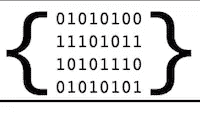

# 数据序列化比较:JSON，YAML，BSON，MessagePack

> 原文：<https://www.sitepoint.com/data-serialization-comparison-json-yaml-bson-messagepack/>


JSON 是 web 上数据交换的事实上的标准，但是它也有缺点，而且还有其他格式可能更适合某些场景。我将比较替代方案的优缺点，包括易用性和性能。

*注意:我不会在这里讨论实现细节，但是如果你是一个 Ruby 程序员，可以看看[这篇文章](https://www.sitepoint.com/choosing-right-serialization-format/)，其中 Dhaivat 写了关于在 Ruby 中实现一些序列化格式的内容。*

## 什么是数据序列化

根据[维基百科](https://en.wikipedia.org/wiki/Serialization)，连载是:

> 将数据结构或对象状态转换为可存储格式(例如，存储在文件或内存缓冲区中，或通过网络连接链路传输)并可在同一或另一计算机环境中重新构建的过程。

假设您想要收集一组人的某些数据—姓名、昵称、出生日期、他们演奏的乐器。您可以轻松地设置一个电子表格，定义一些列，并使每一行都成为一个条目。您可以更进一步，定义出生日期列必须是一个数字，而仪器列可以是一个选项列表。它看起来像这样:

| 名字 | 姓 | 告发 | 绰号 | 工具 |
| --- | --- | --- | --- | --- |
| 威廉 | 郭 | One thousand nine hundred and sixty-two | Axl Rose | 声乐，钢琴 |
| 扫罗 | 哈得孙 | One thousand nine hundred and sixty-five | 斜线 | 吉他 |

或多或少，你在那里做的是**定义一个[数据结构](https://en.wikipedia.org/wiki/Data_structure)**；如果你只需要电子表格格式的，你会做得很好。问题是，如果您想要与数据库或网站交换这些信息，在这些其他平台上实现这些数据结构的机制(即使底层语义总体上是相同的)将会显著不同。除非应用程序是专门为电子表格设计的，否则不能将电子表格即插即用到 web 应用程序中。除非你有某种导出工具或网关，否则你无法将信息从网站转移到数据库。

让我们假设我们的网站已经在其内部逻辑中实现了这些数据结构，并且它只是不能处理电子表格格式。为了解决这些问题，您可以将这些数据结构转换成一种格式，这种格式可以很容易地在不同的应用程序、体系结构等之间共享:您**序列化**它们。通过这样做，您不仅可以确保跨平台传输这些数据，而且可以在称为**反序列化**的逆向过程中重构这些数据。此外，如果从网站交换回电子表格，您将获得原始对象的一个语义相同的克隆——也就是说，一行看起来与您最初发送的一行完全相同。

简而言之:序列化数据就是找到某种可以在不同应用程序之间轻松共享的通用格式。

## 格式

### JSON

[](http://www.json.org/)

> JSON (JavaScript 对象符号)是一种轻量级的数据交换格式。人类读书写字很容易；机器很容易解析和生成。

JSON 是最广泛使用的数据序列化格式，它具有以下特性:

*   **(大部分)[人类可读的](https://en.wikipedia.org/wiki/Human-readable_medium)代码**:即使代码已经被遮挡或者[缩小](https://en.wikipedia.org/wiki/Minification_(programming))，你也可以随时用 [JSONLint](http://pro.jsonlint.com/) 等工具将其缩进，使其重新可读。
*   非常**简单明了的规范**:整个规范的摘要在一个页面上(JSON 网站上显示的)。
*   广泛支持:不仅每种编程语言或 IDE 都支持 JSON，而且许多 web 服务 API 也提供 JSON 作为数据交换的手段。
*   作为 JavaScript 的子集，它支持以下 **JavaScript 数据类型**:
    *   线
    *   数字
    *   目标
    *   排列
    *   `true`和`false`
    *   `null`

这是我们之前的电子表格在 JSON 中序列化后的样子:

```
[
  {
    "name": "William",
    "last name": "Bailey",
    "dob": 1962,
    "nickname": "Axl Rose",
    "instruments": [
      "vocals",
      "piano"
    ]
  },
  {
    "name": "Saul",
    "last name": "Hudson",
    "dob": 1965,
    "nickname": "Slash",
    "instruments": [
      "guitar"
    ]
  }
] 
```

### BSON

[](http://bsonspec.org/)

> BSON 是 Bin ary JSON 的缩写，是一系列类似 JSON 的二进制编码文档。…它还包含了对不属于 JSON 规范的数据类型的简单描述。

JSON 是一种纯文本格式，虽然可以在文本中编码二进制数据，但这有一定的局限性，会使 JSON 文件非常大。BSON 来处理这些问题。

它具有以下特点:

*   **方便存储二进制信息**:更适合交换图像和附件
*   专为**快速内存操作**而设计
*   **简单规范**:和 JSON 一样，BSON[也有一个非常简短的规范](http://bsonspec.org/spec.html)
*   **代表[Mon goDB](http://www.mongodb.org/)的主要数据:BSON 被设计为易于传输**
*   **额外数据类型**:
    *   双精度(64 位 IEEE 754 浮点数)
    *   日期(自 Unix 纪元以来的整数毫秒数)
    *   字节数组(二进制数据)
    *   BSON 物体和 BSON 阵列
    *   JavaScript 代码
    *   MD5 二进位数据
    *   [正则表达式](https://en.wikipedia.org/wiki/Regular_expression)

### 消息包

[](http://msgpack.org/)

> 就像 JSON 一样。但是又快又小。

MessagePack 是另一种用于序列化的二进制格式。没有 BSON 那么有名，但是值得一看。

其特点包括:

*   专为**通过电线**高效传输而设计
*   **比 BSON** 更好的 JSON 兼容性:正如 Sadayuki Furuhashi 在[的这篇堆栈溢出文章](http://stackoverflow.com/a/6357042/2008917)中所解释的
*   **比 BSON** 小:is 的[开销](https://en.wikipedia.org/wiki/Overhead_(computing))比 BSON 小，大部分时间可以序列化更小的对象
*   **类型检查**:支持[静态类型](https://en.wikipedia.org/wiki/Type_system#Static_type_checking)
*   **流式 API** :支持流式解串器，对网络通信很有用。

### 亚姆

> YAML: YAML 不是标记语言。YAML 是一个对所有编程语言都友好的数据序列化标准。

回到纯文本格式， [YAML](http://yaml.org/) 是 JSON 的替代方案:

*   **(真正的)人类可读代码** : YAML 是如此的可读，甚至[的头版内容](http://yaml.org/)都显示在 YAML，以表明这一点
*   紧凑代码:空白缩进用来表示结构，不需要引号和括号
*   **关系数据**的语法:允许带有锚点(`&`)和别名(`*`)的内部引用
*   特别适合查看/编辑数据结构的**:如配置文件、调试过程中的转储、文件头**
*   **一套丰富的[语言独立类型](http://yaml.org/type/)** :
    *   **收藏**:
        *   一组无序的键(`!!map`)
        *   按键顺序(`!!omap`)
        *   按键顺序(`!!pairs`)
        *   不相等值的无序集合(`!!set`)
        *   任意值序列(`!!seq`)
    *   **标量类型**:
        *   空值(`~`，`null`)
        *   小数(`1234`)、十六进制(`0x4D2`)和八进制(`02333`)整数
        *   固定(`1_230.15`)和指数(`12.3015e+02`)浮点
        *   无限(`.inf`、`-.Inf`)和非数字(`.NAN`)
        *   真(`Y`、`true`、`Yes`、`ON`)假(`n`、`FALSE`、`No`、`off`)
        *   采用 [base64](https://en.wikipedia.org/wiki/Base64) 编码的二进制(`!!binary`)
        *   [时间戳](https://en.wikipedia.org/wiki/Timestamp) ( `!!timestamp`)。

这是我们的小电子表格在 YAML 序列化后的样子:

```
- name: William
  last name: Bailey
  dob: 1962
  nickname: Axl Rose
  instruments:
    - vocals
    - piano

- name: Saul
  last name: Hudson
  dob: 1965
  nickname: Slash
  instruments:
    - guitar 
```

## 其他格式

还有许多其他的序列化格式，比如[协议缓冲区](https://developers.google.com/protocol-buffers/) (protobuf，也是二进制的)，我已经(以一种相当随意的方式)省略了。如果你只是想知道每一种可能的格式，去看看维基百科的[数据序列化格式比较](https://en.wikipedia.org/wiki/Comparison_of_data_serialization_formats)。

### … HDF5？

[](https://support.hdfgroup.org/HDF5/)

这里我们会有点跑题，但只是稍微跑题。分层数据格式第 5 版( [HDF5](https://support.hdfgroup.org/HDF5/) )并不是真正为了序列化，而是为了存储，[正在席卷数据科学和其他行业](https://hdfgroup.org/wp/tag/big-data/)。这是一种非常快速和通用的格式，不仅可以用来存储许多数据结构，甚至可以作为关系数据库的替代品。

最后，让我们提一下，如果您对 BSON 和 MessagePack 等用于存储/交换大量信息的二进制格式感兴趣，您可能很想看看 HDF5。

## 基准和比较

出现的一个模式是，BSON 在序列化时可能比 JSON 更昂贵，但在反序列化时更快；MessagePack 在任何操作上都比这两者更快。此外，尽管是二进制格式，但由于其开销，当存储非二进制数据时，BSON 文件有时会比 JSON 文件大。一些链接可以看看:

*   [序列化性能比较(C#/。NET)](http://maxondev.com/serialization-performance-comparison-c-net-formats-frameworks-xmldatacontractserializer-xmlserializer-binaryformatter-json-newtonsoft-servicestack-text/) 由马克西姆·诺瓦克在 M@X on DEV。
*   ivita.com 伊利亚·格里戈利克的协议缓冲区、Avro、节俭区&消息包。
*   [二进制连载导游](https://spin.atomicobject.com/2011/11/23/binary-serialization-tour-guide/)由 Karlin Fox 在原子对象。
*   高效存储熊猫数据帧。
*   MessagePack vs JSON vs BSON。

同样值得注意的是，性能可能会根据您选择的序列化程序和解析器而变化，即使是相同的格式。

## 备注和评论

听起来可能有点傻， **BSON 有一个名为**的优势:人们会自动将 MongoDB (BSON)开发的格式与标准(JSON)联系起来，而这两者并不相关。因此，在为 JSON 寻找二进制替代方案时，您可能还会考虑其他选项。

事实上， **MessagePack 似乎在每个可能的方面都打败了 BSON** :它更快，更小，甚至比 BSON 更兼容 JSON。(事实上，如果你已经在使用 JSON，MessagePack 几乎是一个嵌入式优化。)也许作为一名“记者”我应该更加平衡，但作为一名开发人员，这是一个不用动脑筋的问题。

尽管如此， **BSON 是 MongoDB 存储和表示数据的格式**，所以如果你正在使用这个 NoSQL 数据库，这是坚持使用它的一个理由。

当然，序列化不仅仅是存储二进制数据。不可否认，JSON 有一个不同的目标——让**成为“人类可读的”**。但是不难发现 YAML 在这方面做得更好。

然而，**[YAML 规格](http://yaml.org/spec/)实在是太大了**，特别是与 JSON 的相比。但是可以说，这是必须的，因为它提供了更多的数据类型和特性。

另一方面，不容忽视的是，JSON 的简单性在它被其他序列化格式采用的过程中起到了关键作用。它依赖于已经存在的广泛使用的语言 JavaScript，如果你知道或者接触过 JS(如果你在 web 开发行业，你就是)，你就已经知道 JSON 了。

那为什么不采用 YAML，像现在的*？在许多情况下，这并不容易。JSON 仍然为 web APIs 留有一席之地，因为您可以轻松地在 HTTP 请求中嵌入 JSON 代码(无论是 GET 还是 POST，前者用于 URL，后者用于发送表单):格式**会让您知道传输是否突然中断**，因为代码会自动呈现无效，而 YAML 和其他竞争对手的明文格式可能不会出现这种情况。此外，您仍然需要在某一点上与基于 JSON 的 API 和遗留代码进行交互，并且为同一目的(数据序列化)维护两段代码(JSON 和 YAML 方法)总是一件痛苦的事情。*

 *但是话说回来，这些争论在一定程度上也是推动我们后退并阻止我们采用更新更有效的技术(例如:像 Python 3 胜过 Python 2)。我想了一分钟，我们，程序员和企业家，是创新者，不是吗？* 

## *分享这篇文章*