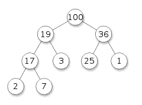
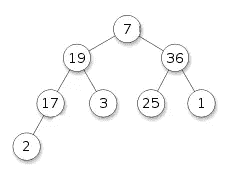

# PHP 开发人员的数据结构:堆

> 原文：<https://www.sitepoint.com/data-structures-3/>

在过去的两篇文章中，我已经向您介绍了三种基本的数据结构:[堆栈、](https://www.sitepoint.com/php-data-structures-1/ "Data Structures for PHP Devs: Stacks and Queues")和[树](https://www.sitepoint.com/data-structures-2/ "Data Structures for PHP Devs: Trees")。在本文中，我将向您介绍另一种密切相关的抽象数据类型:堆。堆是满足堆属性的特殊的树状数据结构——在整个树中，任何父节点的节点值(键)总是相对于其子节点值排序。让我们仔细看看！

## 很

有几种堆变体。例如，如果父关键字被排序，使得它们的值等于或大于它们的子关键字的值，并且最高的关键字位于根，则该堆被称为 *maxheap* 。如果父关键字的排序是等于或低于子关键字的值，最低的关键字位于根，则该堆被称为 *minheap* 。SPL (PHP > =5.3.0)提供了一个基本的堆、minheap、maxheap 和一个称为优先级队列的特殊数据类型。

这里有一个堆的例子:



上图描绘了一个完整的二进制 maxheap。它是二进制的，因为每个节点正好有两个子节点，还有一个 maxheap，因为最高值的键在根节点，所有父节点的值都大于它们的子节点。

虽然堆通常被实现为完整的二叉树，但与二叉树不同的是，它没有兄弟姐妹的隐含排序，也没有任何有序遍历的隐含顺序。

堆是表数据类型的变体，因此它们也具有相同的基本操作:

*   **创建**–创建一个空堆。
*   **is empty**–确定堆是否为空。
*   **insert**–向堆中添加一个项目。
*   **extract**–从堆中移除最顶端的项目(根项目)。

与表不同，堆的检索和删除操作被合并到一个提取操作中，所以让我们首先关注提取操作是如何工作的。

从堆中移除一个项的条件是我们只能移除根节点。假设我们从上面的例子中移除了根节点(100)。我们将剩下两个不相交的堆。我们需要一种方法，在根被移除后，将剩余的节点转换回单个堆。通过将最后一个节点移到根节点，可以很容易地将它们连接起来，但是我们得到的结构没有满足 heap 属性。这样的结构被称为*半堆*。



我们现在需要一种方法将半堆转换成堆。一种策略是沿着树向下慢慢移动根项目，直到它到达一个节点，在那里它不会错位。我们迭代地比较根节点与其子节点的值，并与较大的子节点交换位置，直到它到达没有子节点的值大于(或等于)自身的节点。

## 将堆实现为数组

我们可以天真地将二进制 maxheap 实现为数组。二进制 bode 最多有两个子节点，因此对于任意 n 个节点，二进制堆最多有 2n + 1 个节点。

下面是一个实现的样子:

```
<?php
class BinaryHeap
{
    protected $heap;

    public function __construct() {
        $this->heap  = array();
    }

    public function isEmpty() {
        return empty($this->heap);
    }

    public function count() {
        // returns the heapsize
        return count($this->heap) - 1;
    }

    public function extract() {
        if ($this->isEmpty()) {
            throw new RunTimeException('Heap is empty');
        }

        // extract the root item
        $root = array_shift($this->heap);

        if (!$this->isEmpty()) {
            // move last item into the root so the heap is
            // no longer disjointed
            $last = array_pop($this->heap);
            array_unshift($this->heap, $last);

            // transform semiheap to heap
            $this->adjust(0);
        }

        return $root;
    }

    public function compare($item1, $item2) {
        if ($item1 === $item2) {
            return 0;
        }
        // reverse the comparison to change to a MinHeap!
        return ($item1 > $item2 ? 1 : -1);
    }

    protected function isLeaf($node) {
        // there will always be 2n + 1 nodes in the
        // sub-heap
        return ((2 * $node) + 1) > $this->count();
    }

    protected function adjust($root) {
        // we've gone as far as we can down the tree if
        // root is a leaf
        if (!$this->isLeaf($root)) {
            $left  = (2 * $root) + 1; // left child
            $right = (2 * $root) + 2; // right child

            // if root is less than either of its children
            $h = $this->heap;
            if (
              (isset($h[$left]) &&
                $this->compare($h[$root], $h[$left]) < 0)
              || (isset($h[$right]) &&
                $this->compare($h[$root], $h[$right]) < 0)
            ) {
                // find the larger child
                if (isset($h[$left]) && isset($h[$right])) {
                  $j = ($this->compare($h[$left], $h[$right]) >= 0)
                      ? $left : $right;
                }
                else if (isset($h[$left])) {
                  $j = $left; // left child only
                }
                else {
                  $j = $right; // right child only
                }

                // swap places with root
                list($this->heap[$root], $this->heap[$j]) = 
                  array($this->heap[$j], $this->heap[$root]);

                // recursively adjust semiheap rooted at new
                // node j
                $this->adjust($j);
            }
        }
    }
}
```

插入策略与提取策略正好相反:我们在堆的底部插入条目，并把它放到正确的位置。因为我们知道一个完整的二叉树的最后一层包含 n/2 + 1 个节点，所以我们可以使用一个简单的二分搜索法来遍历堆。

```
public function insert($item) {
    // insert new items at the bottom of the heap
    $this->heap[] = $item;

    // trickle up to the correct location
    $place = $this->count();
    $parent = floor($place / 2);
    // while not at root and greater than parent
    while (
      $place > 0 && $this->compare(
        $this->heap[$place], $this->heap[$parent]) >= 0
    ) {
        // swap places
        list($this->heap[$place], $this->heap[$parent]) =
            array($this->heap[$parent], $this->heap[$place]);
        $place = $parent;
        $parent = floor($place / 2);
    }
}
```

因此，让我们看看当我们在结构中插入一些项目时会发生什么:

```
<?php
$heap = new BinaryHeap();
$heap->insert(19);
$heap->insert(36);
$heap->insert(54);
$heap->insert(100);
$heap->insert(17);
$heap->insert(3);
$heap->insert(25);
$heap->insert(1);
$heap->insert(67);
$heap->insert(2);
$heap->insert(7);
```

如果转储堆结构，您会注意到这些项目没有任何特定的顺序。事实上，它甚至没有按照我们预期的顺序排列:

```
Array
(
    [0] => 100
    [1] => 67
    [2] => 54
    [3] => 36
    [4] => 19
    [5] => 7
    [6] => 25
    [7] => 1
    [8] => 17
    [9] => 2
    [10] => 3
)
```

但是，如果您提取这些项目，您将得到以下结果:

```
<?php
while (!$heap->isEmpty()) {
    echo $heap->extract() . "n";
}
```

```
100
67
54
36
25
19
17
7
3
2
1
```

## SplMaxHeap 和 SplMinHeap

幸运的是，SplHeap、SplMaxHeap 和 SplMinHeap 为我们抽象了所有这些。我们所要做的就是扩展基类并覆盖比较方法，如下所示:

```
<?php
class MyHeap extends SplMaxHeap
{
    public function compare($item1, $item2) {
        return (int) $item1 - $item2;
    }
}
```

compare 方法可以执行任何任意的比较，只要它返回——在 SplMaxHeap 的情况下——一个正整数(如果`$item1`大于`$item2`), 0(如果它们相等),否则返回一个负整数。如果扩展 SplMinHeap，如果`$item1`小于`$item2`，它应该返回一个正整数。

不建议在一个堆中有多个值相同的元素，因为它们可能会以任意的相对位置结束。

## SplPriorityQueue

优先级队列是一种特殊的抽象数据类型，其行为类似于队列，但通常作为堆来实现——在 SplPriorityQueue 的情况下，作为 maxheap 来实现。优先级队列有许多实际应用，例如服务台/票证升级。它们对于提高某些图形应用程序的性能也是必不可少的。

像 SplHeap 一样，您只需覆盖基类和比较器方法:

```
<?php
class PriQueue extends SplPriorityQueue
{
    public function compare($p1, $p2) {
        if ($p1 === $p2) return 0;
        // in ascending order of priority, a lower value
        // means higher priority
        return ($p1 < $p2) ? 1 : -1;
   }
}
```

SplPriorityQueue 的主要区别在于插入操作需要一个优先级值，它可以是混合数据类型。插入操作根据比较器返回的结果，使用优先级在堆中筛选元素。

为了便于说明，我们使用整数优先级:

```
<?php
$pq = new PriQueue();
$pq->insert('A', 4);
$pq->insert('B', 3);
$pq->insert('C', 5);
$pq->insert('D', 8);
$pq->insert('E', 2);
$pq->insert('F', 7);
$pq->insert('G', 1);
$pq->insert('H', 6);
$pq->insert('I', 0);

while ($pq->valid()) {
    print_r($pq->current());
    echo "n";
    $pq->next();
}
```

```
I
G
E
B
A
C
H
F
D 
```

请注意，我们的项目按照优先级从高到低的顺序显示(值越低，优先级越高)。如果`$p1`大于`$p2`，您可以通过更改比较器返回一个正整数来颠倒优先级顺序。

默认情况下，只提取元素的数据。如果您想只提取优先级值，或者同时提取数据和优先级，可以像这样设置提取标志:

```
<?php
// extract just the priority
$pq->setExtractFlags(SplPriorityQueue::EXTR_PRIORITY);

// extract both data and priority (returns an associative
// array for each element)
$pq->setExtractFlags(SplPriorityQueue::EXTR_BOTH);
```

## 摘要

我已经向您介绍了堆抽象数据类型，并向您展示了如何使用简单的数组实现从堆中插入和提取项。我们还看到了比较器如何在 min 和 maxheaps 中使用，以及优先级队列如何操作。敬请期待；在下一篇文章中，我将讨论图形！

图片 via[Fotolia](http://us.fotolia.com/?utm_source=sitepoint&utm_medium=website_link&utm=campaign=sitepoint "Royalty Free Stock Photos at Fotolia.com")

## 分享这篇文章