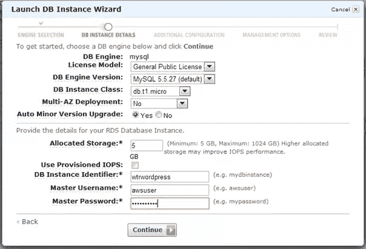
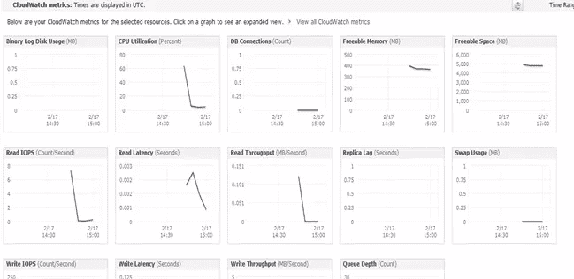
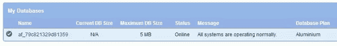
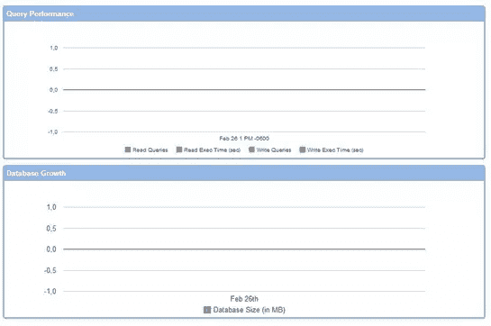
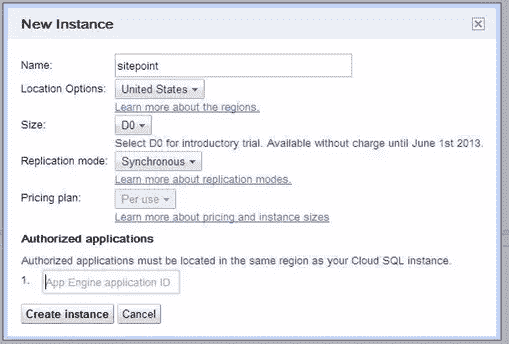
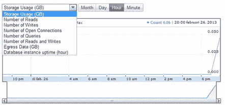
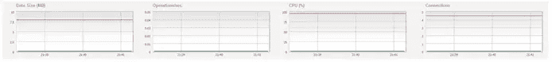

# 数据库即服务:云中的 MySQL

> 原文：<https://www.sitepoint.com/database-as-a-service-mysql-in-the-cloud/>

如今一切都托管在云中，为什么不把数据库也托管在云中呢？在这篇文章中，我将看看提供 MySQL 云托管的云提供商。我将讨论它们的功能、易用性和价格。本文将涵盖:

*   两个在云中只提供 MySQL 的提供商:ClearDB 和 xero und(xero und 将于 2013 年 5 月 15 日关闭。[读到这里](http://xeround.com/mysql-cloud-db-free-registration/)。
*   两个主要的云提供商将托管 MySQL 作为其整体产品的一部分:Amazon RDS for MySQL 和 Google Cloud SQL。

## 特征

尽管所有提供商都提供托管的 MySQL 数据库，但还是有一些差异。您会发现以下限制:

*   Xeround:在完全 MySQL 兼容性方面的限制，比如 ALTER table 函数、日志文件等等。参见[发行说明](http://xeround.com/developers/release-notes/#compatibility)。这些限制主要是为了使动态可伸缩性成为可能。
*   Google Cloud SQL:完全 MySQL 兼容性的限制，以及用户自定义函数和 MySQL 复制等功能。参见[常见问题解答](https://developers.google.com/cloud-sql/faq#supportmysqlfeatures)。

Amazon RDS for MySQL 和 Google Cloud SQL 是非常简单的基于云的 MySQL 实例，没有太多的吸引力，但是具有位于云中的额外好处(当涉及到扩展或缩小时，容易克隆等)。).他们只是允许您将数据库托管在他们的云基础架构中，但有上述限制。Amazon RDS for MySQL 还可以选择在主数据库出现故障时使用复制备用数据库，并提供自动备份。

选择哪一种主要取决于您用来运行主要应用程序的基础设施。举例来说，如果您将 Amazon RDS 托管在 EC2 上，它将是最合适的，因为延迟较低。但是组合不是必需的，你可以用 EC2 服务器托管 Google Cloud SQL 数据库。

Xeround en ClearDB 更上一层楼，它提供高可用性(100%正常运行时间)、轻松备份和地理分布。Xeround 的动态可扩展性更胜一筹，可满足规模和吞吐量需求。它们都试图让您在云中托管数据库变得更加容易，而不用担心当一个节点出现故障时会发生什么。它们都运行在亚马逊 AWS 上，以及 Rackspace Cloud 和惠普云(Xeround)或微软 Azure (ClearDB)上。

## 易用性和特定功能

现在让我们来看看每个提供商让您的数据库运行起来有多简单。

[**亚马逊 RDS**](http://aws.amazon.com/rds/)

像任何其他 AWS 实例一样，启动 Amazon RDS for MySQL 实例，几分钟之内就可以访问它。它需要你有一个有效的 AWS 帐户。Amazon 提供了许多选项，如自动备份、多 AZ 部署(用于故障转移的数据库的备用复制版本)以及从设置开始就提供 IOPS (I/O 优化)，这非常方便。

Amazon 为您的数据库实例使用数据库安全组，为此您需要授权您的服务器的 IP。完成后，使用 DB 实例端点作为数据库服务器，并使用您在设置中指定的登录凭证，这样就完成了。您还可以授予对特定 EC2 安全区域的访问权限。监控立即运行，让您深入了解 CPU、内存、延迟等使用指标。您还可以设置警报，以便在这些指标之一超过指定阈值时通知您。

[**ClearDB**](http://www.cleardb.com/)

设置 ClearDB 只需一分钟，但是有一个缺点。您只能从他们的合作伙伴之一进行设置，包括 Heroku、Microsft Azure Cloud 或 Appfog。我用的是最后一个 Appfog。但使用 Heroku 几乎同样简单，你可以将其与你的应用程序连接。Appfog 使用它自己的环境变量，让您通过应用程序/站点连接到数据库，其中包括数据库位置和登录凭据。

ClearDB 没有提供太多花哨的监控，只是查询性能和数据库增长(MBs)。它允许你自己做一个备份，但是作为它的服务的一部分，它会自动跟踪你的数据库的最后五天。

[**谷歌云 SQL**](https://developers.google.com/cloud-sql/)

启动 Google Cloud SQL 数据库是通过 Google API 站点完成的，并且需要您拥有一个活动帐户(已通过账单确认)。您启动一个新实例，并选择您喜欢的设置。Google Cloud SQL 提供了数据库的自动复制，您可以在同步复制(当更新数据库时，您必须等待复制完成)或异步复制(您不必等待更新，这样更快，但会导致备份期间的中断问题)之间进行选择。

您可以将数据库连接到 Google App Engine 应用程序，或者从外部资源连接。它们提供了一系列选项来连接管理(基于 Java 的命令行工具)或应用程序(JDBC)。Google Cloud SQL 提供了所有基本的监控选项，比如读、写、查询等等。Google Cloud SQL 自动设置每日备份，你可以免费保存长达 7 天的备份。

 **

就像 ClearDB 一样，您可以从 Appfog 和 Heroku 启动 Xeround 数据库，但也可以作为独立的服务。你只需注册 Xeround，并添加一个新的数据库。几分钟后，它开始运行。然后会给你两个地址作为数据库位置。一个是内部地址，如果你的站点和你的数据库在同一个数据中心，一个是外部地址，如果你被托管在其他地方。

Xeround 以数字和图表的形式提供了四种监控指标。你不能用他们的免费计划做备份，但是总会有一个自动备份以备不时之需。

## 定价

所有提供商(目前)都提供免费计划:

*Amazon RDS* : Micro DB 实例(630 MB RAM)，具有 20 GB 存储空间、20 GB 备份空间和每月 1000 万次 I/o(低 IO 容量)，作为其免费层的一部分。

ClearDB :免费计划提供最大 5 MB 的存储空间。10 个连接，每日备份，低 IO 性能。

*Google Cloud SQL* :一个云实例，具有少量(未具体说明)RAM、0.5 GB 存储和“合理的”IO 性能(Google 故意对您获得的内容含糊其辞:这是一个试用计划)。

*Xeround* :免费计划最多提供 10 MB 的存储空间。最多 5 个连接。1 MB/s 吞吐量，无备份。

但是如果你运行一个非常受欢迎的数据库密集型网站呢？那要花多少钱？ClearDB 和 Xeround 使用最大 DB 大小。连接和 IO 性能，而 Google Cloud SQL 和 Amazon RDS 使用传统的实例大小(这时 RAM 就派上了用场)。以下是每个中期计划的一些示例:

*亚马逊 RDS* :中等 DB 实例，3.75 GB RAM，中等 I/O 容量，5 GB 存储，每月 129，60 美元。

*ClearDB* : Scream DB，数据库大小最大可达 10 GB，最大。40 个连接，高 I/O 性能，每月 99.95 美元。

*谷歌云 SQL* : D4，2 GB 内存，每天 170 万 I/O，5 GB 存储，每月 175.80 美元。

*Xeround* : PRO，数据库大小高达 3 GB，最多 4800 个连接，无限吞吐量，每日备份，自动扩展，每月 453.60 美元。

正如您所看到的，Amazon RDS 提供了最大的性价比，但在保证 I/O 性能方面比较保守(尽管他们正在推出预配置的 IOPS 存储，这让您可以更好地控制 I/O)。Google Cloud SQL 对此做了更详细的说明，但提供了比 Amazon RDS 更低的 RAM，价格也更高。Google Cloud SQL 实例会将你的存储缓存在它的 RAM 中，减少 I/o 并改善加载时间。对于亚马逊 RDS，你需要亚马逊 ElastiCache，这是一项独立的付费服务。

ClearDB 和 Xeround 开始时很相似，但当使用更多存储时就有很大不同。公平地说，Xeround 确实提供了一个更便宜的计划(基本)，但它仅限于 0.5 GB 的存储空间。该计划每月花费 17 美元，而对于 1 GB 的存储，ClearDB 每月花费 9.95 美元。ClearDB 有一个专用环境，每月起价 399.95 美元，但这无法与 Xeround 相比，因为后者总是使用多租户环境。Xeround PRO 具有昂贵的 SLA，并提供自动扩展。但是价格是很高的，即使你的数据库只有几兆字节，它也会影响你的决定。

## 结论

在本文中，我想让您对数据库即服务有一个初步的了解。与大多数基于云的服务一样，可能性是无限的。但亚马逊 RDS 是一个很好的全能产品，价格有竞争力，功能齐全。您可以轻松地自己构建一个高可用性数据库，具有自动化复制和大量监控选项。有帮助的是，如果你对云计算感兴趣，你可能已经对 Amazon AWS 有点熟悉了，RDS 使用熟悉的实例方法。

Google Cloud SQL 提供了令人印象深刻的产品，但设置起来可能有点困难。如果你已经熟悉了应用引擎，这会有所帮助，但由于谷歌云不像亚马逊 AWS 那样被广泛使用，它有更高的学习曲线。他们利用从运行谷歌搜索中获得的经验来构建他们的基础设施，因此它是可靠和快速的。但是你确实为这个速度付出了代价。

ClearDB 和 Xeround 起初看起来像是竞争对手，但他们显然希望在定价和功能上区分彼此。他们的首发计划大部分相似，但 Xeround 的 PRO 计划自成一派。它非常昂贵，但是高度可靠和可扩展。这并不意味着 ClearDB 不可靠，但他们的方法不同，他们知道自己的局限性(可伸缩性是 Xeround 无法提供完整的 MySQL 包的原因，正如本文开头描述的他们的局限性)。

它们都使高可用性 MySQL 数据库易于访问、易于设置(Xeround 比 ClearDB 更通用)并且价格合理(如果你保持它很小的话)，充分利用了云的能力。就这一成就而言，他们都是这次比较的赢家。

## 分享这篇文章**